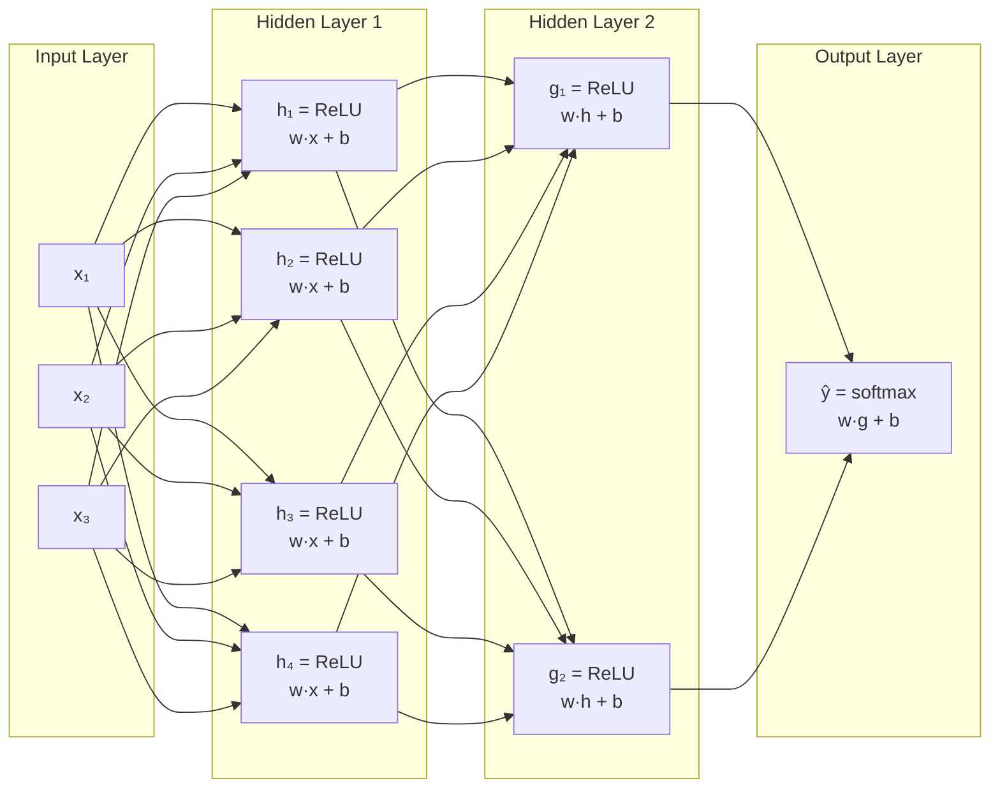

This guide covers the foundational concepts of neural networks — from the single perceptron to deep architectures. By the end, you'll understand how networks learn, why they work, and how to prevent them from failing.

## Prerequisites

- Linear algebra basics (vectors, matrices, dot products)
- Calculus (derivatives, chain rule)
- Basic probability and statistics
- Python familiarity

---

## The Perceptron

The perceptron is the simplest neural unit — a linear classifier inspired by biological neurons.

```text
    x₁ ──→ [w₁] ──┐
                    │
    x₂ ──→ [w₂] ──┼──→ Σ(wᵢxᵢ + b) ──→ activation ──→ output
                    │
    x₃ ──→ [w₃] ──┘
```

Mathematically:

```text
y = f(w₁x₁ + w₂x₂ + ... + wₙxₙ + b) = f(w·x + b)
```

Where:

- **x** = input vector
- **w** = weight vector (learned parameters)
- **b** = bias term
- **f** = activation function

A single perceptron can only learn linearly separable functions. It cannot learn XOR — this limitation motivated multi-layer networks.

```python
import numpy as np

class Perceptron:
    def __init__(self, n_inputs, lr=0.01):
        self.weights = np.zeros(n_inputs)
        self.bias = 0.0
        self.lr = lr

    def predict(self, x):
        return 1 if np.dot(self.weights, x) + self.bias > 0 else 0

    def train(self, x, y_true):
        y_pred = self.predict(x)
        error = y_true - y_pred
        self.weights += self.lr * error * x
        self.bias += self.lr * error
```

---

## Activation Functions

Activation functions introduce non-linearity, allowing networks to learn complex patterns.

| Function | Formula | Range | Use Case | Pros | Cons |
|----------|---------|-------|----------|------|------|
| Sigmoid | σ(x) = 1/(1+e⁻ˣ) | (0, 1) | Binary classification output | Smooth, probabilistic | Vanishing gradients, not zero-centered |
| Tanh | tanh(x) = (eˣ-e⁻ˣ)/(eˣ+e⁻ˣ) | (-1, 1) | Hidden layers (legacy) | Zero-centered | Vanishing gradients |
| ReLU | max(0, x) | [0, ∞) | Hidden layers (default) | Fast, no vanishing gradient | Dead neurons (output=0 forever) |
| Leaky ReLU | max(αx, x), α=0.01 | (-∞, ∞) | Hidden layers | No dead neurons | α is a hyperparameter |
| GELU | x·Φ(x) | ≈(-0.17, ∞) | Transformers | Smooth, empirically better | Computationally heavier |
| Softmax | eˣⁱ/Σeˣʲ | (0, 1), sums to 1 | Multi-class output | Probability distribution | Numerically unstable without log trick |

```python
def relu(x):
    return np.maximum(0, x)

def sigmoid(x):
    return 1 / (1 + np.exp(-x))

def softmax(x):
    # Subtract max for numerical stability
    e_x = np.exp(x - np.max(x))
    return e_x / e_x.sum()
```

### Why ReLU Dominates

ReLU solved the **vanishing gradient problem** that plagued sigmoid/tanh in deep networks. When sigmoid saturates (output near 0 or 1), its gradient approaches zero, making learning impossibly slow in early layers. ReLU's gradient is either 0 or 1 — no saturation.

---

## Network Architecture: Forward Pass

A feedforward neural network chains layers of neurons together:



The forward pass computes:

```text
Layer 1: h = ReLU(W₁·x + b₁)
Layer 2: g = ReLU(W₂·h + b₂)
Output:  ŷ = softmax(W₃·g + b₃)
```

```python
class NeuralNetwork:
    def __init__(self, layer_sizes):
        self.weights = []
        self.biases = []
        for i in range(len(layer_sizes) - 1):
            # Xavier initialization
            w = np.random.randn(layer_sizes[i], layer_sizes[i+1]) * np.sqrt(2.0 / layer_sizes[i])
            b = np.zeros(layer_sizes[i+1])
            self.weights.append(w)
            self.biases.append(b)

    def forward(self, x):
        self.activations = [x]
        for i, (w, b) in enumerate(zip(self.weights, self.biases)):
            z = self.activations[-1] @ w + b
            if i < len(self.weights) - 1:
                a = relu(z)
            else:
                a = softmax(z)
            self.activations.append(a)
        return self.activations[-1]
```

---

## Loss Functions

The loss function measures how wrong the network's predictions are. Training minimizes this value.

| Loss Function | Formula | Use Case |
|---------------|---------|----------|
| MSE (Mean Squared Error) | (1/n)Σ(yᵢ - ŷᵢ)² | Regression |
| Cross-Entropy (Binary) | -[y·log(ŷ) + (1-y)·log(1-ŷ)] | Binary classification |
| Cross-Entropy (Categorical) | -Σ yᵢ·log(ŷᵢ) | Multi-class classification |
| Huber Loss | MSE if \|error\|<δ, else MAE | Regression (robust to outliers) |

```python
def cross_entropy_loss(y_true, y_pred):
    # y_true: one-hot encoded, y_pred: softmax output
    epsilon = 1e-15  # prevent log(0)
    y_pred = np.clip(y_pred, epsilon, 1 - epsilon)
    return -np.sum(y_true * np.log(y_pred))
```

### Why Cross-Entropy for Classification?

Cross-entropy penalizes confident wrong predictions heavily. If the true label is 1 and the model predicts 0.01, the loss is -log(0.01) = 4.6. If it predicts 0.99, the loss is -log(0.99) = 0.01. This creates strong gradients for correction.

---

## Backpropagation

Backpropagation computes how much each weight contributed to the error, using the **chain rule** of calculus.

```text
Forward:  x → [W₁] → h → [W₂] → ŷ → Loss(ŷ, y)

Backward: ∂L/∂W₂ = ∂L/∂ŷ · ∂ŷ/∂W₂
          ∂L/∂W₁ = ∂L/∂ŷ · ∂ŷ/∂h · ∂h/∂W₁
```

The algorithm:

1. **Forward pass** — compute all activations, store intermediate values
2. **Compute loss** — compare prediction to ground truth
3. **Backward pass** — propagate gradients from output to input
4. **Update weights** — adjust each weight proportional to its gradient

```python
def backward(self, y_true):
    m = y_true.shape[0]
    # Output layer gradient (softmax + cross-entropy simplifies)
    delta = self.activations[-1] - y_true  # shape: (batch, output_size)

    self.gradients = []
    for i in range(len(self.weights) - 1, -1, -1):
        # Gradient for weights and biases
        dw = self.activations[i].T @ delta / m
        db = np.mean(delta, axis=0)
        self.gradients.insert(0, (dw, db))

        if i > 0:
            # Propagate gradient through layer
            delta = (delta @ self.weights[i].T) * (self.activations[i] > 0)  # ReLU derivative
```

### Computational Graph Perspective

Modern frameworks (PyTorch, TensorFlow) build a computational graph during the forward pass, then traverse it backwards to compute gradients automatically — this is **automatic differentiation**.

---

## Gradient Descent and Optimizers

Gradient descent updates weights to minimize the loss:

```text
w_new = w_old - learning_rate × ∂Loss/∂w
```

### Variants

| Optimizer | Update Rule | Key Idea |
|-----------|-------------|----------|
| SGD | w -= lr × g | Simple, noisy updates |
| SGD + Momentum | v = βv + g; w -= lr × v | Accumulates velocity, smooths updates |
| RMSProp | s = βs + (1-β)g²; w -= lr × g/√s | Adapts per-parameter learning rate |
| Adam | Combines momentum + RMSProp | Adaptive + momentum, most popular |
| AdamW | Adam + decoupled weight decay | Fixes Adam's L2 regularization |

### Adam in Detail

Adam (Adaptive Moment Estimation) maintains two running averages per parameter:

```python
class Adam:
    def __init__(self, lr=0.001, beta1=0.9, beta2=0.999, eps=1e-8):
        self.lr = lr
        self.beta1 = beta1
        self.beta2 = beta2
        self.eps = eps
        self.m = None  # First moment (mean of gradients)
        self.v = None  # Second moment (mean of squared gradients)
        self.t = 0

    def step(self, params, grads):
        if self.m is None:
            self.m = [np.zeros_like(p) for p in params]
            self.v = [np.zeros_like(p) for p in params]

        self.t += 1
        for i, (p, g) in enumerate(zip(params, grads)):
            self.m[i] = self.beta1 * self.m[i] + (1 - self.beta1) * g
            self.v[i] = self.beta2 * self.v[i] + (1 - self.beta2) * g**2

            # Bias correction (critical for early steps)
            m_hat = self.m[i] / (1 - self.beta1**self.t)
            v_hat = self.v[i] / (1 - self.beta2**self.t)

            p -= self.lr * m_hat / (np.sqrt(v_hat) + self.eps)
```

### Learning Rate Schedules

A fixed learning rate is rarely optimal. Common schedules:

- **Warmup + cosine decay** — start low, ramp up, then decay (standard for transformers)
- **Step decay** — reduce by factor every N epochs
- **One-cycle** — ramp up then down within one training run

---

## Overfitting and Regularization

**Overfitting** = the model memorizes training data instead of learning general patterns. It performs well on training data but poorly on unseen data.

```text
Training loss:    ████████░░░░░░░░  (decreasing)
Validation loss:  ████████████████  (decreasing then INCREASING ← overfitting)
```

### Detection

- Training loss keeps decreasing while validation loss increases
- Large gap between training and validation accuracy

### Regularization Techniques

| Technique | How It Works | When to Use |
|-----------|--------------|-------------|
| L2 Regularization (Weight Decay) | Adds λ·‖w‖² to loss | Always (default in AdamW) |
| Dropout | Randomly zeros neurons during training | Dense layers, prevents co-adaptation |
| Batch Normalization | Normalizes layer inputs, adds learnable scale/shift | Deep networks, stabilizes training |
| Early Stopping | Stop training when validation loss stops improving | Always (cheap insurance) |
| Data Augmentation | Create synthetic training examples | When data is limited |
| Label Smoothing | Replace hard 0/1 targets with 0.1/0.9 | Classification, prevents overconfidence |

### Dropout

During training, each neuron is "dropped" (output set to 0) with probability p (typically 0.1–0.5). This forces the network to not rely on any single neuron.

```python
def dropout(x, p=0.5, training=True):
    if not training:
        return x
    mask = np.random.binomial(1, 1-p, size=x.shape) / (1-p)  # Inverted dropout
    return x * mask
```

The `/ (1-p)` scaling ensures expected values remain the same at inference time.

### Batch Normalization

Normalizes activations within each mini-batch, then applies a learned affine transform:

```text
x̂ = (x - μ_batch) / √(σ²_batch + ε)
y = γ·x̂ + β    (γ and β are learned)
```

Benefits:

- Allows higher learning rates
- Reduces sensitivity to initialization
- Acts as mild regularization

---

## Weight Initialization

Bad initialization can make training impossible. The goal: keep activations and gradients at reasonable magnitudes across layers.

| Method | Formula | Best For |
|--------|---------|----------|
| Xavier/Glorot | W ~ N(0, 2/(fan_in + fan_out)) | Sigmoid, Tanh |
| He/Kaiming | W ~ N(0, 2/fan_in) | ReLU |
| Zero init | W = 0 | Biases only |

If weights are too small, signals vanish. Too large, they explode. Proper initialization keeps the variance of activations roughly constant across layers.

---

## Architecture Overview

### Feedforward Networks (FFN / MLP)

The simplest deep architecture — stacked fully-connected layers. Every neuron connects to every neuron in the next layer.

- **Use case:** Tabular data, simple classification/regression
- **Limitation:** No spatial or temporal structure awareness

### Convolutional Neural Networks (CNN)

Designed for grid-structured data (images, audio spectrograms).

```text
Input Image → [Conv + ReLU] → [Pool] → [Conv + ReLU] → [Pool] → [Flatten] → [FC] → Output
```

Key concepts:

- **Convolution** — slide a small filter (kernel) across the input, computing dot products
- **Pooling** — downsample spatial dimensions (max pooling, average pooling)
- **Translation invariance** — a cat is a cat regardless of position
- **Parameter sharing** — same filter applied everywhere, far fewer parameters than FC

```python
# A 3x3 convolution with 64 filters in PyTorch
import torch.nn as nn
conv = nn.Conv2d(in_channels=3, out_channels=64, kernel_size=3, padding=1)
# Parameters: 3 × 64 × 3 × 3 + 64 = 1,792 (vs millions for equivalent FC)
```

### Recurrent Neural Networks (RNN / LSTM / GRU)

Designed for sequential data (text, time series).

```text
x₁ → [RNN] → h₁
       ↓
x₂ → [RNN] → h₂    (same weights, hidden state carries forward)
       ↓
x₃ → [RNN] → h₃ → output
```

**Vanilla RNN problem:** Vanishing/exploding gradients over long sequences.

**LSTM (Long Short-Term Memory)** solves this with gates:

- **Forget gate** — what to discard from cell state
- **Input gate** — what new information to store
- **Output gate** — what to output from cell state

```text
LSTM Cell:
┌─────────────────────────────────────────┐
│  forget_gate = σ(W_f·[h_{t-1}, x_t])   │
│  input_gate  = σ(W_i·[h_{t-1}, x_t])   │
│  candidate   = tanh(W_c·[h_{t-1}, x_t])│
│  cell_t = forget_gate × cell_{t-1}      │
│         + input_gate × candidate         │
│  output_gate = σ(W_o·[h_{t-1}, x_t])   │
│  h_t = output_gate × tanh(cell_t)       │
└─────────────────────────────────────────┘
```

**GRU (Gated Recurrent Unit)** — simplified LSTM with fewer parameters (merges forget+input gates).

> **Historical note:** RNNs/LSTMs dominated NLP from 2013–2017 until Transformers replaced them. Transformers process all positions in parallel (vs sequential), enabling massive scaling.

---

## The Universal Approximation Theorem

> A feedforward network with a single hidden layer containing a finite number of neurons can approximate any continuous function on a compact subset of ℝⁿ, given a suitable activation function.

**What this means:** Neural networks are theoretically capable of learning any function.

**What this does NOT mean:**

- It doesn't say how many neurons you need (could be astronomically many)
- It doesn't say gradient descent will find the right weights
- It doesn't say the network will generalize to unseen data
- Deeper networks are exponentially more efficient than wide shallow ones

In practice, depth matters more than width. A 10-layer network can represent functions that would require an exponentially wide single-layer network.

---

## Putting It All Together: Training Loop

```python
import torch
import torch.nn as nn
import torch.optim as optim

# Define model
model = nn.Sequential(
    nn.Linear(784, 256),
    nn.ReLU(),
    nn.Dropout(0.2),
    nn.Linear(256, 128),
    nn.ReLU(),
    nn.Dropout(0.2),
    nn.Linear(128, 10)
)

criterion = nn.CrossEntropyLoss()
optimizer = optim.AdamW(model.parameters(), lr=1e-3, weight_decay=1e-2)
scheduler = optim.lr_scheduler.CosineAnnealingLR(optimizer, T_max=100)

# Training loop
for epoch in range(100):
    model.train()
    for batch_x, batch_y in train_loader:
        optimizer.zero_grad()
        output = model(batch_x)
        loss = criterion(output, batch_y)
        loss.backward()          # Backpropagation
        optimizer.step()         # Weight update
    scheduler.step()

    # Validation
    model.eval()
    with torch.no_grad():
        val_loss = sum(criterion(model(x), y) for x, y in val_loader) / len(val_loader)

    # Early stopping check
    if val_loss > best_val_loss:
        patience_counter += 1
        if patience_counter >= patience:
            break
    else:
        best_val_loss = val_loss
        patience_counter = 0
```

---

## Common Pitfalls

| Problem | Symptom | Solution |
|---------|---------|----------|
| Vanishing gradients | Early layers don't learn | Use ReLU, residual connections, proper init |
| Exploding gradients | Loss becomes NaN | Gradient clipping, lower learning rate |
| Dead ReLU neurons | Many neurons output 0 forever | Use Leaky ReLU, lower learning rate |
| Overfitting | Val loss diverges from train loss | Dropout, weight decay, more data, early stopping |
| Underfitting | Both losses remain high | Bigger model, train longer, lower regularization |
| Learning rate too high | Loss oscillates or diverges | Reduce LR, use warmup schedule |
| Learning rate too low | Loss decreases extremely slowly | Increase LR, use LR finder |

---

## Key Takeaways

1. **Neural networks are function approximators** — they learn mappings from inputs to outputs by adjusting weights through gradient descent. The universal approximation theorem guarantees they can represent any continuous function, but finding the right weights is the hard part.

2. **Activation functions enable non-linearity** — without them, stacking layers is pointless (linear compositions are still linear). ReLU is the default for hidden layers; softmax for multi-class output.

3. **Backpropagation is just the chain rule applied systematically** — it computes how much each weight contributed to the error, enabling efficient gradient computation in networks with millions of parameters.

4. **Adam is the default optimizer** — it combines momentum (smoothing) with adaptive per-parameter learning rates. AdamW adds proper weight decay. Always use a learning rate schedule.

5. **Overfitting is the central challenge** — every regularization technique (dropout, weight decay, batch norm, early stopping) fights the same problem: making the model generalize rather than memorize.

6. **Architecture choice depends on data structure** — FFN for tabular, CNN for spatial (images), RNN/LSTM for sequential (text, time series). Transformers have largely replaced RNNs for sequences.

7. **Depth beats width** — deeper networks are exponentially more parameter-efficient than shallow wide ones. Residual connections and normalization make training deep networks practical.
