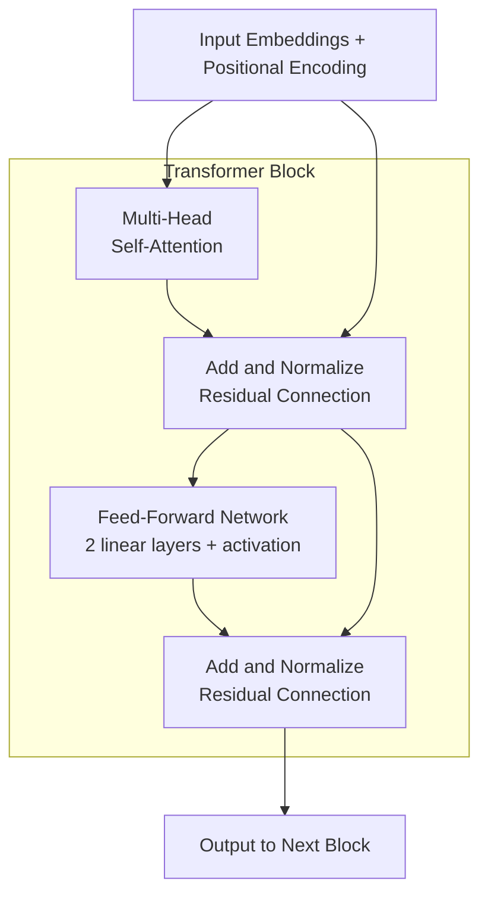
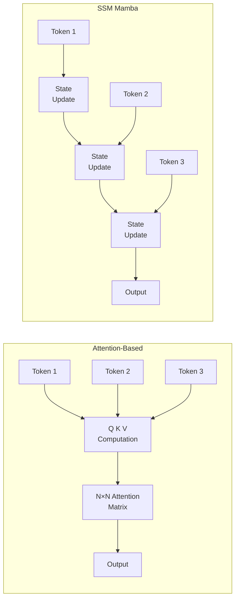

The Transformer is the architecture behind virtually all modern language models (GPT, BERT, Claude, Llama, T5). Introduced in "Attention Is All You Need" (Vaswani et al., 2017), it replaced recurrent networks by processing all positions in parallel through a mechanism called **self-attention**.

This guide breaks down every component — from the attention mechanism to the full architecture variants.

## Prerequisites

- Neural network basics (forward/backward pass, loss functions)
- Matrix multiplication
- Basic understanding of sequence processing (what a "token" is)

---

## The Core Idea: Attention

The fundamental question attention answers: **"When processing token X, how much should I look at every other token in the sequence?"**

In an RNN, information from early tokens must pass through every intermediate step to reach later tokens — a bottleneck. Attention allows direct connections between any two positions, regardless of distance.

```text
RNN: Token₁ → Token₂ → Token₃ → Token₄ → Token₅
     (information degrades over distance)

Attention: Token₁ ←→ Token₂ ←→ Token₃ ←→ Token₄ ←→ Token₅
           (every token directly attends to every other token)
```

---

## Queries, Keys, and Values (Q, K, V)

Attention uses three projections of the input, inspired by information retrieval:

- **Query (Q)** — "What am I looking for?" (the current token's question)
- **Key (K)** — "What do I contain?" (each token's label/identifier)
- **Value (V)** — "What information do I provide?" (each token's content)

Given input embeddings X of shape (sequence_length, d_model):

```text
Q = X · W_Q    (shape: seq_len × d_k)
K = X · W_K    (shape: seq_len × d_k)
V = X · W_V    (shape: seq_len × d_v)
```

The analogy: imagine searching a library. Your query is your search term, keys are book titles, and values are book contents. You match your query against all keys, then retrieve a weighted combination of values.

---

## Scaled Dot-Product Attention

The attention formula:

```text
                    Q · Kᵀ
Attention(Q,K,V) = softmax( ─────── ) · V
                      √d_k
```

Step by step:

1. **Compute similarity scores:** Q · Kᵀ gives a (seq_len × seq_len) matrix where entry (i,j) measures how much token i should attend to token j
2. **Scale:** Divide by √d_k to prevent softmax saturation (large dot products → extreme softmax outputs → vanishing gradients)
3. **Softmax:** Convert scores to probabilities (each row sums to 1)
4. **Weighted sum:** Multiply by V to get the output — a weighted combination of all values

```python
import numpy as np

def scaled_dot_product_attention(Q, K, V, mask=None):
    d_k = Q.shape[-1]
    # (batch, seq_len, d_k) @ (batch, d_k, seq_len) → (batch, seq_len, seq_len)
    scores = Q @ K.transpose(-2, -1) / np.sqrt(d_k)

    if mask is not None:
        scores = scores + mask  # mask contains -inf for positions to ignore

    attention_weights = softmax(scores, axis=-1)
    output = attention_weights @ V  # (batch, seq_len, d_v)
    return output, attention_weights
```

### Why Scale by √d_k?

Without scaling, when d_k is large (e.g., 64), dot products grow proportionally to d_k. Large values push softmax into regions where gradients are near zero. Dividing by √d_k keeps the variance of scores at approximately 1, regardless of dimension.

---

## Multi-Head Attention

Instead of one attention function, the Transformer uses multiple "heads" — each learning different attention patterns.

```text
Head 1: might learn "attend to the previous word"
Head 2: might learn "attend to the subject of the sentence"
Head 3: might learn "attend to syntactically related words"
...
```

```text
MultiHead(Q, K, V) = Concat(head₁, head₂, ..., headₕ) · W_O

where headᵢ = Attention(Q·Wᵢ_Q, K·Wᵢ_K, V·Wᵢ_V)
```

If d_model = 512 and h = 8 heads, each head operates on d_k = d_v = 512/8 = 64 dimensions.

```python
class MultiHeadAttention:
    def __init__(self, d_model, n_heads):
        self.n_heads = n_heads
        self.d_k = d_model // n_heads

        self.W_Q = np.random.randn(d_model, d_model) * 0.02
        self.W_K = np.random.randn(d_model, d_model) * 0.02
        self.W_V = np.random.randn(d_model, d_model) * 0.02
        self.W_O = np.random.randn(d_model, d_model) * 0.02

    def forward(self, x, mask=None):
        batch_size, seq_len, d_model = x.shape

        # Project to Q, K, V
        Q = x @ self.W_Q  # (batch, seq_len, d_model)
        K = x @ self.W_K
        V = x @ self.W_V

        # Split into heads: (batch, seq_len, d_model) → (batch, n_heads, seq_len, d_k)
        Q = Q.reshape(batch_size, seq_len, self.n_heads, self.d_k).transpose(0, 2, 1, 3)
        K = K.reshape(batch_size, seq_len, self.n_heads, self.d_k).transpose(0, 2, 1, 3)
        V = V.reshape(batch_size, seq_len, self.n_heads, self.d_k).transpose(0, 2, 1, 3)

        # Attention per head
        output, weights = scaled_dot_product_attention(Q, K, V, mask)

        # Concatenate heads and project
        output = output.transpose(0, 2, 1, 3).reshape(batch_size, seq_len, d_model)
        return output @ self.W_O
```

### Computational Cost

Self-attention has O(n²·d) complexity where n = sequence length and d = dimension. This quadratic scaling with sequence length is the main bottleneck for long contexts.

---

## Positional Encoding

Attention is **permutation-invariant** — it treats "The cat sat on the mat" the same as "mat the on sat cat The". We need to inject position information.

### Sinusoidal Positional Encoding (Original Transformer)

```text
PE(pos, 2i)   = sin(pos / 10000^(2i/d_model))
PE(pos, 2i+1) = cos(pos / 10000^(2i/d_model))
```

Each position gets a unique vector. The sinusoidal pattern allows the model to learn relative positions because PE(pos+k) can be expressed as a linear function of PE(pos).

```python
def sinusoidal_positional_encoding(max_len, d_model):
    pe = np.zeros((max_len, d_model))
    position = np.arange(max_len)[:, np.newaxis]
    div_term = np.exp(np.arange(0, d_model, 2) * -(np.log(10000.0) / d_model))

    pe[:, 0::2] = np.sin(position * div_term)
    pe[:, 1::2] = np.cos(position * div_term)
    return pe
```

### Rotary Position Embeddings (RoPE)

Used by Llama, Mistral, and most modern models. Instead of adding position information, RoPE **rotates** the query and key vectors based on their position.

Key insight: the dot product of two rotated vectors depends only on their **relative** position, not absolute positions.

```text
RoPE(x, pos) = x · R(pos)

where R(pos) is a rotation matrix with angle proportional to position
```

Advantages over sinusoidal:

- Naturally encodes relative positions
- Decays attention with distance (desirable inductive bias)
- Extrapolates better to longer sequences than seen during training

### ALiBi (Attention with Linear Biases)

Used by BLOOM and some other models. Instead of modifying embeddings, ALiBi adds a **linear bias** to attention scores based on distance:

```text
attention_score(i, j) = q_i · k_j - m · |i - j|
```

Where m is a head-specific slope. Closer tokens get higher scores. No learned parameters — purely geometric.

| Method | Type | Relative Position | Length Extrapolation | Used By |
|--------|------|-------------------|---------------------|---------|
| Sinusoidal | Additive to embeddings | Implicit | Poor | Original Transformer |
| Learned | Additive to embeddings | No | Poor | BERT, GPT-2 |
| RoPE | Rotation of Q, K | Explicit | Good (with NTK scaling) | Llama, Mistral, GPT-NeoX |
| ALiBi | Bias on attention scores | Explicit | Excellent | BLOOM, MPT |

---

## The Transformer Block

A single Transformer block consists of:



### Residual Connections

Each sub-layer (attention, FFN) has a residual (skip) connection:

```text
output = LayerNorm(x + SubLayer(x))
```

Why residual connections matter:

- Enable training of very deep networks (100+ layers)
- Gradients flow directly through skip connections during backprop
- Each layer only needs to learn the "residual" — the difference from identity

### Layer Normalization

Normalizes across the feature dimension (not the batch dimension like BatchNorm):

```text
LayerNorm(x) = γ · (x - μ) / √(σ² + ε) + β
```

Where μ and σ are computed per-token across the d_model dimension. γ and β are learned.

**Pre-norm vs Post-norm:**

| Variant | Formula | Used By | Stability |
|---------|---------|---------|-----------|
| Post-norm (original) | LN(x + SubLayer(x)) | Original Transformer, BERT | Harder to train deep |
| Pre-norm | x + SubLayer(LN(x)) | GPT-2+, Llama, most modern | More stable, easier to train |
| RMSNorm | Like LN but without mean subtraction | Llama, Mistral | Faster, equally effective |

### Feed-Forward Network (FFN)

A position-wise two-layer MLP applied independently to each token:

```text
FFN(x) = W₂ · activation(W₁ · x + b₁) + b₂
```

- W₁ projects from d_model to d_ff (typically 4× d_model)
- Activation: ReLU (original), GELU (BERT, GPT), SwiGLU (Llama, modern)
- W₂ projects back from d_ff to d_model

The FFN is where the model stores "knowledge" — factual associations learned during training. Attention routes information; FFN processes it.

```python
class FeedForward:
    def __init__(self, d_model, d_ff):
        self.w1 = np.random.randn(d_model, d_ff) * 0.02
        self.w2 = np.random.randn(d_ff, d_model) * 0.02

    def forward(self, x):
        return gelu(x @ self.w1) @ self.w2
```

### SwiGLU Activation (Modern Standard)

```text
SwiGLU(x) = (x · W₁) ⊙ swish(x · W_gate)
```

Uses a gating mechanism — one linear projection is element-wise multiplied by a swish-activated gate. Empirically outperforms GELU with similar compute.

---

## Full Architecture Variants

### Encoder-Decoder (Original Transformer, T5)

```text
┌─────────────────┐     ┌─────────────────┐
│     ENCODER      │     │     DECODER      │
│                  │     │                  │
│  Self-Attention  │     │  Masked Self-    │
│  (bidirectional) │     │  Attention       │
│       ↓          │     │  (causal)        │
│  Feed-Forward    │     │       ↓          │
│       ↓          │     │  Cross-Attention │
│  × N layers      │────→│  (attends to     │
│                  │     │   encoder output) │
└─────────────────┘     │       ↓          │
                         │  Feed-Forward    │
                         │       ↓          │
                         │  × N layers      │
                         └─────────────────┘
```

- **Encoder:** Processes the full input bidirectionally (every token sees every other token)
- **Decoder:** Generates output autoregressively (each token only sees previous tokens)
- **Cross-attention:** Decoder attends to encoder's output — this is how the decoder "reads" the input

Use case: Translation, summarization, any sequence-to-sequence task.

### Decoder-Only (GPT, Llama, Claude, Mistral)

```text
┌─────────────────────────┐
│     DECODER-ONLY         │
│                          │
│  Masked Self-Attention   │
│  (causal: token i only   │
│   sees tokens 1..i)      │
│          ↓               │
│  Feed-Forward            │
│          ↓               │
│  × N layers              │
│          ↓               │
│  Linear + Softmax        │
│  (predict next token)    │
└─────────────────────────┘
```

The **causal mask** prevents tokens from attending to future positions:

```text
Attention mask (4 tokens):
     t₁  t₂  t₃  t₄
t₁ [  0  -∞  -∞  -∞ ]
t₂ [  0   0  -∞  -∞ ]
t₃ [  0   0   0  -∞ ]
t₄ [  0   0   0   0 ]

(0 = can attend, -∞ = cannot attend, becomes 0 after softmax)
```

Why decoder-only dominates:

- Simpler architecture (one stack, not two)
- Scales better with compute
- Unified framework: any task can be framed as "complete this text"
- Pre-training objective (next token prediction) is extremely general

### Encoder-Only (BERT)

```text
┌─────────────────────────┐
│     ENCODER-ONLY         │
│                          │
│  Self-Attention          │
│  (bidirectional: every   │
│   token sees all others) │
│          ↓               │
│  Feed-Forward            │
│          ↓               │
│  × N layers              │
│          ↓               │
│  [CLS] token embedding   │
│  → classification head   │
└─────────────────────────┘
```

- No causal mask — full bidirectional context
- Pre-trained with Masked Language Modeling (predict masked tokens)
- Excellent for classification, NER, sentence similarity
- Cannot generate text autoregressively

---

## Model Dimensions

| Model | Layers | d_model | Heads | d_ff | Parameters |
|-------|--------|---------|-------|------|------------|
| BERT-base | 12 | 768 | 12 | 3072 | 110M |
| BERT-large | 24 | 1024 | 16 | 4096 | 340M |
| GPT-2 | 48 | 1600 | 25 | 6400 | 1.5B |
| GPT-3 | 96 | 12288 | 96 | 49152 | 175B |
| Llama 2 7B | 32 | 4096 | 32 | 11008 | 7B |
| Llama 2 70B | 80 | 8192 | 64 | 28672 | 70B |
| GPT-4 (estimated) | ~120 | ~12288 | ~96 | ~49152 | ~1.8T (MoE) |

---

## KV Cache: Making Inference Fast

During autoregressive generation, each new token requires attending to all previous tokens. Without optimization, generating token N requires recomputing attention for all N tokens — O(N²) total work for a sequence.

The **KV cache** stores computed key and value vectors from previous tokens:

```text
Step 1: Generate token 1 → store K₁, V₁
Step 2: Generate token 2 → store K₂, V₂; attend to [K₁,K₂], [V₁,V₂]
Step 3: Generate token 3 → store K₃, V₃; attend to [K₁,K₂,K₃], [V₁,V₂,V₃]
...
```

Only the new token's Q needs to be computed fresh. This reduces generation from O(N²) to O(N) per token.

**Memory cost:** For a 70B model with 80 layers, 64 heads, d_k=128, and a 4096-token context in FP16:

```text
KV cache = 2 × 80 × 64 × 128 × 4096 × 2 bytes ≈ 10.7 GB per sequence
```

This is why long-context models need enormous GPU memory.

---

## Grouped-Query Attention (GQA)

A memory optimization used by Llama 2 70B, Mistral, and others. Instead of separate K,V projections per head, multiple query heads share the same K,V:

| Variant | Query Heads | KV Heads | KV Cache Size | Used By |
|---------|-------------|----------|---------------|---------|
| Multi-Head (MHA) | H | H | 1× | BERT, GPT-3 |
| Multi-Query (MQA) | H | 1 | 1/H × | PaLM, Falcon |
| Grouped-Query (GQA) | H | H/G | 1/G × | Llama 2 70B, Mistral |

GQA with G=8 (e.g., 64 query heads, 8 KV heads) reduces KV cache by 8× with minimal quality loss.

---

## Mixture of Experts (MoE)

Used by GPT-4, Mixtral, and others to scale parameters without proportionally scaling compute.

```text
Input → Router → selects top-k experts (e.g., 2 of 8)
                 ↓
         Expert₁ (FFN)  ←── only activated experts compute
         Expert₂ (FFN)
                 ↓
         Weighted sum → Output
```

- Each "expert" is a separate FFN
- A learned router selects which experts process each token
- Total parameters are large, but active parameters per token are small
- Mixtral 8x7B: 47B total parameters, ~13B active per token

---

## Putting It All Together

A complete forward pass through a decoder-only Transformer:

```text
1: Tokenize input text → token IDs [4521, 892, 1033, ...]
2: Embed tokens → (seq_len, d_model) matrix
3: Add positional encoding (or apply RoPE in attention)
4: For each of N layers:
   a: x_norm = RMSNorm(x)
   b: attn_out = MultiHeadAttention(x_norm, causal_mask=True)
   c: x = x + attn_out                    (residual)
   d: x_norm = RMSNorm(x)
   e: ffn_out = SwiGLU_FFN(x_norm)
   f: x = x + ffn_out                     (residual)
5: Final RMSNorm
6: Linear projection → vocabulary logits (seq_len, vocab_size)
7: Softmax → probability distribution over next token
8: Sample or argmax → next token ID
9: Repeat from step 2 with extended sequence
```

---

## Flash Attention

Standard self-attention materializes the full N×N attention matrix in GPU high-bandwidth memory (HBM). For long sequences, this O(n²) memory requirement becomes the dominant bottleneck — not compute.

### The Memory Wall Problem

```text
Standard Attention Memory Usage:

Sequence Length    Attention Matrix (FP16)    % of 80GB A100
─────────────────────────────────────────────────────────────
2,048              8 MB                       ~0%
8,192              128 MB                     0.16%
32,768             2 GB                       2.5%
131,072            32 GB                      40%
524,288            512 GB                     ❌ impossible
```

The problem isn't FLOPs — it's memory reads/writes between GPU SRAM (fast, small) and HBM (slow, large). Standard attention performs O(n²) HBM accesses.

### Tiling Strategy

Flash Attention never materializes the full attention matrix. Instead, it processes attention in **tiles** that fit in SRAM:

```text
Standard Attention:
  Q, K, V in HBM → compute full S = QKᵀ → write S to HBM
  → read S → softmax → write P to HBM → read P → P·V → output

Flash Attention:
  Load Q tile, K tile, V tile into SRAM
  → compute partial attention in SRAM
  → accumulate output incrementally
  → write only final output to HBM
  (never write N×N matrix to HBM)
```

```python
# Pseudocode for Flash Attention tiling
def flash_attention(Q, K, V, block_size=256):
    N, d = Q.shape
    output = zeros(N, d)
    row_max = full(N, -inf)   # running max for numerically stable softmax
    row_sum = zeros(N)         # running sum for softmax denominator

    # Process K, V in blocks
    for j in range(0, N, block_size):
        K_block = K[j:j+block_size]
        V_block = V[j:j+block_size]

        # For each Q block
        for i in range(0, N, block_size):
            Q_block = Q[i:i+block_size]

            # Compute attention scores for this tile (in SRAM)
            S_block = Q_block @ K_block.T / sqrt(d)

            # Online softmax: update running max and sum
            new_max = maximum(row_max[i:i+block_size], S_block.max(axis=-1))
            # Rescale previous accumulator and add new contribution
            # ... (numerically stable incremental softmax)

            # Accumulate output
            output[i:i+block_size] += softmax(S_block) @ V_block

    return output
```

### IO-Aware Algorithm

The key insight: Flash Attention is an **IO-aware** algorithm. It accounts for the GPU memory hierarchy:

```text
GPU Memory Hierarchy:
┌─────────────────────────────────┐
│  SRAM (on-chip)                 │
│  ~20 MB, ~19 TB/s bandwidth    │
├─────────────────────────────────┤
│  HBM (off-chip)                 │
│  ~80 GB, ~2 TB/s bandwidth     │
└─────────────────────────────────┘

Standard attention: O(N²) HBM reads/writes
Flash Attention:    O(N²d / SRAM_size) HBM accesses
                    (reduction factor = SRAM_size / d ≈ 100-1000×)
```

### Flash Attention 2 Improvements

| Aspect | Flash Attention 1 | Flash Attention 2 |
|--------|-------------------|-------------------|
| Parallelism | Over batch & heads | + over sequence length |
| Work partitioning | Equal across warps | Reduced shared memory reads |
| Occupancy | ~50-70% | ~70-90% GPU utilization |
| Speedup vs standard | 2-4× | 5-9× |
| Causal masking | Computed but masked | Skipped entirely (saves FLOPs) |

Flash Attention 2 achieves near-theoretical peak FLOPS by:

- Reducing non-matmul FLOPs (softmax, masking)
- Better warp-level parallelism (fewer synchronization points)
- Skipping computation for causal mask blocks that are entirely masked

### When Flash Attention Matters

| Scenario | Impact |
|----------|--------|
| Sequence ≤ 512 | Minimal — standard attention fits in memory fine |
| Sequence 2K-8K | Moderate — 2-3× speedup, enables larger batches |
| Sequence 32K+ | Critical — without it, training is infeasible |
| Inference with KV cache | Less impactful (KV cache is the bottleneck, not attention compute) |
| Training | Always beneficial (full attention matrix computed) |

### Hardware Considerations

- **NVIDIA A100/H100:** Native support, optimal block sizes differ per chip
- **AMD MI250/MI300:** ROCm Flash Attention ports available
- **Apple Silicon:** Metal-based implementations exist but less optimized
- **TPUs:** Different memory hierarchy — XLA compiler handles tiling automatically

---

## Context Length Extension Techniques

Training a model on 4K tokens doesn't mean it can only handle 4K tokens. Several techniques extend context length post-training or enable efficient long-context from the start.

### RoPE Scaling Methods

RoPE encodes position as rotation angles. When a model trained on positions 0-4095 encounters position 8000, the rotation angles are out-of-distribution. Scaling methods fix this.

**Linear Scaling (Position Interpolation):**

```text
Original:  θ(pos) = pos · base_frequency
Scaled:    θ(pos) = (pos / scale_factor) · base_frequency

Example: scale_factor = 2 → positions 0-8191 map to angles 0-4095
         (compresses positions to fit within training range)
```

Problem: compresses nearby positions together, reducing local resolution.

**NTK-Aware Scaling:**

Instead of uniformly scaling all frequencies, NTK-aware scaling adjusts the base of RoPE:

```text
Original:  base = 10000
NTK-aware: base = 10000 · scale_factor^(d/(d-2))

Effect: high-frequency components (local position) stay unchanged
        low-frequency components (global position) get stretched
```

This preserves local attention patterns while extending global reach.

**YaRN (Yet another RoPE extensioN):**

Combines NTK-aware scaling with attention temperature adjustment:

```text
YaRN = NTK-aware interpolation
     + attention scaling (√t factor on attention logits)
     + frequency-dependent interpolation (different scaling per dimension)
```

| Method | Extension Factor | Quality Retention | Fine-tuning Needed |
|--------|-----------------|-------------------|-------------------|
| Linear interpolation | 2-4× | Good with fine-tuning | Yes (few hundred steps) |
| NTK-aware | 2-8× | Better at high ratios | Minimal |
| YaRN | 4-16× | Best | ~400 steps |
| Dynamic NTK | Adaptive | Good for inference | No |

### Sliding Window Attention (Mistral)

Instead of attending to all previous tokens, each layer attends only to the last W tokens:

```text
Window size W = 4096

Layer 1: token at position 8000 sees positions [3904, 8000]
Layer 2: token at position 8000 sees positions [3904, 8000]
         BUT those tokens already incorporated info from [0, 3904] in layer 1

Effective receptive field after L layers: L × W
(32 layers × 4096 window = 131K effective context)
```

```text
Full attention mask (8 tokens):        Sliding window mask (W=4):
[1 0 0 0 0 0 0 0]                     [1 0 0 0 0 0 0 0]
[1 1 0 0 0 0 0 0]                     [1 1 0 0 0 0 0 0]
[1 1 1 0 0 0 0 0]                     [1 1 1 0 0 0 0 0]
[1 1 1 1 0 0 0 0]                     [1 1 1 1 0 0 0 0]
[1 1 1 1 1 0 0 0]                     [0 1 1 1 1 0 0 0]  ← window starts
[1 1 1 1 1 1 0 0]                     [0 0 1 1 1 1 0 0]
[1 1 1 1 1 1 1 0]                     [0 0 0 1 1 1 1 0]
[1 1 1 1 1 1 1 1]                     [0 0 0 0 1 1 1 1]
```

Advantages:

- O(n·W) memory instead of O(n²)
- KV cache is bounded: only store W entries per layer
- Information still propagates across full context through layer stacking

### Sparse Attention Patterns

Combine local windows with periodic global tokens:

```text
Sparse attention pattern (Longformer-style):
- Every token attends to local window (±256 tokens)
- Every 512th token is "global" — attends to and is attended by all tokens
- Special tokens ([CLS], [SEP]) are always global

Memory: O(n·W + n·G) where G = number of global tokens
```

### Ring Attention for Distributed Long-Context

For sequences too long for a single GPU, Ring Attention distributes across devices:

```text
GPU 0: tokens [0, N/4)       ──→ sends KV to GPU 1
GPU 1: tokens [N/4, N/2)     ──→ sends KV to GPU 2
GPU 2: tokens [N/2, 3N/4)    ──→ sends KV to GPU 3
GPU 3: tokens [3N/4, N)      ──→ sends KV to GPU 0

Each GPU computes attention for its chunk against ALL KV pairs
by receiving them in a ring pattern (overlaps compute with communication)
```

This enables context lengths of 1M+ tokens by distributing the KV cache across devices.

### Practical Implications for Users

| Context Length | Typical Use Case | Model Examples |
|---------------|-----------------|----------------|
| 4K | Single function, short conversation | GPT-3.5 (original) |
| 8-32K | Full file, medium conversation | GPT-4, Claude 2 |
| 128K | Multiple files, long documents | GPT-4 Turbo, Claude 3 |
| 200K-1M | Entire codebases, books | Claude 3.5, Gemini 1.5 |
| 1M-10M | Research frontier | Gemini 1.5 Pro (experimental) |

Important: longer context ≠ perfect recall. Models show degraded performance in the "middle" of long contexts (the "lost in the middle" phenomenon). Critical information should be placed at the beginning or end of the prompt.

---

## Modern Architecture Innovations

The original Transformer has been refined significantly. Modern LLMs (Llama 3, Mistral, Gemma) use improved components that are faster, more stable, and scale better.

### RMSNorm vs LayerNorm

LayerNorm subtracts the mean and divides by standard deviation. RMSNorm skips the mean subtraction:

```text
LayerNorm(x) = γ · (x - μ) / √(σ² + ε) + β

RMSNorm(x)   = γ · x / √(mean(x²) + ε)
               (no mean subtraction, no bias term β)
```

```python
def rmsnorm(x, weight, eps=1e-6):
    # x: (batch, seq_len, d_model)
    rms = sqrt(mean(x ** 2, axis=-1, keepdims=True) + eps)
    return weight * (x / rms)

def layernorm(x, weight, bias, eps=1e-6):
    mean = x.mean(axis=-1, keepdims=True)
    var = x.var(axis=-1, keepdims=True)
    return weight * (x - mean) / sqrt(var + eps) + bias
```

| Property | LayerNorm | RMSNorm |
|----------|-----------|---------|
| Parameters | 2d (γ, β) | d (γ only) |
| Operations | Mean, variance, normalize, scale, shift | RMS, normalize, scale |
| Speed | Baseline | ~10-15% faster |
| Quality | Baseline | Equivalent (empirically) |
| Used by | BERT, GPT-2, GPT-3 | Llama, Mistral, Gemma, Qwen |

### SwiGLU vs GELU

The FFN activation function has evolved:

```text
ReLU(x)    = max(0, x)                          [Original Transformer]
GELU(x)    = x · Φ(x)  (Φ = Gaussian CDF)      [BERT, GPT-2/3]
SwiGLU(x)  = (xW₁) ⊙ swish(xW_gate)           [Llama, Mistral, modern]

where swish(x) = x · sigmoid(x)
```

SwiGLU uses a **gated** architecture — three weight matrices instead of two:

```text
Standard FFN:    output = W₂ · GELU(W₁ · x)
                 Parameters: d·4d + 4d·d = 8d²

SwiGLU FFN:      output = W₂ · (W₁·x ⊙ swish(W_gate·x))
                 Parameters: d·(8d/3) × 3 ≈ 8d²  (adjusted d_ff to match param count)
```

```python
def swiglu_ffn(x, w1, w_gate, w2):
    """SwiGLU: gated activation with swish"""
    gate = x @ w_gate          # (batch, seq, d_ff)
    gate = gate * sigmoid(gate)  # swish activation
    up = x @ w1               # (batch, seq, d_ff)
    return (up * gate) @ w2   # element-wise gate then project down
```

### Parallel Attention + FFN (PaLM Style)

Standard Transformers compute attention and FFN sequentially. PaLM computes them in **parallel**:

```text
Standard (sequential):
  x → Norm → Attention → + → Norm → FFN → + → output
       └──────────────────┘    └──────────┘
              residual              residual

Parallel:
  x → Norm → ┌─ Attention ─┐
              └─ FFN ───────┘ → sum → + → output
                                      └── residual from x
```

```text
Sequential: output = x + FFN(Norm(x + Attention(Norm(x))))
Parallel:   output = x + Attention(Norm(x)) + FFN(Norm(x))
```

| Property | Sequential | Parallel |
|----------|-----------|----------|
| Compute | Attention then FFN | Both simultaneously |
| Training speed | Baseline | ~15% faster (better GPU utilization) |
| Quality | Baseline | Equivalent at scale (>8B params) |
| Used by | GPT, Llama | PaLM, GPT-J, GPT-NeoX |

At smaller scales (<8B), parallel formulation can slightly underperform sequential. At large scale, the difference vanishes.

### Sliding Window + Global Attention Hybrid

Some architectures mix local sliding window layers with occasional global attention layers:

```text
Mistral/Mixtral pattern:
  Layer 1:  Sliding window (W=4096)
  Layer 2:  Sliding window (W=4096)
  Layer 3:  Sliding window (W=4096)
  Layer 4:  Sliding window (W=4096)
  ...all layers use sliding window...

Gemma 2 / Jamba pattern:
  Layer 1:  Sliding window (local)
  Layer 2:  Global attention (full)
  Layer 3:  Sliding window (local)
  Layer 4:  Global attention (full)
  ...alternating...
```

The hybrid approach gives:

- Local layers: efficient O(n·W) computation for nearby context
- Global layers: full O(n²) attention for long-range dependencies
- Net effect: near-linear scaling with good long-range performance

### State-Space Models (Mamba) as Alternative to Attention

Mamba and similar SSMs replace attention entirely with a different mechanism:

```text
Attention:  output depends on ALL previous tokens (via QKV)
            Complexity: O(n²) training, O(n) generation (with KV cache)

SSM/Mamba:  output depends on a compressed hidden state
            Complexity: O(n) training AND generation
            No KV cache needed!
```

```text
SSM recurrence:
  h_t = A · h_{t-1} + B · x_t     (state update)
  y_t = C · h_t                     (output)

Mamba innovation: make A, B, C input-dependent (selective)
  → "selective state space model"
  → can choose what to remember/forget based on content
```



| Property | Transformer (Attention) | Mamba (SSM) |
|----------|------------------------|-------------|
| Training complexity | O(n²) per layer | O(n) per layer |
| Inference (per token) | O(n) with KV cache | O(1) — fixed state size |
| Memory (inference) | KV cache grows with context | Fixed state size |
| Long-range modeling | Excellent (direct attention) | Good (compressed state) |
| In-context learning | Strong | Weaker (improving) |
| Hardware efficiency | Optimized (Flash Attention) | Excellent (scan operations) |
| Maturity | Dominant, well-understood | Emerging, active research |

Hybrid architectures (Jamba, Zamba) combine Mamba layers with occasional attention layers — getting linear scaling with selective full-context access.

---

## Attention Variants Beyond Standard

The standard scaled dot-product attention is not the only option. Different tasks and constraints have produced specialized attention mechanisms.

### Linear Attention

Replaces softmax with a kernel function to avoid materializing the N×N matrix:

```text
Standard:  Attention = softmax(QKᵀ/√d) · V       → O(n²d)

Linear:    Attention = φ(Q) · (φ(K)ᵀ · V)        → O(nd²)
           where φ is a feature map (e.g., elu(x) + 1)
```

The trick: by removing softmax, matrix multiplication becomes associative. Compute (Kᵀ·V) first — this is (d×d), independent of sequence length:

```text
Standard order:  (Q · Kᵀ) · V  →  (n×n) · (n×d)  = O(n²d)
Linear order:    Q · (Kᵀ · V)  →  (n×d) · (d×d)  = O(nd²)
```

When d < n (common for long sequences), linear attention is faster. Trade-off: reduced expressiveness compared to softmax attention.

### Sparse Attention (BigBird, Longformer)

Instead of every token attending to every other token, sparse patterns reduce connections:

```text
Longformer attention pattern for token i:
  1. Local window: attend to tokens [i-W, i+W]
  2. Global tokens: attend to designated global positions
  3. (Optional) Random: attend to R random positions

BigBird adds:
  4. Random attention: each token attends to R random other tokens
     (ensures graph connectivity with high probability)
```

```text
Dense attention (8 tokens):     Longformer (W=2, 1 global):
■ ■ ■ ■ ■ ■ ■ ■               ■ ■ ■ · · · · ·
■ ■ ■ ■ ■ ■ ■ ■               ■ ■ ■ ■ · · · ·
■ ■ ■ ■ ■ ■ ■ ■               ■ ■ ■ ■ ■ · · ·
■ ■ ■ ■ ■ ■ ■ ■               · ■ ■ ■ ■ ■ · ·
■ ■ ■ ■ ■ ■ ■ ■               · · ■ ■ ■ ■ ■ ·
■ ■ ■ ■ ■ ■ ■ ■               · · · ■ ■ ■ ■ ■
■ ■ ■ ■ ■ ■ ■ ■               · · · · ■ ■ ■ ■
■ ■ ■ ■ ■ ■ ■ ■               · · · · · ■ ■ ■
(64 connections)                ↑ global column
                                (~30 connections)
```

| Model | Pattern | Complexity | Max Length |
|-------|---------|-----------|-----------|
| Standard Transformer | Dense | O(n²) | ~4K (practical) |
| Longformer | Local + Global | O(n·W) | 16K |
| BigBird | Local + Global + Random | O(n·W) | 16K |
| LongT5 | Local + Transient Global | O(n·W) | 16K |

### Cross-Attention

Used when the model needs to attend to a **different** sequence than itself:

```text
Self-attention:   Q, K, V all come from the same sequence
Cross-attention:  Q comes from one sequence, K and V from another

Applications:
- Encoder-decoder: decoder queries attend to encoder keys/values
- Multimodal: text queries attend to image patch keys/values
- Retrieval-augmented: model attends to retrieved document embeddings
```

```python
def cross_attention(query_seq, context_seq, W_Q, W_K, W_V):
    """
    query_seq: (batch, target_len, d_model) — e.g., decoder states
    context_seq: (batch, source_len, d_model) — e.g., encoder output or image patches
    """
    Q = query_seq @ W_Q    # queries from target sequence
    K = context_seq @ W_K  # keys from source/context
    V = context_seq @ W_V  # values from source/context

    # Attention: each target token attends to all source tokens
    scores = Q @ K.T / sqrt(d_k)  # (target_len × source_len)
    weights = softmax(scores)
    return weights @ V  # (target_len × d_v)
```

Cross-attention in multimodal models:

```text
Image encoder output: 256 patch embeddings (each 1024-dim)
Text decoder: generates text tokens

At each decoder layer:
  Q = text token embeddings (what the text is asking about)
  K, V = image patch embeddings (visual information to retrieve)

Result: text generation is grounded in visual content
```

### Prefix Attention (Prefix-LM)

A hybrid between bidirectional encoder and causal decoder:

```text
Causal (decoder-only):        Prefix attention:
[1 0 0 0 0 0]                [1 1 1 0 0 0]  ← prefix tokens see each other
[1 1 0 0 0 0]                [1 1 1 0 0 0]     (bidirectional)
[1 1 1 0 0 0]                [1 1 1 0 0 0]
[1 1 1 1 0 0]                [1 1 1 1 0 0]  ← generation tokens are causal
[1 1 1 1 1 0]                [1 1 1 1 1 0]
[1 1 1 1 1 1]                [1 1 1 1 1 1]

prefix = "Translate to French:"    generation = "Bonjour le monde"
```

Used by: T5 (in some configurations), PaLM (for certain tasks), U-PaLM. Useful when the input context benefits from bidirectional understanding but output must be generated autoregressively.

### Sliding Window Attention (Detailed)

Each token attends only to the W most recent tokens. Combined with causal masking for decoder models:

```text
Sliding window (W=3) with causal mask:
Position:  0  1  2  3  4  5  6  7
Token 0:  [1  ·  ·  ·  ·  ·  ·  ·]
Token 1:  [1  1  ·  ·  ·  ·  ·  ·]
Token 2:  [1  1  1  ·  ·  ·  ·  ·]
Token 3:  [·  1  1  1  ·  ·  ·  ·]  ← window kicks in
Token 4:  [·  ·  1  1  1  ·  ·  ·]
Token 5:  [·  ·  ·  1  1  1  ·  ·]
Token 6:  [·  ·  ·  ·  1  1  1  ·]
Token 7:  [·  ·  ·  ·  ·  1  1  1]
```

Key insight: with L layers of window size W, the **effective receptive field** is L×W tokens. Information propagates through the network even though each individual layer has limited range.

| Attention Type | Memory per Layer | Effective Context | Best For |
|---------------|-----------------|-------------------|----------|
| Full causal | O(n²) | n | Short-medium sequences |
| Sliding window | O(n·W) | L×W | Long sequences, streaming |
| Sliding + global | O(n·W + n·G) | Full | Long docs with structure |
| Linear | O(n·d) | n (compressed) | Very long, lower quality OK |

---

## Key Takeaways

1. **Attention replaces recurrence** — instead of processing tokens sequentially, attention computes direct relationships between all pairs of tokens in parallel. This enables massive parallelism during training and removes the information bottleneck of RNNs.

2. **Q/K/V is a soft dictionary lookup** — queries ask questions, keys provide matchable labels, values provide content. The softmax over Q·Kᵀ/√d_k produces a weighted retrieval over all values.

3. **Multi-head attention learns diverse patterns** — each head can specialize in different linguistic relationships (syntax, semantics, positional). Splitting dimensions across heads costs nothing extra computationally.

4. **Positional encoding is essential and evolving** — the architecture is position-agnostic by design. RoPE (rotation-based) has become the standard for decoder models due to superior relative position encoding and length extrapolation.

5. **Residual connections and normalization enable depth** — without skip connections, gradients vanish in deep networks. Pre-norm (normalize before sublayer) is more stable than post-norm and is now standard.

6. **Decoder-only models won the scaling race** — simpler architecture, unified pre-training objective (next token prediction), and better scaling properties made decoder-only the dominant paradigm for large language models.

7. **The KV cache is the inference bottleneck** — storing key/value vectors for all previous tokens dominates memory during generation. Innovations like GQA and MoE directly address this constraint.

8. **Flash Attention solves the memory wall, not the compute wall** — by tiling attention computation to fit in GPU SRAM and never materializing the full N×N matrix in HBM, Flash Attention makes long-sequence training feasible with 5-9× speedups.

9. **Context length is extensible post-training** — RoPE scaling (NTK-aware, YaRN), sliding window attention, and ring attention allow models to handle sequences far longer than their training length, though quality degrades in the "lost in the middle" zone.

10. **Modern Transformers are heavily modified from the original** — RMSNorm, SwiGLU, GQA, and parallel attention+FFN are now standard. Each change is small individually but together they yield significant efficiency and quality gains at scale.
