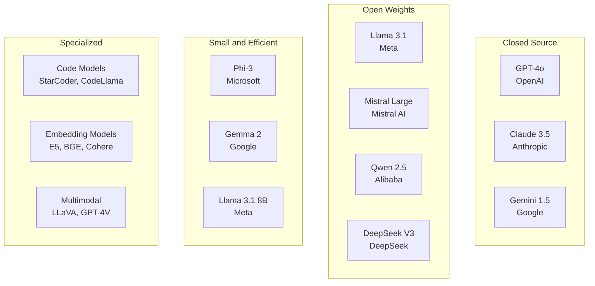

This guide traces the evolution of language models — from counting word sequences to trillion-parameter neural networks that exhibit emergent reasoning. Understanding this history reveals why modern LLMs work the way they do and what trade-offs each generation made.

## Prerequisites

- Basic probability (conditional probability, Bayes' theorem)
- Neural network fundamentals (layers, training, loss functions)
- Transformer architecture basics (attention, encoder/decoder)

---

## What Is a Language Model?

A language model assigns probabilities to sequences of tokens:

```text
P("The cat sat on the mat") = ?
```

Equivalently, it predicts the next token given context:

```text
P(next_token | previous_tokens)
```

Every generation of language model — from n-grams to GPT-4 — is fundamentally doing this. The difference is how well they capture the structure of language.

---

## N-Gram Models (1980s–2000s)

The simplest approach: estimate probabilities by counting occurrences in a corpus.

**Bigram model** (n=2): P(word | previous_word)

```text
P("mat" | "the") = Count("the mat") / Count("the")
```

**Trigram model** (n=3): P(word | two_previous_words)

```text
P("sat" | "cat", "the") = Count("the cat sat") / Count("the cat")
```

```python
from collections import defaultdict

class BigramModel:
    def __init__(self):
        self.counts = defaultdict(lambda: defaultdict(int))
        self.totals = defaultdict(int)

    def train(self, corpus):
        for sentence in corpus:
            for w1, w2 in zip(sentence, sentence[1:]):
                self.counts[w1][w2] += 1
                self.totals[w1] += 1

    def probability(self, word, context):
        if self.totals[context] == 0:
            return 1e-10
        return self.counts[context][word] / self.totals[context]
```

### Limitations

| Problem | Description | Mitigation |
|---------|-------------|------------|
| Sparsity | Most n-grams never appear in training data | Smoothing (Kneser-Ney, Laplace) |
| Fixed context | Can only look at n-1 previous words | Increase n (but sparsity explodes) |
| No generalization | "cat sat" and "dog sat" are unrelated | None — fundamental limitation |
| Storage | Vocabulary^n possible n-grams | Pruning, hash tables |

N-gram models dominated speech recognition and machine translation until ~2013. They're still used as baselines and in hybrid systems.

---

## Word Embeddings: Word2Vec and GloVe (2013–2014)

The breakthrough insight: represent words as dense vectors where **similar words have similar vectors**.

### Word2Vec (Mikolov et al., 2013)

Two architectures:

- **CBOW (Continuous Bag of Words):** Predict center word from surrounding context
- **Skip-gram:** Predict surrounding words from center word

```text
Skip-gram example:
Input: "The [cat] sat on the mat"
Predict: "The", "sat" given "cat"
```

The trained weight matrix becomes the embedding — each row is a word's vector.

```python
# Famous analogy: king - man + woman ≈ queen
embedding["king"] - embedding["man"] + embedding["woman"] ≈ embedding["queen"]
```

### GloVe (Pennington et al., 2014)

Global Vectors — combines the benefits of count-based methods (like LSA) with prediction-based methods (like Word2Vec).

Trains on the **co-occurrence matrix**: how often words appear near each other across the entire corpus.

```text
Objective: w_i · w_j + b_i + b_j = log(X_ij)
(dot product of word vectors should approximate log co-occurrence count)
```

### Properties of Word Embeddings

| Property | Example |
|----------|---------|
| Semantic similarity | cos(cat, dog) > cos(cat, car) |
| Analogies | king - man + woman = queen |
| Clustering | Countries cluster together, verbs cluster together |
| Compositionality | Vectors can be added/subtracted meaningfully |

### Limitation: Static Embeddings

Word2Vec/GloVe assign **one vector per word** regardless of context:

```text
"I went to the bank to deposit money"  ← bank = financial institution
"I sat on the river bank"              ← bank = river edge

Same vector for "bank" in both! This is wrong.
```

This motivated **contextual embeddings**.

---

## ELMo: Contextual Embeddings (2018)

ELMo (Embeddings from Language Models) by Peters et al. was the first widely successful contextual embedding model.

Architecture: Two-layer bidirectional LSTM trained as a language model.

```text
Forward LSTM:  → reads left to right, predicts next word
Backward LSTM: ← reads right to left, predicts previous word

ELMo embedding = weighted combination of all LSTM layers
```

Key innovation: The same word gets **different embeddings depending on context**. "Bank" in a financial sentence gets a different vector than "bank" near a river.

Impact: Adding ELMo embeddings to existing models improved performance on virtually every NLP benchmark by 5-25%.

Limitation: Still sequential (LSTM), so training is slow and context is limited.

---

## BERT: Bidirectional Encoder Representations (2018)

BERT (Devlin et al., Google) applied the Transformer encoder to create deep bidirectional contextual embeddings.

### Pre-training Objectives

#### Masked Language Modeling (MLM)

Randomly mask 15% of tokens and predict them:

```text
Input:  "The cat [MASK] on the [MASK]"
Target: "The cat  sat   on the  mat"
```

This forces bidirectional understanding — the model must use both left and right context.

#### Next Sentence Prediction (NSP)

Given two sentences, predict if B follows A:

```text
[CLS] The cat sat on the mat [SEP] It was a sunny day [SEP] → IsNext
[CLS] The cat sat on the mat [SEP] Quantum physics is complex [SEP] → NotNext
```

(NSP was later shown to be less important — RoBERTa dropped it.)

### Architecture

- Encoder-only Transformer (no causal mask — full bidirectional attention)
- BERT-base: 12 layers, 768 hidden, 12 heads, 110M parameters
- BERT-large: 24 layers, 1024 hidden, 16 heads, 340M parameters
- Vocabulary: 30,000 WordPiece tokens
- Max sequence: 512 tokens

### Fine-tuning Pattern

```text
Pre-trained BERT → Add task-specific head → Fine-tune on labeled data

Classification: [CLS] embedding → linear layer → softmax
NER: Each token embedding → linear layer → tag
QA: Start/end token prediction
```

### Impact

BERT dominated NLP benchmarks from 2018–2020. It established the **pre-train then fine-tune** paradigm that all subsequent models follow.

### BERT Variants

| Model | Key Change | Year |
|-------|-----------|------|
| RoBERTa | More data, no NSP, dynamic masking | 2019 |
| ALBERT | Parameter sharing, factorized embeddings | 2019 |
| DistilBERT | Knowledge distillation, 60% size, 97% performance | 2019 |
| DeBERTa | Disentangled attention (content + position) | 2020 |
| XLM-RoBERTa | Multilingual, 100 languages | 2019 |

---

## GPT Series: Autoregressive Language Models

### GPT-1 (2018)

Radford et al. (OpenAI) showed that a decoder-only Transformer pre-trained on next-token prediction could be fine-tuned for downstream tasks.

- 12 layers, 768 hidden, 117M parameters
- Pre-training: predict next token (autoregressive)
- Fine-tuning: add linear head per task

### GPT-2 (2019)

Scaled up GPT-1 and demonstrated **zero-shot** task performance — no fine-tuning needed.

- 48 layers, 1600 hidden, 1.5B parameters
- Trained on WebText (40GB of web pages)
- Key insight: "Language models are unsupervised multitask learners" — framing tasks as text completion works

```text
Translation (zero-shot):
"Translate English to French: cheese =>"  → "fromage"

Summarization (zero-shot):
"Article: [text] TL;DR:"  → summary
```

### GPT-3 (2020)

The scaling breakthrough — showed that **scale alone** produces qualitatively new capabilities.

- 96 layers, 12288 hidden, 175B parameters
- Trained on 300B tokens (Common Crawl, books, Wikipedia)
- Introduced **in-context learning**: provide examples in the prompt, no gradient updates

```text
Few-shot prompting:
"Translate English to French:
sea otter => loutre de mer
cheese => fromage
plush giraffe =>"  → "girafe en peluche"
```

### GPT-4 (2023)

- Estimated ~1.8T parameters (Mixture of Experts)
- Multimodal (text + images)
- Dramatically improved reasoning, instruction following, safety
- Architecture details not published

### The GPT Scaling Story

| Model | Year | Parameters | Training Tokens | Key Capability |
|-------|------|-----------|-----------------|----------------|
| GPT-1 | 2018 | 117M | ~5B | Fine-tuning works |
| GPT-2 | 2019 | 1.5B | ~40B | Zero-shot transfer |
| GPT-3 | 2020 | 175B | 300B | In-context learning |
| GPT-4 | 2023 | ~1.8T (MoE) | ~13T | Complex reasoning |

---

## T5: Text-to-Text Transfer Transformer (2019)

Google's T5 unified all NLP tasks into a single format: **text in, text out**.

```text
Classification: "classify: This movie is great"     → "positive"
Translation:    "translate English to German: Hello" → "Hallo"
Summarization:  "summarize: [long text]"             → "short summary"
QA:             "question: What is X? context: ..."  → "answer"
```

Architecture: Encoder-decoder Transformer (like the original).

Key contribution: Systematic study of pre-training objectives, model sizes, data, and transfer approaches. Showed that the text-to-text framing is universal.

---

## Scaling Laws (2020–2022)

### Kaplan et al. (2020) — OpenAI Scaling Laws

Discovered power-law relationships between model performance and:

- Number of parameters (N)
- Dataset size (D)
- Compute budget (C)

```text
Loss ∝ N^(-0.076)  (more parameters → lower loss)
Loss ∝ D^(-0.095)  (more data → lower loss)
Loss ∝ C^(-0.050)  (more compute → lower loss)
```

Implication: For a fixed compute budget, it's better to train a **larger model for fewer steps** than a smaller model for more steps.

### Chinchilla (2022) — DeepMind

Challenged the "bigger model is always better" assumption. Found that most models were **undertrained** — they needed more data relative to their size.

**Chinchilla optimal:** Training tokens ≈ 20× parameter count.

| Model | Parameters | Training Tokens | Chinchilla Optimal? |
|-------|-----------|-----------------|---------------------|
| GPT-3 | 175B | 300B | No (undertrained, needs ~3.5T) |
| Chinchilla | 70B | 1.4T | Yes |
| Llama 2 | 70B | 2T | Over-trained (intentionally, for inference efficiency) |

Post-Chinchilla, the field shifted toward training smaller models on more data — better inference cost for equivalent performance.

---

## Emergent Abilities

As models scale, they exhibit capabilities that don't exist in smaller models — **phase transitions** rather than gradual improvement.

| Ability | Appears Around | Description |
|---------|---------------|-------------|
| In-context learning | ~10B params | Learn from examples in the prompt |
| Chain-of-thought reasoning | ~60B params | Step-by-step problem solving |
| Code generation | ~10B params | Write functional programs |
| Instruction following | ~1B (with RLHF) | Follow arbitrary natural language instructions |
| Multi-step math | ~100B params | Solve word problems requiring multiple operations |

**Caveat:** Some researchers argue emergent abilities are artifacts of evaluation metrics (discontinuous metrics create apparent phase transitions). The debate is ongoing.

---

## Tokenization

Language models don't process raw text — they operate on **tokens** (subword units).

### Why Not Characters or Words?

| Approach | Vocabulary Size | Problem |
|----------|----------------|---------|
| Characters | ~256 | Sequences too long, no semantic units |
| Words | 100,000+ | Can't handle new words, morphology lost |
| Subwords | 32,000–100,000 | Best of both: manageable vocab, handles any text |

### Byte Pair Encoding (BPE)

The dominant tokenization algorithm. Iteratively merges the most frequent pair of tokens:

```text
Corpus: "low lower lowest"

Step 0: l o w _ l o w e r _ l o w e s t
Step 1: merge (l, o) → lo:  lo w _ lo w e r _ lo w e s t
Step 2: merge (lo, w) → low: low _ low e r _ low e s t
Step 3: merge (e, r) → er:  low _ low er _ low e s t
Step 4: merge (e, s) → es:  low _ low er _ low es t
Step 5: merge (es, t) → est: low _ low er _ low est
...
```

Result: Common words become single tokens; rare words split into subwords.

```python
# Example tokenization (GPT-style)
"unhappiness" → ["un", "happiness"]
"transformers" → ["transform", "ers"]
"ChatGPT" → ["Chat", "G", "PT"]
```

### SentencePiece

Google's tokenizer that operates on raw text (no pre-tokenization). Treats the input as a sequence of Unicode characters and learns subword units directly. Language-agnostic — works for any script.

Used by: T5, Llama, Mistral, multilingual models.

### tiktoken

OpenAI's fast BPE implementation used by GPT-3.5/4. Key difference: uses a regex-based pre-tokenizer to split on word boundaries before BPE, preventing merges across word boundaries.

```python
import tiktoken

enc = tiktoken.encoding_for_model("gpt-4")
tokens = enc.encode("Hello, world!")
# [9906, 11, 1917, 0]
print(enc.decode(tokens))
# "Hello, world!"
print(len(enc.encode("This sentence has")), "tokens")
```

### Tokenization Comparison

| Tokenizer | Vocab Size | Used By | Special Features |
|-----------|-----------|---------|------------------|
| WordPiece | 30,000 | BERT | Prefix ## for subwords |
| BPE (GPT-2) | 50,257 | GPT-2, GPT-3 | Byte-level fallback |
| tiktoken (cl100k) | 100,000 | GPT-3.5, GPT-4 | Regex pre-split, fast |
| SentencePiece | 32,000 | Llama, T5, Mistral | Language-agnostic, unigram option |

### Tokenization Gotchas

- **Arithmetic:** "123 + 456" might tokenize as ["123", " +", " 456"] or ["12", "3", " +", " 4", "56"] — inconsistent number representation hurts math
- **Multilingual:** Non-English text often requires 2-4× more tokens per word
- **Code:** Whitespace-sensitive languages (Python) need careful handling
- **Token boundaries:** Models can't "see inside" tokens — they process whole tokens as atomic units

---

## Context Windows

The context window is the maximum number of tokens a model can process at once.

| Model | Context Window | Approximate Words |
|-------|---------------|-------------------|
| BERT | 512 | ~380 |
| GPT-3 | 4,096 | ~3,000 |
| GPT-3.5-turbo | 16,384 | ~12,000 |
| GPT-4 | 128,000 | ~96,000 |
| Claude 3.5 | 200,000 | ~150,000 |
| Llama 3.1 | 128,000 | ~96,000 |
| Gemini 1.5 Pro | 2,000,000 | ~1,500,000 |

### Why Context Length Matters

- Longer context = more information available for reasoning
- Enables processing entire codebases, books, or conversation histories
- But: attention is O(n²) — doubling context quadruples compute
- Quality often degrades in the middle of long contexts ("lost in the middle" phenomenon)

### Extending Context

| Technique | How It Works |
|-----------|--------------|
| RoPE scaling (NTK) | Interpolate rotary embeddings to longer positions |
| ALiBi | Linear bias naturally extrapolates |
| Sliding window | Only attend to nearby tokens (Mistral) |
| Ring attention | Distribute long sequences across devices |
| Sparse attention | Only attend to selected positions |

---

## Open vs Closed Models

### Closed-Source (API-only)

| Model | Provider | Parameters | Key Strengths |
|-------|----------|-----------|---------------|
| GPT-4o | OpenAI | ~1.8T (MoE, est.) | Reasoning, multimodal, instruction following |
| Claude 3.5 Sonnet | Anthropic | Undisclosed | Long context, coding, safety |
| Gemini 1.5 Pro | Google | Undisclosed | 2M context, multimodal |

### Open-Weight Models

| Model | Provider | Parameters | License | Key Strengths |
|-------|----------|-----------|---------|---------------|
| Llama 3.1 | Meta | 8B / 70B / 405B | Llama 3.1 Community | Strong general performance |
| Mistral Large | Mistral AI | 123B | Research license | Efficient, multilingual |
| Mixtral 8x7B | Mistral AI | 47B (13B active) | Apache 2.0 | MoE efficiency |
| Qwen 2.5 | Alibaba | 0.5B–72B | Apache 2.0 | Multilingual, code |
| DeepSeek V3 | DeepSeek | 671B (37B active) | MIT | MoE, strong reasoning |
| Gemma 2 | Google | 2B / 9B / 27B | Gemma license | Small but capable |
| Phi-3 | Microsoft | 3.8B / 14B | MIT | Small model, strong reasoning |

### Open vs Closed Trade-offs

| Factor | Open Models | Closed Models |
|--------|-------------|---------------|
| Cost | Self-hosted (GPU cost) or cheap API | Per-token API pricing |
| Privacy | Data stays on your infrastructure | Data sent to provider |
| Customization | Full fine-tuning possible | Prompt engineering only |
| Performance | Approaching closed (Llama 3.1 405B) | Still leading edge |
| Latency | Controllable | Depends on provider |
| Reliability | You manage uptime | Provider manages |
| Updates | You choose when to update | Provider may change behavior |

---

## The Modern LLM Landscape (2024–2025)



### Trends

1. **Open models closing the gap** — Llama 3.1 405B matches GPT-4 on many benchmarks
2. **Small models getting better** — Phi-3 3.8B outperforms GPT-3.5 on some tasks
3. **MoE becoming standard** — More parameters, same inference cost
4. **Longer contexts** — 128K–2M tokens becoming common
5. **Multimodal** — Text + image + audio + video in single models
6. **Reasoning models** — o1, DeepSeek-R1 with explicit chain-of-thought

---

## Key Takeaways

1. **Language modeling is next-token prediction at scale** — from n-grams counting co-occurrences to transformers with trillions of parameters, the core task is the same. The revolution is in how well models capture the structure of language.

2. **Contextual embeddings were the paradigm shift** — static embeddings (Word2Vec) give one vector per word; contextual models (ELMo → BERT → GPT) give different representations based on surrounding context. This is why modern models understand polysemy and nuance.

3. **BERT proved pre-train + fine-tune; GPT proved pre-train + prompt** — BERT showed that unsupervised pre-training creates powerful representations. GPT showed that with enough scale, you don't even need fine-tuning — just describe the task in natural language.

4. **Scaling laws are predictable** — model performance follows power laws with compute, data, and parameters. Chinchilla showed the optimal balance: ~20 tokens per parameter. This guides billion-dollar training decisions.

5. **Tokenization is a hidden bottleneck** — BPE/SentencePiece determine what the model can "see." Poor tokenization hurts arithmetic, multilingual performance, and code understanding. It's the least glamorous but most practically important preprocessing step.

6. **Open models have democratized LLMs** — Llama, Mistral, and others provide near-frontier performance with full control over deployment, privacy, and customization. The gap between open and closed narrows with each release.

7. **Context length is the new frontier** — from 512 tokens (BERT) to 2M tokens (Gemini), longer context enables new applications (full codebase understanding, book-length analysis) but introduces challenges in attention efficiency and retrieval quality.
