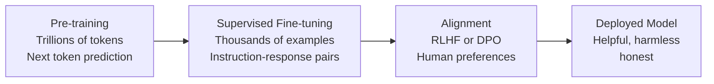
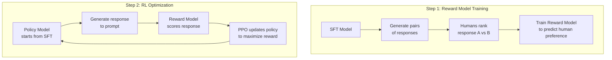

This guide covers the full lifecycle of making a language model useful — from pre-training on raw text to aligning it with human preferences. You'll understand when to fine-tune, when to prompt, and when to use RAG instead.

## Prerequisites

- Transformer architecture (attention, decoder-only models)
- Neural network training (loss functions, optimizers, backpropagation)
- Basic understanding of what language models do (next-token prediction)

---

## The Three Stages of LLM Development

```text
Stage 1: Pre-training          → "Learn language and world knowledge"
Stage 2: Supervised Fine-tuning → "Learn to follow instructions"
Stage 3: Alignment (RLHF/DPO)  → "Learn human preferences"
```



---

## Stage 1: Pre-training

Pre-training creates the **foundation model** — a model that understands language, facts, reasoning patterns, and code, but doesn't yet know how to be a helpful assistant.

### Next-Token Prediction (Autoregressive / Causal LM)

The dominant pre-training objective for decoder-only models (GPT, Llama, Mistral):

```text
Input:  "The capital of France is"
Target: "Paris"

Loss = -log P("Paris" | "The capital of France is")
```

For a sequence of tokens [t₁, t₂, ..., tₙ]:

```text
Loss = -Σᵢ log P(tᵢ | t₁, t₂, ..., tᵢ₋₁)
```

The model learns to predict every token from its left context. This single objective teaches grammar, facts, reasoning, code patterns, and more — all implicitly.

### Masked Language Modeling (BERT-style)

For encoder-only models:

```text
Input:  "The [MASK] sat on the [MASK]"
Target: "cat", "mat"

Loss = -log P("cat" | context) - log P("mat" | context)
```

Bidirectional — uses both left and right context. Better for understanding tasks but can't generate text autoregressively.

### Pre-training Data

| Source | Tokens (approx.) | Content |
|--------|-------------------|---------|
| Common Crawl | 1-5T | Web pages (filtered) |
| Books | 50-100B | Fiction, non-fiction |
| Wikipedia | 5-10B | Encyclopedic knowledge |
| Code (GitHub) | 100-500B | Programming languages |
| Scientific papers | 50-100B | ArXiv, PubMed |
| Conversations | 10-50B | Reddit, forums |

**Data quality matters enormously.** Llama's success came partly from aggressive data filtering and deduplication.

### Pre-training Compute

| Model | GPUs | Training Time | Estimated Cost |
|-------|------|---------------|----------------|
| Llama 2 7B | 2,048 A100 | ~21 days | ~$2M |
| Llama 2 70B | 2,048 A100 | ~150 days | ~$15M |
| GPT-4 (estimated) | ~25,000 A100 | ~90 days | ~$100M |

### Pre-training Hyperparameters (Typical)

```python
# Llama 2 style configuration
config = {
    "optimizer": "AdamW",
    "learning_rate": 3e-4,          # Peak LR
    "lr_schedule": "cosine_decay",
    "warmup_steps": 2000,
    "weight_decay": 0.1,
    "batch_size": 4_000_000,        # Tokens per batch (4M)
    "max_steps": 500_000,
    "gradient_clipping": 1.0,
    "beta1": 0.9,
    "beta2": 0.95,
    "epsilon": 1e-5,
}
```

---

## Stage 2: Supervised Fine-Tuning (SFT)

After pre-training, the model can complete text but doesn't know how to be a helpful assistant. SFT teaches it the **format** of helpful responses.

### Instruction Tuning

Train on (instruction, response) pairs:

```text
### Instruction:
Explain quantum entanglement in simple terms.

### Response:
Quantum entanglement is when two particles become connected in such a way that
measuring one instantly affects the other, no matter how far apart they are...
```

### Data Format

```python
# Typical SFT training example
{
    "messages": [
        {"role": "system", "content": "You are a helpful assistant."},
        {"role": "user", "content": "What is photosynthesis?"},
        {"role": "assistant", "content": "Photosynthesis is the process by which plants convert sunlight, water, and CO₂ into glucose and oxygen..."}
    ]
}
```

The model is trained to predict only the **assistant tokens** — user/system tokens are in the context but don't contribute to the loss.

### SFT Data Sources

| Source | Examples | Quality |
|--------|----------|---------|
| Human-written | 10K–100K | Highest (expensive) |
| Distilled from stronger model | 100K–1M | High (cheaper) |
| Existing NLP datasets reformatted | 1M+ | Medium |
| Self-instruct (model generates own data) | 50K+ | Variable |

### Key Insight: Quality Over Quantity

LIMA (Zhou et al., 2023) showed that **1,000 carefully curated examples** can produce a strong instruction-following model. The pre-trained model already has the knowledge — SFT just teaches it the right format and behavior.

```python
# SFT training loop (simplified)
from transformers import AutoModelForCausalLM, Trainer, TrainingArguments

model = AutoModelForCausalLM.from_pretrained("meta-llama/Llama-2-7b")

training_args = TrainingArguments(
    output_dir="./sft-model",
    num_train_epochs=3,
    per_device_train_batch_size=4,
    gradient_accumulation_steps=8,
    learning_rate=2e-5,          # Much lower than pre-training
    warmup_ratio=0.03,
    lr_scheduler_type="cosine",
    bf16=True,
)

trainer = Trainer(
    model=model,
    args=training_args,
    train_dataset=sft_dataset,
)
trainer.train()
```

---

## Stage 3: Alignment

SFT models follow instructions but may produce harmful, dishonest, or unhelpful outputs. Alignment teaches the model **human preferences** — what makes a response good vs bad.

### RLHF (Reinforcement Learning from Human Feedback)

The original alignment method (used for ChatGPT, Claude):



#### Step 1: Train a Reward Model

Collect human comparisons: given a prompt, humans rank two or more model responses.

```text
Prompt: "Explain gravity to a 5-year-old"

Response A: "Gravity is the force of attraction between masses proportional to..."
Response B: "You know how when you throw a ball up, it always comes back down?..."

Human preference: B > A (simpler, age-appropriate)
```

The reward model learns to assign higher scores to preferred responses:

```python
# Reward model: same architecture as LLM but outputs a scalar
class RewardModel(nn.Module):
    def __init__(self, base_model):
        super().__init__()
        self.backbone = base_model
        self.reward_head = nn.Linear(hidden_size, 1)

    def forward(self, input_ids):
        hidden = self.backbone(input_ids).last_hidden_state[:, -1, :]
        return self.reward_head(hidden)  # Single scalar reward

# Training loss: Bradley-Terry model
# P(A > B) = sigmoid(reward(A) - reward(B))
loss = -log(sigmoid(reward_chosen - reward_rejected))
```

#### Step 2: Optimize with PPO

Use the reward model as a signal to improve the policy (the LLM):

```text
For each prompt:
1. Generate response with current policy
2. Score with reward model
3. Update policy to increase reward
4. Add KL penalty to prevent diverging too far from SFT model
```

The KL penalty is critical — without it, the model finds "reward hacks" (degenerate outputs that score high on the reward model but are actually bad).

```text
Objective = E[reward(response)] - β · KL(policy || reference_policy)
```

#### RLHF Challenges

| Challenge | Description | Mitigation |
|-----------|-------------|------------|
| Reward hacking | Model exploits reward model weaknesses | KL penalty, reward model ensembles |
| Expensive annotation | Human comparisons are slow and costly | Use AI feedback (RLAIF) |
| Training instability | PPO is notoriously unstable | Careful hyperparameter tuning |
| Reward model quality | Garbage in, garbage out | Diverse annotators, clear guidelines |

---

### DPO (Direct Preference Optimization)

DPO (Rafailov et al., 2023) eliminates the reward model and RL entirely. It directly optimizes the policy from preference pairs using a clever mathematical reformulation.

**Key insight:** The optimal policy under the RLHF objective has a closed-form relationship to the reward function. We can skip the reward model and optimize preferences directly.

```text
RLHF: Preferences → Reward Model → RL (PPO) → Better Policy
DPO:  Preferences → Direct Policy Optimization (single step)
```

DPO loss:

```python
# DPO loss function
def dpo_loss(policy_chosen_logps, policy_rejected_logps,
             reference_chosen_logps, reference_rejected_logps, beta=0.1):
    """
    policy_chosen_logps: log P_policy(chosen response)
    reference_chosen_logps: log P_reference(chosen response)
    """
    chosen_rewards = beta * (policy_chosen_logps - reference_chosen_logps)
    rejected_rewards = beta * (policy_rejected_logps - reference_rejected_logps)

    loss = -torch.log(torch.sigmoid(chosen_rewards - rejected_rewards))
    return loss.mean()
```

### DPO vs RLHF

| Aspect | RLHF | DPO |
|--------|------|-----|
| Components | Reward model + PPO | Single training loop |
| Stability | Unstable (RL) | Stable (supervised-like) |
| Compute | 4 models in memory | 2 models (policy + reference) |
| Performance | Proven at scale | Competitive, simpler |
| Flexibility | Can iterate on reward | Fixed to preference data |
| Used by | ChatGPT, Claude | Llama 3, Zephyr, many open models |

### Other Alignment Methods

| Method | Key Idea |
|--------|----------|
| RLAIF | Use AI (not humans) to generate preferences |
| KTO | Only needs "good" or "bad" labels, not comparisons |
| IPO | Fixes DPO's overfitting to preference margin |
| ORPO | Combines SFT and alignment in one step |
| SimPO | Reference-free DPO variant |

---

## Parameter-Efficient Fine-Tuning (PEFT)

Full fine-tuning updates all model parameters — for a 70B model, that's 70 billion floats in memory (plus optimizer states). PEFT methods train only a small fraction of parameters.

### LoRA (Low-Rank Adaptation)

The most popular PEFT method. Instead of updating weight matrix W directly, LoRA adds a low-rank decomposition:

```text
Original: y = Wx
LoRA:     y = Wx + BAx

Where:
- W is frozen (original weights, not updated)
- B is (d × r) — small matrix
- A is (r × d) — small matrix
- r << d (rank, typically 8-64)
```

```text
Full fine-tuning:  Update all of W (d × d parameters)
LoRA:              Only train A and B (2 × d × r parameters)

Example: d=4096, r=16
Full: 16,777,216 parameters per layer
LoRA: 131,072 parameters per layer (0.78%)
```

```python
# LoRA implementation concept
class LoRALayer(nn.Module):
    def __init__(self, original_layer, rank=16, alpha=32):
        super().__init__()
        self.original = original_layer
        self.original.weight.requires_grad = False  # Freeze

        d_in = original_layer.in_features
        d_out = original_layer.out_features

        self.lora_A = nn.Linear(d_in, rank, bias=False)
        self.lora_B = nn.Linear(rank, d_out, bias=False)
        self.scaling = alpha / rank

        # Initialize A with random, B with zeros (start at original behavior)
        nn.init.kaiming_uniform_(self.lora_A.weight)
        nn.init.zeros_(self.lora_B.weight)

    def forward(self, x):
        original_output = self.original(x)
        lora_output = self.lora_B(self.lora_A(x)) * self.scaling
        return original_output + lora_output
```

Using HuggingFace PEFT:

```python
from peft import LoraConfig, get_peft_model

lora_config = LoraConfig(
    r=16,                          # Rank
    lora_alpha=32,                 # Scaling factor
    target_modules=["q_proj", "k_proj", "v_proj", "o_proj",
                    "gate_proj", "up_proj", "down_proj"],
    lora_dropout=0.05,
    bias="none",
    task_type="CAUSAL_LM",
)

model = get_peft_model(base_model, lora_config)
model.print_trainable_parameters()
# trainable params: 13,631,488 || all params: 6,751,318,016 || trainable%: 0.20%
```

### QLoRA (Quantized LoRA)

Combines LoRA with 4-bit quantization of the base model — enables fine-tuning a 65B model on a single 48GB GPU.

```text
Standard LoRA: Base model in FP16 (140GB for 70B) + LoRA adapters
QLoRA:         Base model in 4-bit (35GB for 70B) + LoRA adapters in FP16
```

Key innovations:

- **4-bit NormalFloat (NF4):** Quantization format optimized for normally-distributed weights
- **Double quantization:** Quantize the quantization constants themselves
- **Paged optimizers:** Use CPU RAM for optimizer states that don't fit in GPU

```python
from transformers import BitsAndBytesConfig

bnb_config = BitsAndBytesConfig(
    load_in_4bit=True,
    bnb_4bit_quant_type="nf4",
    bnb_4bit_compute_dtype=torch.bfloat16,
    bnb_4bit_use_double_quant=True,
)

model = AutoModelForCausalLM.from_pretrained(
    "meta-llama/Llama-2-70b",
    quantization_config=bnb_config,
    device_map="auto",
)
# Now apply LoRA on top of the quantized model
```

### Adapters

Insert small trainable modules between frozen layers:

```text
Frozen Layer → [Adapter: down-project → activation → up-project] → Frozen Layer
```

Less popular than LoRA now, but the original PEFT approach (Houlsby et al., 2019).

### PEFT Comparison

| Method | Trainable Params | Memory | Quality vs Full FT | Inference Overhead |
|--------|-----------------|--------|--------------------|--------------------|
| Full fine-tuning | 100% | Very high | Baseline | None |
| LoRA (r=16) | 0.1–1% | Low | 95-100% | Negligible (merge weights) |
| QLoRA | 0.1–1% | Very low | 90-98% | Quantization overhead |
| Adapters | 1-5% | Low | 90-95% | Small (extra layers) |
| Prefix tuning | <0.1% | Very low | 85-95% | Context length cost |
| Prompt tuning | <0.01% | Minimal | 80-90% | Minimal |

---

## Data Preparation for Fine-Tuning

### Data Quality Checklist

1. **Format consistency** — all examples follow the same template
2. **Diversity** — cover the range of tasks/topics you need
3. **Quality** — each example represents ideal model behavior
4. **Length distribution** — match expected inference lengths
5. **Deduplication** — remove near-duplicates
6. **Decontamination** — remove evaluation benchmark data

### Data Formatting

```python
# Chat format (most common)
def format_chat(example):
    messages = [
        {"role": "system", "content": "You are a helpful coding assistant."},
        {"role": "user", "content": example["question"]},
        {"role": "assistant", "content": example["answer"]},
    ]
    return tokenizer.apply_chat_template(messages, tokenize=False)

# Alpaca format (legacy but common in datasets)
TEMPLATE = """### Instruction:
{instruction}

### Input:
{input}

### Response:
{output}"""
```

### How Much Data?

| Use Case | Examples Needed | Notes |
|----------|----------------|-------|
| Format/style change | 100–1,000 | Model already knows the task |
| New task (simple) | 1,000–10,000 | Classification, extraction |
| New domain | 10,000–100,000 | Medical, legal, specialized |
| New language | 100,000+ | Or use multilingual base |

---

## Distributed Training

Training large models requires multiple GPUs. Key strategies:

### Data Parallelism

Same model on each GPU, different data batches. Gradients averaged across GPUs.

```text
GPU 0: Model copy → Batch 0 → Gradients₀ ─┐
GPU 1: Model copy → Batch 1 → Gradients₁ ─┼→ Average → Update all copies
GPU 2: Model copy → Batch 2 → Gradients₂ ─┘
```

Works when the model fits on one GPU. Scales linearly with GPU count.

### Model Parallelism (Tensor Parallelism)

Split individual layers across GPUs:

```text
GPU 0: First half of attention heads
GPU 1: Second half of attention heads
→ All-reduce to combine
```

Needed when a single layer is too large for one GPU.

### Pipeline Parallelism

Split layers across GPUs sequentially:

```text
GPU 0: Layers 1-8
GPU 1: Layers 9-16
GPU 2: Layers 17-24
GPU 3: Layers 25-32
```

Problem: GPU utilization is low (pipeline bubbles). Solution: micro-batching.

### FSDP (Fully Sharded Data Parallelism)

Shards model parameters, gradients, and optimizer states across GPUs. Each GPU only holds 1/N of the full state, gathering parameters on-demand for computation.

```python
# PyTorch FSDP
from torch.distributed.fsdp import FullyShardedDataParallel as FSDP

model = FSDP(
    model,
    sharding_strategy=ShardingStrategy.FULL_SHARD,
    mixed_precision=MixedPrecision(
        param_dtype=torch.bfloat16,
        reduce_dtype=torch.bfloat16,
    ),
)
```

### DeepSpeed ZeRO

Similar to FSDP — progressively shards more state:

| ZeRO Stage | What's Sharded | Memory Reduction |
|------------|----------------|------------------|
| Stage 1 | Optimizer states | 4× |
| Stage 2 | + Gradients | 8× |
| Stage 3 | + Parameters | Linear with GPU count |

### Training Infrastructure Summary

| Model Size | Minimum Hardware | Strategy |
|-----------|-----------------|----------|
| <1B | 1× A100 80GB | Standard training |
| 1-7B | 1-4× A100 80GB | FSDP or DeepSpeed ZeRO-2 |
| 7-13B | 4-8× A100 80GB | FSDP/ZeRO-3 |
| 13-70B | 8-64× A100 80GB | ZeRO-3 + tensor parallelism |
| 70B+ | 64-512+ A100/H100 | Full 3D parallelism |

For **fine-tuning with QLoRA**, requirements drop dramatically:

| Model Size | GPU Memory Needed |
|-----------|-------------------|
| 7B | 1× 24GB (RTX 4090) |
| 13B | 1× 48GB (A6000) |
| 70B | 1× 80GB (A100) or 2× 48GB |

---

## When to Fine-Tune vs Prompt vs RAG

This is the most important practical decision for LLM applications:

### Decision Framework

```text
Do you need the model to know NEW FACTS?
├── Yes → Is the knowledge static or changing?
│   ├── Static (rarely updates) → Fine-tune on domain data
│   └── Dynamic (updates frequently) → RAG
│
└── No → Do you need a new BEHAVIOR or FORMAT?
    ├── Yes → Can you describe it in a prompt?
    │   ├── Yes, and it works → Prompt engineering (done!)
    │   └── No, too complex → Fine-tune (SFT)
    │
    └── No → Do you need better QUALITY on specific tasks?
        ├── Marginal improvement needed → Better prompts, few-shot examples
        └── Significant improvement needed → Fine-tune
```

### Comparison

| Approach | When to Use | Cost | Latency | Maintenance |
|----------|-------------|------|---------|-------------|
| Prompt engineering | Task is describable, model already capable | Lowest | Lowest | Update prompts |
| Few-shot examples | Need consistent format, have good examples | Low | Slightly higher (longer context) | Curate examples |
| RAG | Need current/private knowledge, facts change | Medium | Higher (retrieval step) | Maintain index |
| Fine-tuning (LoRA) | Need new behavior, style, or domain expertise | Medium-High | Same as base | Retrain periodically |
| Full fine-tuning | Maximum quality, have lots of data | Highest | Same as base | Retrain periodically |

### When Fine-Tuning Wins

- **Consistent output format** — JSON schema, specific template
- **Domain-specific language** — medical, legal, code in niche framework
- **Behavior change** — tone, verbosity, reasoning style
- **Latency-sensitive** — can't afford RAG retrieval step
- **Cost at scale** — smaller fine-tuned model replaces expensive large model

### When RAG Wins

- **Knowledge changes frequently** — product catalogs, documentation
- **Need citations/sources** — verifiable answers
- **Private data** — can't include in training data
- **Hallucination reduction** — ground responses in retrieved facts

### When Prompting Wins

- **Quick iteration** — test ideas without training
- **General tasks** — the model already knows how
- **Low volume** — not worth fine-tuning investment
- **Flexibility** — requirements change frequently

---

## Practical Fine-Tuning Recipe

A complete workflow for fine-tuning an open model:

```python
# Step 1: Load base model with quantization
from transformers import AutoModelForCausalLM, AutoTokenizer, BitsAndBytesConfig
from peft import LoraConfig, get_peft_model, prepare_model_for_kbit_training
from trl import SFTTrainer, SFTConfig

model_name = "meta-llama/Llama-3.1-8B"

bnb_config = BitsAndBytesConfig(
    load_in_4bit=True,
    bnb_4bit_quant_type="nf4",
    bnb_4bit_compute_dtype=torch.bfloat16,
)

model = AutoModelForCausalLM.from_pretrained(
    model_name,
    quantization_config=bnb_config,
    device_map="auto",
    attn_implementation="flash_attention_2",
)
tokenizer = AutoTokenizer.from_pretrained(model_name)

# Step 2: Prepare for training
model = prepare_model_for_kbit_training(model)

lora_config = LoraConfig(
    r=32,
    lora_alpha=64,
    target_modules=["q_proj", "k_proj", "v_proj", "o_proj",
                    "gate_proj", "up_proj", "down_proj"],
    lora_dropout=0.05,
    bias="none",
    task_type="CAUSAL_LM",
)

model = get_peft_model(model, lora_config)

# Step 3: Configure training
training_config = SFTConfig(
    output_dir="./output",
    num_train_epochs=3,
    per_device_train_batch_size=4,
    gradient_accumulation_steps=4,
    learning_rate=2e-4,
    lr_scheduler_type="cosine",
    warmup_ratio=0.03,
    max_seq_length=2048,
    bf16=True,
    logging_steps=10,
    save_strategy="epoch",
    evaluation_strategy="epoch",
)

# Step 4: Train
trainer = SFTTrainer(
    model=model,
    args=training_config,
    train_dataset=train_dataset,
    eval_dataset=eval_dataset,
    tokenizer=tokenizer,
)
trainer.train()

# Step 5: Save adapter
model.save_pretrained("./final-adapter")

# Step 6: Merge adapter into base model for deployment (optional)
from peft import PeftModel
base = AutoModelForCausalLM.from_pretrained(model_name, torch_dtype=torch.bfloat16)
merged = PeftModel.from_pretrained(base, "./final-adapter")
merged = merged.merge_and_unload()
merged.save_pretrained("./merged-model")
```

---

## Evaluation

### Metrics for Fine-Tuned Models

| Metric | What It Measures | When to Use |
|--------|-----------------|-------------|
| Perplexity | How surprised the model is by test data | General language quality |
| BLEU/ROUGE | N-gram overlap with reference | Translation, summarization |
| Pass@k | Code execution success rate | Code generation |
| Human evaluation | Overall quality, helpfulness | Always (gold standard) |
| LLM-as-judge | GPT-4 rates outputs | Scalable proxy for human eval |
| Task-specific accuracy | Exact match on benchmarks | Classification, QA |

### Evaluation Best Practices

1. **Hold out test data** that's never seen during training
2. **Evaluate on your actual use case**, not just benchmarks
3. **Compare against the base model** to measure improvement
4. **Check for regression** on general capabilities
5. **Use multiple metrics** — no single number captures quality

---

## Key Takeaways

1. **Pre-training creates knowledge; fine-tuning shapes behavior** — the base model learns language and facts from trillions of tokens. SFT teaches it to be helpful. Alignment teaches it human preferences. Each stage requires orders of magnitude less data than the previous one.

2. **RLHF aligns models with human values but is complex** — training a reward model from human comparisons, then optimizing with PPO, produces remarkably well-behaved models. But it's expensive, unstable, and prone to reward hacking.

3. **DPO simplifies alignment dramatically** — by reformulating the RLHF objective, DPO achieves comparable results with a single supervised training step. It's becoming the default for open-model alignment.

4. **LoRA makes fine-tuning accessible** — by training only low-rank adapter matrices (0.1-1% of parameters), you can fine-tune a 70B model on consumer hardware. QLoRA adds 4-bit quantization to reduce memory further.

5. **The fine-tune vs prompt vs RAG decision is critical** — fine-tuning for behavior/format changes, RAG for dynamic knowledge, prompting for tasks the model already handles. Most applications need a combination.

6. **Data quality trumps quantity for fine-tuning** — 1,000 perfect examples often outperform 100,000 mediocre ones. The model already has knowledge from pre-training; fine-tuning just needs to demonstrate the desired behavior pattern.

7. **Distributed training is essential at scale** — FSDP/DeepSpeed shard model state across GPUs, enabling training of models that don't fit on a single device. But for fine-tuning with PEFT, a single GPU often suffices.
