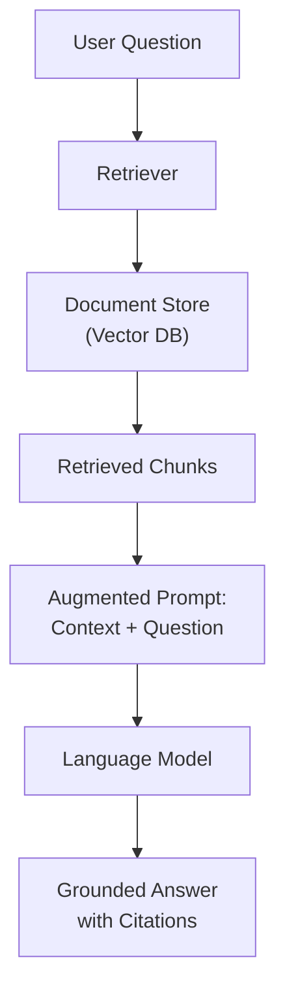
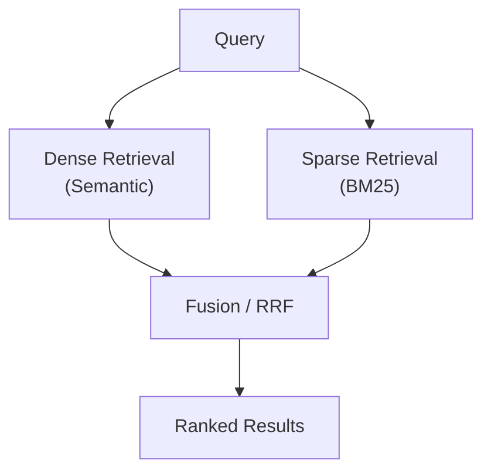
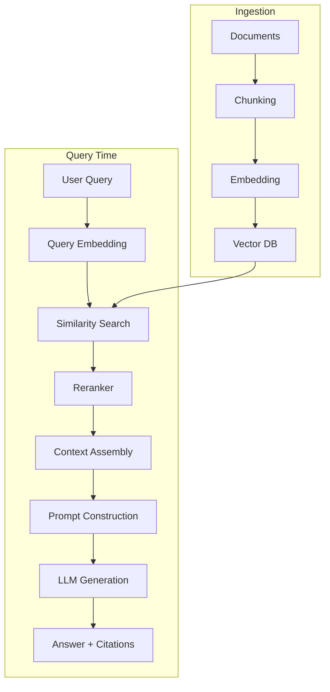
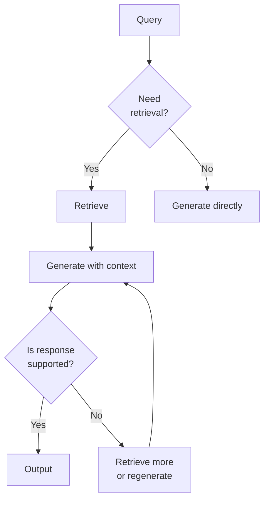

Retrieval-Augmented Generation combines the generative power of large language models with external knowledge retrieval. Instead of relying solely on what the model memorized during training, RAG fetches relevant documents at inference time and includes them in the prompt context. This grounds the model's responses in factual, up-to-date information.

## Prerequisites

- Understanding of how LLMs generate text and their context windows
- Basic familiarity with embeddings and vector spaces
- Knowledge of prompt engineering fundamentals

---

## Why RAG?

### The Problem with Pure LLMs

Large language models have fundamental limitations that RAG addresses:

| Limitation | Description | How RAG Helps |
|-----------|-------------|---------------|
| Knowledge cutoff | Training data has a fixed end date | Retrieves current information |
| Hallucination | Models confidently generate false information | Grounds responses in source documents |
| No private data | Models don't know your internal docs | Retrieves from your knowledge base |
| No attribution | Can't cite sources for claims | Provides source documents for citation |
| Expensive updates | Retraining/fine-tuning is costly | Update the retrieval index instead |

### When to Use RAG vs Fine-Tuning vs Prompting

| Approach | Best For | Knowledge Type | Update Frequency |
|----------|----------|----------------|-----------------|
| Prompting | Small context, few facts | Fits in prompt | Every request |
| Fine-tuning | Behavioral changes, style, format | Baked into weights | Weeks/months |
| RAG | Large knowledge bases, changing data | External retrieval | Minutes/hours |
| RAG + Fine-tuning | Domain expertise + current data | Both | Mixed |



---

## Embedding Models

Embeddings convert text into dense numerical vectors that capture semantic meaning. Similar texts produce vectors that are close together in the embedding space.

### How Embeddings Work

```text
"The cat sat on the mat"  →  [0.12, -0.34, 0.56, ..., 0.78]  (1536 dimensions)
"A feline rested on a rug" →  [0.11, -0.33, 0.55, ..., 0.77]  (similar vector!)
"Stock prices rose today"  →  [-0.45, 0.67, -0.12, ..., 0.23]  (very different)
```

### Embedding Model Comparison

| Model | Dimensions | Max Tokens | Strengths | Provider |
|-------|-----------|------------|-----------|----------|
| text-embedding-3-large | 3072 | 8191 | Best quality, dimension reduction | OpenAI |
| text-embedding-3-small | 1536 | 8191 | Good quality/cost balance | OpenAI |
| embed-v4 | 1024 | 512 | Excellent multilingual, search types | Cohere |
| voyage-3 | 1024 | 32000 | Long context, code-aware | Voyage AI |
| bge-large-en-v1.5 | 1024 | 512 | Best open-source (MTEB) | BAAI |
| nomic-embed-text-v1.5 | 768 | 8192 | Long context, open-source | Nomic |
| all-MiniLM-L6-v2 | 384 | 256 | Fast, lightweight | Sentence-Transformers |
| mxbai-embed-large | 1024 | 512 | Strong open-source alternative | Mixedbread |

### Generating Embeddings

```python
import openai

def get_embeddings(texts: list[str], model: str = "text-embedding-3-small") -> list[list[float]]:
    """Generate embeddings for a list of texts."""
    response = openai.embeddings.create(input=texts, model=model)
    return [item.embedding for item in response.data]

# Open-source alternative with sentence-transformers
from sentence_transformers import SentenceTransformer

model = SentenceTransformer("BAAI/bge-large-en-v1.5")
embeddings = model.encode(["Hello world", "Semantic search is powerful"])
```

### Similarity Metrics

| Metric | Formula | Range | Best For |
|--------|---------|-------|----------|
| Cosine similarity | cos(θ) = A·B / (‖A‖·‖B‖) | [-1, 1] | Normalized embeddings (most common) |
| Dot product | A·B | (-∞, +∞) | When magnitude matters |
| Euclidean distance | ‖A - B‖₂ | [0, +∞) | Absolute distance (lower = more similar) |

---

## Vector Databases

Vector databases are purpose-built for storing, indexing, and querying high-dimensional vectors efficiently.

### Why Not a Regular Database?

Traditional databases use B-trees for exact lookups. Vector search requires **approximate nearest neighbor (ANN)** algorithms because exact search in high dimensions is computationally prohibitive (curse of dimensionality).

### Vector Database Comparison

| Database | Type | Index Algorithms | Strengths | Deployment |
|----------|------|-----------------|-----------|------------|
| Pinecone | Managed SaaS | Proprietary | Zero-ops, fast scaling | Cloud only |
| Weaviate | Open-source | HNSW | Hybrid search, modules | Self-hosted / Cloud |
| Qdrant | Open-source | HNSW | Rust performance, filtering | Self-hosted / Cloud |
| pgvector | PostgreSQL extension | IVFFlat, HNSW | Familiar SQL, no new infra | Wherever Postgres runs |
| Milvus | Open-source | IVF, HNSW, DiskANN | Massive scale, GPU support | Self-hosted / Cloud |
| ChromaDB | Open-source | HNSW | Simple API, prototyping | Embedded / Self-hosted |

### pgvector Example

```python
import psycopg2
from pgvector.psycopg2 import register_vector

conn = psycopg2.connect("postgresql://localhost/ragdb")
register_vector(conn)
cur = conn.cursor()

# Create table with vector column
cur.execute("""
    CREATE TABLE IF NOT EXISTS documents (
        id SERIAL PRIMARY KEY,
        content TEXT NOT NULL,
        metadata JSONB,
        embedding vector(1536)
    );
    CREATE INDEX ON documents USING hnsw (embedding vector_cosine_ops);
""")

# Insert document with embedding
cur.execute(
    "INSERT INTO documents (content, metadata, embedding) VALUES (%s, %s, %s)",
    (chunk_text, json.dumps(metadata), embedding_vector)
)

# Query: find top-5 most similar documents
cur.execute("""
    SELECT content, metadata, 1 - (embedding <=> %s::vector) AS similarity
    FROM documents
    ORDER BY embedding <=> %s::vector
    LIMIT 5
""", (query_embedding, query_embedding))
```

### Qdrant Example

```python
from qdrant_client import QdrantClient
from qdrant_client.models import Distance, VectorParams, PointStruct

client = QdrantClient(url="http://localhost:6333")

# Create collection
client.create_collection(
    collection_name="documents",
    vectors_config=VectorParams(size=1536, distance=Distance.COSINE),
)

# Upsert documents
client.upsert(
    collection_name="documents",
    points=[
        PointStruct(id=i, vector=emb, payload={"text": text, "source": source})
        for i, (emb, text, source) in enumerate(zip(embeddings, texts, sources))
    ]
)

# Search with metadata filtering
results = client.search(
    collection_name="documents",
    query_vector=query_embedding,
    query_filter={"must": [{"key": "source", "match": {"value": "technical-docs"}}]},
    limit=5
)
```

---

## Chunking Strategies

Documents must be split into chunks before embedding. Chunk size and strategy significantly impact retrieval quality.

### Why Chunking Matters

```text
Too small (50 tokens):   "The API returns" → lacks context, meaningless in isolation
Too large (2000 tokens): Entire page → dilutes the embedding, retrieves irrelevant content
Sweet spot (200-500):    Complete paragraph/section → meaningful, focused, retrievable
```

### Chunking Methods

| Method | Description | Best For |
|--------|-------------|----------|
| Fixed-size | Split every N characters/tokens | Simple, predictable |
| Fixed with overlap | Fixed size + overlapping window | Preserves cross-boundary context |
| Recursive | Split by hierarchy (section → paragraph → sentence) | Structured documents |
| Semantic | Split at topic/meaning boundaries | Unstructured text |
| Document-aware | Respect markdown headers, code blocks, tables | Technical documentation |

### Implementation

```python
from langchain_text_splitters import RecursiveCharacterTextSplitter

# Recursive splitting — tries larger separators first, falls back to smaller
splitter = RecursiveCharacterTextSplitter(
    chunk_size=500,
    chunk_overlap=50,
    separators=["\n\n", "\n", ". ", " ", ""],  # Priority order
    length_function=len,
)

chunks = splitter.split_text(document_text)
```

```python
# Semantic chunking — splits at meaning boundaries
from langchain_experimental.text_splitter import SemanticChunker
from langchain_openai import OpenAIEmbeddings

semantic_splitter = SemanticChunker(
    OpenAIEmbeddings(),
    breakpoint_threshold_type="percentile",
    breakpoint_threshold_amount=95,  # Split when similarity drops below 95th percentile
)

semantic_chunks = semantic_splitter.split_text(document_text)
```

### Chunking Decision Framework

```text
┌─────────────────────────────────────────────────────┐
│ What type of content?                               │
├──────────────────┬──────────────────────────────────┤
│ Structured docs  │ Use document-aware (headers,     │
│ (markdown, HTML) │ sections as natural boundaries)  │
├──────────────────┼──────────────────────────────────┤
│ Code             │ Split by function/class, keep    │
│                  │ imports with each chunk           │
├──────────────────┼──────────────────────────────────┤
│ Prose            │ Recursive (paragraph → sentence) │
│                  │ with 10-20% overlap              │
├──────────────────┼──────────────────────────────────┤
│ Mixed/unknown    │ Semantic chunking                │
└──────────────────┴──────────────────────────────────┘
```

### Metadata Enrichment

Always store metadata alongside chunks for filtering and attribution:

```python
def create_chunk_with_metadata(text: str, source: str, page: int, section: str) -> dict:
    return {
        "text": text,
        "metadata": {
            "source": source,
            "page": page,
            "section": section,
            "chunk_size": len(text),
            "created_at": datetime.utcnow().isoformat(),
        }
    }
```

---

## Retrieval Methods

### Dense Retrieval

Dense retrieval uses embedding similarity to find relevant documents. It excels at semantic matching — finding documents that mean the same thing even with different words.

```text
Query: "How do I fix a memory leak in Python?"
Retrieves: "Debugging memory issues in Python applications" (semantically similar)
```

### Sparse Retrieval (BM25)

BM25 is a keyword-based scoring algorithm. It excels at exact term matching and is robust for queries with specific technical terms, names, or identifiers.

```text
Query: "error code ECONNREFUSED"
BM25 finds: Documents containing exactly "ECONNREFUSED"
Dense might miss: If the embedding doesn't capture the specific error code
```

```python
from rank_bm25 import BM25Okapi

# Index documents
tokenized_corpus = [doc.lower().split() for doc in documents]
bm25 = BM25Okapi(tokenized_corpus)

# Query
tokenized_query = "memory leak python".lower().split()
scores = bm25.get_scores(tokenized_query)
top_indices = scores.argsort()[-5:][::-1]
```

### Hybrid Retrieval

Hybrid search combines dense and sparse retrieval, getting the best of both worlds:



**Reciprocal Rank Fusion (RRF)** is the most common fusion method:

```python
def reciprocal_rank_fusion(rankings: list[list[str]], k: int = 60) -> list[str]:
    """Combine multiple ranked lists using RRF."""
    scores = {}
    for ranking in rankings:
        for rank, doc_id in enumerate(ranking):
            scores[doc_id] = scores.get(doc_id, 0) + 1.0 / (k + rank + 1)

    return sorted(scores.keys(), key=lambda x: scores[x], reverse=True)

# Combine dense and sparse results
dense_results = ["doc_3", "doc_7", "doc_1", "doc_5"]
sparse_results = ["doc_7", "doc_2", "doc_3", "doc_9"]
fused = reciprocal_rank_fusion([dense_results, sparse_results])
```

### Retrieval Method Comparison

| Method | Strengths | Weaknesses |
|--------|-----------|------------|
| Dense (embedding) | Semantic understanding, paraphrase matching | Misses exact terms, requires good embeddings |
| Sparse (BM25) | Exact matching, no ML needed, fast | No semantic understanding, keyword dependent |
| Hybrid (dense + sparse) | Best of both, robust | More complex, needs fusion tuning |

---

## Reranking

Initial retrieval (whether dense, sparse, or hybrid) is optimized for recall — casting a wide net. Reranking is a second-stage model that re-scores retrieved documents for precision.

### Cross-Encoder Reranking

Cross-encoders process the query and document together (not independently), enabling deep interaction between them:

```text
Bi-encoder (retrieval):   embed(query) · embed(doc)     → fast but shallow
Cross-encoder (reranking): model(query + doc) → score   → slow but accurate
```

```python
from sentence_transformers import CrossEncoder

reranker = CrossEncoder("cross-encoder/ms-marco-MiniLM-L-12-v2")

# Score query-document pairs
query = "How to handle database migrations in production?"
documents = [retrieved_doc_1, retrieved_doc_2, retrieved_doc_3, ...]

pairs = [[query, doc] for doc in documents]
scores = reranker.predict(pairs)

# Rerank by score
reranked = sorted(zip(documents, scores), key=lambda x: x[1], reverse=True)
top_documents = [doc for doc, score in reranked[:5]]
```

### Cohere Rerank API

```python
import cohere

co = cohere.Client("your-api-key")

results = co.rerank(
    model="rerank-v3.5",
    query="database migration strategies",
    documents=retrieved_documents,
    top_n=5,
    return_documents=True,
)

for result in results.results:
    print(f"Score: {result.relevance_score:.3f} | {result.document.text[:100]}")
```

### Two-Stage Retrieval Pipeline

```text
┌──────────────────────────────────────────────────────────────┐
│ Stage 1: Retrieval (fast, high recall)                       │
│   Input: query → Output: top 20-50 candidates               │
│   Method: ANN search (HNSW) + optional BM25                 │
│   Latency: ~10-50ms                                         │
├──────────────────────────────────────────────────────────────┤
│ Stage 2: Reranking (slower, high precision)                  │
│   Input: 20-50 candidates → Output: top 3-5 most relevant   │
│   Method: Cross-encoder scoring                              │
│   Latency: ~100-300ms                                        │
└──────────────────────────────────────────────────────────────┘
```

---

## RAG Pipeline Architecture

### Complete Pipeline



### Implementation

```python
class RAGPipeline:
    def __init__(self, vector_store, embedding_model, reranker, llm):
        self.vector_store = vector_store
        self.embedding_model = embedding_model
        self.reranker = reranker
        self.llm = llm

    def query(self, question: str, top_k: int = 5) -> dict:
        # 1: Embed the query
        query_embedding = self.embedding_model.embed(question)

        # 2: Retrieve candidates (cast wide net)
        candidates = self.vector_store.search(query_embedding, limit=20)

        # 3: Rerank for precision
        reranked = self.reranker.rerank(question, candidates, top_n=top_k)

        # 4: Assemble context
        context = "\n\n---\n\n".join([doc.text for doc in reranked])

        # 5: Generate answer
        prompt = f"""Answer the question based on the provided context.
If the context doesn't contain enough information, say so.

Context:
{context}

Question: {question}

Answer:"""

        answer = self.llm.generate(prompt)

        return {
            "answer": answer,
            "sources": [{"text": doc.text, "metadata": doc.metadata} for doc in reranked],
        }
```

---

## RAG Evaluation

Evaluating RAG systems requires measuring both retrieval quality and generation quality.

### Evaluation Dimensions

| Dimension | Measures | Metric |
|-----------|----------|--------|
| Context Relevance | Are retrieved docs relevant to the query? | Precision@k, nDCG |
| Faithfulness | Is the answer supported by the context? | Groundedness score |
| Answer Relevance | Does the answer address the question? | Semantic similarity to reference |
| Context Recall | Did we retrieve all necessary information? | Recall@k |
| Hallucination | Does the answer contain unsupported claims? | Claim verification rate |

### RAGAS Framework

RAGAS (Retrieval Augmented Generation Assessment) provides automated evaluation:

```python
from ragas import evaluate
from ragas.metrics import faithfulness, answer_relevancy, context_precision, context_recall
from datasets import Dataset

# Prepare evaluation dataset
eval_data = Dataset.from_dict({
    "question": ["What is the capital of France?", ...],
    "answer": ["Paris is the capital of France.", ...],
    "contexts": [["France is a country in Europe. Its capital is Paris."], ...],
    "ground_truth": ["The capital of France is Paris.", ...],
})

results = evaluate(
    eval_data,
    metrics=[faithfulness, answer_relevancy, context_precision, context_recall],
)
print(results)
# {'faithfulness': 0.95, 'answer_relevancy': 0.92, 'context_precision': 0.88, ...}
```

### Manual Evaluation Checklist

For each query-answer pair:

1. **Retrieval**: Did the system find the right documents? (inspect retrieved chunks)
2. **Faithfulness**: Is every claim in the answer traceable to a retrieved chunk?
3. **Completeness**: Does the answer cover all aspects of the question?
4. **Hallucination**: Are there any statements not supported by the context?
5. **Attribution**: Can the user verify claims by checking cited sources?

---

## Advanced RAG Patterns

### Multi-Hop RAG

Some questions require information from multiple documents that must be combined:

```text
Question: "What is the market cap of the company that acquired Twitter?"

Hop 1: "Twitter was acquired by X Corp (Elon Musk) in 2022"
Hop 2: "X Corp is private and not publicly traded" → need related: "Tesla market cap..."
```

```python
def multi_hop_rag(question: str, max_hops: int = 3) -> str:
    """Iteratively retrieve and reason across multiple documents."""
    context_so_far = []
    current_query = question

    for hop in range(max_hops):
        # Retrieve for current query
        new_docs = retrieve(current_query)
        context_so_far.extend(new_docs)

        # Ask LLM: do we have enough to answer?
        check = llm.generate(f"""
Given this context: {format_context(context_so_far)}
Can you fully answer: {question}
If yes, provide the answer. If no, what additional information is needed?
""")

        if "ANSWER:" in check:
            return check.split("ANSWER:")[1].strip()

        # Generate follow-up query for next hop
        current_query = extract_followup_query(check)

    # Final attempt with all gathered context
    return llm.generate(f"Context: {format_context(context_so_far)}\nQuestion: {question}")
```

### Self-RAG

Self-RAG trains the model to decide when retrieval is needed and to critique its own outputs:



Key insight: the model outputs special tokens indicating:

- `[Retrieve]` — whether retrieval is needed
- `[IsRel]` — whether retrieved passage is relevant
- `[IsSup]` — whether the response is supported by evidence
- `[IsUse]` — whether the response is useful

### Corrective RAG (CRAG)

CRAG adds a knowledge refinement step that evaluates retrieval quality and takes corrective action:

```python
def corrective_rag(question: str) -> str:
    """RAG with retrieval quality assessment and correction."""
    # Standard retrieval
    documents = retrieve(question, top_k=5)

    # Evaluate retrieval quality
    relevance_scores = evaluate_relevance(question, documents)

    if max(relevance_scores) > 0.8:
        # High confidence: use retrieved docs
        context = filter_relevant(documents, relevance_scores, threshold=0.5)
    elif max(relevance_scores) > 0.4:
        # Medium confidence: refine with web search
        web_results = web_search(question)
        context = merge_and_deduplicate(documents, web_results)
    else:
        # Low confidence: fall back to web search entirely
        context = web_search(question)

    # Generate with corrected context
    return generate_answer(question, context)
```

### Query Transformation

Improve retrieval by transforming the user's query before searching:

| Technique | Description | Example |
|-----------|-------------|---------|
| Query expansion | Add synonyms and related terms | "ML" → "machine learning ML artificial intelligence" |
| HyDE | Generate hypothetical answer, embed that | Query → fake answer → embed answer → search |
| Step-back | Ask a more general question first | "Why did X fail?" → "How does X work?" |
| Sub-queries | Decompose into simpler questions | Complex Q → [Q1, Q2, Q3] → retrieve each |

```python
def hyde_retrieval(question: str) -> list:
    """Hypothetical Document Embeddings — generate a fake answer, then search for real ones."""
    # Generate hypothetical answer (doesn't need to be correct)
    hypothetical = llm.generate(
        f"Write a short paragraph that would answer this question:\n{question}"
    )

    # Embed the hypothetical answer (captures the "shape" of a good answer)
    hyde_embedding = embed(hypothetical)

    # Search with the hypothetical embedding
    return vector_store.search(hyde_embedding, limit=10)
```

---

## Production Considerations

### Indexing Pipeline

```text
┌─────────────┐     ┌──────────┐     ┌──────────┐     ┌──────────┐
│ Data Sources│────▶│ Extract  │────▶│ Chunk    │────▶│ Embed    │
│ (docs, APIs)│     │ & Clean  │     │ & Enrich │     │ & Store  │
└─────────────┘     └──────────┘     └──────────┘     └──────────┘
                         │                                    │
                         ▼                                    ▼
                    ┌──────────┐                      ┌──────────────┐
                    │ Dedup &  │                      │ Vector DB +  │
                    │ Version  │                      │ Metadata     │
                    └──────────┘                      └──────────────┘
```

### Key Production Decisions

| Decision | Options | Recommendation |
|----------|---------|----------------|
| Chunk size | 200-1000 tokens | Start with 400-500, tune based on eval |
| Overlap | 0-20% of chunk size | 10-15% for prose, 0% for structured |
| Top-k retrieval | 3-20 | Retrieve 10-20, rerank to top 3-5 |
| Embedding model | See comparison table | text-embedding-3-small for cost, large for quality |
| Vector DB | See comparison table | pgvector if you have Postgres, Qdrant for scale |
| Reranker | Cross-encoder, Cohere | Always use one — 10-30% quality improvement |

### Failure Modes

| Failure | Symptom | Fix |
|---------|---------|-----|
| Poor chunking | Retrieves partial/irrelevant content | Improve chunk boundaries, add overlap |
| Embedding mismatch | Semantically similar docs not retrieved | Try different embedding model, add metadata |
| Context stuffing | Too much irrelevant context confuses LLM | Rerank aggressively, reduce top-k |
| Stale index | Answers based on outdated information | Implement incremental re-indexing |
| Lost in the middle | LLM ignores middle context chunks | Put most relevant chunks first and last |

---

## Key Takeaways

1. **RAG solves the core LLM limitations** — knowledge cutoff, hallucination, and lack of private data access — by grounding generation in retrieved evidence rather than relying on memorized knowledge.

2. **Embedding model choice matters enormously** — it determines what "similar" means for your retrieval. Evaluate on your actual data; the best benchmark model may not be best for your domain.

3. **Chunking is the most underrated component** — bad chunks produce bad embeddings produce bad retrieval. Use document-aware splitting, appropriate overlap, and always enrich with metadata.

4. **Hybrid retrieval (dense + sparse) with reranking** is the production standard — dense catches semantic matches, sparse catches exact terms, and cross-encoder reranking provides the precision layer.

5. **Evaluate systematically** — measure context relevance, faithfulness, and answer quality separately. A system can retrieve perfectly but generate poorly, or vice versa. RAGAS provides automated metrics.

6. **Advanced patterns (multi-hop, self-RAG, CRAG)** address the limitations of naive RAG — use them when simple single-retrieval pipelines produce incomplete or unreliable answers.

7. **Query transformation** (HyDE, sub-queries, step-back) can improve retrieval quality more than changing the embedding model — the way you search matters as much as what you search through.
