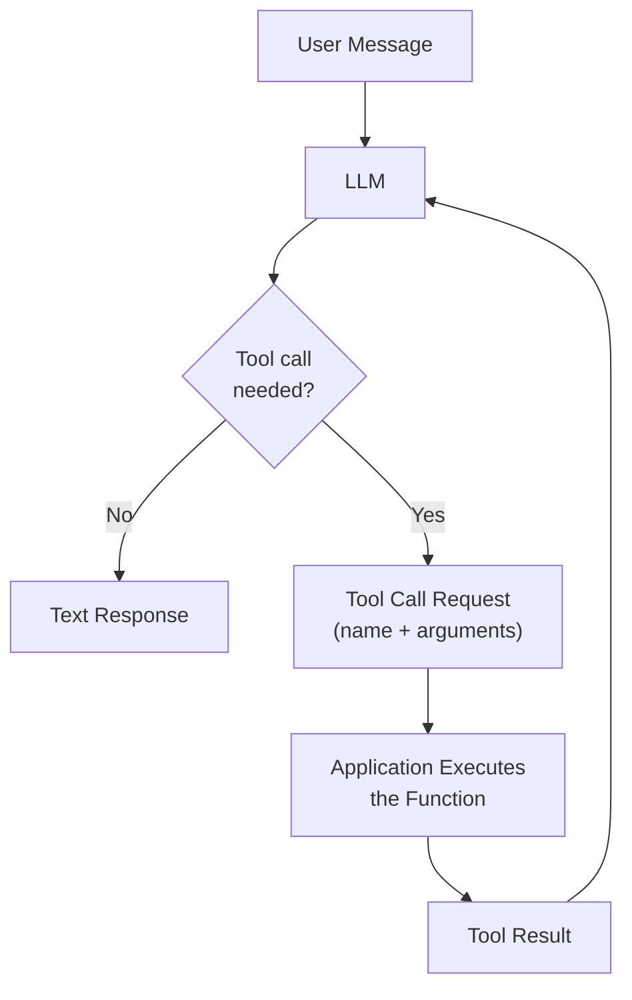
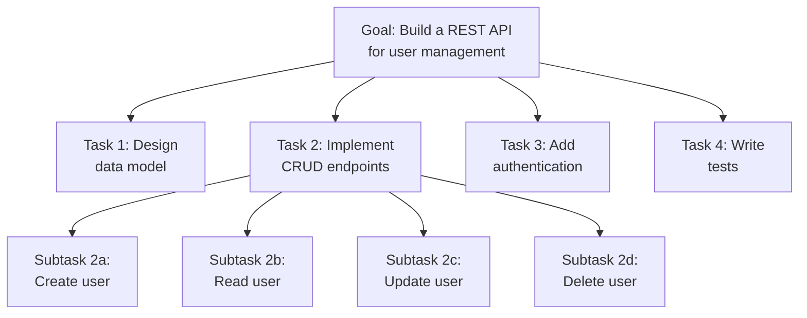
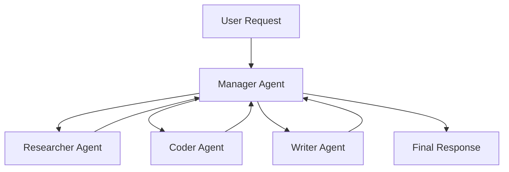
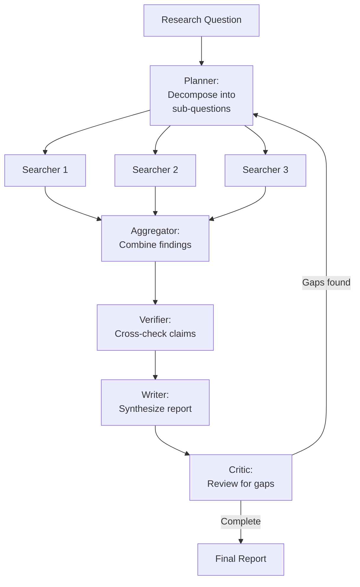

AI agents are systems where a language model autonomously decides what actions to take, executes those actions via external tools, observes the results, and iterates until a goal is achieved. Unlike simple prompt-response interactions, agents maintain state, plan multi-step strategies, and interact with the real world through APIs, databases, file systems, and other software.

## Prerequisites

- Understanding of LLM inference and prompt engineering
- Familiarity with function calling and structured output
- Basic knowledge of API design and software architecture

---

## Function and Tool Calling

Tool calling is the mechanism by which an LLM requests execution of external functions. The model doesn't execute code — it generates structured requests that the application fulfills.

### The Tool Calling Loop



### OpenAI Function Calling

```python
import openai
import json

tools = [
    {
        "type": "function",
        "function": {
            "name": "search_database",
            "description": "Search the product database by query and optional filters",
            "parameters": {
                "type": "object",
                "properties": {
                    "query": {"type": "string", "description": "Search query text"},
                    "category": {"type": "string", "enum": ["electronics", "clothing", "food"]},
                    "max_price": {"type": "number", "description": "Maximum price filter"},
                },
                "required": ["query"],
            },
        },
    }
]

messages = [{"role": "user", "content": "Find me headphones under $100"}]

response = openai.chat.completions.create(
    model="gpt-4o", messages=messages, tools=tools, tool_choice="auto"
)

# Model returns a tool call
tool_call = response.choices[0].message.tool_calls[0]
# tool_call.function.name == "search_database"
# tool_call.function.arguments == '{"query": "headphones", "max_price": 100, "category": "electronics"}'

# Execute the function
result = search_database(**json.loads(tool_call.function.arguments))

# Feed result back to the model
messages.append(response.choices[0].message)
messages.append({"role": "tool", "tool_call_id": tool_call.id, "content": json.dumps(result)})

final_response = openai.chat.completions.create(model="gpt-4o", messages=messages, tools=tools)
```

### Anthropic Tool Use

```python
import anthropic

client = anthropic.Anthropic()

response = client.messages.create(
    model="claude-sonnet-4-20250514",
    max_tokens=1024,
    tools=[
        {
            "name": "get_weather",
            "description": "Get current weather for a location",
            "input_schema": {
                "type": "object",
                "properties": {
                    "location": {"type": "string"},
                    "unit": {"type": "string", "enum": ["celsius", "fahrenheit"]},
                },
                "required": ["location"],
            },
        }
    ],
    messages=[{"role": "user", "content": "What's the weather in Tokyo?"}],
)

# Process tool use blocks in the response
for block in response.content:
    if block.type == "tool_use":
        # block.name == "get_weather"
        # block.input == {"location": "Tokyo", "unit": "celsius"}
        result = get_weather(**block.input)
```

### Tool Design Principles

| Principle | Description |
|-----------|-------------|
| Clear descriptions | The model chooses tools based on descriptions — be precise |
| Minimal parameters | Fewer required params = fewer errors |
| Typed parameters | Use enums, number ranges, and formats to constrain |
| Idempotent when possible | Safe to retry on failure |
| Return structured data | JSON results the model can reason about |
| Error messages | Return clear errors the model can interpret and recover from |

---

## The ReAct Pattern

ReAct (Reason + Act) interleaves reasoning traces with actions. The model thinks about what to do, takes an action, observes the result, and reasons about the next step.

### ReAct Loop

```text
Question: What is the population of the country where the Eiffel Tower is located?

Thought 1: I need to find which country the Eiffel Tower is in.
Action 1: search("Eiffel Tower location")
Observation 1: The Eiffel Tower is located in Paris, France.

Thought 2: The Eiffel Tower is in France. Now I need France's population.
Action 2: search("France population 2024")
Observation 2: France has a population of approximately 68.4 million (2024).

Thought 3: I have the answer. France's population is about 68.4 million.
Action 3: finish("The population of France, where the Eiffel Tower is located, is approximately 68.4 million.")
```

### Implementation

```python
REACT_SYSTEM_PROMPT = """You are a helpful assistant that solves problems step by step.

You have access to these tools:
- search(query): Search the web for information
- calculate(expression): Evaluate a math expression
- lookup(term): Look up a term in the knowledge base

For each step, output:
Thought: [your reasoning about what to do next]
Action: [tool_name(arguments)]

After receiving an Observation, continue with the next Thought.
When you have the final answer, use: Action: finish(answer)
"""

def react_loop(question: str, max_steps: int = 10) -> str:
    messages = [
        {"role": "system", "content": REACT_SYSTEM_PROMPT},
        {"role": "user", "content": question},
    ]

    for step in range(max_steps):
        response = llm.generate(messages)
        action = parse_action(response)

        if action.name == "finish":
            return action.args

        # Execute the action
        observation = execute_tool(action.name, action.args)
        messages.append({"role": "assistant", "content": response})
        messages.append({"role": "user", "content": f"Observation: {observation}"})

    return "Max steps reached without conclusion."
```

### ReAct vs Other Patterns

| Pattern | Reasoning | Action | Observation | Best For |
|---------|-----------|--------|-------------|----------|
| ReAct | Yes (explicit) | Yes | Yes | Multi-step research, complex queries |
| Act-only | No | Yes | Yes | Simple tool routing |
| Chain-of-Thought | Yes | No | No | Reasoning without tools |
| Plan-then-Execute | Yes (upfront) | Yes | Partial | Known multi-step procedures |

---

## Planning and Task Decomposition

Complex goals require breaking down into subtasks. Planning is the agent's ability to create and follow a structured approach.

### Hierarchical Task Decomposition



### Planning Strategies

| Strategy | Description | Tradeoff |
|----------|-------------|----------|
| Upfront planning | Generate full plan before executing | May not adapt to discoveries |
| Incremental planning | Plan next step based on current state | Slower, more adaptive |
| Hierarchical | High-level plan → decompose each step | Balances structure and flexibility |
| Replanning | Replan when observations contradict assumptions | Robust but expensive |

### Plan-and-Execute Pattern

```python
def plan_and_execute(goal: str) -> str:
    # Phase 1: Generate plan
    plan = llm.generate(f"""
Break this goal into a numbered list of concrete steps:
Goal: {goal}

Rules:
- Each step should be independently verifiable
- Steps should be in dependency order
- Include verification steps
""")

    steps = parse_steps(plan)
    results = []

    # Phase 2: Execute each step
    for i, step in enumerate(steps):
        result = execute_step(step, context=results)
        results.append({"step": step, "result": result})

        # Check if replanning is needed
        if needs_replan(step, result):
            remaining = replan(goal, completed=results, remaining=steps[i+1:])
            steps = steps[:i+1] + remaining

    return synthesize_results(results)
```

---

## Memory Systems

Agents need memory to maintain context across interactions and learn from past experiences.

### Memory Types

```text
┌─────────────────────────────────────────────────────────────┐
│                     Agent Memory                             │
├──────────────────────┬──────────────────────────────────────┤
│  Short-Term Memory   │  Long-Term Memory                    │
│  (Working Context)   │  (Persistent Storage)                │
├──────────────────────┼──────────────────────────────────────┤
│  - Current messages  │  - Conversation summaries            │
│  - Tool results      │  - User preferences                 │
│  - Scratchpad        │  - Learned facts                    │
│  - Plan state        │  - Past task outcomes               │
│                      │  - Episodic memories                 │
│  Lifetime: session   │  Lifetime: indefinite               │
│  Storage: context    │  Storage: vector DB / KV store      │
└──────────────────────┴──────────────────────────────────────┘
```

### Short-Term Memory (Context Window)

The simplest memory is the conversation history itself. Management strategies:

```python
class ConversationMemory:
    def __init__(self, max_tokens: int = 100000):
        self.messages = []
        self.max_tokens = max_tokens

    def add(self, message: dict):
        self.messages.append(message)
        self._trim()

    def _trim(self):
        """Keep recent messages within token budget."""
        while count_tokens(self.messages) > self.max_tokens:
            # Summarize oldest messages instead of dropping
            oldest = self.messages[1:4]  # Keep system prompt
            summary = llm.generate(f"Summarize this conversation segment:\n{oldest}")
            self.messages = (
                [self.messages[0]]  # system prompt
                + [{"role": "system", "content": f"Previous context summary: {summary}"}]
                + self.messages[4:]
            )
```

### Long-Term Memory

```python
class LongTermMemory:
    def __init__(self, vector_store):
        self.vector_store = vector_store

    def store(self, content: str, metadata: dict):
        """Store a memory with metadata for later retrieval."""
        embedding = embed(content)
        self.vector_store.upsert(
            id=generate_id(),
            vector=embedding,
            payload={"content": content, "timestamp": now(), **metadata},
        )

    def recall(self, query: str, limit: int = 5) -> list[str]:
        """Retrieve relevant memories."""
        query_embedding = embed(query)
        results = self.vector_store.search(query_embedding, limit=limit)
        return [r.payload["content"] for r in results]

    def reflect(self, recent_memories: list[str]) -> str:
        """Generate higher-level insights from recent memories."""
        return llm.generate(f"""
Based on these recent observations, what patterns or insights emerge?
{chr(10).join(recent_memories)}
""")
```

---

## Multi-Agent Systems

Multi-agent systems use multiple specialized agents that collaborate to solve complex problems.

### Architectures

| Architecture | Description | Best For |
|--------------|-------------|----------|
| Hierarchical | Manager delegates to specialist workers | Clear task decomposition |
| Peer-to-peer | Agents communicate as equals | Debate, consensus-building |
| Pipeline | Output of one agent feeds the next | Sequential workflows |
| Blackboard | Shared workspace all agents read/write | Collaborative problem-solving |

### Hierarchical Multi-Agent



```python
class ManagerAgent:
    def __init__(self, workers: dict[str, Agent]):
        self.workers = workers

    def solve(self, task: str) -> str:
        # Decompose task
        plan = self.plan(task)

        results = {}
        for step in plan:
            worker = self.workers[step.assigned_to]
            result = worker.execute(step.instruction, context=results)
            results[step.id] = result

        # Synthesize final answer
        return self.synthesize(task, results)
```

---

## Agent Frameworks

### LangChain / LangGraph

LangGraph builds agents as state machines with explicit control flow:

```python
from langgraph.graph import StateGraph, END
from typing import TypedDict, Annotated

class AgentState(TypedDict):
    messages: list
    next_action: str

def reasoning_node(state: AgentState) -> AgentState:
    """Decide what to do next."""
    response = llm.invoke(state["messages"])
    if response.tool_calls:
        return {"messages": state["messages"] + [response], "next_action": "tools"}
    return {"messages": state["messages"] + [response], "next_action": "end"}

def tool_node(state: AgentState) -> AgentState:
    """Execute tool calls."""
    last_message = state["messages"][-1]
    results = [execute_tool(tc) for tc in last_message.tool_calls]
    return {"messages": state["messages"] + results, "next_action": "reason"}

# Build graph
graph = StateGraph(AgentState)
graph.add_node("reason", reasoning_node)
graph.add_node("tools", tool_node)
graph.add_edge("reason", "tools", condition=lambda s: s["next_action"] == "tools")
graph.add_edge("tools", "reason")
graph.add_edge("reason", END, condition=lambda s: s["next_action"] == "end")
graph.set_entry_point("reason")

agent = graph.compile()
```

### CrewAI

CrewAI models agents as team members with roles:

```python
from crewai import Agent, Task, Crew

researcher = Agent(
    role="Senior Research Analyst",
    goal="Find comprehensive information about the given topic",
    backstory="Expert at finding and synthesizing information from multiple sources",
    tools=[search_tool, web_scraper],
)

writer = Agent(
    role="Technical Writer",
    goal="Create clear, well-structured documentation",
    backstory="Experienced at translating complex topics into readable content",
    tools=[file_writer],
)

research_task = Task(
    description="Research {topic} and compile key findings",
    agent=researcher,
    expected_output="Structured research notes with sources",
)

writing_task = Task(
    description="Write a comprehensive guide based on the research",
    agent=writer,
    expected_output="A well-structured markdown document",
    context=[research_task],  # Depends on research output
)

crew = Crew(agents=[researcher, writer], tasks=[research_task, writing_task])
result = crew.kickoff(inputs={"topic": "WebAssembly in production"})
```

### AutoGen

AutoGen focuses on multi-agent conversations:

```python
from autogen import AssistantAgent, UserProxyAgent

assistant = AssistantAgent(
    name="coding_assistant",
    llm_config={"model": "gpt-4o"},
    system_message="You are a helpful coding assistant. Write and debug Python code.",
)

executor = UserProxyAgent(
    name="executor",
    human_input_mode="NEVER",
    code_execution_config={"work_dir": "workspace", "use_docker": True},
)

# Agents converse until task is solved
executor.initiate_chat(assistant, message="Create a FastAPI app with user CRUD endpoints")
```

### Framework Comparison

| Framework | Architecture | Strengths | Best For |
|-----------|-------------|-----------|----------|
| LangGraph | State machine graphs | Fine-grained control, cycles, persistence | Complex workflows with branching |
| CrewAI | Role-based teams | Simple API, role abstraction | Team-like collaboration |
| AutoGen | Conversational | Code execution, human-in-loop | Coding tasks, iterative refinement |
| Semantic Kernel | Plugin-based | .NET/Java support, enterprise | Microsoft ecosystem |

---

## Model Context Protocol (MCP)

MCP is an open standard for connecting AI agents to external tools and data sources. It provides a unified interface so agents can discover and use tools without custom integration code per tool.

### MCP Architecture

```text
┌──────────────┐         ┌──────────────┐         ┌──────────────┐
│   AI Agent   │◀──────▶│  MCP Client  │◀──────▶│  MCP Server  │
│  (LLM App)  │  JSON   │  (in host)   │  JSON   │  (tool       │
│              │  -RPC   │              │  -RPC   │   provider)  │
└──────────────┘         └──────────────┘         └──────────────┘
                                                         │
                                                         ▼
                                                  ┌──────────────┐
                                                  │  Resources:  │
                                                  │  - APIs      │
                                                  │  - Databases │
                                                  │  - Files     │
                                                  └──────────────┘
```

### MCP Concepts

| Concept | Description |
|---------|-------------|
| Server | Exposes tools, resources, and prompts via MCP protocol |
| Client | Connects to servers, discovers capabilities, routes requests |
| Tools | Functions the agent can invoke (like function calling) |
| Resources | Data the agent can read (files, DB records, API responses) |
| Prompts | Reusable prompt templates the server provides |
| Sampling | Server can request LLM completions from the client |

### MCP Server Example

```typescript
import { McpServer } from "@modelcontextprotocol/sdk/server/mcp.js";
import { StdioServerTransport } from "@modelcontextprotocol/sdk/server/stdio.js";
import { z } from "zod";

const server = new McpServer({ name: "database-server", version: "1.0.0" });

// Expose a tool
server.tool(
  "query_database",
  "Execute a read-only SQL query against the application database",
  { query: z.string().describe("SQL SELECT query to execute") },
  async ({ query }) => {
    if (!query.trim().toLowerCase().startsWith("select")) {
      return { content: [{ type: "text", text: "Error: Only SELECT queries allowed" }] };
    }
    const results = await db.query(query);
    return { content: [{ type: "text", text: JSON.stringify(results, null, 2) }] };
  }
);

// Expose a resource
server.resource("schema://tables", "Database schema", async () => {
  const schema = await db.query("SELECT table_name, column_name, data_type FROM information_schema.columns");
  return { contents: [{ uri: "schema://tables", text: JSON.stringify(schema) }] };
});

const transport = new StdioServerTransport();
await server.connect(transport);
```

### Why MCP Matters

- **Standardization**: One protocol instead of custom integrations per tool
- **Discovery**: Agents can discover available tools at runtime
- **Composability**: Mix and match servers from different providers
- **Security**: Clear boundaries between agent and tool execution

---

## Sandboxing and Safety

Agents that execute code or modify systems need safety boundaries.

### Risk Levels

| Action Type | Risk | Mitigation |
|-------------|------|------------|
| Read-only queries | Low | Rate limiting |
| File reads | Low-Medium | Path restrictions, no secrets |
| API calls (GET) | Medium | Authentication, rate limits |
| File writes | High | Sandboxed directory, review |
| Code execution | High | Docker containers, timeouts |
| API calls (POST/DELETE) | High | Human approval, dry-run |
| System commands | Critical | Whitelist only, never shell=True |

### Sandboxing Strategies

```python
class SafeExecutor:
    """Execute agent actions with safety boundaries."""

    ALLOWED_PATHS = ["/workspace/", "/tmp/agent/"]
    BLOCKED_COMMANDS = ["rm -rf", "sudo", "curl | sh", "eval"]
    MAX_EXECUTION_TIME = 30  # seconds

    def execute_code(self, code: str) -> str:
        """Run code in isolated Docker container."""
        import docker
        client = docker.from_env()
        container = client.containers.run(
            "python:3.12-slim",
            command=["python", "-c", code],
            mem_limit="256m",
            cpu_period=100000,
            cpu_quota=50000,  # 50% CPU
            network_mode="none",  # No network access
            read_only=True,
            timeout=self.MAX_EXECUTION_TIME,
            detach=False,
            remove=True,
        )
        return container.decode("utf-8")

    def validate_file_access(self, path: str) -> bool:
        """Ensure file access is within allowed directories."""
        resolved = os.path.realpath(path)
        return any(resolved.startswith(allowed) for allowed in self.ALLOWED_PATHS)
```

### Human-in-the-Loop

For high-risk actions, require human approval:

```python
class ApprovalGate:
    def __init__(self, auto_approve_reads: bool = True):
        self.auto_approve_reads = auto_approve_reads

    def check(self, action: str, args: dict) -> bool:
        risk = self.assess_risk(action, args)

        if risk == "low" and self.auto_approve_reads:
            return True

        # Present to human
        print(f"\n⚠️  Agent wants to: {action}")
        print(f"   Arguments: {json.dumps(args, indent=2)}")
        print(f"   Risk level: {risk}")
        response = input("   Approve? [y/N]: ")
        return response.lower() == "y"
```

---

## Real-World Agent Architectures

### Coding Agent Architecture

```text
┌─────────────────────────────────────────────────────────┐
│                    Coding Agent                          │
├─────────────────────────────────────────────────────────┤
│  Planner: Breaks task into file-level changes           │
│  ↓                                                      │
│  Coder: Generates code changes per file                 │
│  ↓                                                      │
│  Reviewer: Checks for bugs, style, security             │
│  ↓                                                      │
│  Executor: Runs tests, linters                          │
│  ↓                                                      │
│  Iterator: If tests fail → back to Coder with errors    │
├─────────────────────────────────────────────────────────┤
│  Tools: file_read, file_write, terminal, search,        │
│         git_diff, run_tests, lint                        │
├─────────────────────────────────────────────────────────┤
│  Safety: sandboxed workspace, git branch isolation,     │
│          no push without approval                       │
└─────────────────────────────────────────────────────────┘
```

### Customer Support Agent

```text
┌─────────────────────────────────────────────────────────┐
│                 Support Agent                            │
├─────────────────────────────────────────────────────────┤
│  Router: Classify intent → route to specialist          │
│  ├── Billing Agent: refunds, invoices, plan changes     │
│  ├── Technical Agent: debugging, how-to, errors         │
│  └── Escalation Agent: complex issues → human handoff   │
├─────────────────────────────────────────────────────────┤
│  Tools: CRM lookup, order history, knowledge base,      │
│         ticket creation, refund processing              │
├─────────────────────────────────────────────────────────┤
│  Memory: customer history, previous tickets,            │
│          resolution patterns                            │
├─────────────────────────────────────────────────────────┤
│  Guardrails: max refund amount, escalation triggers,    │
│              PII handling, compliance checks            │
└─────────────────────────────────────────────────────────┘
```

### Research Agent



---

## Key Takeaways

1. **Tool calling is the bridge between LLMs and the real world** — well-designed tool schemas with clear descriptions, typed parameters, and good error messages are essential for reliable agent behavior.

2. **ReAct (Reason + Act)** interleaves thinking with action, making agent behavior interpretable and debuggable — each step has explicit reasoning that can be audited.

3. **Planning and task decomposition** transform open-ended goals into executable steps — hierarchical decomposition with replanning handles the gap between initial plans and runtime discoveries.

4. **Memory systems** (short-term context + long-term vector storage) give agents continuity across sessions and the ability to learn from past interactions without retraining.

5. **Multi-agent architectures** (hierarchical, pipeline, peer-to-peer) enable specialization — each agent can have different tools, system prompts, and models optimized for its role.

6. **MCP standardizes tool integration** — instead of custom code per tool, a single protocol enables discovery, invocation, and composition of tools from any provider.

7. **Safety is non-negotiable for production agents** — sandbox code execution, restrict file/network access, implement human-in-the-loop for high-risk actions, and never give agents more permissions than they need.
