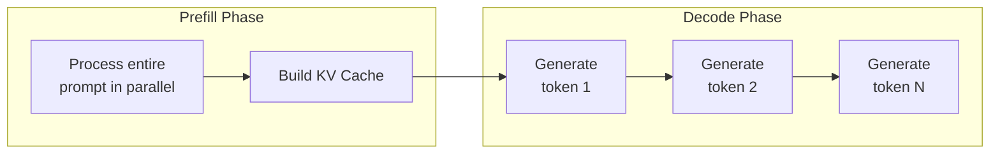
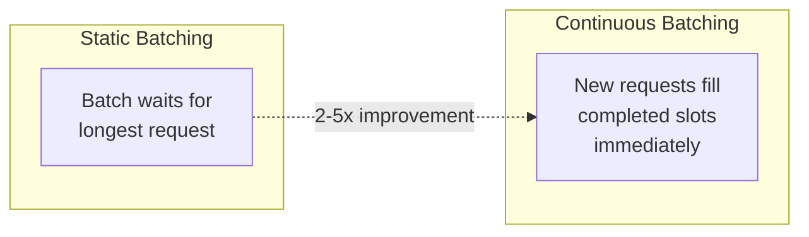
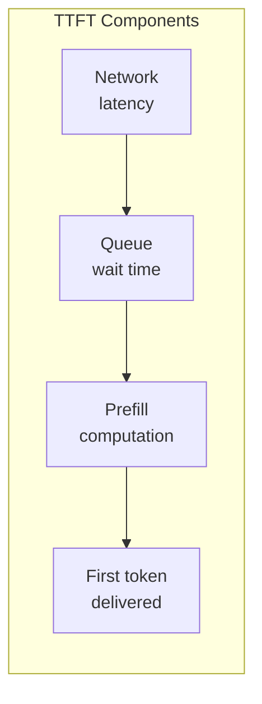
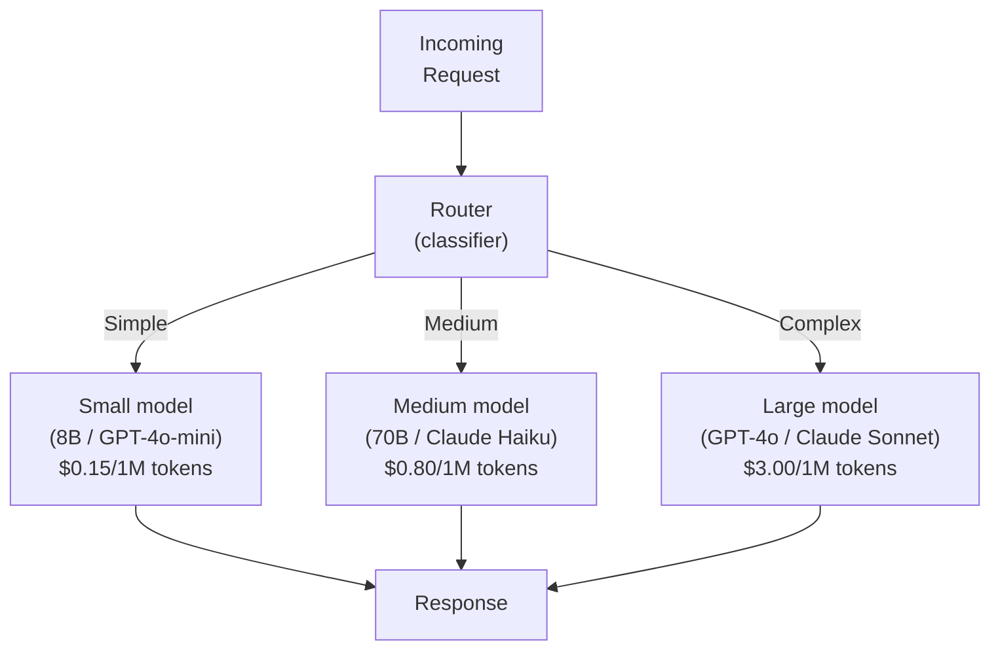
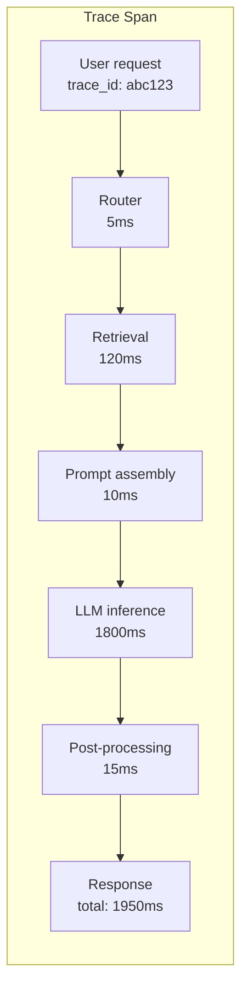
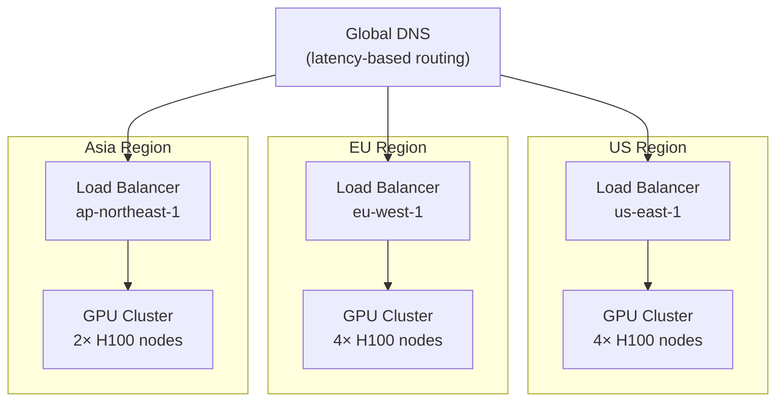

Deploying large language models in production requires understanding the mechanics of text generation, memory constraints, optimization techniques, and the tradeoffs between latency, throughput, and cost. This chapter covers how LLMs generate text at the hardware level and how to serve them efficiently at scale.

## Prerequisites

- Understanding of transformer architecture (attention, KV cache)
- Basic knowledge of GPU computing and memory hierarchies
- Familiarity with model parameters and floating-point representations

---

## Inference Mechanics

### Autoregressive Generation

LLMs generate text one token at a time. Each new token is conditioned on all previous tokens. This sequential dependency is the fundamental constraint of LLM inference.

```text
Prompt: "The capital of France is"

Step 1: P("Paris" | "The capital of France is")     → "Paris"
Step 2: P("."     | "The capital of France is Paris") → "."
Step 3: P("<EOS>" | "The capital of France is Paris.") → STOP
```

### Two Phases of Inference



| Phase | Computation | Bottleneck | Parallelism |
|-------|-------------|------------|-------------|
| Prefill | Process all prompt tokens | Compute-bound (matrix multiply) | High (all tokens at once) |
| Decode | Generate one token per step | Memory-bound (loading weights) | Low (sequential) |

The prefill phase is fast because all prompt tokens are processed in parallel. The decode phase is slow because each token depends on the previous one — the GPU must load the entire model weights from memory for each single token generated.

### KV Cache

The Key-Value cache stores the attention keys and values from all previous tokens, avoiding recomputation at each generation step.

```text
Without KV Cache (naive):
  Token 1: compute attention over [prompt]
  Token 2: compute attention over [prompt + token1]        ← recomputes prompt
  Token 3: compute attention over [prompt + token1 + token2] ← recomputes everything
  Complexity: O(n²) per token

With KV Cache:
  Token 1: compute attention, STORE K,V for all positions
  Token 2: compute attention for new token using CACHED K,V + new K,V
  Token 3: compute attention for new token using CACHED K,V + new K,V
  Complexity: O(n) per token
```

### KV Cache Memory Formula

```text
KV Cache Size = 2 × num_layers × num_heads × head_dim × sequence_length × bytes_per_param

Example (Llama 3 70B, FP16, 4096 sequence length):
  = 2 × 80 × 64 × 128 × 4096 × 2 bytes
  = ~10.7 GB per sequence
```

This is why long contexts are expensive — the KV cache grows linearly with sequence length and must fit in GPU memory alongside the model weights.

---

## GPU Memory Estimation

Understanding memory requirements is critical for deployment planning.

### Model Weight Memory

```text
Memory = num_parameters × bytes_per_parameter

FP32: 4 bytes per param  → 70B model = 280 GB
FP16: 2 bytes per param  → 70B model = 140 GB
INT8: 1 byte per param   → 70B model = 70 GB
INT4: 0.5 bytes per param → 70B model = 35 GB
```

### Total GPU Memory Budget

```text
Total GPU Memory = Model Weights + KV Cache + Activations + Overhead

Example: Serving Llama 3 70B in INT4 with 8 concurrent users (4K context):
  Model weights:  35 GB
  KV cache:       10.7 GB × 8 users = 85.6 GB
  Activations:    ~2 GB
  Overhead:       ~3 GB
  Total:          ~126 GB → needs 2× A100 80GB or 2× H100 80GB
```

### GPU Comparison for Inference

| GPU | VRAM | FP16 TFLOPS | Memory BW | Best For |
|-----|------|-------------|-----------|----------|
| NVIDIA H100 SXM | 80 GB | 989 | 3.35 TB/s | Large models, high throughput |
| NVIDIA A100 80GB | 80 GB | 312 | 2.0 TB/s | Production serving |
| NVIDIA L40S | 48 GB | 362 | 864 GB/s | Cost-effective inference |
| NVIDIA RTX 4090 | 24 GB | 330 | 1.0 TB/s | Development, small models |
| Apple M4 Ultra | 192 GB (unified) | ~50 | 800 GB/s | Local development, large models |
| AMD MI300X | 192 GB | 1300 | 5.3 TB/s | High-memory workloads |

### Quick Sizing Guide

| Model Size | Precision | Min VRAM | Recommended Setup |
|-----------|-----------|----------|-------------------|
| 7-8B | FP16 | 16 GB | 1× RTX 4090 or 1× L40S |
| 7-8B | INT4 | 6 GB | 1× RTX 4060 or Apple M-series |
| 13B | FP16 | 28 GB | 1× A100 40GB |
| 70B | INT4 | 40 GB | 1× A100 80GB or 2× RTX 4090 |
| 70B | FP16 | 140 GB | 2× A100 80GB |
| 405B | INT4 | 210 GB | 4× A100 80GB or 3× H100 |

---

## Quantization

Quantization reduces model precision from FP16/BF16 to lower bit-widths, dramatically reducing memory requirements and improving inference speed with minimal quality loss.

### Precision Formats

| Format | Bits | Range | Use Case |
|--------|------|-------|----------|
| FP32 | 32 | ±3.4×10³⁸ | Training (legacy) |
| BF16 | 16 | ±3.4×10³⁸ (less precision) | Training and inference |
| FP16 | 16 | ±65504 | Inference baseline |
| INT8 | 8 | -128 to 127 | Good quality/speed tradeoff |
| INT4 | 4 | -8 to 7 | Maximum compression |
| FP8 (E4M3) | 8 | ±448 | H100 native support |

### Quantization Methods

| Method | Approach | Quality | Speed | Calibration Data |
|--------|----------|---------|-------|-----------------|
| RTN (Round-to-Nearest) | Naive rounding | Poor at INT4 | Fast | None |
| GPTQ | Layer-wise optimal rounding | Good | Medium | Required (~128 samples) |
| AWQ | Activation-aware weight quantization | Very good | Medium | Required |
| GGUF (llama.cpp) | Multiple quant levels per tensor | Good | Fast | None (pre-quantized) |
| bitsandbytes (NF4) | Normal-float 4-bit | Good | Fast | None (dynamic) |
| SmoothQuant | Migrate difficulty from activations to weights | Good for INT8 | Fast | Required |

### GPTQ

GPTQ performs layer-wise quantization, minimizing the output error for each layer using a small calibration dataset:

```python
from transformers import AutoModelForCausalLM, AutoTokenizer, GPTQConfig

quantization_config = GPTQConfig(
    bits=4,
    dataset="c4",  # Calibration dataset
    group_size=128,  # Quantize in groups of 128 weights
    desc_act=True,  # Order by activation magnitude
)

model = AutoModelForCausalLM.from_pretrained(
    "meta-llama/Llama-3.1-70B",
    quantization_config=quantization_config,
    device_map="auto",
)
```

### AWQ (Activation-Aware Weight Quantization)

AWQ observes that a small fraction of weights (corresponding to high-activation channels) are disproportionately important. It protects these salient weights:

```python
from awq import AutoAWQForCausalLM

model = AutoAWQForCausalLM.from_pretrained("meta-llama/Llama-3.1-70B")
tokenizer = AutoTokenizer.from_pretrained("meta-llama/Llama-3.1-70B")

quant_config = {"zero_point": True, "q_group_size": 128, "w_bit": 4}
model.quantize(tokenizer, quant_config=quant_config)
model.save_quantized("llama-3.1-70b-awq")
```

### GGUF Format

GGUF is the format used by llama.cpp and Ollama. It supports mixed quantization levels within a single model:

```text
Common GGUF quantization levels:
  Q2_K  — 2-bit (very aggressive, noticeable quality loss)
  Q4_0  — 4-bit (basic, fast)
  Q4_K_M — 4-bit (k-quant medium, good balance)
  Q5_K_M — 5-bit (higher quality)
  Q6_K  — 6-bit (near-FP16 quality)
  Q8_0  — 8-bit (minimal quality loss)
```

### Quality Impact of Quantization

| Model | FP16 (baseline) | INT8 | INT4 (GPTQ) | INT4 (AWQ) |
|-------|-----------------|------|-------------|------------|
| Llama 3 8B (MMLU) | 66.6 | 66.4 (-0.3%) | 65.8 (-1.2%) | 66.1 (-0.8%) |
| Llama 3 70B (MMLU) | 79.5 | 79.3 (-0.3%) | 78.7 (-1.0%) | 79.0 (-0.6%) |

Rule of thumb: INT8 is nearly lossless. INT4 with good methods (AWQ, GPTQ) loses 0.5-2% on benchmarks. Below 4-bit, quality degrades noticeably.

---

## Serving Frameworks

### vLLM

vLLM is the production standard for high-throughput LLM serving. Its key innovation is **PagedAttention** — managing KV cache like virtual memory pages, eliminating fragmentation.

```python
from vllm import LLM, SamplingParams

# Load model
llm = LLM(
    model="meta-llama/Llama-3.1-70B-Instruct",
    tensor_parallel_size=2,  # Split across 2 GPUs
    quantization="awq",
    max_model_len=8192,
    gpu_memory_utilization=0.9,
)

# Generate
sampling_params = SamplingParams(temperature=0.7, top_p=0.9, max_tokens=512)
outputs = llm.generate(["Explain quantum computing in simple terms"], sampling_params)
```

Serve as OpenAI-compatible API:

```text
$ vllm serve meta-llama/Llama-3.1-70B-Instruct \
    --tensor-parallel-size 2 \
    --quantization awq \
    --max-model-len 8192 \
    --port 8000
```

### Text Generation Inference (TGI)

HuggingFace's production serving solution:

```text
$ docker run --gpus all -p 8080:80 \
    ghcr.io/huggingface/text-generation-inference:latest \
    --model-id meta-llama/Llama-3.1-70B-Instruct \
    --quantize awq \
    --num-shard 2 \
    --max-input-length 4096 \
    --max-total-tokens 8192
```

### Ollama

Ollama simplifies local model serving with a Docker-like experience:

```text
$ ollama pull llama3.1:70b-instruct-q4_K_M
$ ollama run llama3.1:70b-instruct-q4_K_M "Explain transformers"

# Serve as API
$ ollama serve  # Exposes OpenAI-compatible API on :11434
```

```python
import ollama

response = ollama.chat(
    model="llama3.1:70b-instruct-q4_K_M",
    messages=[{"role": "user", "content": "Explain transformers"}],
)
```

### llama.cpp

The original CPU/GPU inference engine for GGUF models:

```text
$ ./llama-server \
    -m models/llama-3.1-70b-instruct-Q4_K_M.gguf \
    -ngl 80 \       # Offload all layers to GPU
    -c 8192 \       # Context length
    --host 0.0.0.0 \
    --port 8080
```

### Framework Comparison

| Framework | Strengths | Best For | GPU Required |
|-----------|-----------|----------|--------------|
| vLLM | Highest throughput, PagedAttention | Production serving at scale | Yes |
| TGI | HuggingFace ecosystem, easy Docker | Production with HF models | Yes |
| Ollama | Simplest setup, model management | Local dev, prototyping | Optional |
| llama.cpp | CPU support, GGUF format, minimal deps | Edge, CPU-only, Apple Silicon | Optional |
| SGLang | Structured generation, RadixAttention | Constrained output, high throughput | Yes |

---

## Batching Strategies

### Static Batching

Process a fixed batch of requests together. Problem: all requests must wait for the longest one to finish.

```text
Request 1: "Hi"           → generates 3 tokens   (done at step 3, waits until step 50)
Request 2: "Write essay"  → generates 50 tokens  (done at step 50)
Request 3: "Hello"        → generates 2 tokens   (done at step 2, waits until step 50)

GPU utilization: poor after short requests finish
```

### Continuous Batching (Iteration-Level Batching)

vLLM and TGI use continuous batching: as soon as one request finishes, a new one takes its slot immediately.

```text
Step 1:  [Req1, Req2, Req3] — all generating
Step 3:  [Req1✓, Req2, Req3] — Req1 done, Req4 enters
Step 4:  [Req4, Req2, Req3✓] — Req3 done, Req5 enters
Step 5:  [Req4, Req2, Req5] — continuous flow
...
```



Benefits:

- 2-5× higher throughput than static batching
- Lower average latency (short requests don't wait)
- Better GPU utilization

---

## Speculative Decoding

Speculative decoding uses a small, fast "draft" model to generate candidate tokens, then verifies them in parallel with the large "target" model.

```text
Standard decoding (70B model):
  Step 1: generate token 1 (slow)
  Step 2: generate token 2 (slow)
  Step 3: generate token 3 (slow)
  ...
  Total: N slow steps

Speculative decoding:
  Draft model (7B): quickly generate 5 candidate tokens
  Target model (70B): verify all 5 in ONE forward pass (parallel)
  Accept: first 3 match → keep them (3 tokens for cost of ~1 step)
  Reject: token 4 differs → regenerate from there
```

```text
┌─────────────────────────────────────────────────────────┐
│ Draft model generates: "The quick brown fox jumps"      │
│ Target model verifies:  ✓    ✓     ✓     ✓    ✗        │
│ Accepted tokens:       "The quick brown fox"            │
│ Speedup: 4 tokens verified in 1 target forward pass    │
└─────────────────────────────────────────────────────────┘
```

Key properties:

- **Lossless**: output distribution is identical to the target model alone
- **Speedup**: 2-3× typical, depends on draft-target agreement rate
- **Requirement**: draft model must be much faster than target

---

## API Providers

### Provider Comparison

| Provider | Models | Strengths | Pricing Model |
|----------|--------|-----------|---------------|
| OpenAI | GPT-4o, o1, o3 | Best overall quality, ecosystem | Per token (input/output) |
| Anthropic | Claude 4, Sonnet, Haiku | Long context, safety, coding | Per token |
| Google | Gemini 2.5 Pro/Flash | Multimodal, long context (2M) | Per token |
| Mistral | Mistral Large, Codestral | European, open-weight options | Per token |
| Groq | Llama, Mixtral | Fastest inference (custom hardware) | Per token |
| Together AI | Open-source models | Wide model selection, fine-tuning | Per token |
| Fireworks AI | Open-source models | Fast, function calling | Per token |
| AWS Bedrock | Multiple providers | Enterprise, VPC, compliance | Per token |

### Cost Comparison (approximate, per 1M tokens, as of 2025)

| Model | Input Cost | Output Cost | Context |
|-------|-----------|-------------|---------|
| GPT-4o | $2.50 | $10.00 | 128K |
| GPT-4o-mini | $0.15 | $0.60 | 128K |
| Claude Sonnet 4 | $3.00 | $15.00 | 200K |
| Claude Haiku 3.5 | $0.80 | $4.00 | 200K |
| Gemini 2.5 Flash | $0.15 | $0.60 | 1M |
| Llama 3.1 70B (Together) | $0.88 | $0.88 | 128K |
| Llama 3.1 8B (Together) | $0.18 | $0.18 | 128K |

### Self-Hosting Economics

```text
When self-hosting makes sense:
  ✓ High volume (>$5K/month API spend)
  ✓ Data privacy requirements (no external API calls)
  ✓ Predictable, sustained load
  ✓ Need for customization (fine-tuned models)
  ✓ Latency-sensitive (co-located with application)

When API providers win:
  ✓ Variable/bursty load
  ✓ Need latest frontier models
  ✓ Small team (no ML ops capacity)
  ✓ Rapid prototyping
  ✓ Low volume
```

---

## Cost Optimization

### Strategies

| Strategy | Savings | Complexity | Quality Impact |
|----------|---------|------------|----------------|
| Model routing (small → large) | 50-70% | Medium | Minimal (if done well) |
| Prompt caching | 30-50% | Low | None |
| Quantization (self-hosted) | 50-75% memory | Medium | 0.5-2% |
| Batch processing | 50% (OpenAI batch API) | Low | None (higher latency) |
| Output length limits | 20-40% | Low | Possible truncation |
| Semantic caching | 30-60% | Medium | None for cache hits |

### Model Routing

Route simple queries to cheap models, complex ones to expensive models:

```python
def route_request(query: str) -> str:
    """Route to appropriate model based on complexity."""
    # Use a cheap classifier to determine complexity
    complexity = classify_complexity(query)  # Uses small model or heuristics

    if complexity == "simple":
        return call_model("gpt-4o-mini", query)  # $0.15/1M input
    elif complexity == "medium":
        return call_model("claude-haiku", query)  # $0.80/1M input
    else:
        return call_model("gpt-4o", query)  # $2.50/1M input
```

### Prompt Caching

Many providers offer automatic caching for repeated prompt prefixes:

```text
First request:  [System prompt: 2000 tokens] + [User: 100 tokens] → full price
Second request: [System prompt: 2000 tokens (CACHED)] + [User: 50 tokens] → cache discount

Anthropic: 90% discount on cached input tokens
OpenAI: 50% discount on cached input tokens
```

### Semantic Caching

Cache responses for semantically similar queries:

```python
class SemanticCache:
    def __init__(self, vector_store, similarity_threshold: float = 0.95):
        self.store = vector_store
        self.threshold = similarity_threshold

    def get(self, query: str) -> str | None:
        embedding = embed(query)
        results = self.store.search(embedding, limit=1)
        if results and results[0].score > self.threshold:
            return results[0].payload["response"]
        return None

    def set(self, query: str, response: str):
        embedding = embed(query)
        self.store.upsert(vector=embedding, payload={"query": query, "response": response})
```

---

## Latency vs Throughput Tradeoffs

### Definitions

- **Latency**: Time from request to complete response (matters for interactive use)
  - **Time to First Token (TTFT)**: Time until the first token is generated
  - **Inter-Token Latency (ITL)**: Time between consecutive tokens
- **Throughput**: Total tokens generated per second across all requests (matters for batch processing)

### The Fundamental Tradeoff

```text
Larger batch size → Higher throughput, Higher latency
Smaller batch size → Lower latency, Lower throughput

                Throughput
                    ▲
                    │         ╭──────────
                    │       ╭─╯
                    │     ╭─╯
                    │   ╭─╯
                    │ ╭─╯
                    │╭╯
                    ├──────────────────────▶ Batch Size
                    │
    Latency         │
                    ▲
                    │              ╭────────
                    │           ╭──╯
                    │        ╭──╯
                    │     ╭──╯
                    │  ───╯
                    ├──────────────────────▶ Batch Size
```

### Optimization by Use Case

| Use Case | Priority | Optimization |
|----------|----------|-------------|
| Chat/interactive | Low TTFT, low ITL | Small batch, speculative decoding |
| Code completion | Low TTFT | Speculative decoding, small model |
| Batch processing | High throughput | Large batch, continuous batching |
| Streaming | Low ITL | Token-level streaming |
| RAG pipeline | Balanced | Parallel retrieval + generation |

---

## Edge Deployment

Running models on edge devices (phones, laptops, embedded systems) with limited resources.

### Edge Deployment Options

| Platform | Runtime | Models | Performance |
|----------|---------|--------|-------------|
| iOS/macOS | Core ML, MLX | Up to 7B quantized | 30-50 tok/s (M-series) |
| Android | MediaPipe, ONNX | Up to 3B quantized | 10-20 tok/s |
| Browser | WebLLM (WebGPU) | Up to 7B quantized | 10-30 tok/s |
| Raspberry Pi | llama.cpp | Up to 3B Q4 | 2-5 tok/s |
| Laptop (CPU) | llama.cpp, Ollama | Up to 13B Q4 | 10-30 tok/s |

### MLX (Apple Silicon)

```python
import mlx.core as mx
from mlx_lm import load, generate

model, tokenizer = load("mlx-community/Llama-3.1-8B-Instruct-4bit")
response = generate(model, tokenizer, prompt="Explain edge AI", max_tokens=200)
```

### Key Edge Constraints

| Constraint | Impact | Mitigation |
|-----------|--------|------------|
| Limited RAM | Can't fit large models | Aggressive quantization (Q4, Q2) |
| No GPU (or weak GPU) | Slow matrix multiply | CPU-optimized kernels, smaller models |
| Battery | Sustained inference drains battery | Limit generation length, offload to cloud |
| Thermal | Sustained compute causes throttling | Batch requests, duty cycling |

---

## Structured Output and Constrained Decoding

Unconstrained LLM output is free-form text. For production systems that need machine-readable responses — JSON, SQL, function calls — you need guarantees that the output is syntactically valid.

### The Problem

```text
Prompt: "Return a JSON object with name and age"

Unconstrained output (may fail):
  {"name": "Alice", "age": 30}       ← valid (lucky)
  Sure! Here's the JSON:             ← invalid (preamble)
  {"name": "Alice", age: 30}         ← invalid (missing quotes)
  {"name": "Alice", "age": "thirty"} ← valid JSON, wrong type
```

### Approaches to Structured Output

| Approach | Guarantee | Performance | Flexibility |
|----------|-----------|-------------|-------------|
| Prompt engineering ("respond in JSON") | None — best effort | No overhead | High |
| JSON mode (provider-level) | Valid JSON syntax | Minimal overhead | Medium |
| JSON Schema enforcement | Valid JSON + correct structure | 5-15% overhead | Medium |
| Grammar-based decoding (GBNF) | Any formal grammar | 10-30% overhead | Very high |
| Outlines / structured generation | Regex or JSON Schema | 10-20% overhead | High |
| Function calling schemas | Provider-validated structure | Minimal overhead | Medium |

### JSON Mode and Schema Enforcement

API providers offer built-in structured output:

```python
from openai import OpenAI

client = OpenAI()

response = client.chat.completions.create(
    model="gpt-4o",
    response_format={
        "type": "json_schema",
        "json_schema": {
            "name": "user_info",
            "strict": True,
            "schema": {
                "type": "object",
                "properties": {
                    "name": {"type": "string"},
                    "age": {"type": "integer", "minimum": 0},
                    "email": {"type": "string", "format": "email"},
                },
                "required": ["name", "age", "email"],
                "additionalProperties": False,
            },
        },
    },
    messages=[{"role": "user", "content": "Generate info for a test user"}],
)
```

### Grammar-Based Decoding (GBNF)

llama.cpp supports GBNF grammars that constrain token generation at each step. Only tokens that continue a valid parse are allowed:

```text
# GBNF grammar for a JSON object with specific fields
root   ::= "{" ws "\"action\":" ws action "," ws "\"reason\":" ws string "}"
action ::= "\"approve\"" | "\"reject\"" | "\"escalate\""
string ::= "\"" [^"\\]* "\""
ws     ::= [ \t\n]*
```

```text
How grammar-based decoding works:

Normal decoding:     P(token | context) → sample from full vocabulary
Constrained:         P(token | context) → mask invalid tokens → sample from valid set

Token vocabulary: ["{", "}", "\"", "name", "age", ":", ...]
Grammar state: expecting value after "age":
  Valid next tokens:   [0-9, "-"]
  Invalid (masked):    ["}", "\"", "name", ...]
```

### Outlines Library

Outlines provides structured generation for any HuggingFace or vLLM model:

```python
import outlines

model = outlines.models.vllm("meta-llama/Llama-3.1-8B-Instruct")

# Generate matching a regex
generator = outlines.generate.regex(model, r"\d{3}-\d{2}-\d{4}")
result = generator("Generate a fake SSN: ")

# Generate matching a JSON schema
from pydantic import BaseModel

class Review(BaseModel):
    sentiment: str  # "positive" | "negative" | "neutral"
    score: float
    summary: str

generator = outlines.generate.json(model, Review)
review = generator("Review this product: Great quality, fast shipping")
```

### Function Calling

Function calling is structured output specialized for tool use. The model outputs a function name and arguments matching a predefined schema:

```python
tools = [
    {
        "type": "function",
        "function": {
            "name": "get_weather",
            "parameters": {
                "type": "object",
                "properties": {
                    "location": {"type": "string"},
                    "unit": {"type": "string", "enum": ["celsius", "fahrenheit"]},
                },
                "required": ["location"],
            },
        },
    }
]

response = client.chat.completions.create(
    model="gpt-4o",
    messages=[{"role": "user", "content": "Weather in Paris?"}],
    tools=tools,
    tool_choice="auto",
)
# Guaranteed valid: {"name": "get_weather", "arguments": {"location": "Paris"}}
```

### Performance Implications

```text
Constrained decoding overhead sources:
  1. Token masking — compute valid token set at each step
  2. Reduced sampling space — may force suboptimal tokens
  3. Grammar state tracking — maintain parser state

Typical overhead:
  Simple JSON schema:  5-10% slower generation
  Complex nested schema: 15-25% slower
  Regex patterns:      10-15% slower
  Free-form grammar:   15-30% slower

Mitigation:
  - Pre-compile grammars/schemas (one-time cost)
  - Use provider-native JSON mode when possible (optimized internally)
  - Keep schemas simple — deep nesting increases overhead
```

---

## Streaming and Real-Time Inference

Users perceive streaming responses as faster even when total generation time is identical. Streaming reduces perceived latency by showing tokens as they are generated rather than waiting for the complete response.

### Server-Sent Events (SSE)

SSE is the standard transport for LLM streaming. It uses a single HTTP connection with the server pushing events:

```typescript
// Server-side: Express + OpenAI streaming
import express from "express";
import OpenAI from "openai";

const app = express();
const openai = new OpenAI();

app.post("/chat/stream", async (req, res) => {
  res.setHeader("Content-Type", "text/event-stream");
  res.setHeader("Cache-Control", "no-cache");
  res.setHeader("Connection", "keep-alive");

  const stream = await openai.chat.completions.create({
    model: "gpt-4o",
    messages: req.body.messages,
    stream: true,
  });

  for await (const chunk of stream) {
    const content = chunk.choices[0]?.delta?.content;
    if (content) {
      res.write(`data: ${JSON.stringify({ content })}\n\n`);
    }
  }

  res.write("data: [DONE]\n\n");
  res.end();
});
```

```typescript
// Client-side: consuming SSE stream
async function streamChat(messages: Message[]): AsyncGenerator<string> {
  const response = await fetch("/chat/stream", {
    method: "POST",
    headers: { "Content-Type": "application/json" },
    body: JSON.stringify({ messages }),
  });

  const reader = response.body!.getReader();
  const decoder = new TextDecoder();
  let buffer = "";

  while (true) {
    const { done, value } = await reader.read();
    if (done) break;

    buffer += decoder.decode(value, { stream: true });
    const lines = buffer.split("\n\n");
    buffer = lines.pop() || "";

    for (const line of lines) {
      if (line.startsWith("data: ") && line !== "data: [DONE]") {
        const { content } = JSON.parse(line.slice(6));
        yield content;
      }
    }
  }
}
```

### Time-to-First-Token Optimization



| Optimization | Target | Impact on TTFT |
|-------------|--------|----------------|
| Shorter system prompts | Prefill time | -20-50% |
| Prompt caching | Prefill time | -80-90% (cache hit) |
| Speculative decoding | Decode start | -10-20% |
| Geographic proximity | Network latency | -50-200ms |
| Request prioritization | Queue wait | Variable |
| Smaller model for first response | All phases | -50-70% |

### Streaming with Tool Calls

Tool calls during streaming require buffering — the model must complete the function call JSON before execution:

```python
async def stream_with_tools(messages: list, tools: list):
    """Handle streaming where tool calls may interrupt generation."""
    stream = await client.chat.completions.create(
        model="gpt-4o",
        messages=messages,
        tools=tools,
        stream=True,
    )

    tool_calls_buffer = {}
    async for chunk in stream:
        delta = chunk.choices[0].delta

        # Regular content — stream immediately
        if delta.content:
            yield {"type": "content", "text": delta.content}

        # Tool call accumulation — buffer until complete
        if delta.tool_calls:
            for tc in delta.tool_calls:
                idx = tc.index
                if idx not in tool_calls_buffer:
                    tool_calls_buffer[idx] = {"name": "", "arguments": ""}
                if tc.function.name:
                    tool_calls_buffer[idx]["name"] = tc.function.name
                if tc.function.arguments:
                    tool_calls_buffer[idx]["arguments"] += tc.function.arguments

        # On finish_reason="tool_calls", execute and continue
        if chunk.choices[0].finish_reason == "tool_calls":
            for tc in tool_calls_buffer.values():
                result = await execute_tool(tc["name"], tc["arguments"])
                yield {"type": "tool_result", "name": tc["name"], "result": result}
```

### Client-Side Rendering Patterns

```text
Pattern 1: Append-only (simple)
  Each token appends to a text buffer → re-render

Pattern 2: Markdown streaming
  Accumulate tokens → parse partial markdown → render HTML
  Challenge: incomplete markdown (e.g., "**bold" without closing)

Pattern 3: Structured streaming
  Buffer until valid JSON fragment → parse and render component
  Used for: charts, tables, code blocks with syntax highlighting

Pattern 4: Optimistic rendering
  Show tokens immediately + reformat on sentence boundaries
  Reduces visual jitter from partial words
```

---

## Multi-Model Architectures

Production systems rarely use a single model for everything. Multi-model architectures route requests to the most cost-effective model that can handle them, combine outputs from specialized models, or use cascading patterns for quality assurance.

### Model Routing



```python
from enum import Enum

class Complexity(Enum):
    SIMPLE = "simple"      # Factual Q&A, formatting, classification
    MEDIUM = "medium"      # Summarization, translation, simple reasoning
    COMPLEX = "complex"    # Multi-step reasoning, code generation, analysis

class ModelRouter:
    def __init__(self):
        self.classifier = load_classifier()  # Small fine-tuned model or rules
        self.models = {
            Complexity.SIMPLE: "gpt-4o-mini",
            Complexity.MEDIUM: "claude-3-5-haiku-latest",
            Complexity.COMPLEX: "gpt-4o",
        }

    def route(self, query: str, context: dict) -> str:
        # Heuristic signals for routing
        signals = {
            "token_count": count_tokens(query),
            "has_code": bool(re.search(r"```", query)),
            "requires_reasoning": any(w in query.lower()
                for w in ["analyze", "compare", "design", "why"]),
            "is_classification": context.get("task_type") == "classify",
        }

        complexity = self.classifier.predict(signals)
        return self.models[complexity]
```

### Cascade Pattern

Try the cheapest model first. Only escalate if confidence is low:

```python
async def cascade_generate(query: str, threshold: float = 0.85) -> str:
    """Try cheap model first, escalate if uncertain."""
    # Level 1: Fast and cheap
    response = await call_model("gpt-4o-mini", query, logprobs=True)
    confidence = compute_confidence(response.logprobs)

    if confidence >= threshold:
        return response.text

    # Level 2: More capable
    response = await call_model("gpt-4o", query, logprobs=True)
    confidence = compute_confidence(response.logprobs)

    if confidence >= threshold:
        return response.text

    # Level 3: Most capable (always accept)
    response = await call_model("claude-sonnet-4", query)
    return response.text
```

```text
Cascade economics (1000 requests):
  Without cascade: 1000 × $0.003 (GPT-4o) = $3.00
  With cascade:    700 × $0.00015 (mini) + 200 × $0.003 (4o) + 100 × $0.003 (sonnet)
                 = $0.105 + $0.60 + $0.30 = $1.005 (66% savings)
```

### Specialized Models per Task

| Task | Recommended Model | Why |
|------|-------------------|-----|
| Code generation | Claude Sonnet 4, Codestral | Trained on code, tool use |
| Classification | Fine-tuned small model (8B) | Fast, cheap, high accuracy |
| Summarization | GPT-4o-mini, Gemini Flash | Good enough, low cost |
| Complex reasoning | o3, Claude Sonnet 4 | Chain-of-thought capability |
| Embedding/search | text-embedding-3-small | Purpose-built, fast |
| Translation | Dedicated NMT or GPT-4o-mini | Specialized beats general |
| Vision/multimodal | GPT-4o, Gemini 2.5 Pro | Native multimodal |

### A/B Testing Models in Production

```python
import random
import hashlib

class ModelABTest:
    def __init__(self, experiments: list[dict]):
        self.experiments = experiments
        # Example: [{"model": "gpt-4o", "weight": 0.5},
        #           {"model": "claude-sonnet-4", "weight": 0.5}]

    def select_model(self, user_id: str, experiment_id: str) -> str:
        """Deterministic assignment based on user_id for consistency."""
        hash_input = f"{user_id}:{experiment_id}"
        hash_val = int(hashlib.sha256(hash_input.encode()).hexdigest(), 16)
        bucket = (hash_val % 1000) / 1000.0

        cumulative = 0.0
        for exp in self.experiments:
            cumulative += exp["weight"]
            if bucket < cumulative:
                return exp["model"]
        return self.experiments[-1]["model"]

    def log_result(self, user_id: str, model: str, metrics: dict):
        """Log for analysis: latency, quality score, user satisfaction."""
        emit_metric("ab_test", {
            "user_id": user_id,
            "model": model,
            "ttft_ms": metrics["ttft_ms"],
            "total_tokens": metrics["total_tokens"],
            "quality_score": metrics.get("quality_score"),
            "thumbs_up": metrics.get("thumbs_up"),
        })
```

---

## Monitoring and Observability

LLM systems require specialized monitoring beyond standard application metrics. Token generation rates, quality degradation, and cost tracking are unique to inference workloads.

### Key Metrics

| Metric | What It Measures | Target (Interactive) | Target (Batch) |
|--------|-----------------|---------------------|----------------|
| TTFT (Time to First Token) | Responsiveness | < 500ms | N/A |
| ITL (Inter-Token Latency) | Streaming smoothness | < 50ms | N/A |
| Tokens/second (per request) | Generation speed | > 30 tok/s | > 50 tok/s |
| Tokens/second (system) | Throughput | Depends on hardware | Maximize |
| p50 latency | Typical experience | < 2s | < 30s |
| p95 latency | Tail experience | < 5s | < 60s |
| Error rate | Reliability | < 0.1% | < 0.5% |
| Queue depth | Capacity pressure | < 10 | < 100 |
| GPU utilization | Resource efficiency | 70-90% | > 90% |
| KV cache utilization | Memory pressure | < 85% | < 95% |

### Metrics Collection

```python
import time
from dataclasses import dataclass, field

@dataclass
class InferenceMetrics:
    request_id: str
    model: str
    start_time: float = field(default_factory=time.time)
    first_token_time: float | None = None
    end_time: float | None = None
    input_tokens: int = 0
    output_tokens: int = 0
    error: str | None = None

    @property
    def ttft_ms(self) -> float | None:
        if self.first_token_time:
            return (self.first_token_time - self.start_time) * 1000
        return None

    @property
    def total_latency_ms(self) -> float | None:
        if self.end_time:
            return (self.end_time - self.start_time) * 1000
        return None

    @property
    def tokens_per_second(self) -> float | None:
        if self.end_time and self.first_token_time and self.output_tokens > 1:
            decode_time = self.end_time - self.first_token_time
            return (self.output_tokens - 1) / decode_time if decode_time > 0 else None
        return None

    def emit(self):
        """Send to monitoring system (Datadog, Prometheus, etc.)."""
        metrics = {
            "llm.ttft_ms": self.ttft_ms,
            "llm.total_latency_ms": self.total_latency_ms,
            "llm.tokens_per_second": self.tokens_per_second,
            "llm.input_tokens": self.input_tokens,
            "llm.output_tokens": self.output_tokens,
            "llm.model": self.model,
        }
        send_to_monitoring(metrics)
```

### Logging Prompts and Completions Safely

```text
Safety rules for LLM logging:

  ✓ Log: model name, token counts, latency, finish reason, request ID
  ✓ Log: prompt template name (not content), tool calls made
  ⚠ Conditional: full prompts/completions (only with PII redaction)
  ✗ Never log: API keys, user credentials, raw PII

Redaction strategy:
  1. Hash user identifiers before logging
  2. Strip emails, phone numbers, SSNs via regex
  3. Use a separate, access-controlled store for full prompt logs
  4. Set retention policies (7-30 days for debug, aggregates longer)
```

### Cost Dashboard

```python
@dataclass
class CostTracker:
    """Track per-request and aggregate LLM costs."""

    pricing: dict[str, dict[str, float]]  # model -> {input: $/1M, output: $/1M}

    def request_cost(self, model: str, input_tokens: int, output_tokens: int) -> float:
        rates = self.pricing[model]
        return (input_tokens * rates["input"] + output_tokens * rates["output"]) / 1_000_000

    def daily_report(self, requests: list[InferenceMetrics]) -> dict:
        by_model = {}
        for req in requests:
            cost = self.request_cost(req.model, req.input_tokens, req.output_tokens)
            by_model.setdefault(req.model, {"count": 0, "cost": 0.0, "tokens": 0})
            by_model[req.model]["count"] += 1
            by_model[req.model]["cost"] += cost
            by_model[req.model]["tokens"] += req.input_tokens + req.output_tokens
        return by_model
```

### Alerting on Quality Degradation

```text
Quality signals to monitor:

  1. Refusal rate spike — model refusing valid requests
  2. Empty/truncated responses — max_tokens hit or errors
  3. Tool call failure rate — invalid JSON, wrong function names
  4. User feedback (thumbs down) — lagging indicator
  5. Response length anomalies — suddenly shorter/longer than baseline
  6. Latency percentile drift — p95 creeping up over days

Alert thresholds (example):
  - TTFT p95 > 2s for 5 minutes → warning
  - Error rate > 1% for 5 minutes → critical
  - Cost per hour > 2× daily average → warning
  - Refusal rate > 5% → investigate
```

### Tracing Through LLM Pipelines



```python
# Distributed tracing for LLM pipelines
from opentelemetry import trace

tracer = trace.get_tracer("llm-service")

async def handle_request(query: str):
    with tracer.start_as_current_span("llm_request") as span:
        span.set_attribute("llm.query_length", len(query))

        with tracer.start_as_current_span("retrieval"):
            context = await retrieve_documents(query)
            span.set_attribute("retrieval.doc_count", len(context))

        with tracer.start_as_current_span("inference") as llm_span:
            response = await generate(query, context)
            llm_span.set_attribute("llm.model", response.model)
            llm_span.set_attribute("llm.input_tokens", response.input_tokens)
            llm_span.set_attribute("llm.output_tokens", response.output_tokens)
            llm_span.set_attribute("llm.ttft_ms", response.ttft_ms)

        return response.text
```

---

## Scaling Patterns

LLM inference is GPU-bound and expensive. Scaling requires different strategies than traditional web services because GPU resources are scarce, expensive, and have unique characteristics (high memory, high throughput but limited concurrency per device).

### Horizontal Scaling

```text
┌─────────────────────────────────────────────────────────────┐
│                     Load Balancer                            │
│              (least-connections or queue-aware)              │
└─────────┬──────────────┬──────────────┬────────────────────┘
          │              │              │
    ┌─────▼─────┐  ┌────▼──────┐  ┌───▼───────┐
    │ GPU Node 1│  │ GPU Node 2│  │ GPU Node 3│
    │ 2× H100   │  │ 2× H100   │  │ 2× H100   │
    │ vLLM      │  │ vLLM      │  │ vLLM      │
    │ Queue: 3  │  │ Queue: 7  │  │ Queue: 1  │
    └───────────┘  └───────────┘  └───────────┘
```

| Load Balancing Strategy | Best For | Why |
|------------------------|----------|-----|
| Round-robin | Uniform request sizes | Simple, even distribution |
| Least-connections | Variable request sizes | Avoids overloading slow requests |
| Queue-depth aware | LLM inference | Routes to node with shortest queue |
| Token-budget aware | Mixed workloads | Accounts for prompt length differences |

### Auto-Scaling Based on Queue Depth

```python
# Auto-scaling policy for GPU inference nodes
scaling_config = {
    "metric": "queue_depth_per_node",
    "scale_up": {
        "threshold": 10,          # Queue > 10 requests per node
        "cooldown_seconds": 300,  # Wait 5 min between scale-ups
        "increment": 1,           # Add 1 node at a time
    },
    "scale_down": {
        "threshold": 2,           # Queue < 2 requests per node
        "cooldown_seconds": 900,  # Wait 15 min (GPU nodes are expensive to start)
        "decrement": 1,
    },
    "limits": {
        "min_nodes": 2,           # Always keep 2 for redundancy
        "max_nodes": 8,           # Budget cap
    },
}
```

```text
Why queue depth > CPU utilization for LLM scaling:

  CPU/GPU utilization is always high during inference (80-95%).
  It doesn't tell you if users are WAITING.

  Queue depth directly measures user-facing impact:
    Queue = 0-3:  healthy, low latency
    Queue = 5-10: degrading, scale up soon
    Queue = 15+:  users waiting, scale up NOW
```

### Multi-Region Deployment



| Consideration | Strategy |
|--------------|----------|
| Model consistency | Same model version across all regions |
| Failover | Cross-region fallback with increased latency |
| Data residency | Route by user location for compliance |
| Cost optimization | Fewer nodes in low-traffic regions, scale on demand |
| Cache sharing | Regional prompt caches (not shared cross-region) |

### Handling Traffic Spikes

```text
Strategy: Tiered degradation

Normal load:     All requests → full model (GPT-4o equivalent)
High load:       Simple requests → smaller model, complex → full model
Overload:        Queue > threshold → reject with retry-after header
                 OR degrade to smaller model for all requests

Implementation:
  1. Request queue with priority levels
  2. Admission control (reject early rather than timeout)
  3. Model downgrade under pressure (70B → 8B)
  4. Pre-computed responses for common queries (cache)
  5. Rate limiting per user/tenant
```

```python
class AdmissionController:
    """Protect GPU nodes from overload."""

    def __init__(self, max_queue: int = 50, max_pending_tokens: int = 100_000):
        self.max_queue = max_queue
        self.max_pending_tokens = max_pending_tokens

    async def admit(self, request: InferenceRequest) -> AdmissionResult:
        current_queue = await self.get_queue_depth()
        pending_tokens = await self.get_pending_token_count()

        if current_queue >= self.max_queue:
            return AdmissionResult.REJECT  # 429 with Retry-After

        if pending_tokens + request.estimated_tokens > self.max_pending_tokens:
            if request.priority == "low":
                return AdmissionResult.REJECT
            return AdmissionResult.DOWNGRADE  # Use smaller model

        return AdmissionResult.ADMIT
```

### Capacity Planning

```text
Capacity formula:

  Required GPU nodes = Peak QPS × Avg tokens per request / Tokens per second per node

  Example:
    Peak QPS: 50 requests/second
    Avg output tokens: 200
    Tokens/sec per node (vLLM, 2×H100, 70B-AWQ): ~2000 tok/s

    Required: 50 × 200 / 2000 = 5 nodes

  Add headroom:
    +1 node for redundancy
    +1 node for traffic spikes (20% buffer)
    Total: 7 nodes

  Cost estimate (on-demand H100 instances):
    7 nodes × 2 GPUs × ~$3/hr/GPU = ~$42/hour = ~$30K/month
```

| Planning Factor | Consideration |
|----------------|---------------|
| Peak vs average | Size for p95 traffic, not average |
| Cold start time | GPU nodes take 5-10 min to load models |
| Batch efficiency | Higher batch = better throughput per GPU |
| Context length | Longer contexts reduce concurrent capacity |
| Model updates | Need capacity to run old + new during rollout |

## Key Takeaways

1. **LLM inference has two distinct phases** — prefill (compute-bound, parallel) and decode (memory-bound, sequential). The decode phase is the bottleneck for latency because it requires loading full model weights for each single token.

2. **KV cache is the memory bottleneck for serving** — it grows linearly with sequence length and batch size. A 70B model serving 8 concurrent users at 4K context needs ~86 GB just for KV cache.

3. **Quantization (INT4/INT8) is nearly free performance** — AWQ and GPTQ at 4-bit lose only 0.5-2% quality while halving memory requirements and improving throughput. Always quantize for inference.

4. **Continuous batching** (vLLM, TGI) provides 2-5× throughput improvement over static batching by immediately filling slots freed by completed requests.

5. **Speculative decoding** achieves 2-3× speedup with zero quality loss by using a small draft model to propose tokens that the large model verifies in parallel.

6. **Cost optimization is a system design problem** — model routing (cheap model for simple queries), prompt caching, semantic caching, and batch APIs can reduce costs by 50-80% compared to naive usage.

7. **GPU memory estimation is straightforward arithmetic** — model weights (params × bytes) + KV cache (layers × heads × dim × seq_len × batch × 2 × bytes) + overhead. Always calculate before choosing hardware.

8. **Constrained decoding guarantees valid output** — grammar-based decoding and JSON schema enforcement eliminate parsing failures at 5-30% generation overhead. Use provider-native JSON mode when available for minimal cost.

9. **Streaming reduces perceived latency dramatically** — SSE-based token streaming makes responses feel instant even when total generation time is unchanged. Optimize TTFT (time to first token) as the primary UX metric.

10. **Multi-model architectures cut costs 50-70%** — route simple queries to cheap models, cascade to expensive ones only when confidence is low. Most production traffic is simple enough for small models.

11. **Monitor queue depth, not GPU utilization** — GPU utilization is always high during inference and tells you nothing about user experience. Queue depth directly measures whether users are waiting.
