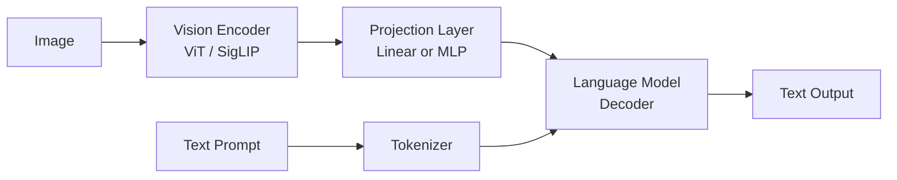
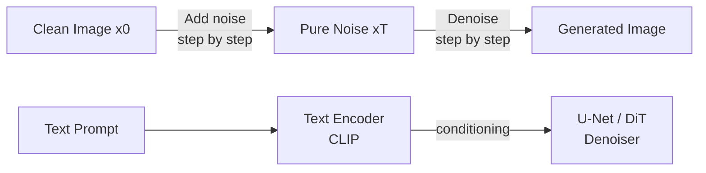
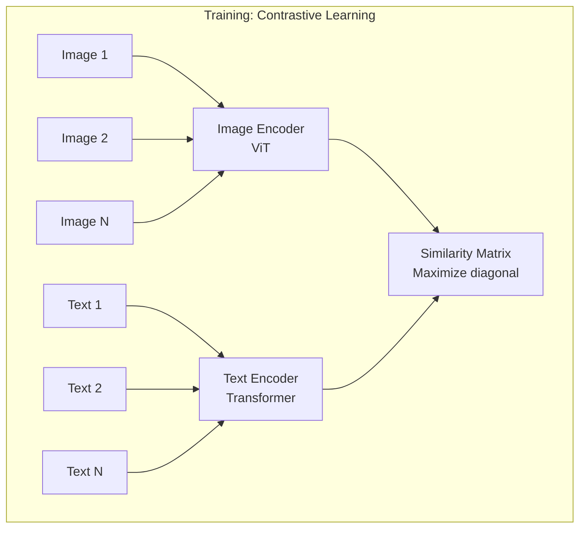
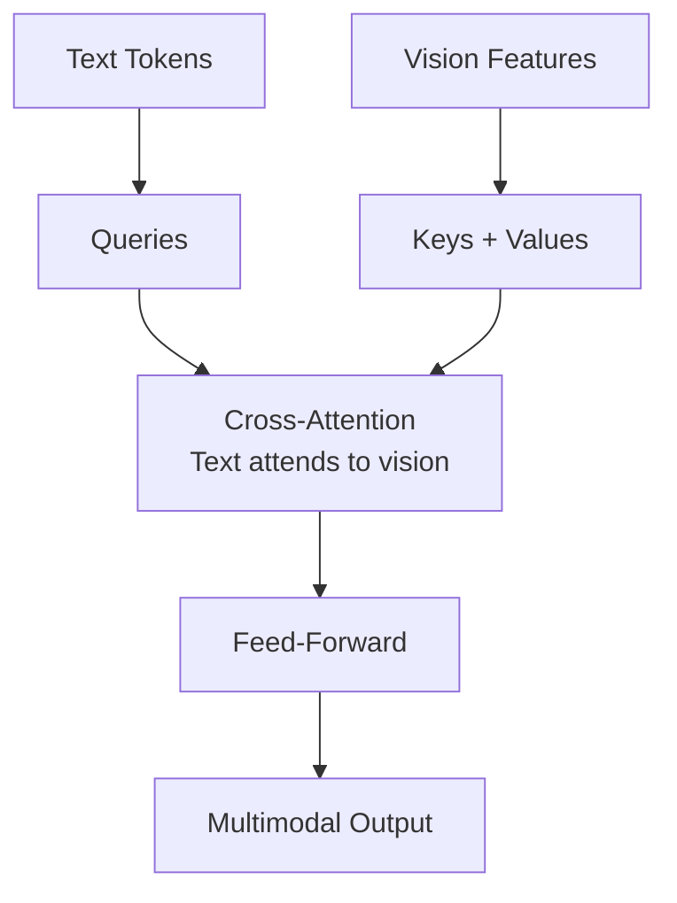
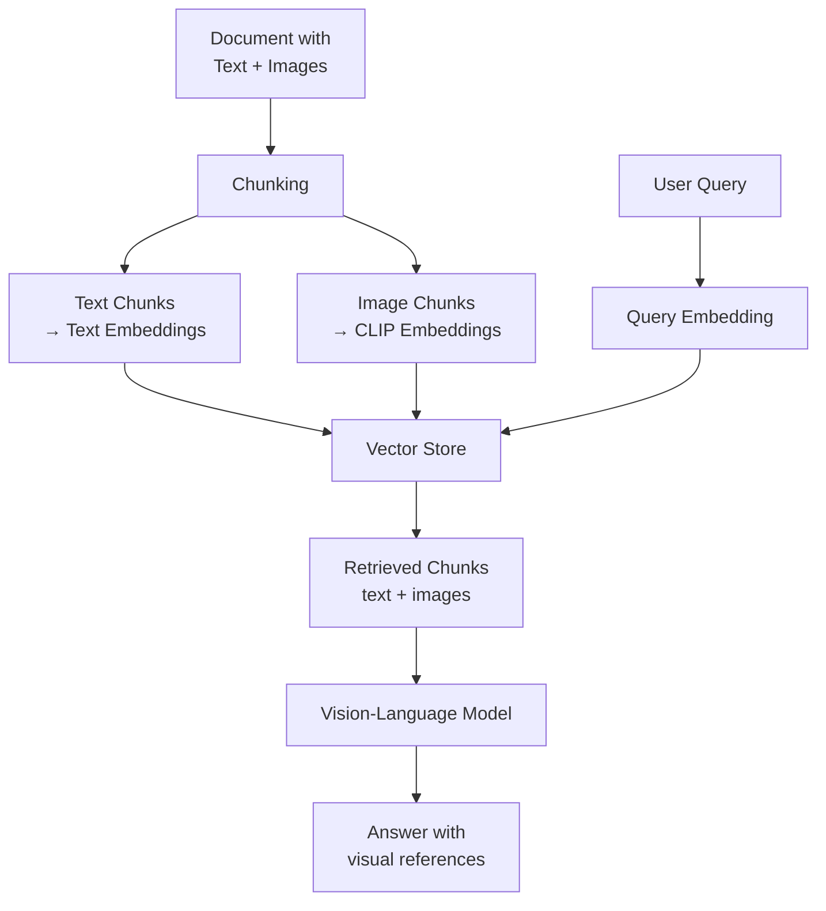

Multimodal AI systems process and generate content across multiple modalities — text, images, audio, and video. This chapter covers the architectures, capabilities, and practical applications of models that bridge these domains.

## Vision-Language Models

### How Vision-Language Models Work

Vision-language models (VLMs) combine a visual encoder with a language model, enabling understanding of images through natural language.



### Architecture Patterns

| Model | Vision Encoder | Language Model | Connection Method |
|-------|---------------|----------------|-------------------|
| GPT-4V / GPT-4o | Proprietary | GPT-4 | Native multimodal training |
| Claude 3.x Vision | Proprietary | Claude | Native multimodal training |
| LLaVA | CLIP ViT-L/14 | Vicuna / LLaMA | Linear projection + instruction tuning |
| Gemini | Proprietary | Gemini | Native multimodal (all modalities) |
| Qwen-VL | ViT-bigG | Qwen | Cross-attention + compression |
| InternVL | InternViT-6B | InternLM | Dynamic resolution + pixel shuffle |

### Using Vision Models

```python
from openai import OpenAI
import base64

client = OpenAI()

def analyze_image(image_path: str, question: str) -> str:
    """Analyze an image with GPT-4o."""
    
    with open(image_path, "rb") as f:
        image_data = base64.standard_b64encode(f.read()).decode("utf-8")
    
    response = client.chat.completions.create(
        model="gpt-4o",
        messages=[{
            "role": "user",
            "content": [
                {"type": "text", "text": question},
                {"type": "image_url", "image_url": {
                    "url": f"data:image/png;base64,{image_data}",
                    "detail": "high"  # "low", "high", or "auto"
                }}
            ]
        }],
        max_tokens=1000
    )
    return response.choices[0].message.content


def analyze_image_url(url: str, question: str) -> str:
    """Analyze an image from URL."""
    
    response = client.chat.completions.create(
        model="gpt-4o",
        messages=[{
            "role": "user",
            "content": [
                {"type": "text", "text": question},
                {"type": "image_url", "image_url": {"url": url}}
            ]
        }]
    )
    return response.choices[0].message.content
```

### Vision Model Capabilities

| Capability | Description | Use Cases |
|-----------|-------------|-----------|
| Image description | Detailed natural language descriptions | Accessibility, cataloging |
| OCR / text extraction | Read text from images | Document processing, receipts |
| Visual reasoning | Answer questions requiring inference | Diagram understanding, charts |
| Object detection | Identify and locate objects | Inventory, safety monitoring |
| Spatial understanding | Understand layout and relationships | UI analysis, architecture |
| Multi-image comparison | Compare or relate multiple images | Before/after, product matching |
| Chart/graph reading | Extract data from visualizations | Report analysis, data extraction |

### Practical Considerations

```text
Token Cost for Images (GPT-4o):

Detail Level    Tokens Used         Best For
─────────────────────────────────────────────────
low             85 tokens           Quick classification, simple questions
high            85-1105 tokens      OCR, detailed analysis, small text
auto            Model decides       General use

High detail: image split into 512x512 tiles
Each tile = 170 tokens + 85 base tokens
Max: 2048x2048 before downscaling
```

### LLaVA Architecture Deep Dive

LLaVA (Large Language and Vision Assistant) demonstrates a clean, reproducible VLM architecture:

```text
LLaVA Training Pipeline:

Stage 1: Feature Alignment (pretrain)
  - Freeze: Vision encoder + LLM
  - Train: Projection layer only
  - Data: 558K image-caption pairs
  - Goal: Align visual features to language embedding space

Stage 2: Visual Instruction Tuning
  - Freeze: Vision encoder
  - Train: Projection layer + LLM (full or LoRA)
  - Data: 665K multimodal instruction-following examples
  - Goal: Follow complex visual instructions
```

## Image Generation

### Diffusion Models — Core Concept

Diffusion models learn to reverse a gradual noising process. Training adds noise step by step; generation removes noise step by step.



```text
Forward Process (Training):
  x0 → x1 → x2 → ... → xT (pure Gaussian noise)
  Each step adds a small amount of noise

Reverse Process (Generation):
  xT → xT-1 → ... → x1 → x0 (clean image)
  Model learns to predict and remove noise at each step

The model learns: given noisy image xt and timestep t,
predict the noise that was added (or predict x0 directly)
```

### Latent Diffusion (Stable Diffusion)

Instead of operating in pixel space (expensive), latent diffusion works in a compressed latent space:

```text
Stable Diffusion Architecture:

Text Prompt ──→ CLIP Text Encoder ──→ Cross-Attention
                                           │
Random Noise ──→ U-Net (in latent space) ──┘
                      │
                      ↓ (iterative denoising)
                 Clean Latent
                      │
                      ↓
                 VAE Decoder ──→ Final Image (512x512 or higher)

Key insight: 512x512 image = 64x64 latent (64x less compute)
```

### Image Generation Models Comparison

| Model | Architecture | Resolution | Key Feature |
|-------|-------------|-----------|-------------|
| Stable Diffusion 1.5 | Latent Diffusion (U-Net) | 512x512 | Open source, huge community |
| SDXL | Latent Diffusion (larger U-Net) | 1024x1024 | Two-stage refinement |
| Stable Diffusion 3 | Latent Diffusion (DiT) | 1024x1024 | MMDiT architecture, better text |
| DALL-E 3 | Proprietary diffusion | 1024x1024 | Excellent prompt following |
| Midjourney v6 | Proprietary | Up to 2048x2048 | Aesthetic quality, artistic style |
| Flux | Rectified Flow (DiT) | 1024x1024+ | Fast, high quality, open weights |
| Imagen 3 | Cascaded diffusion | 1024x1024 | Google's text-to-image |

### Using Image Generation APIs

```python
from openai import OpenAI

client = OpenAI()

def generate_image(prompt: str, size: str = "1024x1024") -> str:
    """Generate an image with DALL-E 3."""
    
    response = client.images.generate(
        model="dall-e-3",
        prompt=prompt,
        size=size,  # "1024x1024", "1792x1024", "1024x1792"
        quality="hd",  # "standard" or "hd"
        n=1
    )
    return response.data[0].url


def edit_image(image_path: str, mask_path: str, prompt: str) -> str:
    """Edit an image with inpainting (DALL-E 2)."""
    
    response = client.images.edit(
        model="dall-e-2",
        image=open(image_path, "rb"),
        mask=open(mask_path, "rb"),  # Transparent area = edit region
        prompt=prompt,
        size="1024x1024"
    )
    return response.data[0].url
```

### Key Concepts in Image Generation

| Concept | Description |
|---------|-------------|
| CFG (Classifier-Free Guidance) | Controls how strongly the model follows the prompt (higher = more literal) |
| Negative prompts | Describe what you don't want in the image |
| Steps / iterations | More steps = higher quality but slower |
| Seed | Random seed for reproducibility |
| ControlNet | Additional conditioning (pose, depth, edges) |
| LoRA | Lightweight fine-tuning for specific styles or subjects |
| Inpainting | Edit specific regions of an existing image |
| Img2img | Generate new image guided by a reference image |
| Upscaling | Increase resolution of generated images |

## Speech and Audio Models

### Speech-to-Text (ASR)

| Model | Provider | Key Features |
|-------|----------|-------------|
| Whisper | OpenAI (open source) | Multilingual, robust, multiple sizes |
| Whisper large-v3 | OpenAI | Best open ASR, 99 languages |
| Deepgram Nova-2 | Deepgram | Fast, streaming, enterprise |
| Google USM | Google | 300+ languages |
| Assembly AI | Assembly AI | Speaker diarization, sentiment |

```python
from openai import OpenAI

client = OpenAI()

def transcribe_audio(audio_path: str, language: str = None) -> str:
    """Transcribe audio using Whisper."""
    
    with open(audio_path, "rb") as audio_file:
        transcript = client.audio.transcriptions.create(
            model="whisper-1",
            file=audio_file,
            language=language,  # ISO 639-1 code, or None for auto-detect
            response_format="verbose_json",
            timestamp_granularities=["segment"]
        )
    return transcript


def translate_audio(audio_path: str) -> str:
    """Translate any language audio to English text."""
    
    with open(audio_path, "rb") as audio_file:
        translation = client.audio.translations.create(
            model="whisper-1",
            file=audio_file
        )
    return translation.text
```

### Text-to-Speech (TTS)

| Model | Provider | Key Features |
|-------|----------|-------------|
| OpenAI TTS | OpenAI | 6 voices, fast, natural |
| ElevenLabs | ElevenLabs | Voice cloning, emotion control, 29 languages |
| Bark | Suno (open source) | Music, sound effects, multilingual |
| XTTS | Coqui (open source) | Voice cloning with 6s reference |
| Azure Neural TTS | Microsoft | 400+ voices, SSML control |

```python
def text_to_speech(text: str, voice: str = "alloy") -> bytes:
    """Generate speech from text using OpenAI TTS."""
    
    response = client.audio.speech.create(
        model="tts-1-hd",  # "tts-1" (fast) or "tts-1-hd" (quality)
        voice=voice,  # alloy, echo, fable, onyx, nova, shimmer
        input=text,
        speed=1.0  # 0.25 to 4.0
    )
    return response.content  # Raw audio bytes (mp3)
```

### Audio Understanding

Modern multimodal models can directly process audio:

```python
# GPT-4o with audio input (native audio understanding)
def analyze_audio(audio_path: str, question: str) -> str:
    """Analyze audio content with GPT-4o audio."""
    
    import base64
    with open(audio_path, "rb") as f:
        audio_data = base64.standard_b64encode(f.read()).decode()
    
    response = client.chat.completions.create(
        model="gpt-4o-audio-preview",
        messages=[{
            "role": "user",
            "content": [
                {"type": "text", "text": question},
                {"type": "input_audio", "input_audio": {
                    "data": audio_data,
                    "format": "mp3"
                }}
            ]
        }]
    )
    return response.choices[0].message.content
```

## Video Generation

### Current State of Video Generation

| Model | Provider | Duration | Resolution | Key Feature |
|-------|----------|----------|-----------|-------------|
| Sora | OpenAI | Up to 60s | 1080p | Realistic physics, long coherence |
| Runway Gen-3 Alpha | Runway | 10s | 1080p | Fast, controllable motion |
| Kling | Kuaishou | 5-10s | 1080p | Open access, good quality |
| Pika | Pika Labs | 4s | 1080p | Easy to use, style control |
| Stable Video Diffusion | Stability AI | 4s | 576x1024 | Open source |
| Veo 2 | Google | 8s+ | 4K | Cinematic quality |

### Video Generation Architecture

```text
Video Diffusion Pipeline:

Text Prompt ──→ Text Encoder
                    │
                    ↓
Random Noise ──→ Spatial-Temporal U-Net/DiT ──→ Clean Latent Frames
(T frames)       │                                    │
                 │ Temporal attention                  ↓
                 │ (consistency across frames)    VAE Decoder
                 │                                    │
                 └── Spatial attention                ↓
                     (quality per frame)         Video Output

Key challenges:
- Temporal consistency (objects don't flicker/morph)
- Physics simulation (gravity, collisions, fluid)
- Long-range coherence (beginning matches end)
- Camera motion (smooth, intentional movement)
```

### Video Generation Approaches

| Approach | Description | Example |
|----------|-------------|---------|
| Text-to-video | Generate video from text description | Sora, Runway Gen-3 |
| Image-to-video | Animate a still image | Stable Video Diffusion |
| Video-to-video | Transform existing video style | Runway, Pika |
| Interpolation | Generate frames between keyframes | Film VFI models |

## Multimodal Embeddings

### CLIP (Contrastive Language-Image Pre-training)

CLIP learns a shared embedding space for text and images through contrastive learning:



```text
CLIP Contrastive Learning:

Given a batch of N (image, text) pairs:
- Encode all images → N image embeddings
- Encode all texts → N text embeddings
- Compute N×N similarity matrix
- Maximize similarity for matching pairs (diagonal)
- Minimize similarity for non-matching pairs (off-diagonal)

Result: images and text that describe the same thing
        land near each other in embedding space
```

```python
from transformers import CLIPProcessor, CLIPModel
from PIL import Image
import torch

model = CLIPModel.from_pretrained("openai/clip-vit-large-patch14")
processor = CLIPProcessor.from_pretrained("openai/clip-vit-large-patch14")

def get_image_embedding(image_path: str) -> torch.Tensor:
    """Get CLIP embedding for an image."""
    image = Image.open(image_path)
    inputs = processor(images=image, return_tensors="pt")
    embedding = model.get_image_features(**inputs)
    return embedding / embedding.norm(dim=-1, keepdim=True)

def get_text_embedding(text: str) -> torch.Tensor:
    """Get CLIP embedding for text."""
    inputs = processor(text=text, return_tensors="pt", padding=True)
    embedding = model.get_text_features(**inputs)
    return embedding / embedding.norm(dim=-1, keepdim=True)

def image_text_similarity(image_path: str, texts: list[str]) -> list[float]:
    """Score how well each text describes the image."""
    image = Image.open(image_path)
    inputs = processor(text=texts, images=image, return_tensors="pt", padding=True)
    outputs = model(**inputs)
    # Cosine similarity scaled to [0, 1]
    similarities = outputs.logits_per_image.softmax(dim=1)
    return similarities[0].tolist()
```

### Applications of Multimodal Embeddings

| Application | How It Works |
|-------------|-------------|
| Image search by text | Embed query text, find nearest images |
| Image search by image | Embed query image, find similar images |
| Zero-shot classification | Compare image embedding to class label embeddings |
| Content moderation | Detect similarity to known harmful content |
| Product matching | Match product photos to catalog descriptions |
| Accessibility | Auto-generate alt text by finding closest descriptions |

## Architecture Patterns for Multimodal Systems

### Early vs Late Fusion

```text
Early Fusion:
  Modalities combined BEFORE main processing
  ┌─────────┐   ┌─────────┐
  │  Image  │   │  Text   │
  └────┬────┘   └────┬────┘
       │              │
       └──────┬───────┘  ← Combine early (concatenate, project)
              │
       ┌──────┴──────┐
       │  Shared      │
       │  Transformer │
       └──────┬──────┘
              │
         Output

Late Fusion:
  Modalities processed SEPARATELY, combined at the end
  ┌─────────┐   ┌─────────┐
  │  Image  │   │  Text   │
  └────┬────┘   └────┬────┘
       │              │
  ┌────┴────┐   ┌────┴────┐
  │ Vision  │   │Language │
  │ Model   │   │ Model   │
  └────┬────┘   └────┬────┘
       │              │
       └──────┬───────┘  ← Combine late (attention, MLP)
              │
         Output
```

| Pattern | Pros | Cons | Examples |
|---------|------|------|----------|
| Early fusion | Deep cross-modal interaction | Expensive to train from scratch | Gemini, GPT-4o |
| Late fusion | Reuse pretrained unimodal models | Limited cross-modal reasoning | LLaVA, BLIP-2 |
| Cross-attention | Flexible, modular | Added complexity | Flamingo, Qwen-VL |
| Shared embedding | Simple, efficient | Shallow interaction | CLIP-based systems |

### Cross-Attention Fusion



Used in models like Flamingo — language model tokens attend to visual features at specific layers, allowing the LLM to "look at" the image when generating each token.

### Choosing an Architecture

| Use Case | Recommended Pattern | Reasoning |
|----------|-------------------|-----------|
| General multimodal chat | Early fusion (native) | Best cross-modal understanding |
| Add vision to existing LLM | Late fusion + projection | Reuse pretrained LLM weights |
| Image-text retrieval | Shared embedding (CLIP-style) | Efficient similarity search |
| Document understanding | Cross-attention | Need fine-grained text-image alignment |
| Real-time applications | Late fusion | Can cache modality encodings separately |

## Practical Applications

### Document Understanding Pipeline

```python
def process_document(image_path: str) -> dict:
    """Extract structured data from a document image."""
    
    response = client.chat.completions.create(
        model="gpt-4o",
        messages=[{
            "role": "user",
            "content": [
                {"type": "text", "text": """Analyze this document and extract:
1. Document type (invoice, receipt, form, letter, etc.)
2. Key fields as structured JSON
3. Any tables present (as arrays)
4. Handwritten notes if any

Return as JSON."""},
                {"type": "image_url", "image_url": {
                    "url": f"data:image/png;base64,{encode_image(image_path)}",
                    "detail": "high"
                }}
            ]
        }],
        response_format={"type": "json_object"}
    )
    return json.loads(response.choices[0].message.content)
```

### Multimodal RAG



### Real-World Multimodal Applications

| Domain | Application | Modalities | Model Choice |
|--------|-------------|-----------|--------------|
| E-commerce | Product search and matching | Image + Text | CLIP + LLM |
| Healthcare | Medical image analysis + report | Image + Text | Specialized VLM |
| Accessibility | Image descriptions for blind users | Image → Text | GPT-4o, Claude |
| Education | Diagram explanation | Image + Text | VLM with reasoning |
| Manufacturing | Defect detection + reporting | Image + Text | Fine-tuned VLM |
| Media | Auto-captioning, content moderation | Image/Video + Text | CLIP + classifiers |
| Customer support | Visual troubleshooting | Image + Text + Audio | Multimodal chat |
| Legal | Contract analysis with signatures | Image + Text | Document VLM |

### Building a Multimodal Application

```python
class MultimodalAssistant:
    """Assistant that handles text, images, and audio."""
    
    def __init__(self):
        self.client = OpenAI()
        self.conversation = []
    
    def process_input(self, text: str = None, image_path: str = None, 
                      audio_path: str = None) -> str:
        """Process any combination of modalities."""
        
        content = []
        
        if text:
            content.append({"type": "text", "text": text})
        
        if image_path:
            with open(image_path, "rb") as f:
                img_data = base64.standard_b64encode(f.read()).decode()
            content.append({"type": "image_url", "image_url": {
                "url": f"data:image/png;base64,{img_data}"
            }})
        
        if audio_path:
            # Transcribe audio first, then include as text
            transcript = self.client.audio.transcriptions.create(
                model="whisper-1",
                file=open(audio_path, "rb")
            )
            content.append({"type": "text", 
                          "text": f"[Audio transcript]: {transcript.text}"})
        
        self.conversation.append({"role": "user", "content": content})
        
        response = self.client.chat.completions.create(
            model="gpt-4o",
            messages=self.conversation,
            max_tokens=2000
        )
        
        assistant_msg = response.choices[0].message.content
        self.conversation.append({"role": "assistant", "content": assistant_msg})
        return assistant_msg
```

---

## Key Takeaways

1. **Vision-language models bridge seeing and understanding** — architectures like LLaVA show that connecting a frozen vision encoder to an LLM via a simple projection layer, followed by instruction tuning, produces capable visual assistants.

2. **Diffusion models dominate image generation** — by learning to reverse a noising process in latent space, models like Stable Diffusion and DALL-E 3 generate high-quality images from text descriptions with fine-grained control.

3. **Audio AI is mature and accessible** — Whisper provides near-human transcription across 99 languages, while TTS models like ElevenLabs enable natural voice synthesis with emotion and style control.

4. **Video generation is the current frontier** — models like Sora demonstrate emergent physics understanding, but temporal consistency and long-form coherence remain active research challenges.

5. **CLIP's shared embedding space enables zero-shot multimodal search** — by training image and text encoders contrastively, CLIP enables searching images with text (and vice versa) without task-specific training.

6. **Architecture choice depends on the use case** — early fusion (Gemini, GPT-4o) gives deepest cross-modal understanding; late fusion (LLaVA) lets you reuse existing models; shared embeddings (CLIP) enable efficient retrieval.

7. **Multimodal applications combine multiple models** — real-world systems often chain specialized models (Whisper → LLM → TTS, or CLIP → VLM → structured output) rather than relying on a single model for everything.
