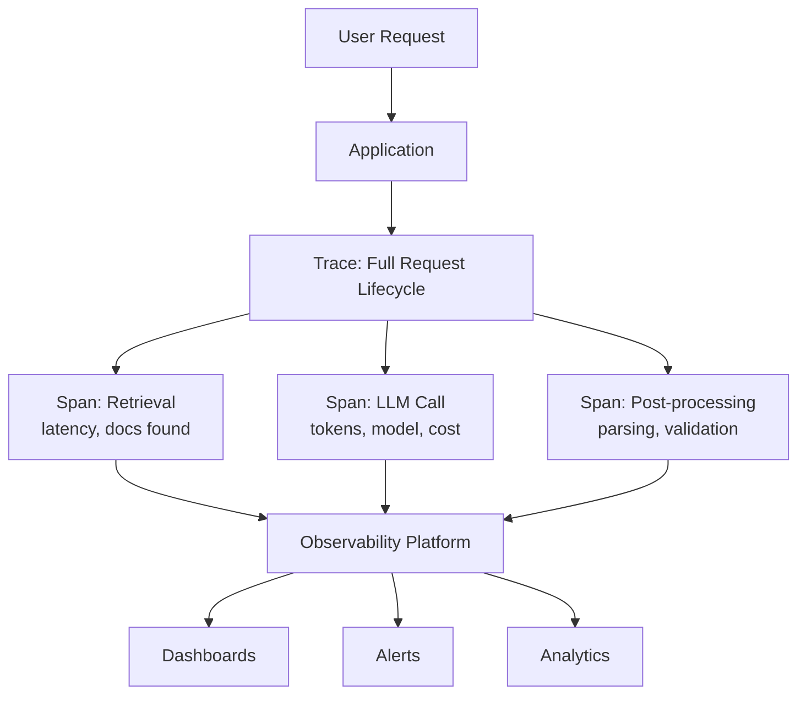
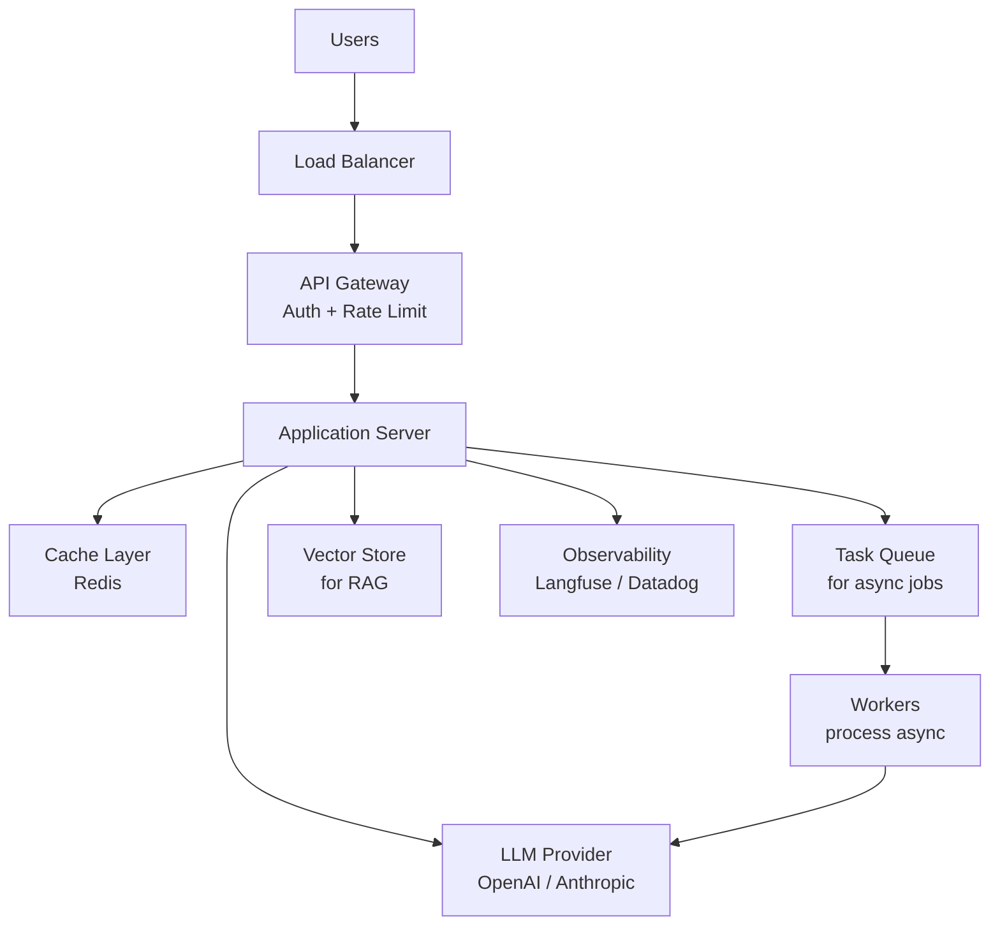
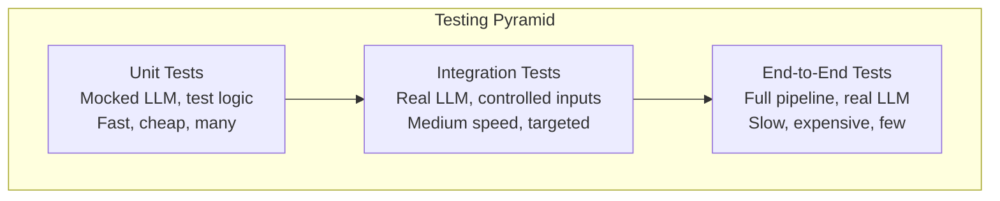

Moving from prototype to production with LLMs requires engineering discipline around reliability, cost, observability, and testing. This chapter covers the patterns and practices for building robust LLM-powered applications.

## API Integration Patterns

### Streaming Responses

Streaming delivers tokens as they're generated, reducing perceived latency from seconds to milliseconds for the first token:

```python
from openai import OpenAI

client = OpenAI()

def stream_response(messages: list[dict]) -> str:
    """Stream a response, yielding tokens as they arrive."""
    
    stream = client.chat.completions.create(
        model="gpt-4o",
        messages=messages,
        stream=True
    )
    
    full_response = ""
    for chunk in stream:
        if chunk.choices[0].delta.content:
            token = chunk.choices[0].delta.content
            full_response += token
            print(token, end="", flush=True)
    
    return full_response
```

Server-Sent Events (SSE) for web applications:

```python
from fastapi import FastAPI
from fastapi.responses import StreamingResponse

app = FastAPI()

@app.post("/chat")
async def chat_endpoint(request: ChatRequest):
    """Stream LLM response via SSE."""
    
    async def generate():
        stream = client.chat.completions.create(
            model="gpt-4o",
            messages=request.messages,
            stream=True
        )
        for chunk in stream:
            if chunk.choices[0].delta.content:
                yield f"data: {json.dumps({'token': chunk.choices[0].delta.content})}\n\n"
        yield "data: [DONE]\n\n"
    
    return StreamingResponse(generate(), media_type="text/event-stream")
```

### Retries with Exponential Backoff

```python
import time
import random
from openai import (
    OpenAI, 
    RateLimitError, 
    APITimeoutError, 
    InternalServerError
)

RETRYABLE_ERRORS = (RateLimitError, APITimeoutError, InternalServerError)

def call_with_retry(
    func,
    max_retries: int = 3,
    base_delay: float = 1.0,
    max_delay: float = 60.0
) -> any:
    """Call an API function with exponential backoff."""
    
    for attempt in range(max_retries + 1):
        try:
            return func()
        except RETRYABLE_ERRORS as e:
            if attempt == max_retries:
                raise
            
            delay = min(base_delay * (2 ** attempt), max_delay)
            jitter = random.uniform(0, delay * 0.1)
            
            print(f"Attempt {attempt + 1} failed: {e}. "
                  f"Retrying in {delay + jitter:.1f}s")
            time.sleep(delay + jitter)
```

### Fallback Chains

```python
class LLMWithFallback:
    """Try primary model, fall back to alternatives on failure."""
    
    def __init__(self):
        self.models = [
            {"provider": "openai", "model": "gpt-4o"},
            {"provider": "anthropic", "model": "claude-sonnet-4-20250514"},
            {"provider": "openai", "model": "gpt-4o-mini"},  # cheaper fallback
        ]
    
    def complete(self, messages: list[dict]) -> str:
        """Try each model in order until one succeeds."""
        
        errors = []
        for config in self.models:
            try:
                return self._call_model(config, messages)
            except Exception as e:
                errors.append(f"{config['model']}: {e}")
                continue
        
        raise RuntimeError(
            f"All models failed:\n" + "\n".join(errors)
        )
    
    def _call_model(self, config: dict, messages: list[dict]) -> str:
        if config["provider"] == "openai":
            response = openai_client.chat.completions.create(
                model=config["model"], messages=messages
            )
            return response.choices[0].message.content
        elif config["provider"] == "anthropic":
            response = anthropic_client.messages.create(
                model=config["model"],
                messages=messages,
                max_tokens=4096
            )
            return response.content[0].text
```

### Request Patterns Comparison

| Pattern | When to Use | Tradeoff |
|---------|-------------|----------|
| Single call | Simple queries, low latency needed | No redundancy |
| Streaming | User-facing chat, long responses | More complex client code |
| Retry with backoff | Rate limits, transient errors | Higher latency on failure |
| Fallback chain | High availability requirements | Multiple provider costs |
| Parallel calls | Need consensus or best-of-N | Higher cost, need aggregation |
| Batch API | Offline processing, cost-sensitive | Higher latency (hours) |

## Context Window Management

### The Problem

Every LLM has a finite context window. As conversations grow or documents get longer, you must decide what to keep and what to discard.

```text
Context Window Budget:

┌─────────────────────────────────────────────────────┐
│ System Prompt          │ ~500-2000 tokens            │
│ Conversation History   │ Variable (grows over time)  │
│ Retrieved Context      │ ~1000-4000 tokens           │
│ Current User Message   │ Variable                    │
│ Reserved for Output    │ ~1000-4000 tokens           │
└─────────────────────────────────────────────────────┘
Total must fit within model's context limit
```

### Sliding Window

Keep only the most recent N messages:

```python
class SlidingWindowMemory:
    """Keep last N messages, always preserve system prompt."""
    
    def __init__(self, max_messages: int = 20):
        self.max_messages = max_messages
        self.system_prompt = None
        self.messages = []
    
    def add(self, message: dict):
        if message["role"] == "system":
            self.system_prompt = message
        else:
            self.messages.append(message)
            if len(self.messages) > self.max_messages:
                self.messages = self.messages[-self.max_messages:]
    
    def get_messages(self) -> list[dict]:
        result = []
        if self.system_prompt:
            result.append(self.system_prompt)
        result.extend(self.messages)
        return result
```

### Summarization Strategy

Summarize older messages to compress history:

```python
class SummarizingMemory:
    """Summarize old messages to fit context window."""
    
    def __init__(self, max_tokens: int = 4000, summary_threshold: int = 3000):
        self.max_tokens = max_tokens
        self.summary_threshold = summary_threshold
        self.summary = ""
        self.recent_messages = []
    
    def add(self, message: dict):
        self.recent_messages.append(message)
        
        if self._estimate_tokens() > self.summary_threshold:
            self._compress()
    
    def _compress(self):
        """Summarize older messages."""
        # Keep last 4 messages as-is
        to_summarize = self.recent_messages[:-4]
        self.recent_messages = self.recent_messages[-4:]
        
        summary_prompt = (
            f"Previous summary: {self.summary}\n\n"
            f"New messages to incorporate:\n"
            f"{self._format_messages(to_summarize)}\n\n"
            f"Provide an updated summary of the full conversation so far. "
            f"Preserve key decisions, facts, and context."
        )
        
        self.summary = client.chat.completions.create(
            model="gpt-4o-mini",  # Use cheap model for summarization
            messages=[{"role": "user", "content": summary_prompt}]
        ).choices[0].message.content
    
    def get_messages(self) -> list[dict]:
        messages = []
        if self.summary:
            messages.append({
                "role": "system",
                "content": f"Conversation summary so far: {self.summary}"
            })
        messages.extend(self.recent_messages)
        return messages
    
    def _estimate_tokens(self) -> int:
        return sum(len(m["content"]) // 4 for m in self.recent_messages)
    
    def _format_messages(self, messages: list[dict]) -> str:
        return "\n".join(f"{m['role']}: {m['content']}" for m in messages)
```

### Strategy Comparison

| Strategy | Pros | Cons | Best For |
|----------|------|------|----------|
| Sliding window | Simple, predictable | Loses old context | Short conversations |
| Summarization | Preserves key info | Lossy, adds latency | Long conversations |
| Token-based trim | Precise budget control | May cut mid-thought | Fixed-budget systems |
| Importance scoring | Keeps most relevant | Complex to implement | Multi-topic chats |
| RAG over history | Retrieves relevant past | Retrieval may miss | Very long histories |

## Structured Output Parsing

### JSON Mode

```python
def get_structured_response(prompt: str, schema_description: str) -> dict:
    """Get a JSON response from the model."""
    
    response = client.chat.completions.create(
        model="gpt-4o",
        messages=[
            {"role": "system", "content": 
             f"Respond in JSON format. Schema: {schema_description}"},
            {"role": "user", "content": prompt}
        ],
        response_format={"type": "json_object"}
    )
    return json.loads(response.choices[0].message.content)
```

### Structured Outputs with JSON Schema

```python
from pydantic import BaseModel

class ExtractedEntity(BaseModel):
    name: str
    entity_type: str  # person, organization, location
    confidence: float

class ExtractionResult(BaseModel):
    entities: list[ExtractedEntity]
    summary: str

def extract_entities(text: str) -> ExtractionResult:
    """Extract entities with guaranteed schema compliance."""
    
    response = client.beta.chat.completions.parse(
        model="gpt-4o",
        messages=[
            {"role": "system", "content": "Extract named entities from the text."},
            {"role": "user", "content": text}
        ],
        response_format=ExtractionResult
    )
    return response.choices[0].message.parsed
```

### Handling Parse Failures

```python
def robust_parse(prompt: str, schema: type[BaseModel], max_attempts: int = 3) -> BaseModel:
    """Parse with retry on validation failure."""
    
    for attempt in range(max_attempts):
        try:
            response = client.beta.chat.completions.parse(
                model="gpt-4o",
                messages=[{"role": "user", "content": prompt}],
                response_format=schema
            )
            return response.choices[0].message.parsed
        except Exception as e:
            if attempt == max_attempts - 1:
                raise
            # Add error context for next attempt
            prompt = (
                f"{prompt}\n\n"
                f"Previous attempt failed validation: {e}\n"
                f"Please fix the output to match the required schema."
            )
```

## Caching Strategies

### Exact Match Cache

```python
import hashlib
import json
from datetime import datetime, timedelta

class ExactMatchCache:
    """Cache LLM responses by exact input hash."""
    
    def __init__(self, ttl_hours: int = 24):
        self.cache = {}  # In production: Redis or similar
        self.ttl = timedelta(hours=ttl_hours)
    
    def _hash_request(self, messages: list[dict], model: str) -> str:
        key = json.dumps({"messages": messages, "model": model}, sort_keys=True)
        return hashlib.sha256(key.encode()).hexdigest()
    
    def get(self, messages: list[dict], model: str) -> str | None:
        key = self._hash_request(messages, model)
        if key in self.cache:
            entry = self.cache[key]
            if datetime.now() - entry["timestamp"] < self.ttl:
                return entry["response"]
            del self.cache[key]
        return None
    
    def set(self, messages: list[dict], model: str, response: str):
        key = self._hash_request(messages, model)
        self.cache[key] = {"response": response, "timestamp": datetime.now()}
```

### Semantic Cache

```python
import numpy as np

class SemanticCache:
    """Cache based on semantic similarity of queries."""
    
    def __init__(self, similarity_threshold: float = 0.95):
        self.threshold = similarity_threshold
        self.entries = []  # [(embedding, response)]
    
    def _get_embedding(self, text: str) -> list[float]:
        response = client.embeddings.create(
            model="text-embedding-3-small",
            input=text
        )
        return response.data[0].embedding
    
    def get(self, query: str) -> str | None:
        query_embedding = np.array(self._get_embedding(query))
        
        for stored_embedding, response in self.entries:
            similarity = np.dot(query_embedding, stored_embedding) / (
                np.linalg.norm(query_embedding) * np.linalg.norm(stored_embedding)
            )
            if similarity >= self.threshold:
                return response
        return None
    
    def set(self, query: str, response: str):
        embedding = np.array(self._get_embedding(query))
        self.entries.append((embedding, response))
```

### Caching Strategy Comparison

| Strategy | Hit Rate | Latency Savings | Cost | Best For |
|----------|----------|----------------|------|----------|
| Exact match | Low (identical queries only) | ~100% per hit | Minimal | Repeated identical queries |
| Semantic cache | Medium-High | ~100% per hit | Embedding cost per query | Similar but not identical queries |
| Prompt caching (provider) | High for shared prefixes | 50% token cost | Free (provider feature) | Long system prompts, RAG |
| Response streaming cache | N/A | First-token latency | Minimal | Repeated streaming requests |

## Observability and Tracing

### Why LLM Observability Matters

```text
Traditional API:  Request → Response (deterministic, fast)
LLM API:          Request → ??? → Response (non-deterministic, slow, expensive)

You need to track:
- What was sent (full prompt including system message)
- What came back (full response)
- How long it took (latency breakdown)
- How much it cost (token counts × pricing)
- Whether it was correct (quality metrics)
- Why it failed (error classification)
```

### Tracing Architecture



### LangSmith Integration

```python
from langsmith import traceable, Client

ls_client = Client()

@traceable(name="answer_question", run_type="chain")
def answer_question(question: str, context: list[str]) -> str:
    """Traced function — automatically logs to LangSmith."""
    
    prompt = f"Context: {chr(10).join(context)}\n\nQuestion: {question}"
    
    response = client.chat.completions.create(
        model="gpt-4o",
        messages=[{"role": "user", "content": prompt}]
    )
    return response.choices[0].message.content
```

### Langfuse Integration

```python
from langfuse import Langfuse
from langfuse.decorators import observe, langfuse_context

langfuse = Langfuse()

@observe()
def rag_pipeline(query: str) -> str:
    """Full RAG pipeline with Langfuse tracing."""
    
    # Retrieval span
    langfuse_context.update_current_observation(name="retrieval")
    docs = retrieve_documents(query)
    
    # Generation span
    langfuse_context.update_current_observation(name="generation")
    response = client.chat.completions.create(
        model="gpt-4o",
        messages=[
            {"role": "system", "content": "Answer based on the provided context."},
            {"role": "user", "content": f"Context: {docs}\n\nQuery: {query}"}
        ]
    )
    
    result = response.choices[0].message.content
    
    # Log quality score
    langfuse_context.score_current_trace(
        name="relevance",
        value=evaluate_relevance(query, result)
    )
    
    return result
```

### Key Metrics to Track

| Metric | What It Tells You | Alert Threshold |
|--------|-------------------|-----------------|
| Latency (P50, P95, P99) | User experience | P95 > 5s |
| Token usage (input/output) | Cost driver | Sudden 2x spike |
| Error rate | Reliability | > 1% |
| Cache hit rate | Cost efficiency | < 20% (investigate) |
| Quality scores | Output correctness | Below baseline |
| Cost per request | Budget tracking | > budget / expected_requests |
| Hallucination rate | Trust and safety | > 5% |

## Cost Tracking and Optimization

### Token Pricing Awareness

```python
# Pricing per 1M tokens (approximate, check current rates)
PRICING = {
    "gpt-4o": {"input": 2.50, "output": 10.00},
    "gpt-4o-mini": {"input": 0.15, "output": 0.60},
    "claude-sonnet-4-20250514": {"input": 3.00, "output": 15.00},
    "claude-haiku-3": {"input": 0.25, "output": 1.25},
}

def estimate_cost(model: str, input_tokens: int, output_tokens: int) -> float:
    """Estimate cost for a single request."""
    prices = PRICING[model]
    return (
        (input_tokens / 1_000_000) * prices["input"] +
        (output_tokens / 1_000_000) * prices["output"]
    )

class CostTracker:
    """Track cumulative costs across requests."""
    
    def __init__(self, budget_limit: float = 100.0):
        self.total_cost = 0.0
        self.budget_limit = budget_limit
        self.requests = []
    
    def log_request(self, model: str, input_tokens: int, output_tokens: int):
        cost = estimate_cost(model, input_tokens, output_tokens)
        self.total_cost += cost
        self.requests.append({
            "model": model,
            "input_tokens": input_tokens,
            "output_tokens": output_tokens,
            "cost": cost,
            "timestamp": datetime.now()
        })
        
        if self.total_cost > self.budget_limit * 0.8:
            print(f"⚠️ Budget warning: ${self.total_cost:.2f} / ${self.budget_limit:.2f}")
    
    def get_summary(self) -> dict:
        return {
            "total_cost": self.total_cost,
            "total_requests": len(self.requests),
            "avg_cost_per_request": self.total_cost / max(len(self.requests), 1),
            "by_model": self._group_by_model()
        }
    
    def _group_by_model(self) -> dict:
        by_model = {}
        for r in self.requests:
            model = r["model"]
            if model not in by_model:
                by_model[model] = {"count": 0, "cost": 0.0}
            by_model[model]["count"] += 1
            by_model[model]["cost"] += r["cost"]
        return by_model
```

### Cost Optimization Strategies

| Strategy | Savings | Complexity | When to Use |
|----------|---------|-----------|-------------|
| Model routing (cheap → expensive) | 40-70% | Medium | Mixed difficulty queries |
| Prompt caching | 50% on cached tokens | Low | Repeated system prompts |
| Semantic caching | 80-95% per hit | Medium | Repeated similar queries |
| Batch API | 50% | Low | Offline processing |
| Shorter prompts | Proportional | Low | Always |
| Output length limits | Proportional | Low | When full response not needed |

## Rate Limiting

### Client-Side Rate Limiting

```python
import asyncio
from collections import deque

class TokenBucketRateLimiter:
    """Rate limit API calls using token bucket algorithm."""
    
    def __init__(self, requests_per_minute: int = 60, tokens_per_minute: int = 90000):
        self.rpm_limit = requests_per_minute
        self.tpm_limit = tokens_per_minute
        self.request_times = deque()
        self.token_usage = deque()  # (timestamp, tokens)
    
    async def acquire(self, estimated_tokens: int = 1000):
        """Wait until we can make a request within limits."""
        while True:
            now = asyncio.get_event_loop().time()
            
            # Clean old entries (older than 60s)
            while self.request_times and now - self.request_times[0] > 60:
                self.request_times.popleft()
            while self.token_usage and now - self.token_usage[0][0] > 60:
                self.token_usage.popleft()
            
            current_rpm = len(self.request_times)
            current_tpm = sum(t for _, t in self.token_usage)
            
            if (current_rpm < self.rpm_limit and 
                current_tpm + estimated_tokens < self.tpm_limit):
                self.request_times.append(now)
                self.token_usage.append((now, estimated_tokens))
                return
            
            await asyncio.sleep(0.1)
```

## Error Handling

### Error Classification

| Error Type | Retryable | Action |
|-----------|-----------|--------|
| Rate limit (429) | Yes | Backoff, respect Retry-After header |
| Timeout | Yes | Retry with same request |
| Server error (500/503) | Yes | Backoff and retry |
| Invalid request (400) | No | Fix request, don't retry |
| Auth error (401/403) | No | Check credentials |
| Context length exceeded | No | Reduce input, summarize |
| Content filter triggered | No | Modify prompt, handle gracefully |
| Model overloaded | Yes | Backoff, try different model |

### Comprehensive Error Handler

```python
from openai import (
    BadRequestError, AuthenticationError, RateLimitError,
    APITimeoutError, InternalServerError
)

class LLMErrorHandler:
    """Centralized error handling for LLM calls."""
    
    def handle(self, error: Exception, context: dict) -> dict:
        """Classify and handle an LLM API error."""
        
        if isinstance(error, RateLimitError):
            return {
                "action": "retry",
                "delay": self._parse_retry_after(error),
                "message": "Rate limited — backing off"
            }
        elif isinstance(error, BadRequestError):
            if "context_length" in str(error):
                return {
                    "action": "reduce_context",
                    "message": "Input too long — need to truncate"
                }
            elif "content_filter" in str(error):
                return {
                    "action": "modify_prompt",
                    "message": "Content filter triggered"
                }
            return {"action": "fail", "message": f"Bad request: {error}"}
        elif isinstance(error, APITimeoutError):
            return {"action": "retry", "delay": 5, "message": "Timeout — retrying"}
        elif isinstance(error, InternalServerError):
            return {"action": "fallback", "message": "Server error — trying fallback model"}
        else:
            return {"action": "fail", "message": f"Unexpected error: {error}"}
    
    def _parse_retry_after(self, error) -> float:
        # Extract retry-after from headers if available
        return getattr(error, 'retry_after', 60.0)
```

## Production Architecture Patterns

### Standard LLM Application Architecture



### Key Architecture Decisions

| Decision | Options | Recommendation |
|----------|---------|----------------|
| Sync vs Async | Sync for chat, async for batch | Async for anything > 10s |
| Single vs multi-model | One model vs routing | Route by complexity for cost savings |
| Managed vs self-hosted | API providers vs own infra | Start managed, self-host when scale justifies |
| Monolith vs microservices | Single app vs separate services | Monolith until team/scale demands split |
| Stateless vs stateful | No memory vs conversation state | Stateless app + external state store |

### Async Processing Pattern

```python
from celery import Celery

app = Celery("llm_tasks", broker="redis://localhost:6379")

@app.task(bind=True, max_retries=3, default_retry_delay=60)
def process_document(self, document_id: str):
    """Async document processing with LLM."""
    try:
        doc = load_document(document_id)
        
        # Long-running LLM operation
        result = client.chat.completions.create(
            model="gpt-4o",
            messages=[
                {"role": "system", "content": "Analyze this document..."},
                {"role": "user", "content": doc.content}
            ]
        )
        
        save_result(document_id, result.choices[0].message.content)
    except RateLimitError as e:
        self.retry(exc=e, countdown=120)
```

## Testing LLM Applications

### Testing Challenges

```text
Traditional Software:     Deterministic → exact assertions
LLM Applications:        Non-deterministic → fuzzy assertions

You can't assert: response == "exact expected string"
You must assert: response satisfies quality criteria
```

### Testing Pyramid for LLM Apps



### Unit Tests with Mocked LLM

```python
import pytest
from unittest.mock import patch, MagicMock

def test_parse_structured_output():
    """Test parsing logic independent of LLM."""
    
    mock_response = MagicMock()
    mock_response.choices = [MagicMock()]
    mock_response.choices[0].message.content = json.dumps({
        "entities": [{"name": "Paris", "type": "location"}],
        "summary": "Text about Paris"
    })
    
    with patch("openai.OpenAI") as mock_client:
        mock_client.return_value.chat.completions.create.return_value = mock_response
        
        result = extract_entities("I visited Paris last summer")
        
        assert len(result["entities"]) == 1
        assert result["entities"][0]["name"] == "Paris"


def test_context_window_management():
    """Test that context trimming works correctly."""
    
    memory = SlidingWindowMemory(max_messages=5)
    for i in range(10):
        memory.add({"role": "user", "content": f"Message {i}"})
    
    messages = memory.get_messages()
    assert len(messages) == 5
    assert "Message 9" in messages[-1]["content"]
```

### Integration Tests with LLM-as-Judge

```python
@pytest.mark.integration
def test_rag_answer_quality():
    """Test RAG pipeline produces relevant answers."""
    
    test_cases = [
        {
            "query": "What is the return policy?",
            "expected_topics": ["30 days", "refund", "original payment"],
            "context_docs": ["returns_policy.md"]
        }
    ]
    
    for case in test_cases:
        result = rag_pipeline(case["query"])
        
        # LLM-as-judge evaluation
        judgment = client.chat.completions.create(
            model="gpt-4o",
            messages=[{"role": "user", "content": 
                f"Does this answer address the query adequately?\n"
                f"Query: {case['query']}\n"
                f"Answer: {result}\n"
                f"Expected topics: {case['expected_topics']}\n"
                f"Score 1-5 and explain. Output JSON: "
                f'{{"score": N, "explanation": "..."}}'
            }],
            response_format={"type": "json_object"}
        )
        
        score = json.loads(judgment.choices[0].message.content)["score"]
        assert score >= 3, f"Quality too low: {score}/5"


@pytest.mark.integration
def test_no_hallucination():
    """Test that responses are grounded in provided context."""
    
    context = "Our store is open Monday-Friday 9am-5pm. We are closed weekends."
    query = "Are you open on Saturday?"
    
    result = rag_pipeline(query, context=context)
    
    # Should say closed/not open, not hallucinate hours
    assert any(word in result.lower() for word in ["closed", "not open", "no"])
```

### Evaluation Datasets

```python
class EvalDataset:
    """Manage evaluation datasets for regression testing."""
    
    def __init__(self, path: str):
        self.cases = self._load(path)
    
    def run_evaluation(self, pipeline_fn) -> dict:
        """Run pipeline against all test cases and score."""
        results = []
        for case in self.cases:
            output = pipeline_fn(case["input"])
            score = self._score(output, case["expected"])
            results.append({"case": case["id"], "score": score, "output": output})
        
        return {
            "mean_score": sum(r["score"] for r in results) / len(results),
            "pass_rate": sum(1 for r in results if r["score"] >= 3) / len(results),
            "failures": [r for r in results if r["score"] < 3]
        }
```

---

## Key Takeaways

1. **Streaming is essential for user-facing applications** — delivering tokens incrementally reduces perceived latency from seconds to milliseconds, dramatically improving user experience for chat interfaces.

2. **Context window management is a core engineering challenge** — sliding windows work for simple cases, but production systems need summarization strategies and token budgeting to handle long conversations without losing critical context.

3. **Caching saves 40-90% of costs** — exact match caching handles repeated queries; semantic caching catches paraphrases; provider-level prompt caching reduces costs for shared system prompts.

4. **Observability is non-negotiable in production** — trace every LLM call with input, output, latency, tokens, and cost; without this data you cannot debug, optimize, or budget effectively.

5. **Test LLM applications at multiple levels** — unit test your logic with mocked LLMs, integration test with real models using LLM-as-judge scoring, and maintain evaluation datasets for regression detection.

6. **Error handling must account for LLM-specific failure modes** — rate limits, context overflow, content filters, and non-deterministic failures all require different handling strategies beyond standard HTTP error codes.

7. **Cost awareness must be built into the architecture** — model routing, caching, prompt optimization, and budget alerts prevent surprise bills; track cost per request as a first-class metric alongside latency and quality.
