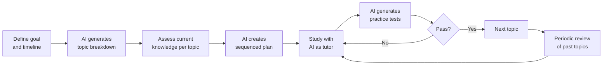
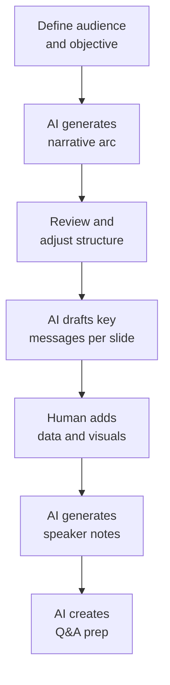
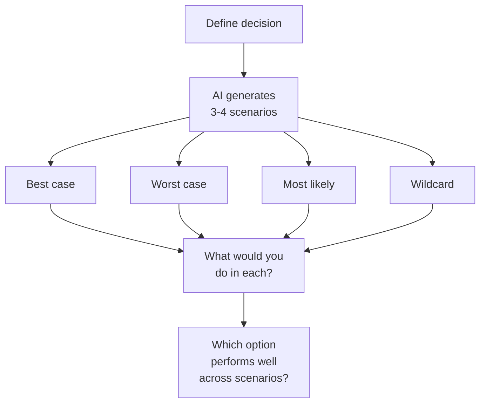
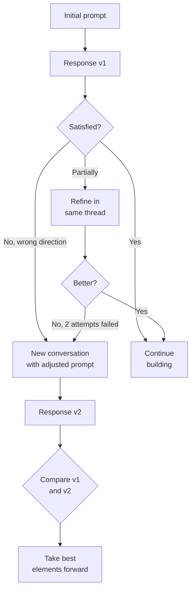
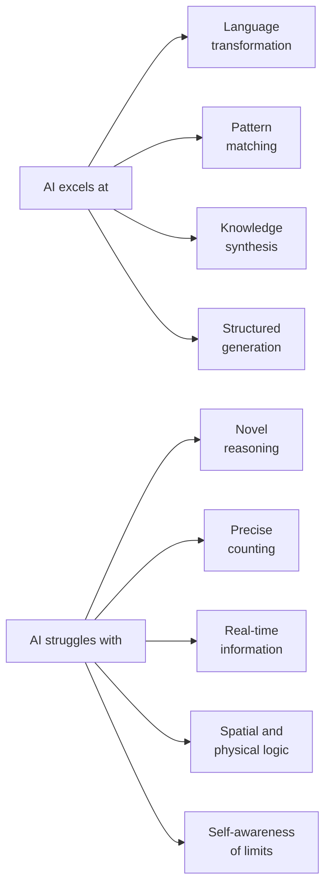

This chapter is about practical wisdom — how to get the most value from AI tools as an end user, whether you're writing, researching, analyzing data, or building workflows. The goal is to develop intuition for when AI helps, when it misleads, and how to collaborate with it productively.

## Choosing the Right Model

### Capability vs Cost Matrix

Not every task needs the most powerful model. Matching task complexity to model capability saves money and often improves speed.

| Task Type | Recommended Tier | Examples | Why |
|-----------|-----------------|----------|-----|
| Simple extraction | Small/cheap | Summarize email, extract dates, classify sentiment | Pattern matching, no reasoning needed |
| Writing assistance | Mid-tier | Draft emails, edit prose, rephrase | Good language ability sufficient |
| Complex reasoning | Top-tier | Multi-step analysis, code architecture, research synthesis | Needs strong reasoning chains |
| Creative work | Top-tier | Novel writing, brainstorming, strategy | Benefits from broader knowledge |
| Data transformation | Small/cheap | Format conversion, regex generation, CSV parsing | Mechanical transformation |
| Code generation | Mid to top-tier | Depends on complexity — boilerplate vs architecture | Simple code is easy; complex needs reasoning |

### Model Selection Decision Tree

```text
Is the task simple and well-defined?
├── YES: Does it need reasoning or just pattern matching?
│   ├── Pattern matching → GPT-4o-mini, Claude Haiku, Gemini Flash
│   └── Some reasoning → GPT-4o-mini, Claude Sonnet
└── NO: Is it creative, analytical, or requires deep expertise?
    ├── Creative/nuanced → Claude Sonnet/Opus, GPT-4o
    ├── Analytical/research → Claude Sonnet, GPT-4o, Gemini Pro
    └── Coding/technical → Claude Sonnet, GPT-4o, specialized coding models
```

### Current Model Tiers (as of 2026)

| Tier | Models | Cost Range (per 1M tokens) | Best For |
|------|--------|---------------------------|----------|
| Economy | GPT-4o-mini, Claude Haiku, Gemini Flash | $0.10-0.60 | High volume, simple tasks |
| Standard | GPT-4o, Claude Sonnet, Gemini Pro | $2-15 | General purpose, good quality |
| Premium | Claude Opus, o1/o3, Gemini Ultra | $15-60 | Complex reasoning, research |
| Specialized | Codex, domain-specific fine-tunes | Varies | Narrow expertise |

## Crafting Effective Prompts as an End User

### The CLEAR Framework

| Letter | Principle | Example |
|--------|-----------|---------|
| **C**ontext | Provide background | "I'm a product manager preparing a quarterly review..." |
| **L**ength | Specify output scope | "In 3-4 paragraphs..." or "As a bullet list of 5-7 items..." |
| **E**xplicit | State exactly what you want | "List the pros and cons" not "What do you think?" |
| **A**udience | Who is this for? | "Explain for a non-technical executive..." |
| **R**ole | What perspective to take | "As an experienced data analyst..." |

### Prompt Quality Spectrum

```text
Weak prompt:
  "Tell me about machine learning"

Better:
  "Explain the difference between supervised and unsupervised
   machine learning with one real-world example of each"

Best:
  "I'm preparing a 5-minute explanation of ML for my marketing team.
   They have no technical background. Explain supervised vs unsupervised
   learning using analogies from everyday life. Keep it under 200 words.
   End with why this matters for our recommendation engine."
```

### Common Prompt Patterns for End Users

| Pattern | Template | Use Case |
|---------|----------|----------|
| Summarize | "Summarize this in [N] bullet points for [audience]" | Meeting notes, articles, reports |
| Compare | "Compare [A] and [B] across these dimensions: [list]" | Decision making |
| Transform | "Rewrite this [from format] as [to format]" | Email → slides, notes → report |
| Analyze | "What are the strengths, weaknesses, and risks of [X]?" | Proposals, strategies |
| Generate | "Create [N] options for [thing] that meet [criteria]" | Brainstorming |
| Critique | "What's wrong with this reasoning? Be specific." | Stress-testing ideas |
| Teach | "Explain [X] as if I'm [level]. Use [analogy domain]." | Learning new topics |

## Iterative Refinement

### The Conversation as a Tool

AI interactions are not one-shot — the most effective use is iterative:

```text
Iteration Pattern:

Round 1: Broad request → Get initial output
Round 2: "Good, but make it more [specific adjustment]"
Round 3: "The second paragraph is too technical — simplify"
Round 4: "Add a concrete example for point 3"
Round 5: "Perfect. Now format as [final format]"
```

### Refinement Techniques

| Technique | When to Use | Example |
|-----------|-------------|---------|
| Narrow scope | Output too broad | "Focus only on the cost implications" |
| Add constraints | Output too generic | "Use only data from 2024 onwards" |
| Change tone | Wrong register | "Make this more formal / casual / direct" |
| Request alternatives | First attempt not right | "Give me 3 different approaches to this" |
| Provide feedback | Partially correct | "Points 1 and 3 are good. Point 2 is wrong because..." |
| Show examples | Style mismatch | "Here's an example of the tone I want: [example]" |
| Decompose | Task too complex | "Let's break this into steps. First, just outline the structure" |

### When to Start Over vs Refine

```text
Keep refining when:
- The core content is right but needs polish
- You're adjusting tone, length, or format
- Small factual corrections needed

Start a new conversation when:
- The model is stuck in a wrong direction
- Accumulated context is confusing the model
- You've fundamentally changed what you want
- The conversation is very long and responses degrade
```

## Understanding Model Limitations

### Knowledge Cutoff

Every model has a training data cutoff date. Information after that date is unavailable unless provided in context.

| Limitation | Symptom | Workaround |
|-----------|---------|------------|
| Knowledge cutoff | "As of my last update..." or wrong recent facts | Provide current information in the prompt |
| No internet access | Can't check current prices, news, weather | Use tools with web access or provide data |
| No memory across sessions | Forgets previous conversations | Re-provide context or use memory features |
| No file access | Can't read your local files | Paste content or use file-upload features |

### Reasoning Failures

AI models can fail at reasoning in predictable ways:

| Failure Type | Example | Why It Happens |
|-------------|---------|----------------|
| Counting errors | Miscounting items in a list | Tokenization doesn't map to characters |
| Spatial reasoning | Wrong directions on a map | No spatial model, just text patterns |
| Multi-step math | Arithmetic errors in long calculations | Each step compounds error probability |
| Logical negation | Confusing "not all" with "none" | Negation is hard in natural language |
| Temporal reasoning | Confusing event ordering | Dates are just numbers without timeline |
| Self-reference | Wrong about own capabilities | Trained on text about older models |

### The "Confidently Wrong" Problem

```text
The Danger Zone:

                    High Confidence
                         │
         ┌───────────────┼───────────────┐
         │               │               │
         │   CORRECT     │   DANGEROUS   │
         │   AND         │   (confidently│
         │   CONFIDENT   │    wrong)     │
         │               │               │
    ─────┼───────────────┼───────────────┼─────
         │               │               │
         │   UNCERTAIN   │   WRONG AND   │
         │   (says "I'm  │   UNCERTAIN   │
         │    not sure")  │   (at least   │
         │               │    hedges)    │
         │               │               │
         └───────────────┼───────────────┘
                         │
                    Low Confidence

Models are MOST dangerous in the upper-right quadrant:
stating false information with complete confidence.

Common triggers:
- Obscure facts (rare in training data)
- Recent events (after cutoff)
- Specific numbers (dates, statistics, prices)
- Citations (paper titles, authors, URLs)
- Personal/private information
```

### Verification Strategies

| Claim Type | How to Verify | Risk if Wrong |
|-----------|---------------|---------------|
| Statistics/numbers | Check primary source | High — decisions based on wrong data |
| Citations/references | Search for the actual paper/article | High — credibility damage |
| Code/API usage | Test it, check official docs | Medium — bugs |
| Historical facts | Cross-reference encyclopedia | Medium — misinformation |
| Current events | Check news sources | High — outdated information |
| Opinions presented as facts | Recognize the pattern | Medium — false consensus |

## AI for Writing

### Writing Workflows

| Stage | How AI Helps | Prompt Approach |
|-------|-------------|----------------|
| Brainstorming | Generate ideas, angles, outlines | "Give me 10 angles for an article about [topic]" |
| Outlining | Structure and organize thoughts | "Create an outline for [piece] targeting [audience]" |
| Drafting | Generate initial text | "Write a first draft based on this outline: [outline]" |
| Editing | Improve clarity, flow, conciseness | "Edit this for clarity. Cut unnecessary words." |
| Proofreading | Grammar, spelling, consistency | "Proofread this. List all errors found." |
| Adapting | Change tone, audience, format | "Rewrite this email for a C-level audience" |

### Effective Writing Prompts

```text
For drafting:
"Write a [type] about [topic]. 
Audience: [who]. 
Tone: [formal/casual/technical/friendly].
Length: [word count or paragraph count].
Key points to cover: [list].
Avoid: [things to exclude]."

For editing:
"Edit this text. Priorities:
1. Cut length by 30% without losing meaning
2. Replace jargon with plain language
3. Make each paragraph start with its key point
4. Flag any claims that need citations

Original: [paste text]"

For summarizing:
"Summarize this [document type] in [format].
Preserve: [key information to keep].
Audience: [who will read the summary].
Length: [constraint].

Source: [paste content]"
```

### Writing Anti-Patterns

| Anti-Pattern | Problem | Better Approach |
|-------------|---------|-----------------|
| "Write me an essay about X" | Generic, unfocused output | Provide angle, audience, key points |
| Using AI output verbatim | Sounds generic, may contain errors | Edit heavily, add your voice |
| No iteration | First draft is rarely best | Refine 2-3 rounds minimum |
| Ignoring tone mismatch | AI defaults to formal/generic | Specify tone explicitly, provide examples |
| Skipping fact-check | AI may hallucinate statistics | Verify all factual claims |

## AI for Research and Analysis

### Research Workflow

```text
Effective AI Research Process:

1: Frame the question precisely
   "What are the tradeoffs between microservices and monoliths
    for a team of 5 engineers building a B2B SaaS product?"

2: Get initial landscape
   "What are the main schools of thought on this topic?
    Who are the key voices? What does recent research say?"

3: Go deeper on promising directions
   "Explain [specific subtopic] in more detail.
    What are the counterarguments?"

4: Synthesize
   "Given everything we've discussed, summarize the key
    decision factors in a comparison table."

5: Verify independently
   Check key claims against primary sources.
   AI is a starting point, not the final word.
```

### Analysis Patterns

| Analysis Type | Prompt Pattern | Output Format |
|--------------|----------------|---------------|
| SWOT | "Analyze [X] using SWOT framework" | 4-quadrant table |
| Comparison | "Compare [options] across [dimensions]" | Matrix table |
| Root cause | "Why might [problem] be happening? Use 5 Whys." | Causal chain |
| Risk assessment | "What could go wrong with [plan]? Rate likelihood and impact." | Risk matrix |
| Stakeholder analysis | "Who is affected by [decision]? What are their concerns?" | Stakeholder map |
| Decision matrix | "Score [options] against [criteria] on 1-5 scale" | Weighted matrix |

### Limitations for Research

- Cannot access paywalled papers or proprietary databases
- May synthesize plausible-sounding but non-existent research
- Cannot distinguish between mainstream and fringe views reliably
- Recency bias — may not know the latest developments
- Cannot perform original analysis on data it hasn't seen

## AI for Data Processing

### Common Data Tasks

| Task | Prompt Approach | Example |
|------|----------------|---------|
| Format conversion | "Convert this CSV to JSON with this structure: [schema]" | CSV → JSON, XML → YAML |
| Data cleaning | "Clean this data: fix dates, standardize names, flag anomalies" | Messy spreadsheet data |
| Regex generation | "Write a regex that matches [pattern] but not [anti-pattern]" | Email, phone, URL patterns |
| SQL queries | "Write a SQL query that [description] from tables [schema]" | Complex joins, aggregations |
| Data analysis | "Analyze this data and identify trends, outliers, patterns" | Sales data, metrics |
| Formula creation | "Write an Excel formula that [calculation]" | VLOOKUP, complex conditionals |

### Working with Data in AI

```text
Best practices for data tasks:

1: Provide sample data (not just description)
   Show 3-5 rows so the model understands the format

2: Specify edge cases
   "Some dates are MM/DD/YYYY, others are DD-MM-YYYY"

3: Define expected output format
   Show an example of what the result should look like

4: Ask for explanation
   "Write the query AND explain what each part does"

5: Test with known data
   Verify the output against cases where you know the answer
```

## Building Personal Workflows

### Workflow Design Principles

```text
Effective AI Workflow:

1: Identify repetitive cognitive tasks in your day
2: Design a prompt template for each
3: Build a library of proven prompts
4: Chain prompts for multi-step processes
5: Iterate and improve based on output quality
```

### Example Personal Workflows

| Workflow | Steps | Time Saved |
|---------|-------|-----------|
| Meeting prep | Summarize agenda → research topics → draft questions | 20-30 min |
| Email triage | Classify urgency → draft responses → flag follow-ups | 15-20 min/batch |
| Weekly report | Gather notes → synthesize themes → draft report → edit | 45-60 min |
| Learning new topic | Get overview → identify key concepts → create study plan | 30 min |
| Decision making | Frame options → analyze tradeoffs → draft recommendation | 30-45 min |

### Building a Prompt Library

```text
Prompt Library Structure:

/prompts
├── writing/
│   ├── email-professional.md
│   ├── email-followup.md
│   ├── document-summary.md
│   └── meeting-notes.md
├── analysis/
│   ├── swot.md
│   ├── decision-matrix.md
│   └── risk-assessment.md
├── coding/
│   ├── code-review.md
│   ├── test-generation.md
│   └── documentation.md
└── personal/
    ├── weekly-review.md
    ├── learning-plan.md
    └── brainstorm.md

Each file contains:
- The prompt template with [PLACEHOLDERS]
- Usage notes (when to use, which model)
- Example input/output
- Known limitations
```

### System Prompts for Persistent Assistants

```text
Example: Personal Writing Editor

"You are my writing editor. Your job:
- Cut unnecessary words (target: 20% shorter)
- Replace passive voice with active
- Flag vague claims that need specifics
- Maintain my voice (direct, slightly informal, technical)
- Never add flowery language or filler phrases
- If something is unclear, ask rather than guess

Format feedback as:
1. Overall assessment (1 sentence)
2. Specific edits (inline suggestions)
3. Structural suggestions (if any)"
```

## Privacy and Data Considerations

### What Happens to Your Data

| Provider | Data Usage | Retention | Opt-Out Available |
|----------|-----------|-----------|-------------------|
| OpenAI (API) | Not used for training | 30 days (abuse monitoring) | Default — API data not trained on |
| OpenAI (ChatGPT free) | May be used for training | Retained | Yes (settings toggle) |
| Anthropic (API) | Not used for training | 30 days | Default |
| Anthropic (Claude.ai) | May be used for training | Retained | Yes (settings) |
| Google (API) | Not used for training | Varies | Default for paid API |
| Local models | Never leaves your machine | You control | N/A |

### Data Classification for AI Use

| Data Type | Safe to Use with AI? | Recommendation |
|-----------|---------------------|----------------|
| Public information | Yes | Any model |
| Internal documents | Depends on policy | Enterprise tier or local models |
| Customer PII | No (without safeguards) | Anonymize first, or use local models |
| Source code (proprietary) | Depends on policy | Enterprise tier with data protection |
| Financial data | No (usually) | Local models or approved enterprise tools |
| Health/medical data | No | Strict compliance requirements |
| Credentials/secrets | Never | Never paste secrets into AI tools |

### Privacy Best Practices

```text
Before sending data to an AI:

1: Check your organization's AI usage policy
2: Classify the data sensitivity
3: Remove or anonymize PII if possible
4: Use enterprise/API tiers (not free consumer tiers)
5: Consider local models for sensitive work
6: Never include credentials, API keys, or secrets
7: Be aware that prompts may be logged for abuse monitoring
```

## Organizational Adoption Patterns

### Maturity Levels

| Level | Description | Characteristics |
|-------|-------------|-----------------|
| 1: Exploration | Individuals experimenting | No policy, ad-hoc usage, no governance |
| 2: Adoption | Teams using regularly | Basic guidelines, approved tools list |
| 3: Integration | Built into workflows | Formal policies, training, metrics |
| 4: Optimization | Systematic improvement | ROI measurement, custom solutions, governance |
| 5: Transformation | AI-native processes | Processes redesigned around AI capabilities |

### Adoption Challenges

| Challenge | Symptom | Solution |
|-----------|---------|----------|
| No clear policy | People afraid to use AI or use it recklessly | Publish clear, permissive-with-guardrails policy |
| Quality concerns | "AI output is generic/wrong" | Training on effective prompting |
| Security fears | Blanket bans on AI tools | Provide approved tools with data protection |
| Uneven adoption | Some teams 10x, others 0x | Champions program, share success stories |
| Measurement gap | "Is this actually helping?" | Track before/after metrics on pilot teams |
| Skill gap | People don't know how to prompt well | Invest in prompt engineering training |

### Organizational Guidelines Template

```text
AI Usage Policy (Template):

APPROVED TOOLS: [list with data classification levels]
DATA RULES: 
  - Never input [classified data types]
  - Anonymize [data types] before use
  - Use [enterprise tier] for [data types]
QUALITY RULES:
  - AI output must be reviewed before external use
  - Cite AI assistance in [contexts]
  - Human accountable for all AI-assisted decisions
SECURITY:
  - No credentials or secrets in prompts
  - No customer PII without anonymization
  - Report any data leakage incidents
```

## The Human-AI Collaboration Model

### AI as Tool, Not Oracle

```text
The Right Mental Model:

❌ AI as Oracle:
   "AI said X, so X must be true"
   → Dangerous. Leads to uncritical acceptance.

❌ AI as Threat:
   "AI will replace me, so I won't use it"
   → Counterproductive. Misses real benefits.

✅ AI as Tool:
   "AI helps me think faster and explore more options,
    but I make the decisions and verify the output"
   → Productive. Leverages strengths of both.

The human provides:
- Judgment and taste
- Domain expertise and context
- Ethical reasoning
- Accountability
- Creative direction
- Verification

The AI provides:
- Speed and scale
- Breadth of knowledge
- Pattern recognition
- Tireless iteration
- First drafts and options
- Mechanical transformation
```

### Collaboration Patterns

| Pattern | Description | Example |
|---------|-------------|---------|
| AI drafts, human edits | AI generates first version, human refines | Writing, code, documentation |
| Human directs, AI executes | Human provides strategy, AI handles details | Data analysis, formatting |
| AI suggests, human decides | AI presents options, human chooses | Architecture decisions, strategies |
| AI checks, human verifies | AI reviews for issues, human confirms | Code review, proofreading |
| Parallel exploration | AI explores multiple paths simultaneously | Brainstorming, research |
| Rubber duck with intelligence | Explain your thinking to AI, it asks questions | Problem solving, debugging |

### When to Trust AI Output

```text
Trust Calibration:

HIGH trust (verify lightly):
- Format transformations (JSON → CSV)
- Grammar and spelling corrections
- Code syntax and formatting
- Summarization of text you've read
- Generating boilerplate/templates

MEDIUM trust (verify key claims):
- Explanations of well-known concepts
- Code for common patterns
- Analysis of data you provided
- Comparisons of well-documented options

LOW trust (verify everything):
- Specific facts, dates, statistics
- Citations and references
- Claims about recent events
- Medical, legal, or financial advice
- Security-sensitive code
- Anything where being wrong has consequences
```

### Developing AI Intuition

Over time, effective AI users develop intuition for:

1. **When output "smells wrong"** — recognizing the patterns of hallucination (too specific, too confident, suspiciously convenient)
2. **When to push back** — asking "are you sure?" or "what's your source?" when something seems off
3. **When to start over** — recognizing when the conversation has gone down a wrong path
4. **What level of detail to provide** — knowing how much context produces the best results
5. **Which tasks to delegate** — matching task characteristics to AI strengths

---

## AI for Learning and Skill Development

AI can function as a personal tutor available on demand — patient, adaptable, and capable of explaining concepts from multiple angles. The key is using it to deepen understanding rather than bypass learning.

### The Socratic Method with AI

Instead of asking AI for answers directly, prompt it to guide you through reasoning:

| Approach | Prompt | Learning Effect |
|----------|--------|-----------------|
| Direct answer | "What is dependency injection?" | Passive — you read, maybe forget |
| Socratic | "I want to understand dependency injection. Ask me questions to test my understanding, then correct misconceptions." | Active — forces you to articulate and self-correct |
| Explain back | "I'll explain dependency injection to you. Tell me what I got wrong." | Deep — teaching reveals gaps |
| Analogy bridge | "Explain dependency injection using a restaurant analogy, then ask me to extend the analogy to cover edge cases." | Creative — builds mental models |

```text
Effective learning prompt:

"I'm learning [topic]. My current level: [beginner/intermediate/advanced].
Don't give me the answer directly. Instead:
1. Ask me what I already know
2. Present a problem that requires this concept
3. Guide me with hints if I'm stuck
4. Correct my reasoning when I'm wrong
5. Only explain fully after I've attempted it"
```

### Generating Practice Exercises

| Skill Type | Prompt Pattern | Example |
|-----------|----------------|---------|
| Conceptual | "Generate 5 scenarios where I need to identify which [concept] applies" | Design patterns, logical fallacies |
| Procedural | "Give me a step-by-step exercise to practice [skill] with increasing difficulty" | SQL queries, git workflows |
| Analytical | "Present a case study and ask me to analyze it using [framework]" | SWOT analysis, code review |
| Creative | "Give me constraints and ask me to design a solution" | System design, writing prompts |
| Debugging | "Show me broken [code/logic/argument] and ask me to find the errors" | Code bugs, flawed reasoning |

### Adaptive Explanation Levels

Ask AI to explain the same concept at different depths:

```text
"Explain [concept] at three levels:
1. For a 10-year-old (core intuition only)
2. For a college student (mechanisms and tradeoffs)
3. For a practitioner (implementation details and edge cases)"
```

This reveals which level you actually understand and where gaps begin.

### AI-Assisted Study Plans



### Spaced Repetition with AI

Use AI to generate review questions at increasing intervals:

| Day | Prompt | Purpose |
|-----|--------|---------|
| Day 1 | "Quiz me on what we covered about [topic] today — 5 questions" | Immediate recall |
| Day 3 | "Ask me harder questions about [topic] that require applying the concept" | Short-term retention |
| Day 7 | "Give me a scenario that combines [topic] with [previous topic]" | Integration |
| Day 14 | "Test me on [topic] — include edge cases and common misconceptions" | Long-term retention |
| Day 30 | "Present a real-world problem that requires [topic] — don't tell me which concept applies" | Transfer |

### Limitations as a Learning Tool

| Risk | Description | Mitigation |
|------|-------------|------------|
| Reinforcing misconceptions | If you state something wrong, AI may agree or build on it | Periodically ask "Am I wrong about anything?" and cross-reference authoritative sources |
| Shallow understanding | Reading AI explanations feels like learning but may not stick | Always practice — do exercises, explain back, build something |
| Dependency | Reaching for AI instead of struggling productively | Set a "struggle timer" — try 15 minutes alone before asking AI |
| Outdated information | AI may teach deprecated practices or old APIs | Verify against official documentation for anything version-specific |
| False confidence | Passing AI-generated quizzes doesn't guarantee real competence | Test yourself in real environments — build projects, take real exams |

## AI for Communication

AI excels at communication tasks because language is its native domain. The key is using it to enhance your message while preserving your authentic voice and intent.

### Drafting Emails

| Email Type | Prompt Strategy | Key Instruction |
|-----------|-----------------|-----------------|
| Cold outreach | Provide context about recipient and your goal | "Keep it under 100 words. One clear ask." |
| Difficult conversation | Describe the situation and desired outcome | "Be direct but empathetic. No passive aggression." |
| Follow-up | Provide previous context and what you need | "Reference our last exchange. Add urgency without pressure." |
| Decline/rejection | State what you're declining and why | "Be clear and kind. Offer an alternative if possible." |
| Escalation | Describe the issue, attempts made, and what you need | "Factual tone. No blame. Focus on resolution." |

```text
Email drafting template:

"Draft an email with these parameters:
- To: [role/relationship, not name]
- Context: [situation]
- Goal: [what I want to happen after they read this]
- Tone: [professional/casual/urgent/diplomatic]
- Constraints: [length, things to avoid, cultural notes]
- My draft/notes: [rough points to include]"
```

### Preparing Presentations

Use AI to structure thinking before building slides:



| Presentation Task | Prompt | Output |
|-------------------|--------|--------|
| Structure | "I have 15 minutes to present [topic] to [audience]. Create a narrative arc with slide-by-slide breakdown." | Slide outline with timing |
| Key messages | "For each slide, write the one sentence the audience should remember." | Core message per slide |
| Speaker notes | "Write speaker notes for this slide. Conversational tone, 30 seconds of speaking." | Talk track |
| Q&A prep | "What questions will [audience type] ask about this? Draft concise answers." | Anticipated questions |
| Simplification | "This slide has too much text. Reduce to 3 bullet points max, each under 8 words." | Concise bullets |

### Meeting Summaries

```text
Meeting summary prompt:

"Summarize these meeting notes into:
1. DECISIONS MADE (what was agreed)
2. ACTION ITEMS (who does what by when)
3. OPEN QUESTIONS (unresolved, needs follow-up)
4. KEY DISCUSSION POINTS (2-3 sentences max)

Format action items as: [Owner] — [Task] — [Deadline]

Notes: [paste raw notes]"
```

### Translating Between Technical and Non-Technical Language

| Direction | Prompt Pattern | Example |
|-----------|---------------|---------|
| Tech → Executive | "Rewrite this technical explanation for a CEO who cares about business impact, timeline, and risk." | "The API rate limiter..." → "We're adding protection that prevents system overload during peak traffic..." |
| Tech → Customer | "Explain this to a user who doesn't know what a server is. Focus on what it means for them." | "Database migration..." → "We're upgrading our systems — you might notice a brief pause..." |
| Non-tech → Tech | "Convert this business requirement into technical specifications a developer can implement." | "Make it faster" → "Reduce P95 latency to under 200ms for the /search endpoint" |
| Cross-domain | "I'm a [role A] explaining this to a [role B]. Translate appropriately." | Finance → Engineering, Design → Product |

### Adapting Tone and Audience

| Audience | Tone Markers | What They Care About |
|----------|-------------|---------------------|
| C-suite | Concise, outcome-focused, numbers | ROI, risk, timeline, competitive advantage |
| Engineering peers | Technical, precise, detailed | Implementation, tradeoffs, edge cases |
| Customers | Simple, empathetic, action-oriented | What it means for them, what to do next |
| Cross-functional | Balanced, jargon-free, visual | How it affects their work, dependencies |
| External partners | Professional, clear scope, formal | Commitments, deliverables, expectations |

### Cultural Considerations

| Dimension | Low-Context Cultures | High-Context Cultures |
|-----------|---------------------|----------------------|
| Directness | State the point immediately | Build context before the ask |
| Disagreement | "I disagree because..." | "Perhaps we could also consider..." |
| Requests | "Please do X by Friday" | "It would be helpful if X could be ready soon" |
| Feedback | Direct and specific | Indirect, face-saving |
| AI prompt adjustment | "Make this direct and explicit" | "Make this diplomatic and indirect. Soften the request." |

When using AI for cross-cultural communication, specify: "The recipient is in [culture/region]. Adjust formality, directness, and structure accordingly."

## AI for Decision Making

AI is useful for structuring decisions, not making them. It can help you think more rigorously, surface considerations you missed, and stress-test your reasoning — but the decision remains yours.

### Structured Analysis Frameworks

| Framework | When to Use | AI Prompt |
|-----------|-------------|-----------|
| Pros/Cons | Simple binary choice | "List pros and cons of [option]. Be specific — no generic points." |
| Decision Matrix | Multiple options, multiple criteria | "Score [options] against [criteria] on 1-5. Show the math." |
| SWOT | Strategic assessment | "SWOT analysis of [decision]. Focus on non-obvious threats and opportunities." |
| First/Second/Third Order | Understanding consequences | "What are the first, second, and third-order effects of [decision]?" |
| Reversibility Test | Gauging risk | "Is this decision easily reversible? What's the cost of being wrong?" |
| Pre-mortem | Risk identification | "Imagine we chose [option] and it failed badly. What went wrong?" |

### Decision Matrix Example

```text
Prompt: "I'm deciding between [Option A], [Option B], and [Option C] for [context].

Criteria (weighted):
- Cost (weight: 3)
- Time to implement (weight: 2)
- Long-term maintainability (weight: 3)
- Team skill match (weight: 2)
- Risk level (weight: 1)

Score each option 1-5 per criterion. Show weighted totals.
Then tell me what this analysis DOESN'T capture that I should consider."
```

### Scenario Planning



Prompt: "For the decision to [X], describe four scenarios: best case, worst case, most likely, and a wildcard scenario I haven't considered. For each, explain what happens in 6 months."

### Devil's Advocate Prompting

Force AI to argue against your preferred option:

```text
"I'm leaning toward [option]. Your job is to argue AGAINST it as strongly
as possible. Be specific, cite real risks, and don't hold back. I want to
hear the strongest case for NOT doing this.

After your argument, rate on 1-10 how compelling you find your own
counter-argument."
```

| Technique | Prompt | Purpose |
|-----------|--------|---------|
| Steel-man opposition | "What's the strongest argument against my position?" | Find real weaknesses |
| Assumption challenge | "What assumptions am I making? Which are most likely wrong?" | Surface hidden assumptions |
| Inversion | "Instead of asking how to succeed, what would guarantee failure?" | Identify risks via inversion |
| Outsider perspective | "How would [specific role/person] view this decision?" | Break echo chamber |
| Time travel | "Will I regret this in 5 years? Why?" | Long-term perspective |

### Avoiding Confirmation Bias

AI will agree with you by default. Counter this actively:

| Bias Trap | How It Manifests | Counter-Prompt |
|-----------|-----------------|----------------|
| Leading questions | "Don't you think X is better?" → AI agrees | "Compare X and Y objectively. Don't favor either." |
| Selective framing | Only presenting data that supports your view | "What data would DISPROVE my hypothesis?" |
| Anchoring | First option mentioned gets favored | "Evaluate options in random order. Score before comparing." |
| Sunk cost | "We've already invested in X..." | "Ignore past investment. If starting fresh today, what would you choose?" |
| Authority bias | "The CTO suggested X..." | "Evaluate the idea on its merits, regardless of who proposed it." |

### When NOT to Use AI for Decisions

| Situation | Why Not | What to Do Instead |
|-----------|---------|-------------------|
| Ethical dilemmas with real consequences | AI lacks moral agency and accountability | Consult ethics frameworks, advisors, affected parties |
| Decisions requiring empathy | AI simulates but doesn't feel | Talk to the people involved |
| Legal/compliance choices | AI may be wrong about regulations | Consult qualified professionals |
| Decisions with incomplete private context | AI only knows what you tell it | Gather more information first |
| When you're avoiding responsibility | Using AI as cover for a hard call | Own the decision — AI is input, not authority |
| High-stakes irreversible choices | The cost of AI being wrong is too high | Use AI for analysis, but decide with human judgment and expert input |

## Managing AI Conversations

Understanding how AI conversations work — their mechanics and limitations — helps you get consistently better results.

### Context Window Awareness

Every AI model has a finite context window — the total amount of text (prompt + conversation history + response) it can process at once.

| Model Tier | Typical Context Window | Practical Implication |
|-----------|----------------------|----------------------|
| Economy | 8K-32K tokens | Short conversations, focused tasks |
| Standard | 128K-200K tokens | Long documents, extended conversations |
| Premium | 200K+ tokens | Entire codebases, book-length analysis |

```text
What happens as context fills up:

Tokens 0-25%:    Peak performance. Model has full attention.
Tokens 25-50%:   Still good. Minor degradation on early details.
Tokens 50-75%:   Middle content may get less attention ("lost in the middle" effect).
Tokens 75-100%:  Early conversation details may be forgotten. Quality drops.
Beyond limit:    Oldest content silently dropped or conversation rejected.
```

### When to Start Fresh vs Continue

| Continue the conversation when... | Start fresh when... |
|----------------------------------|---------------------|
| Building on established context | The model is stuck in a wrong direction |
| Iterating on a specific output | You've fundamentally changed your goal |
| The conversation is under 50% of context | The conversation is very long and quality is dropping |
| You need consistency with prior answers | Prior context is confusing the model |
| You're in a multi-step workflow | You want a "clean" perspective without prior bias |
| Corrections are small and incremental | You've given contradictory instructions |

### Conversation Branching Strategy



Practical approach: if two refinement attempts don't fix the issue, start fresh with a better initial prompt rather than accumulating confused context.

### Saving and Reusing Effective Prompts

| Category | What to Save | Format |
|----------|-------------|--------|
| Templates | Prompts with [PLACEHOLDERS] that work repeatedly | Markdown file with usage notes |
| System prompts | Persona/behavior instructions for persistent use | Separate file, version-controlled |
| Chains | Multi-step prompt sequences for complex workflows | Numbered steps with expected outputs |
| Corrections | Phrases that reliably fix common AI mistakes | Quick-reference list |
| Anti-patterns | Prompts that consistently produce bad results | "Don't do this" notes |

```text
Prompt template format:

---
name: Technical Document Review
model: Any mid-tier+
use-when: Reviewing technical docs before publishing
---

"Review this technical document for:
1. Factual accuracy (flag anything you're uncertain about)
2. Clarity (highlight jargon that needs definition)
3. Completeness (what questions would a reader still have?)
4. Structure (does the flow make sense?)

Audience: [AUDIENCE]
Document type: [TYPE]
Priority concern: [SPECIFIC FOCUS]

Document:
[PASTE CONTENT]"
```

### Multi-Turn Strategy

| Strategy | When to Use | How |
|----------|-------------|-----|
| Scaffold first | Complex output needed | "First, outline the structure. I'll approve before you write the full version." |
| Divide and conquer | Large task | "Let's handle this in parts. Part 1: [scope]. Don't address parts 2-3 yet." |
| Progressive disclosure | You have lots of context | Provide context in stages — don't dump everything at once |
| Checkpoint | Long workflow | "Before continuing, summarize what we've established so far." |
| Role lock | Consistency needed | Restate the role/persona every few turns if it drifts |

### Handling Contradictions

When AI contradicts itself or gives inconsistent answers:

| Situation | Response |
|-----------|----------|
| AI contradicts its earlier answer | "You said X earlier but now you're saying Y. Which is correct and why?" |
| AI agrees with your correction too easily | "Don't just agree with me. Was your original answer actually wrong, or am I mistaken?" |
| Different answers in different conversations | The model is uncertain — treat both as hypotheses and verify externally |
| AI says "I can't do X" then does X | Capability boundaries are fuzzy — rephrase and try again |
| AI gives different answers to the same prompt | Non-deterministic by design — if consistency matters, lower temperature or use structured output |

## Future-Proofing Your AI Skills

AI capabilities are evolving rapidly. The skills that matter are those that transfer across model generations and remain valuable as capabilities expand.

### Staying Current with Model Releases

| Source | What It Tells You | Check Frequency |
|--------|-------------------|-----------------|
| Provider blogs (OpenAI, Anthropic, Google) | New models, capabilities, pricing | Monthly |
| Benchmark leaderboards (LMSYS, HELM) | Relative model performance | When choosing models |
| Community forums (Reddit, HN, Twitter/X) | Real-world usage reports, gotchas | Weekly (skim) |
| Your own testing | How new models handle YOUR tasks | When new models release |
| Pricing pages | Cost changes that affect workflow economics | Quarterly |

```text
When a new model releases, test it on YOUR tasks:

1. Keep 5-10 "benchmark prompts" — tasks you run regularly
2. Run them on the new model
3. Compare: quality, speed, cost
4. Switch only if meaningfully better for YOUR use cases
5. Don't chase every release — stability has value
```

### Transferable Prompting Skills

These skills work regardless of which model or provider you use:

| Skill | Why It Transfers | How to Develop |
|-------|-----------------|----------------|
| Clear problem decomposition | All models benefit from structured input | Practice breaking complex asks into steps |
| Constraint specification | Reduces ambiguity for any model | Always state format, length, audience, tone |
| Example-driven instruction | Few-shot learning works across architectures | Build a library of input/output examples |
| Iterative refinement | Conversation is universal | Practice the refine-don't-restart habit |
| Output verification | Models will always have failure modes | Build the habit of checking, not trusting |
| Knowing what to ask | The bottleneck is human clarity, not AI capability | Invest in understanding your own needs before prompting |

### Building Mental Models of AI Capabilities



| Mental Model | Description | Practical Implication |
|-------------|-------------|----------------------|
| "Sophisticated autocomplete" | AI predicts likely next tokens based on patterns | Good at common patterns, weak on truly novel combinations |
| "Compressed internet" | Training data is a lossy compression of human knowledge | Knows a lot broadly, unreliable on specifics |
| "Eager intern" | Capable and fast, but needs clear direction and verification | Always review output; don't assume correctness |
| "Mirror with knowledge" | Reflects and extends your input with broad knowledge | Quality of output is bounded by quality of input |

### Adapting Workflows as Models Improve

| Current Limitation | Likely Future Improvement | How to Prepare |
|-------------------|--------------------------|----------------|
| Knowledge cutoff | Real-time information access | Build workflows that separate "what AI knows" from "what needs to be current" |
| Context window limits | Larger windows, better retrieval | Design modular prompts that work at any context size |
| No persistent memory | Cross-session memory | Keep your own records — don't depend on AI memory features |
| Single modality focus | Native multimodal (text + image + audio + video) | Learn to describe visual/spatial problems in text — this skill remains useful even with multimodal |
| Hallucination | Better calibration, citations | Maintain verification habits even as models improve — overconfidence is the risk |
| No tool use | Reliable tool/API integration | Understand which tasks need external tools vs pure generation |

### The Skill of Knowing What AI Can't Do

This is the most durable skill — it evolves with each model generation but the meta-skill remains:

| Category | Current Limitations (2026) | The Durable Skill |
|----------|---------------------------|-------------------|
| Factual accuracy | Hallucinations on specifics | Knowing which claims to verify (even as hallucination rates drop) |
| Reasoning | Fails on novel multi-step logic | Recognizing when a problem requires reasoning AI can't reliably do |
| Judgment | No values, no stakes, no accountability | Knowing when human judgment is irreplaceable |
| Context | Limited to what's in the window | Knowing what context the AI is missing |
| Creativity | Recombines existing patterns | Recognizing when you need genuine novelty vs sophisticated remix |
| Empathy | Simulates but doesn't feel | Knowing when real human connection is needed |

```text
The meta-skill progression:

Beginner:  "AI can do everything" → overreliance, disappointment
           "AI can do nothing" → underuse, missed value

Intermediate: "AI is good at X but bad at Y" → appropriate delegation

Advanced: "For THIS specific task, with THIS context, AI will likely
          [succeed/struggle] because [reasoning about why]"
          → calibrated, adaptive, efficient use

Expert: Automatically routes tasks to AI or human effort based on
        intuition built from hundreds of interactions. Rarely surprised
        by AI failures. Quickly adapts when capabilities change.
```

---

## Key Takeaways

1. **Match model to task** — using GPT-4o for simple extraction wastes money; using a cheap model for complex reasoning wastes time. Build intuition for which tier each task needs.

2. **Specificity is the single biggest lever** — vague prompts get generic outputs; specific prompts with context, constraints, audience, and examples get useful outputs. The CLEAR framework (Context, Length, Explicit, Audience, Role) provides structure.

3. **Iterate rather than expecting perfection** — treat AI interactions as conversations, not commands. The best results come from 3-5 rounds of refinement, not a single perfect prompt.

4. **Verify claims proportional to their risk** — format transformations need light verification; factual claims, citations, and security-sensitive code need thorough checking. Develop calibrated trust.

5. **AI is confidently wrong about specific facts** — statistics, citations, recent events, and obscure details are the highest-risk categories for hallucination. Never trust these without independent verification.

6. **Build reusable workflows, not one-off prompts** — invest time in prompt templates, system prompts, and multi-step workflows that you refine over time. The compound returns are significant.

7. **The human-AI collaboration model is "AI as tool, not oracle"** — AI provides speed, breadth, and first drafts; humans provide judgment, domain expertise, accountability, and verification. Neither alone is as effective as both together.

8. **Use AI as a Socratic tutor, not an answer machine** — the learning value comes from AI asking you questions, generating exercises, and correcting your reasoning — not from passively reading its explanations.

9. **AI excels at communication adaptation** — translating between audiences, adjusting tone, and structuring messages are among AI's strongest capabilities. Use it to bridge communication gaps, but preserve your authentic voice.

10. **For decisions, use AI to structure thinking, not to decide** — decision matrices, devil's advocate prompting, and pre-mortems help you think more rigorously. But accountability for the decision stays with you.

11. **Manage conversations deliberately** — know when to continue vs start fresh, checkpoint long conversations, and save effective prompts. Context window awareness prevents quality degradation in extended interactions.
