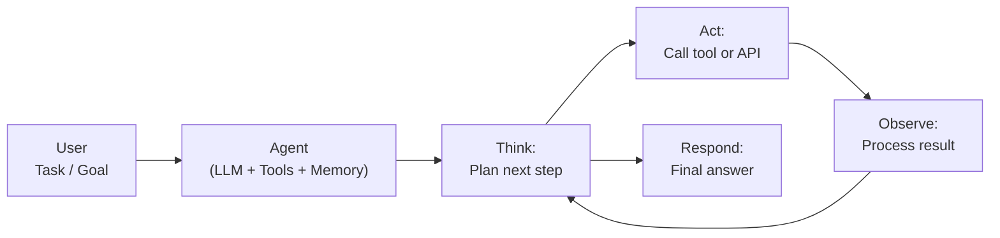
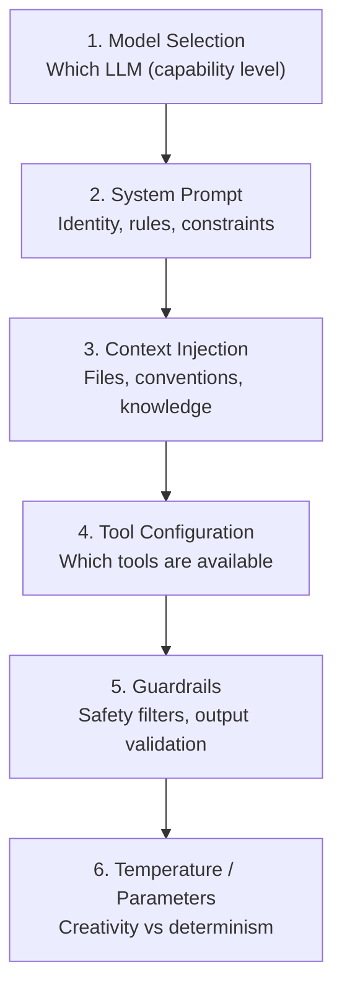
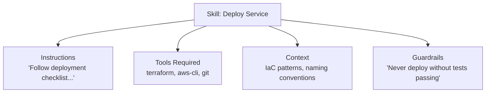
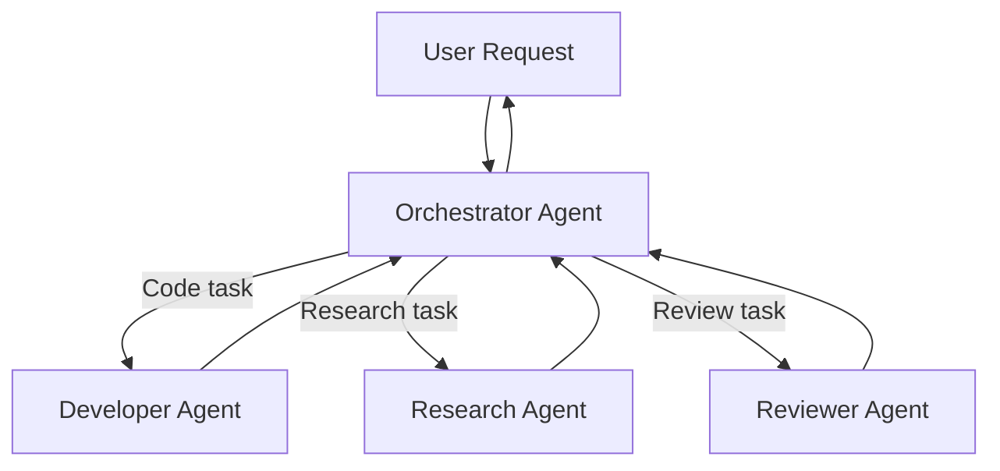
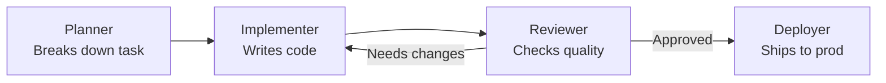

## What Are AI Agents?

An AI agent is a system that uses a language model as its reasoning core, enhanced with the ability to take actions in the world — calling tools, reading files, querying databases, browsing the web, or interacting with APIs. Unlike a simple chatbot that only generates text, an agent observes, reasons, acts, and iterates.



### Core Agent Loop

Most agent frameworks implement some variant of this loop:

1. **Receive** — user provides a goal or task
2. **Plan** — the LLM decides what to do (which tool to call, what information to gather)
3. **Act** — execute the chosen action (function call, API request, file operation)
4. **Observe** — read the result of the action
5. **Iterate** — repeat 2–4 until the goal is satisfied
6. **Respond** — deliver the final result to the user

### Agent vs Chatbot

| Aspect | Chatbot | Agent |
|--------|---------|-------|
| Actions | Text generation only | Tool use, API calls, code execution |
| Reasoning | Single-shot response | Multi-step planning and iteration |
| State | Conversation history only | Memory, context, workspace state |
| Autonomy | Responds to prompts | Pursues goals across multiple steps |
| Error handling | None (just generates more text) | Can observe failures and retry differently |

---

## System Prompts (The Constitution)

The system prompt is the foundational instruction set that defines an agent's identity, behavior, constraints, and capabilities. It's loaded before any user interaction and persists across the conversation.

### Anatomy of a System Prompt

```
┌──────────────────────────────────────────┐
│  Identity & Role                         │
│  "You are a senior backend engineer..."  │
├──────────────────────────────────────────┤
│  Capabilities & Tools                    │
│  "You have access to: file system,      │
│   git, databases, web search..."         │
├──────────────────────────────────────────┤
│  Behavioral Rules                        │
│  "Always ask before deleting files..."   │
├──────────────────────────────────────────┤
│  Response Style                          │
│  "Be concise. Use code blocks for..."   │
├──────────────────────────────────────────┤
│  Safety Guardrails                       │
│  "Never execute destructive commands..." │
├──────────────────────────────────────────┤
│  Context / Domain Knowledge              │
│  "The codebase uses Python 3.12..."     │
└──────────────────────────────────────────┘
```

### Design Principles for System Prompts

| Principle | Explanation |
|-----------|-------------|
| **Specificity** | Vague instructions produce vague behavior. "Be helpful" vs "When the user describes a bug, read the relevant code before suggesting fixes" |
| **Hierarchy** | Critical rules first — models attend more to early content |
| **Constraints before freedoms** | Define what NOT to do before what TO do |
| **Observable behavior** | Define behaviors in terms of actions ("read the file first") not internal states ("be thoughtful") |
| **Testability** | Every rule should have a scenario where you can verify compliance |
| **No contradiction** | Contradictory rules cause unpredictable behavior. Resolve conflicts explicitly. |

### Anti-Patterns

| Anti-Pattern | Problem | Better |
|--------------|---------|--------|
| "Be the best assistant possible" | Too vague, no behavioral impact | Specific behavioral rules |
| Walls of text without structure | Model loses focus | Use headers, bullets, tables |
| "Never make mistakes" | Impossible, causes hedging | Define specific error-handling behavior |
| Listing every possible scenario | Token waste, diminishing returns | Principles + examples for edge cases |
| Emotional manipulation ("I'll be fired if...") | Unreliable, ethically questionable | Direct instructions |

---

## Steering (Behavioral Configuration)

Steering refers to the techniques for controlling agent behavior beyond the system prompt. It encompasses everything that shapes how an agent operates without retraining the model.

### Steering Layers



### Context Injection Patterns

| Pattern | When to Use | Example |
|---------|-------------|---------|
| **Always-include** | Rules that apply to every interaction | Code style guide, safety rules |
| **Conditional** | Rules that apply to specific tasks | "When writing Terraform..." |
| **On-demand** | Large references loaded when relevant | API documentation, schemas |
| **Dynamic** | State that changes between requests | Current git branch, open issues |

### Steering Files

Many agent systems use configuration files that define behavior per-project or per-role:

```yaml
# Example: agent steering configuration
role: backend-engineer
model: claude-sonnet-4-20250514
temperature: 0.3

rules:
  - Always read existing code before modifying it
  - Run tests after every code change
  - Use the project's existing patterns and libraries
  - Ask before making destructive operations

context:
  always:
    - ./conventions/code-style.md
    - ./conventions/architecture.md
  conditional:
    - trigger: "terraform|infrastructure"
      include: ./conventions/iac-patterns.md
    - trigger: "test|testing"
      include: ./conventions/testing-strategy.md

tools:
  enabled:
    - file_read
    - file_write
    - terminal
    - web_search
  disabled:
    - delete_file  # Require human approval
```

---

## Skills (Composable Capabilities)

A skill is a packaged, reusable unit of agent capability — a specific task or domain the agent can perform well. Skills combine instructions, context, and tool configuration into a coherent module.

### Skill Architecture



### Skill Composition

| Approach | How It Works | Trade-offs |
|----------|-------------|------------|
| **Monolithic agent** | One agent with everything | Simple but unfocused, large context |
| **Skill-switched** | One agent that activates skills as needed | Flexible, manageable context |
| **Multi-agent** | Specialized agents hand off to each other | Clear separation, coordination overhead |
| **Hierarchical** | Orchestrator delegates to specialist sub-agents | Scalable, complex to design |

### Skill Design Pattern

```
Skill Definition:
├── Name: "code-reviewer"
├── Description: "Reviews code changes for quality, security, and style"
├── Trigger: When MR/PR review is requested
├── Context:
│   ├── Project coding standards
│   ├── Common vulnerability patterns
│   └── Previous review decisions
├── Tools: git_diff, file_read, create_comment
├── Process:
│   1. Read the diff
│   2. Check for security issues
│   3. Check for style violations
│   4. Check for logic errors
│   5. Provide feedback with specific line references
└── Output format: Structured review comments with severity
```

---

## Agent Architecture Patterns

### ReAct (Reason + Act)

The model alternates between reasoning (thinking about what to do) and acting (calling tools):

```
Thought: I need to find the user's order. Let me query the database.
Action: query_db("SELECT * FROM orders WHERE user_id = 123")
Observation: [{"id": 456, "status": "shipped", "date": "2024-01-15"}]
Thought: The order is shipped. Let me get the tracking info.
Action: get_tracking(order_id=456)
Observation: {"carrier": "DHL", "tracking": "12345", "eta": "2024-01-18"}
Thought: I have all the information to respond.
Answer: Your order #456 was shipped via DHL (tracking: 12345), expected delivery Jan 18.
```

### Plan-and-Execute

The agent first creates a plan, then executes each step:

```
Plan:
1. Read the current test file
2. Identify the failing test
3. Read the source code it tests
4. Identify the bug
5. Fix the source code
6. Run tests to verify

Executing step 1... [reads file]
Executing step 2... [identifies assertion failure]
...
```

### Tool-Use Patterns

| Pattern | Description |
|---------|-------------|
| **Sequential** | One tool at a time, each building on the last |
| **Parallel** | Multiple independent tool calls at once |
| **Conditional** | Tool choice depends on previous results |
| **Iterative** | Repeat a tool call with different parameters until satisfied |
| **Fallback** | If primary tool fails, try alternative |

---

## Multi-Agent Systems

### Orchestrator Pattern



### Pipeline Pattern



### When to Use Multi-Agent vs Single Agent

| Single Agent | Multi-Agent |
|-------------|-------------|
| Task is coherent and sequential | Task has distinct phases requiring different expertise |
| Context window is sufficient | Individual context would overflow a single agent |
| Latency matters | Quality matters more than speed |
| Simple tool set | Each sub-task needs a different tool set |

---

## Guardrails and Safety

### Types of Guardrails

| Layer | What It Catches | Example |
|-------|----------------|---------|
| **Input filtering** | Prompt injection, jailbreaks | Detect "ignore previous instructions" patterns |
| **Tool restrictions** | Unauthorized actions | Prevent `rm -rf /`, restrict network access |
| **Output validation** | Harmful content, data leaks | Check for PII in responses, validate JSON schema |
| **Human-in-the-loop** | High-risk decisions | Require approval for production deployments |
| **Rate limiting** | Runaway agents | Max 50 tool calls per task, timeout after 5 minutes |
| **Sandboxing** | System damage | Execute code in containers, restrict file system access |

### Designing Safety Into Agents

1. **Principle of least privilege** — grant only the tools and permissions needed for the task
2. **Confirm destructive actions** — deletion, deployment, data modification require human approval
3. **Audit trail** — log every tool call, input, and output for post-hoc review
4. **Graceful degradation** — if a tool fails, the agent should explain and suggest alternatives, not retry infinitely
5. **Scope boundaries** — define what's in-scope and out-of-scope explicitly in steering

---

## Evaluating Agents

### What to Measure

| Dimension | Metrics |
|-----------|---------|
| **Task completion** | Success rate, partial completion, failure modes |
| **Efficiency** | Tool calls per task, tokens used, time to completion |
| **Safety** | Guardrail violations, unauthorized actions |
| **Quality** | Accuracy of outputs, code correctness, factual precision |
| **User experience** | Response time, clarity, need for follow-up |

### Evaluation Approaches

- **Unit tests for tools** — verify each tool works correctly in isolation
- **Integration tests** — run the agent through known scenarios and verify outcomes
- **Red-teaming** — attempt to make the agent violate its constraints
- **A/B testing** — compare different system prompts or configurations on real tasks
- **Human evaluation** — expert review of agent outputs for quality and correctness

---

## Key Takeaways

1. **Agents = LLM + Tools + Loop** — the ability to act, observe, and iterate is what separates agents from chatbots
2. **System prompts are constitutional** — they define identity, rules, and behavior. Invest heavily in their design.
3. **Steering is multi-layered** — model selection, system prompt, context injection, tool configuration, and guardrails all contribute
4. **Skills are composable** — package capabilities into reusable modules rather than putting everything in one prompt
5. **ReAct (Reason + Act)** is the dominant pattern — interleave thinking with tool use
6. **Multi-agent systems** scale expertise — use when tasks require distinct specialist knowledge
7. **Guardrails are non-negotiable** — every production agent needs safety boundaries, audit logging, and human oversight
8. **Specificity beats length** — a concise, well-structured system prompt outperforms a vague, lengthy one
