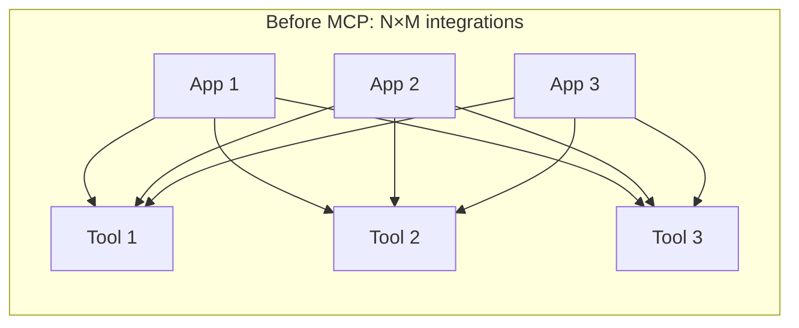
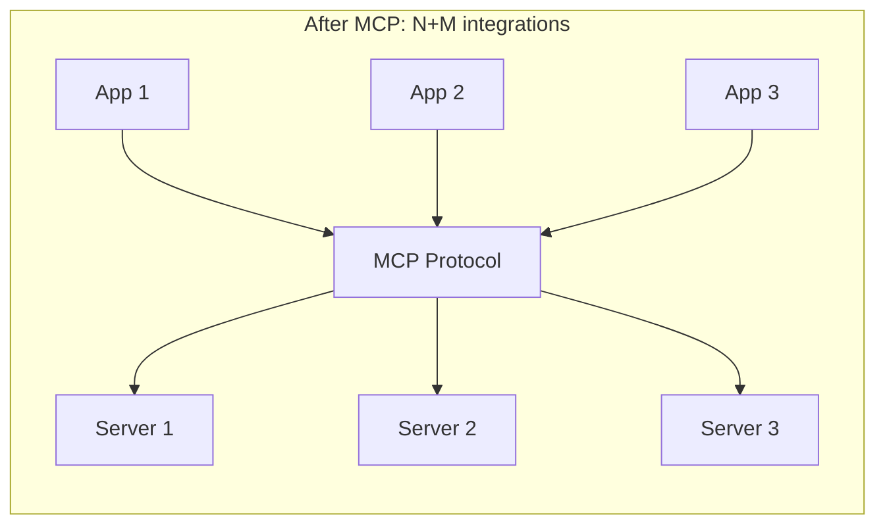
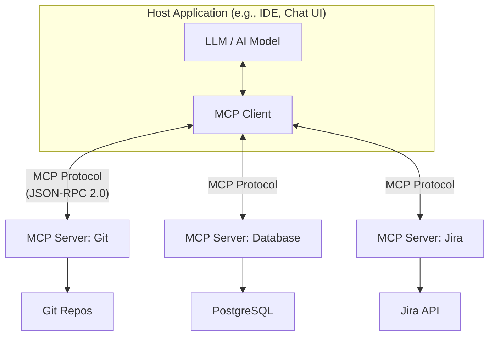
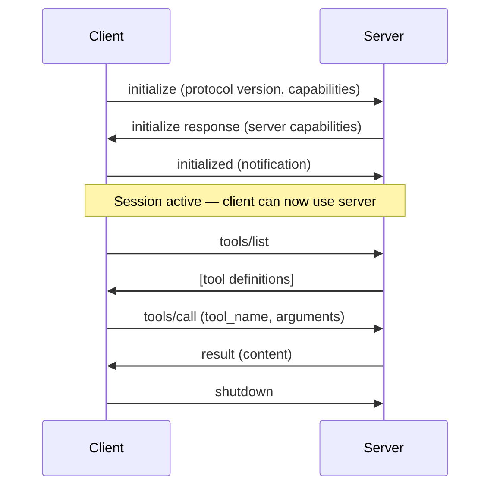

## What Is MCP?

The **Model Context Protocol** (MCP) is an open standard for connecting AI models to external data sources and tools. Created by Anthropic and open-sourced in late 2024, it provides a universal interface between AI applications (clients) and integrations (servers), much like USB-C standardized device connectivity.

### The Problem MCP Solves

Before MCP, every AI application had to build custom integrations for each tool:





**N apps × M tools = N×M custom integrations** becomes **N + M** — each app implements the client protocol once, each tool implements the server protocol once.

---

## Architecture



### Roles

| Component | Role | Examples |
|-----------|------|----------|
| **Host** | The application the user interacts with | IDE, chat interface, CLI tool |
| **Client** | Protocol handler inside the host — manages connections to servers | Built into the host |
| **Server** | Exposes capabilities (tools, resources, prompts) via MCP | Git server, DB server, Slack server |
| **Transport** | Communication channel between client and server | stdio, SSE (HTTP), WebSocket |

---

## Protocol Fundamentals

MCP uses **JSON-RPC 2.0** as its wire format. All messages are either requests (with an `id`), responses (matching the `id`), or notifications (no `id`, no response expected).

### Connection Lifecycle



### Capability Negotiation

During initialization, both sides declare what they support:

```json
{
  "method": "initialize",
  "params": {
    "protocolVersion": "2025-06-18",
    "capabilities": {
      "tools": {},
      "resources": { "subscribe": true },
      "prompts": {}
    },
    "clientInfo": { "name": "my-ide", "version": "1.0" }
  }
}
```

---

## The Three Primitives

MCP servers expose three types of capabilities:

### 1. Tools (Model-Controlled)

Functions the AI model can call to take actions. The model decides when to use them.

```json
{
  "name": "query_database",
  "description": "Execute a read-only SQL query against the application database",
  "inputSchema": {
    "type": "object",
    "properties": {
      "sql": { "type": "string", "description": "SQL SELECT query" }
    },
    "required": ["sql"]
  }
}
```

**Characteristics:**
- Model decides when to invoke
- Must be confirmed by user (human-in-the-loop for dangerous operations)
- Can have side effects (write to DB, send email, create file)
- Analogous to POST endpoints in a REST API

### 2. Resources (Application-Controlled)

Data the server makes available — files, database records, API responses. The application decides when to fetch them.

```json
{
  "uri": "file:///project/src/main.py",
  "name": "main.py",
  "mimeType": "text/x-python",
  "description": "Main application entry point"
}
```

**Characteristics:**
- Application/user controls when to load
- Read-only (no side effects)
- Identified by URI
- Can be subscribed to for real-time updates
- Analogous to GET endpoints

### 3. Prompts (User-Controlled)

Pre-written prompt templates that users can invoke. They structure interactions for specific workflows.

```json
{
  "name": "code-review",
  "description": "Review code changes for quality and security",
  "arguments": [
    { "name": "diff", "description": "The code diff to review", "required": true },
    { "name": "focus", "description": "What to focus on (security, performance, style)" }
  ]
}
```

**Characteristics:**
- User explicitly selects and invokes
- Template that expands with arguments
- Returns structured messages for the conversation
- Analogous to slash commands

### Primitive Comparison

| Primitive | Controlled By | Side Effects | Timing |
|-----------|--------------|--------------|--------|
| Tools | Model (AI decides) | Yes (can modify state) | During reasoning |
| Resources | Application (user/app decides) | No (read-only) | Before or during reasoning |
| Prompts | User (explicit invocation) | No | Before reasoning starts |

---

## Transport Mechanisms

### stdio (Standard I/O)

The server runs as a child process; communication happens over stdin/stdout:

```
Client → stdin → Server process
Client ← stdout ← Server process
           stderr → logs (not protocol)
```

- **Best for:** Local tools, CLI-based servers, development
- **Pros:** Simple, fast, no network overhead
- **Cons:** Must run locally, one client per server process

### SSE (Server-Sent Events over HTTP)

The server exposes an HTTP endpoint; client connects via SSE for server→client messages and POST for client→server:

```
Client → POST /message → Server
Client ← SSE stream ← Server
```

- **Best for:** Remote servers, shared services, cloud-hosted tools
- **Pros:** Works over network, firewalls, load balancers
- **Cons:** More complex setup, latency

### Streamable HTTP (newer)

A simplified HTTP transport that can optionally upgrade to SSE for streaming. Designed for stateless/short-lived interactions.

---

## Building an MCP Server

### Example: A Weather Tool Server (TypeScript)

```typescript
import { McpServer } from "@modelcontextprotocol/sdk/server/mcp.js";
import { StdioServerTransport } from "@modelcontextprotocol/sdk/server/stdio.js";
import { z } from "zod";

const server = new McpServer({
  name: "weather-server",
  version: "1.0.0",
});

// Register a tool
server.tool(
  "get_weather",
  "Get current weather for a city",
  {
    city: z.string().describe("City name"),
    units: z.enum(["celsius", "fahrenheit"]).default("celsius"),
  },
  async ({ city, units }) => {
    const weather = await fetchWeather(city, units);
    return {
      content: [{
        type: "text",
        text: `${city}: ${weather.temp}°${units === "celsius" ? "C" : "F"}, ${weather.condition}`,
      }],
    };
  }
);

// Start the server
const transport = new StdioServerTransport();
await server.connect(transport);
```

### Example: Python Server

```python
from mcp.server import Server
from mcp.server.stdio import stdio_server
from mcp.types import Tool, TextContent

server = Server("database-server")

@server.list_tools()
async def list_tools() -> list[Tool]:
    return [
        Tool(
            name="query",
            description="Run a read-only SQL query",
            inputSchema={
                "type": "object",
                "properties": {
                    "sql": {"type": "string", "description": "SQL query"}
                },
                "required": ["sql"]
            }
        )
    ]

@server.call_tool()
async def call_tool(name: str, arguments: dict) -> list[TextContent]:
    if name == "query":
        result = await db.execute(arguments["sql"])
        return [TextContent(type="text", text=str(result))]

async def main():
    async with stdio_server() as (read, write):
        await server.run(read, write)
```

---

## Client Configuration

MCP clients are typically configured in the host application. Example configuration:

```json
{
  "mcpServers": {
    "git": {
      "command": "mcp-server-git",
      "args": ["--repository", "/path/to/repo"]
    },
    "database": {
      "command": "mcp-server-postgres",
      "env": {
        "DATABASE_URL": "postgresql://localhost/mydb"
      }
    },
    "jira": {
      "url": "https://mcp.example.com/jira",
      "transport": "sse",
      "headers": {
        "Authorization": "Bearer ${JIRA_TOKEN}"
      }
    }
  }
}
```

---

## Common MCP Servers

| Server | Provides |
|--------|----------|
| **Filesystem** | Read/write files, search, directory listing |
| **Git** | Commits, diffs, branches, blame, log |
| **PostgreSQL / MySQL** | Query databases, list schemas |
| **Slack** | Send messages, read channels |
| **GitHub / GitLab** | Issues, PRs, reviews, repos |
| **Jira** | Tickets, boards, sprints |
| **Confluence** | Pages, search, create/update |
| **Docker** | Container management |
| **Kubernetes** | Pod listing, logs, describe |
| **AWS** | Service operations via CLI |
| **Browser** | Navigate, screenshot, interact with web pages |

---

## Security Considerations

| Risk | Mitigation |
|------|-----------|
| **Prompt injection via tool results** | Treat tool output as untrusted data; don't execute instructions from it |
| **Credential exposure** | Use environment variables or credential stores, never hardcode tokens |
| **Excessive permissions** | Servers should implement least-privilege (read-only where possible) |
| **Data exfiltration** | Validate that the model isn't sending sensitive data to unexpected tools |
| **Uncontrolled actions** | Human-in-the-loop for destructive operations (delete, deploy, send) |
| **Server impersonation** | Verify server identity; use HTTPS for remote servers |

---

## Key Takeaways

1. **MCP standardizes tool integration** — write the integration once, use it in any MCP-compatible AI application
2. **Three primitives:** Tools (model-invoked actions), Resources (app-controlled data), Prompts (user-invoked templates)
3. **Transport-agnostic** — works over stdio (local) or HTTP/SSE (remote)
4. **JSON-RPC 2.0** is the wire protocol — request/response with capability negotiation
5. **Security requires care** — tool results are untrusted, credentials must be secured, human approval for dangerous actions
6. **The ecosystem is growing rapidly** — hundreds of community MCP servers available for common services
7. **Client + Server is the model** — your AI app (client) connects to many servers, each exposing specific capabilities
