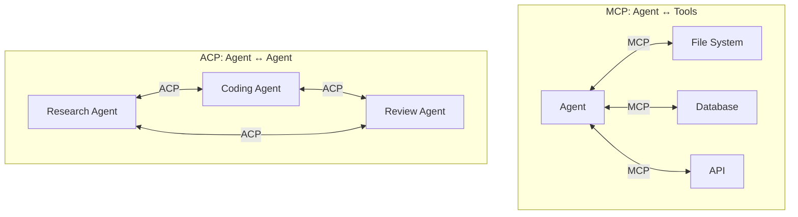
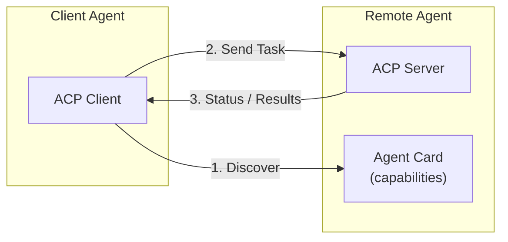
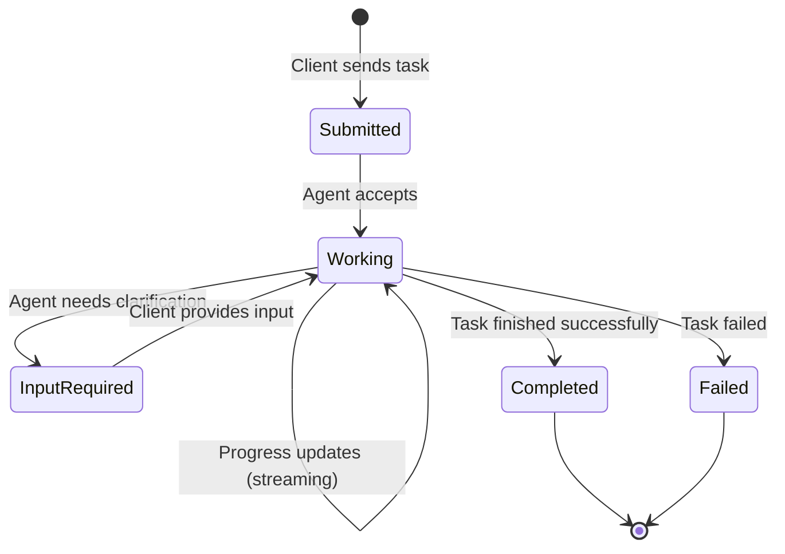
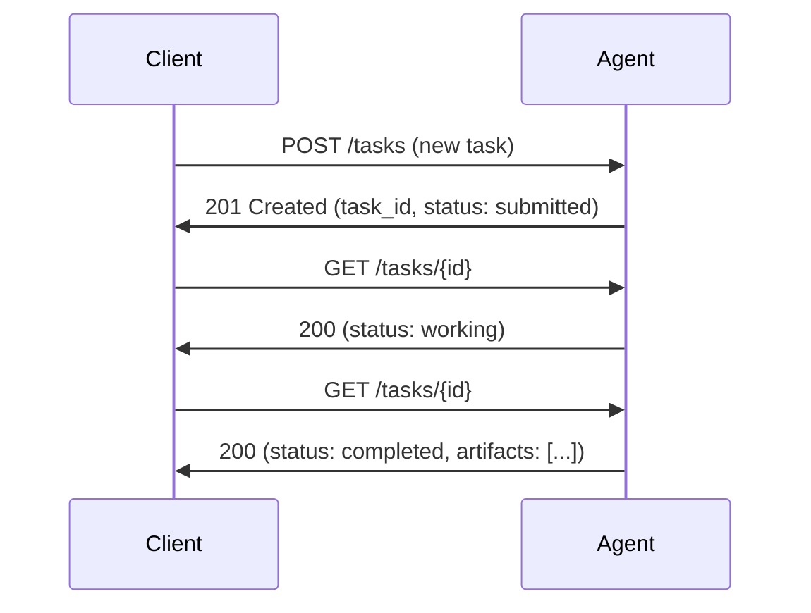
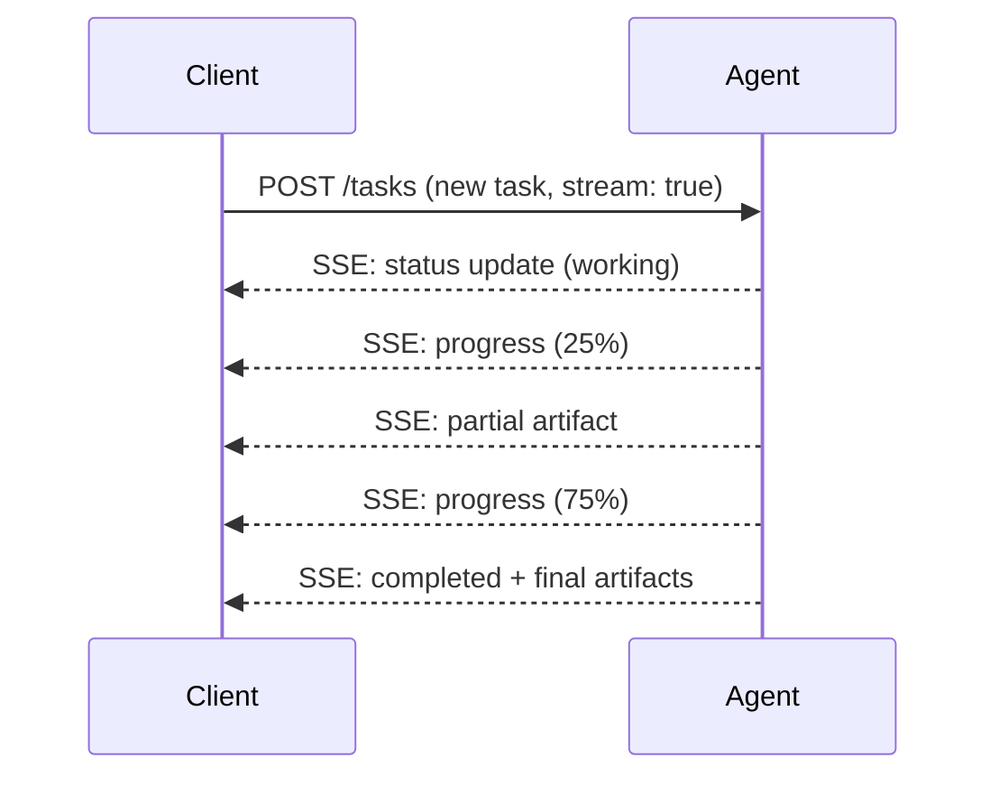
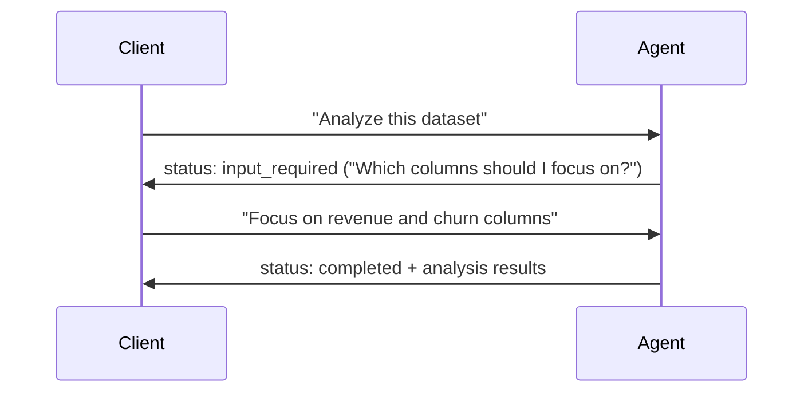
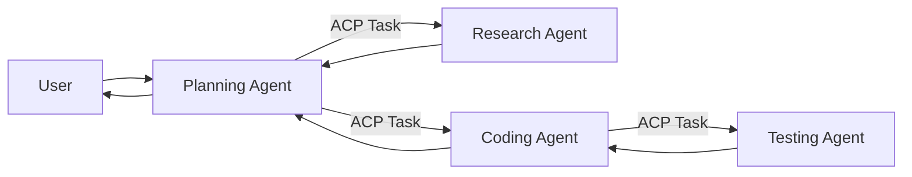

## What Is ACP?

The **Agent Communication Protocol** (ACP) — also known as **A2A** (Agent-to-Agent) in Google's implementation — is an emerging open standard for **agent-to-agent communication**. While MCP connects an AI agent to tools and data sources, ACP connects agents to each other, enabling them to discover capabilities, delegate tasks, and collaborate without knowing each other's internal implementation.

### MCP vs ACP: Different Problems



| Protocol | Connects | Primary Use |
|----------|----------|-------------|
| **MCP** | Agent ↔ Tools/Data | Give an agent access to external capabilities |
| **ACP/A2A** | Agent ↔ Agent | Let agents collaborate, delegate, and communicate |

---

## Why Agent-to-Agent Communication?

As AI systems become more complex, no single agent can do everything well. Multi-agent architectures emerge:

| Scenario | Why A2A |
|----------|---------|
| **Specialized agents** | A coding agent delegates security review to a security-specialist agent |
| **Cross-organization** | Company A's procurement agent negotiates with Company B's sales agent |
| **Scalability** | Break complex workflows into cooperating specialists |
| **Different vendors** | A Claude-based agent collaborates with a GPT-based agent |
| **Opaque agents** | Agents don't need to know each other's internals — only the protocol |

---

## Architecture

### Core Concepts



### Agent Card (Discovery)

Every ACP-compliant agent publishes an **Agent Card** — a JSON document describing its identity and capabilities. Typically hosted at a well-known URL (e.g., `/.well-known/agent.json`):

```json
{
  "name": "code-review-agent",
  "description": "Reviews code for security vulnerabilities and style issues",
  "url": "https://agents.example.com/code-reviewer",
  "version": "1.0.0",
  "capabilities": {
    "streaming": true,
    "pushNotifications": true
  },
  "skills": [
    {
      "id": "security-review",
      "name": "Security Code Review",
      "description": "Analyzes code for OWASP Top 10 vulnerabilities",
      "inputSchema": {
        "type": "object",
        "properties": {
          "code": { "type": "string" },
          "language": { "type": "string" }
        },
        "required": ["code"]
      }
    },
    {
      "id": "style-review",
      "name": "Style & Convention Review",
      "description": "Checks code against team style guidelines"
    }
  ],
  "authentication": {
    "type": "oauth2",
    "tokenUrl": "https://auth.example.com/token"
  }
}
```

---

## Communication Flow

### Task Lifecycle



### Task Object

The core unit of communication is a **Task**:

```json
{
  "id": "task-uuid-1234",
  "status": "working",
  "messages": [
    {
      "role": "user",
      "parts": [
        { "type": "text", "text": "Review this Python function for security issues" },
        { "type": "file", "mimeType": "text/x-python", "data": "base64..." }
      ]
    }
  ],
  "artifacts": [],
  "metadata": {
    "priority": "high",
    "deadline": "2024-06-01T12:00:00Z"
  }
}
```

### Messages and Parts

Messages can contain multiple **parts** — text, files, structured data:

| Part Type | Use |
|-----------|-----|
| `text` | Plain text content |
| `file` | Binary/text file with MIME type |
| `data` | Structured JSON data |

### Artifacts (Results)

When a task completes, the agent returns **artifacts**:

```json
{
  "artifacts": [
    {
      "name": "review-report",
      "parts": [
        {
          "type": "text",
          "text": "## Security Review\n\n### Critical: SQL Injection on line 42..."
        }
      ]
    },
    {
      "name": "fixed-code",
      "parts": [
        { "type": "file", "mimeType": "text/x-python", "data": "base64..." }
      ]
    }
  ]
}
```

---

## Communication Patterns

### Request-Response (Simple)

Client sends task, waits for completion:



### Streaming (Real-Time Updates)

For long-running tasks, the agent streams progress:



### Multi-Turn (Interactive)

The agent requests clarification before completing:



### Delegation (Agent-to-Agent Chain)



---

## Discovery Mechanisms

How do agents find each other?

| Mechanism | How | When |
|-----------|-----|------|
| **Well-known URL** | `/.well-known/agent.json` | Public agents on known domains |
| **Agent registry** | Centralized directory of agent cards | Enterprise / marketplace |
| **DNS-based** | SRV records or TXT records pointing to agent | Organization-wide discovery |
| **Manual configuration** | Hard-coded URLs in client config | Development, fixed architectures |

---

## Security and Trust

### Authentication

| Method | Use Case |
|--------|----------|
| **OAuth 2.0** | Standard — agents authenticate via token exchange |
| **API Keys** | Simple but limited — good for development |
| **mTLS** | Mutual TLS for high-security agent-to-agent |
| **OIDC** | Identity federation across organizations |

### Authorization

```json
{
  "permissions": {
    "code-review-agent": {
      "skills": ["security-review", "style-review"],
      "maxConcurrentTasks": 5,
      "allowedInputTypes": ["text/x-python", "text/javascript"],
      "dataClassification": "internal"
    }
  }
}
```

### Trust Considerations

| Concern | Mitigation |
|---------|-----------|
| Agent impersonation | Verify agent card signatures, use mTLS |
| Data leakage | Classification-aware routing, encryption in transit |
| Malicious delegation | Limit delegation depth, audit trail |
| Prompt injection via task content | Treat all incoming task content as untrusted data |
| Infinite loops | Timeout, max iterations, circuit breaker |
| Cost control | Budget limits per agent per time window |

---

## ACP vs Other Multi-Agent Approaches

| Approach | Coupling | Discovery | Best For |
|----------|---------|-----------|----------|
| **ACP/A2A** | Loose — protocol-based | Automatic via agent cards | Cross-system, cross-org agents |
| **LangGraph / CrewAI** | Tight — code-level | Hard-coded in orchestrator | Single-application multi-agent |
| **Message queues (SQS/Kafka)** | Loose — event-based | Manual configuration | Async, high-volume, event-driven |
| **Direct API calls** | Tight — API-specific | Manual | Simple point-to-point |

---

## Building ACP-Compliant Agents

### Server Implementation (Conceptual)

```python
from acp import AgentServer, Task, Artifact, TextPart

server = AgentServer(
    name="summarization-agent",
    description="Summarizes documents and text content",
)

@server.skill("summarize")
async def summarize(task: Task) -> list[Artifact]:
    text = task.get_text_input()
    
    task.update_status("working", progress=0.1)
    
    summary = await llm.generate(
        system="You are a precise summarizer.",
        user=f"Summarize this:\n\n{text}"
    )
    
    task.update_status("working", progress=0.9)
    
    return [Artifact(
        name="summary",
        parts=[TextPart(text=summary)]
    )]

server.run(host="0.0.0.0", port=8080)
```

### Client Usage

```python
from acp import AgentClient

# Discover agent capabilities
client = AgentClient("https://agents.example.com/summarizer")
card = await client.discover()

# Send a task
task = await client.send_task(
    skill="summarize",
    messages=[{"role": "user", "parts": [{"type": "text", "text": long_document}]}]
)

# Wait for completion (or stream)
result = await client.wait_for_task(task.id)
print(result.artifacts[0].parts[0].text)
```

---

## Real-World Applications

| Application | How ACP Helps |
|-------------|---------------|
| **Enterprise workflows** | Procurement agent negotiates with vendor agents |
| **Code development** | Planning agent delegates to coder, reviewer, deployer |
| **Customer support** | Triage agent routes to specialist agents (billing, technical, sales) |
| **Research** | Coordinator dispatches research queries to domain-specialist agents |
| **Data pipelines** | Ingestion agent triggers validation agent, then transformation agent |

---

## Key Takeaways

1. **ACP enables agent-to-agent collaboration** without sharing internal implementation details
2. **Agent Cards** are the discovery mechanism — they advertise what an agent can do
3. **Tasks** are the unit of work — with lifecycle states (submitted → working → completed/failed)
4. **Multi-turn interaction** allows agents to request clarification before completing work
5. **Streaming** provides real-time progress for long-running tasks
6. **MCP and ACP are complementary** — MCP connects agents to tools, ACP connects agents to agents
7. **Security is critical** — authentication, authorization, data classification, and audit trails are required for production
8. **The standard is evolving** — early adoption means influencing the direction, but expect breaking changes
