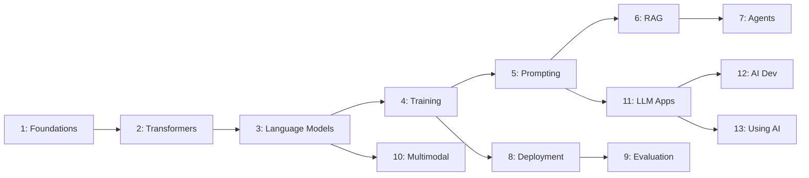
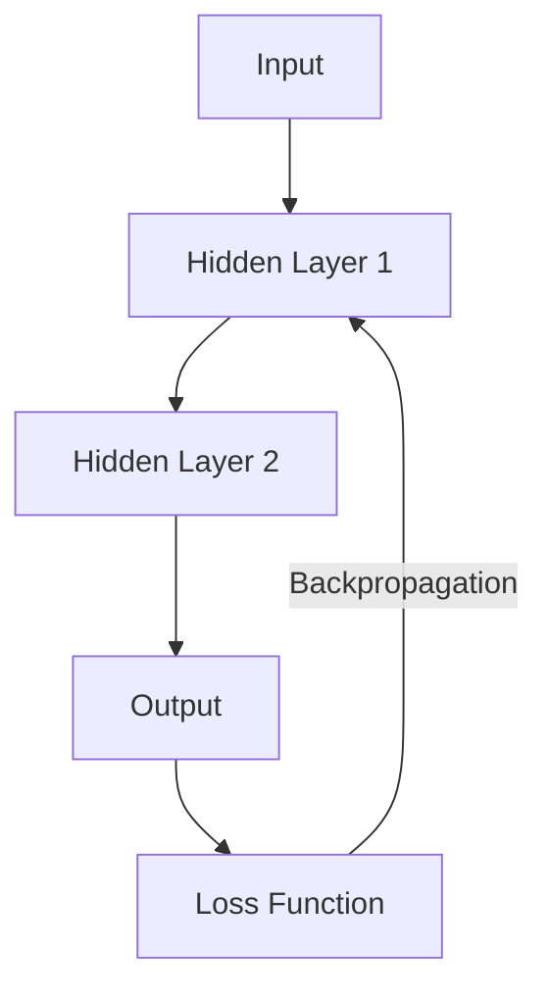
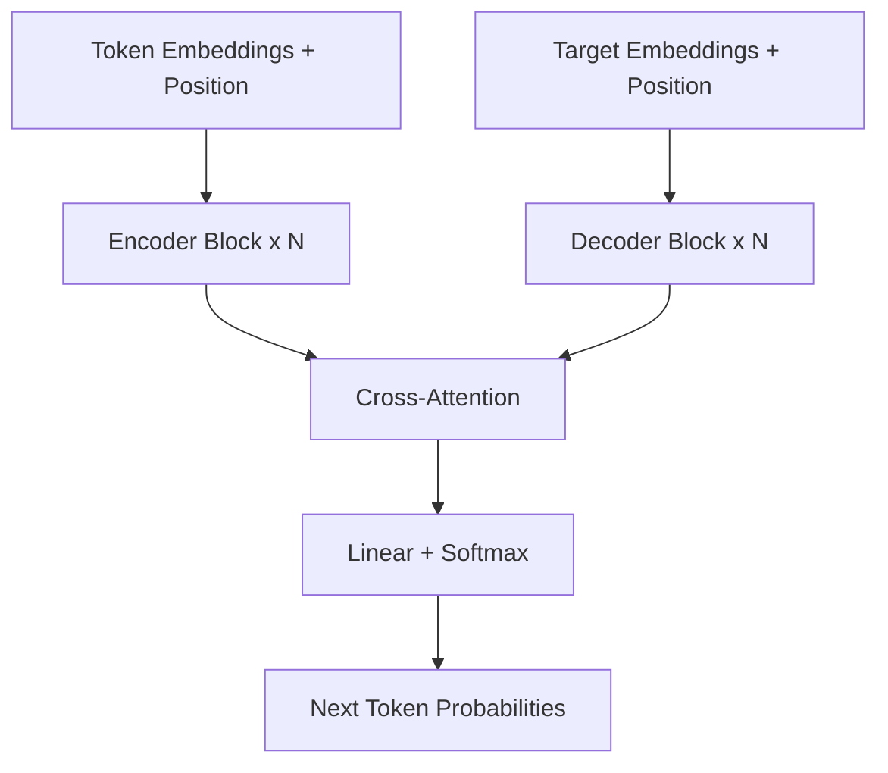
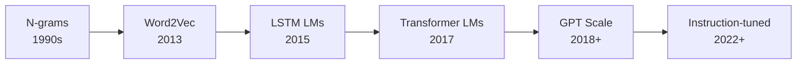
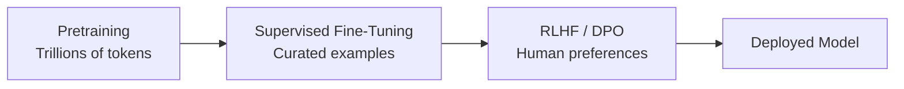
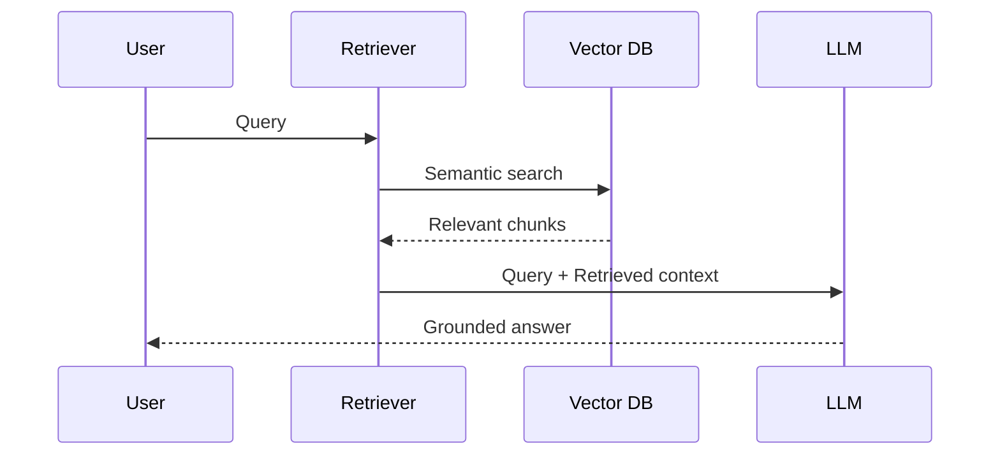
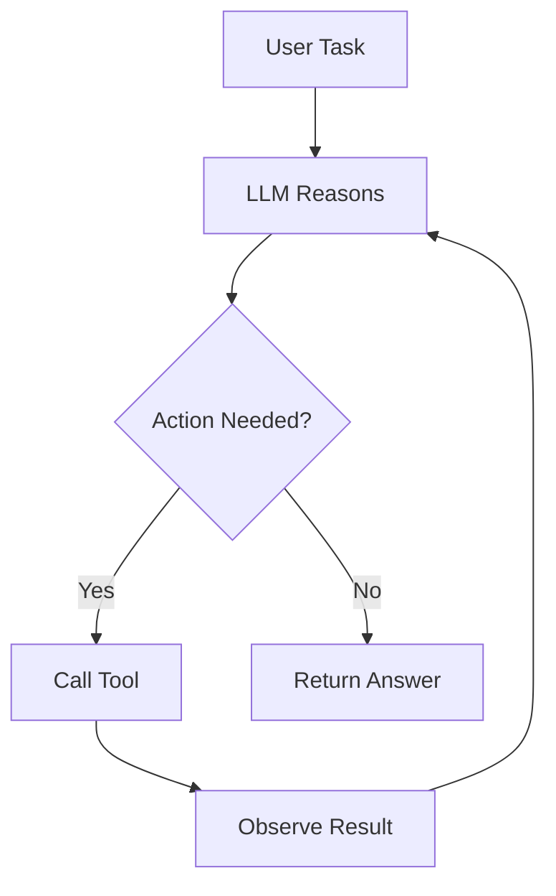
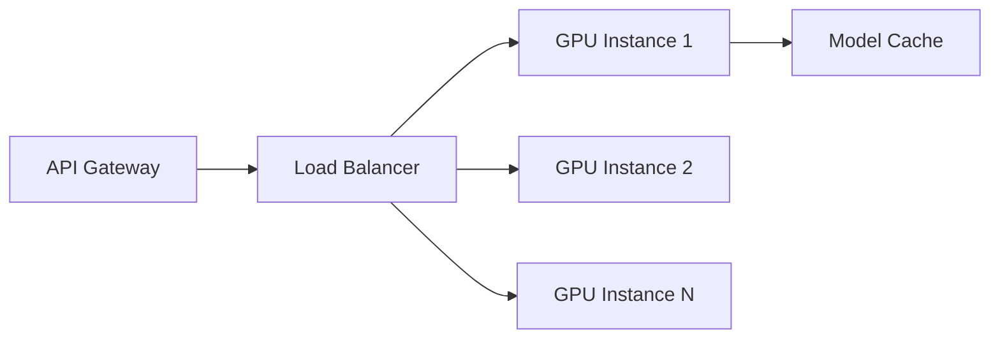
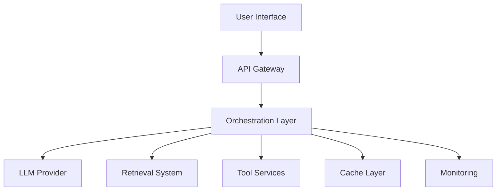

A comprehensive learning path covering the theory, architecture, and practical application of modern AI systems — from neural network fundamentals through building production LLM applications. Designed for ML engineers who want depth and software developers who want to use AI effectively.

## Prerequisites

- Programming proficiency in Python (or willingness to read Python examples)
- Basic linear algebra: vectors, matrices, dot products
- Basic probability and statistics: distributions, Bayes' theorem
- Familiarity with APIs and software architecture concepts
- For sections 1–4: calculus fundamentals (derivatives, chain rule) are helpful but not required

## How This Path Is Organized

Each section below is an overview. Deep-dive files for each topic live alongside this README:

```text
paths/ai-llms/
├── README.md                  ← You are here (map file)
├── 01-foundations.md
├── 02-transformer-architecture.md
├── 03-language-models.md
├── 04-training-fine-tuning.md
├── 05-prompt-engineering.md
├── 06-rag.md
├── 07-agents-tool-use.md
├── 08-inference-deployment.md
├── 09-evaluation-safety.md
├── 10-multimodal-models.md
├── 11-building-llm-apps.md
├── 12-ai-assisted-development.md
└── 13-using-ai-effectively.md
```



---

## 1. Foundations: Neural Networks and Deep Learning

The building blocks of all modern AI. Neural networks learn hierarchical representations from data through layers of parameterized transformations.

### Core Concepts

| Concept | What It Does | Why It Matters |
|---------|-------------|----------------|
| Perceptron | Weighted sum + activation | Simplest learning unit |
| Backpropagation | Computes gradients through the network | Enables learning via gradient descent |
| Loss function | Measures prediction error | Defines what "correct" means |
| Activation functions | Introduce non-linearity | Allow networks to learn complex patterns |
| Regularization | Prevents overfitting | Generalizes to unseen data |

### Key Architectures

| Architecture | Strength | Use Case |
|-------------|----------|----------|
| Feedforward (MLP) | Tabular data, simple mappings | Classification, regression |
| CNN | Spatial patterns | Images, audio spectrograms |
| RNN/LSTM | Sequential data | Time series, early NLP |
| Transformer | Long-range dependencies, parallelism | NLP, vision, multimodal |



### Key Takeaway

Deep learning works because stacking layers creates increasingly abstract representations — pixels become edges become shapes become objects. The transformer (Section 2) superseded RNNs by processing sequences in parallel.

---

## 2. The Transformer Architecture

The architecture behind GPT, BERT, Claude, and virtually all modern LLMs. Introduced in "Attention Is All You Need" (2017), it replaced recurrence with self-attention.

### Why Transformers Won

| Problem with RNNs | Transformer Solution |
|-------------------|---------------------|
| Sequential processing (slow) | Parallel attention over all positions |
| Vanishing gradients over long sequences | Direct connections via attention |
| Fixed-size hidden state bottleneck | Attention weights scale with sequence |

### Architecture Overview



### Core Mechanisms

- **Self-attention**: Each token attends to every other token, computing relevance scores (Q·K^T / √d)
- **Multi-head attention**: Multiple attention patterns in parallel capture different relationships
- **Positional encoding**: Injects sequence order since attention is position-agnostic
- **Feed-forward layers**: Per-position transformations after attention
- **Layer normalization**: Stabilizes training across layers
- **Residual connections**: Enable gradient flow through deep stacks

### Variants

| Variant | Architecture | Examples | Best For |
|---------|-------------|----------|----------|
| Encoder-only | Bidirectional attention | BERT, RoBERTa | Classification, embeddings |
| Decoder-only | Causal (left-to-right) attention | GPT, Claude, Llama | Text generation |
| Encoder-decoder | Full transformer | T5, BART | Translation, summarization |

### Key Takeaway

Self-attention lets every token "see" every other token in one step. This parallelism enables training on massive datasets and captures long-range dependencies that RNNs cannot.

---

## 3. Language Models: From N-grams to GPT

Language modeling is the task of predicting the next token given context. This simple objective, scaled up, produces emergent capabilities.

### Evolution



### Scaling Laws

| Factor | Effect |
|--------|--------|
| More parameters | Better loss, emergent abilities at scale |
| More data | Diminishing returns without model scale |
| More compute | Chinchilla-optimal: scale data and params together |
| Context length | Longer reasoning chains, more grounding |

### Key Concepts

- **Tokenization**: Text → subword tokens (BPE, SentencePiece). Vocabulary size affects efficiency and coverage
- **Perplexity**: Exponential of cross-entropy loss — lower is better
- **Emergent abilities**: Capabilities that appear only at sufficient scale (chain-of-thought, in-context learning)
- **In-context learning**: Performing tasks from examples in the prompt without weight updates

### Key Takeaway

The "predict next token" objective is deceptively powerful. At scale, it produces models that can reason, translate, code, and follow instructions — all from the same training signal.

---

## 4. Training and Fine-Tuning

How models go from random weights to useful assistants. Training happens in stages, each with different data, objectives, and compute requirements.

### Training Pipeline



### Training Stages

| Stage | Data | Objective | Compute |
|-------|------|-----------|---------|
| Pretraining | Web crawl, books, code | Next-token prediction | Thousands of GPUs, weeks |
| SFT | Instruction-response pairs | Follow instructions | Tens of GPUs, hours-days |
| RLHF/DPO | Human preference rankings | Align with human values | Moderate |
| Task fine-tuning | Domain-specific data | Specialize for a task | Single GPU, hours |

### Fine-Tuning Approaches

| Method | What Changes | When to Use |
|--------|-------------|-------------|
| Full fine-tuning | All weights | Maximum control, large dataset |
| LoRA / QLoRA | Low-rank adapter matrices | Limited compute, preserve base knowledge |
| Prefix tuning | Learned prompt embeddings | Very limited data |
| Prompt tuning | Soft prompt tokens | Minimal changes needed |

### Key Takeaway

Pretraining gives knowledge; fine-tuning gives behavior. LoRA makes fine-tuning accessible — you can adapt a 70B model on a single GPU by training <1% of parameters.

---

## 5. Prompt Engineering

The art and science of communicating effectively with language models. Prompt design is the primary interface for most developers.

### Prompting Techniques

| Technique | Description | When to Use |
|-----------|-------------|-------------|
| Zero-shot | Direct instruction, no examples | Simple, well-defined tasks |
| Few-shot | Include input-output examples | Pattern matching, formatting |
| Chain-of-thought | "Think step by step" | Reasoning, math, logic |
| System prompts | Set persona and constraints | Consistent behavior |
| Structured output | Request JSON, XML, tables | Integration with code |

### Anatomy of an Effective Prompt

```text
[SYSTEM] Role, constraints, output format
[CONTEXT] Background information, documents
[INSTRUCTION] What to do — specific, unambiguous
[EXAMPLES] Input-output pairs (few-shot)
[INPUT] The actual data to process
```

### Common Failure Modes

| Problem | Cause | Fix |
|---------|-------|-----|
| Hallucination | No grounding data | Add context, use RAG |
| Wrong format | Ambiguous instruction | Show exact output format |
| Ignoring constraints | Buried in long prompt | Put constraints early and repeat |
| Inconsistent behavior | Temperature too high | Lower temperature, add examples |

### Key Takeaway

Prompting is programming in natural language. Specificity, structure, and examples matter more than politeness or verbosity. Test prompts systematically — they're code.

---

## 6. Retrieval-Augmented Generation (RAG)

Connecting LLMs to external knowledge so they can answer questions about data they weren't trained on — without fine-tuning.

### RAG Pipeline



### Components

| Component | Options | Considerations |
|-----------|---------|----------------|
| Embedding model | OpenAI, Cohere, open-source | Dimension, speed, domain fit |
| Vector store | Pinecone, Weaviate, pgvector, Chroma | Scale, filtering, cost |
| Chunking strategy | Fixed-size, semantic, recursive | Chunk size vs context preservation |
| Retrieval method | Dense, sparse, hybrid, reranking | Precision vs recall tradeoff |

### Advanced Patterns

- **Hybrid search**: Combine dense vectors with BM25 keyword matching
- **Reranking**: Use a cross-encoder to reorder retrieved chunks by relevance
- **Query transformation**: Rewrite user queries for better retrieval (HyDE, multi-query)
- **Agentic RAG**: Let the model decide when and what to retrieve
- **Graph RAG**: Combine knowledge graphs with vector retrieval

### Key Takeaway

RAG trades training cost for inference cost. It keeps models current, reduces hallucination, and enables domain-specific answers without touching model weights. Chunking and retrieval quality matter more than model size.

---

## 7. Agents and Tool Use

LLMs that can take actions — calling APIs, executing code, browsing the web, and orchestrating multi-step workflows.

### Agent Loop



### Agent Patterns

| Pattern | Description | Example |
|---------|-------------|---------|
| ReAct | Reason + Act in alternating steps | Research tasks |
| Plan-and-execute | Plan all steps, then execute | Complex multi-step tasks |
| Tool-augmented | LLM selects from available tools | Code execution, API calls |
| Multi-agent | Multiple specialized agents collaborate | Software development |

### Tool Design Principles

- **Clear descriptions**: The model selects tools based on their descriptions
- **Typed parameters**: Define inputs with types and constraints
- **Idempotent when possible**: Safe to retry on failure
- **Scoped permissions**: Limit what each tool can do
- **Observable**: Log all tool calls for debugging

### Frameworks

| Framework | Approach | Strength |
|-----------|----------|----------|
| LangChain/LangGraph | Graph-based orchestration | Flexibility, ecosystem |
| CrewAI | Multi-agent roles | Team simulation |
| AutoGen | Conversational agents | Research, code generation |
| Native function calling | Provider API (OpenAI, Anthropic) | Simplicity, reliability |

### Key Takeaway

Agents extend LLMs from "text in, text out" to "task in, result out." The key challenge is reliability — agents fail silently, loop infinitely, or hallucinate tool calls. Constrain the action space and validate outputs.

---

## 8. Inference and Deployment

Serving LLMs in production — balancing latency, throughput, cost, and quality.

### Serving Stack

| Layer | Options | Tradeoff |
|-------|---------|----------|
| Model format | Full precision, GGUF, GPTQ, AWQ | Quality vs memory vs speed |
| Serving engine | vLLM, TGI, Triton, Ollama | Throughput vs simplicity |
| Infrastructure | GPU cloud, serverless, edge | Cost vs latency vs scale |
| API layer | OpenAI-compatible, custom | Ecosystem vs control |

### Optimization Techniques

| Technique | What It Does | Tradeoff |
|-----------|-------------|----------|
| Quantization (4-bit, 8-bit) | Reduce precision of weights | Minor quality loss, 2-4x memory savings |
| KV-cache | Cache attention keys/values | Memory for speed |
| Continuous batching | Process multiple requests together | Latency for throughput |
| Speculative decoding | Draft model proposes, main model verifies | Extra compute for lower latency |
| Distillation | Train smaller model from larger | Offline cost for runtime savings |

### Deployment Patterns



### Key Takeaway

The gap between "works in a notebook" and "serves 1000 req/s" is enormous. Quantization + continuous batching + proper infrastructure gets you 90% of the way. Measure tokens/second/dollar, not just accuracy.

---

## 9. Evaluation and Safety

Measuring model quality and preventing harm — the hardest unsolved problems in AI.

### Evaluation Dimensions

| Dimension | Metrics | Tools |
|-----------|---------|-------|
| Accuracy | Exact match, F1, BLEU, ROUGE | Standard benchmarks |
| Reasoning | GSM8K, MATH, ARC | Benchmark suites |
| Instruction following | MT-Bench, AlpacaEval | LLM-as-judge |
| Safety | Toxicity rate, refusal accuracy | Red-teaming, automated probes |
| Hallucination | Faithfulness, attribution | RAG evaluation frameworks |

### Safety Concerns

| Risk | Description | Mitigation |
|------|-------------|------------|
| Hallucination | Confident false statements | RAG, citations, confidence calibration |
| Harmful content | Toxic, biased, or dangerous output | RLHF, content filters, guardrails |
| Prompt injection | Adversarial inputs override instructions | Input validation, sandboxing |
| Data leakage | Training data memorization | Differential privacy, output filtering |
| Misuse | Generating malware, disinformation | Usage policies, monitoring |

### Evaluation Best Practices

- **Use multiple metrics** — no single number captures quality
- **Test on your distribution** — public benchmarks don't reflect your use case
- **LLM-as-judge** — use a stronger model to evaluate a weaker one
- **Human evaluation** — irreplaceable for subjective quality
- **Regression testing** — track metrics across model versions

### Key Takeaway

Evaluation is where most LLM projects fail. Build evaluation into your development loop from day one. Safety is not a feature you add later — it's a constraint you design around.

---

## 10. Multimodal Models

Models that process and generate across modalities — text, images, audio, video, and code in unified architectures.

### Modality Landscape

| Modality | Input Examples | Output Examples |
|----------|---------------|-----------------|
| Text | Prompts, documents | Responses, summaries |
| Image | Photos, diagrams, screenshots | Generated images, edits |
| Audio | Speech, music | Transcription, TTS, music |
| Video | Clips, streams | Descriptions, generated video |
| Code | Source files | Completions, explanations |

### Architecture Approaches

| Approach | How It Works | Examples |
|----------|-------------|----------|
| Unified transformer | All modalities share one model | GPT-4o, Gemini |
| Modality adapters | Encoders project into shared space | LLaVA, BLIP-2 |
| Diffusion + LLM | Separate generation and understanding | DALL-E 3 + GPT-4 |

### Key Capabilities

- **Vision-language**: Describe images, answer questions about diagrams, read documents (OCR-free)
- **Speech**: Real-time conversation, voice cloning, translation
- **Code understanding**: Read screenshots of UIs and generate code
- **Video**: Summarize, search, generate short clips

### Key Takeaway

Multimodal models collapse the boundary between "seeing" and "reading." For developers, this means APIs that accept images, audio, and video alongside text — enabling applications impossible with text-only models.

---

## 11. Building LLM Applications

Architecture patterns for production systems that use LLMs as components — not toys, not research, but reliable software.

### Application Architecture



### Design Patterns

| Pattern | When to Use | Example |
|---------|-------------|---------|
| Prompt chaining | Multi-step reasoning | Extract → Classify → Summarize |
| Routing | Different models for different tasks | Simple queries → small model, complex → large |
| Fallback | Graceful degradation | Primary model down → backup model |
| Guardrails | Input/output validation | Block PII, enforce format |
| Caching | Repeated similar queries | Semantic cache with embeddings |

### Production Concerns

| Concern | Solution |
|---------|----------|
| Latency | Streaming, caching, smaller models for simple tasks |
| Cost | Token budgets, prompt optimization, model routing |
| Reliability | Retries, fallbacks, circuit breakers |
| Observability | Log all prompts/completions, trace chains, alert on anomalies |
| Testing | Eval suites, regression tests, A/B testing |
| Security | Input sanitization, output filtering, rate limiting |

### Key Takeaway

LLM applications are distributed systems with a non-deterministic component. Apply the same engineering rigor as any production service: observability, testing, graceful degradation, and cost controls.

---

## 12. AI-Assisted Development

Using AI tools to write, review, debug, and maintain code — the developer's daily workflow with AI.

### Tool Categories

| Category | Tools | Use Case |
|----------|-------|----------|
| Code completion | Copilot, Codeium, Cursor | Line/block completion in IDE |
| Chat assistants | Claude, ChatGPT, Gemini | Explain, refactor, design |
| Agentic coding | Cursor Agent, Kiro, Aider, Claude Code | Multi-file changes, full features |
| Code review | AI-powered review bots | Catch bugs, suggest improvements |
| Testing | AI test generation | Unit tests, edge cases |

### Effective Patterns

- **Context is king**: Give the AI relevant files, types, and constraints
- **Iterate, don't regenerate**: Refine outputs incrementally
- **Verify everything**: AI code compiles ≠ AI code is correct
- **Use for boilerplate**: Maximum value on repetitive, well-defined tasks
- **Pair programming model**: You architect, AI implements

### Anti-Patterns

| Anti-Pattern | Problem | Better Approach |
|-------------|---------|-----------------|
| Blind acceptance | Bugs, security holes | Review every suggestion |
| No context | Generic, wrong code | Provide types, examples, constraints |
| Prompt-and-pray | Inconsistent results | Structured prompts, iteration |
| Replacing understanding | Can't debug AI code | Understand before accepting |

### Key Takeaway

AI-assisted development is a multiplier, not a replacement. The developers who benefit most are those who can precisely specify what they want and critically evaluate what they get.

---

## 13. Using AI Effectively

Principles for getting maximum value from AI systems — applicable whether you're a developer, analyst, writer, or manager.

### Mental Models

| Model | Description | Application |
|-------|-------------|-------------|
| AI as intern | Capable but needs clear direction | Specify exactly what you want |
| AI as search | Synthesizes rather than retrieves | Ask for analysis, not just facts |
| AI as draft machine | Fast first drafts, human refinement | Generate → Edit → Verify |
| AI as rubber duck | Explains your own thinking back | Describe problems to get clarity |

### Principles for Effective Use

1. **Be specific** — vague inputs produce vague outputs
2. **Provide context** — the model only knows what you tell it (plus training data)
3. **Iterate** — first output is a starting point, not a final answer
4. **Verify claims** — models hallucinate with confidence
5. **Know the limits** — no real-time data, no true reasoning, no memory across sessions (unless designed)
6. **Match tool to task** — not everything needs AI

### When AI Helps Most vs Least

| High Value | Low Value |
|-----------|-----------|
| Drafting and brainstorming | Decisions requiring accountability |
| Summarizing large documents | Tasks requiring real-time data |
| Code generation for known patterns | Novel research at the frontier |
| Translation and reformatting | Emotional or ethical judgment |
| Explaining complex topics | Anything requiring 100% accuracy |

### Key Takeaway

AI is a tool with a specific grain — it works brilliantly with that grain and poorly against it. Learn what it's good at, structure your requests to play to its strengths, and always maintain human judgment on outputs that matter.

---

## Summary

| Section | Core Concepts | Audience Focus |
|---------|--------------|----------------|
| 1: Foundations | Neurons, backprop, architectures, loss functions | ML engineers |
| 2: Transformers | Self-attention, multi-head, positional encoding | ML engineers |
| 3: Language Models | Tokenization, scaling laws, emergent abilities | Both |
| 4: Training | Pretraining, SFT, RLHF, LoRA | ML engineers |
| 5: Prompt Engineering | Few-shot, CoT, system prompts, structured output | Both |
| 6: RAG | Embeddings, vector stores, chunking, retrieval | Both |
| 7: Agents | ReAct, tool use, multi-agent, orchestration | Both |
| 8: Deployment | Quantization, serving engines, batching, cost | ML engineers |
| 9: Evaluation | Benchmarks, safety, red-teaming, LLM-as-judge | Both |
| 10: Multimodal | Vision-language, speech, unified architectures | Both |
| 11: LLM Apps | Architecture patterns, reliability, observability | Developers |
| 12: AI-Assisted Dev | Copilot, agentic coding, review, testing | Developers |
| 13: Using AI | Mental models, principles, knowing limits | Everyone |
