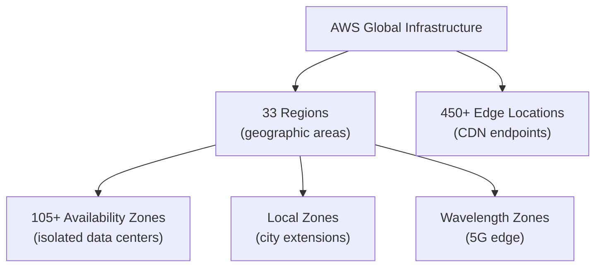
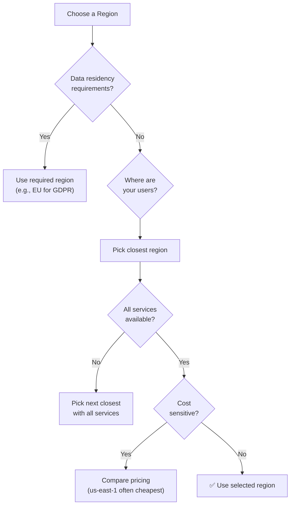
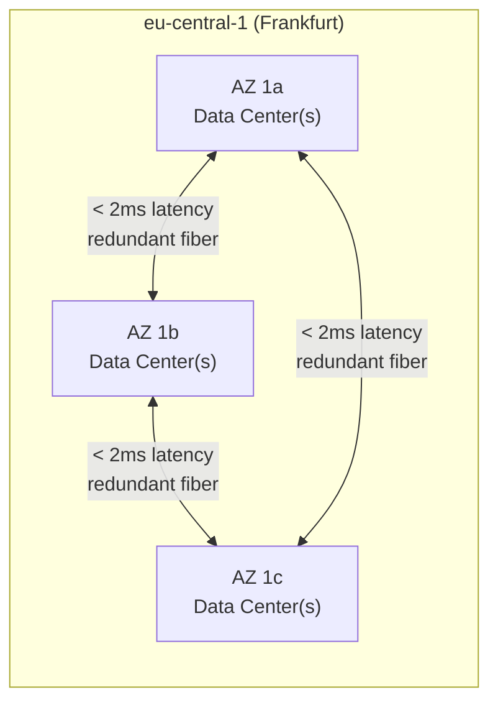
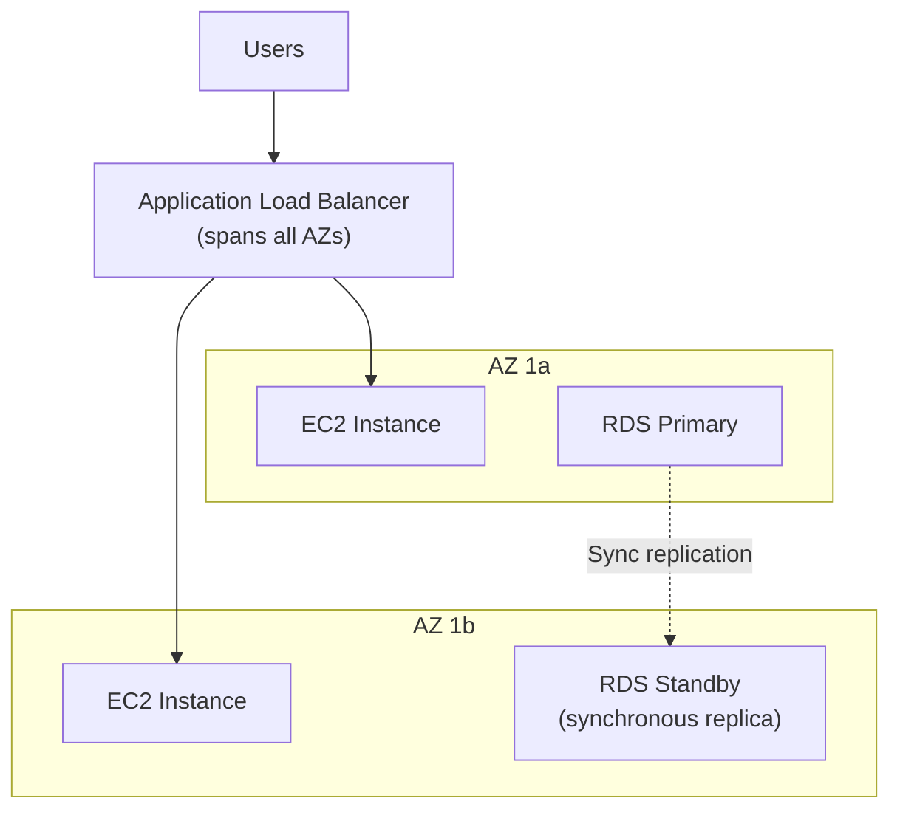
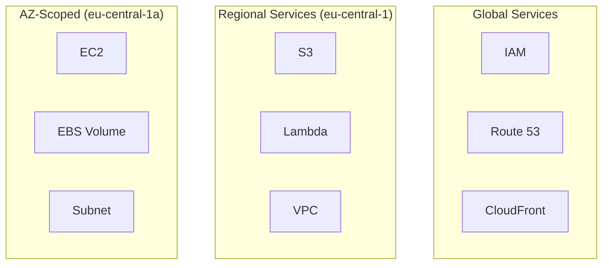
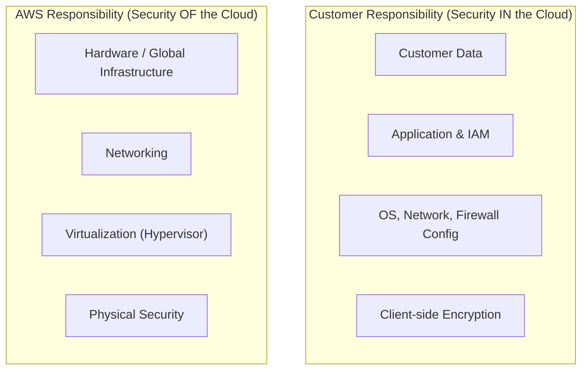

## The Physical Layer

AWS operates the world's largest cloud infrastructure — a global network of data centers organized into a hierarchy designed for high availability, low latency, and data sovereignty.

---

## Regions

A Region is a geographic area containing multiple isolated data centers. Each region is completely independent — a failure in one region doesn't affect others.

### Region Naming

| Region Code | Location | Common Use |
|-------------|----------|-----------|
| `us-east-1` | N. Virginia | Default for many services, largest |
| `eu-central-1` | Frankfurt | European workloads, GDPR |
| `eu-west-1` | Ireland | European workloads |
| `ap-southeast-1` | Singapore | Asia-Pacific |
| `us-west-2` | Oregon | US West Coast |

### Choosing a Region

**Key factors:**

1. **Compliance** — GDPR requires EU data residency; some industries require specific countries
2. **Latency** — closer to users = faster response times
3. **Service availability** — new services launch in us-east-1 first
4. **Cost** — same service can cost 10-20% more in some regions

---

## Availability Zones (AZs)

Each region has 3-6 AZs. Each AZ is one or more physically separate data centers with independent power, cooling, and networking.

### AZ Properties

- **Physically isolated** — separate buildings, power grids, flood zones
- **Connected** — high-bandwidth, low-latency private fiber between AZs
- **Independent failure** — a power outage in AZ-a doesn't affect AZ-b
- **Mapped differently per account** — your `eu-central-1a` might be a different physical AZ than another account's `eu-central-1a`

### Multi-AZ Architecture

Deploying across multiple AZs is the foundation of high availability on AWS:

If AZ-a fails: ALB routes all traffic to AZ-b, RDS fails over to standby.

---

## Edge Locations

Edge locations are AWS's CDN (CloudFront) and DNS (Route 53) endpoints distributed globally — 450+ locations in 90+ cities.

| Service | Uses Edge Locations For |
|---------|------------------------|
| **CloudFront** | Caching static/dynamic content close to users |
| **Route 53** | DNS resolution at the nearest location |
| **AWS WAF** | Filtering malicious traffic at the edge |
| **Lambda@Edge** | Running code at CDN edge |
| **Global Accelerator** | Routing to optimal endpoint via AWS backbone |

---

## AWS Backbone Network

AWS operates its own global fiber network connecting all regions and edge locations. Traffic between regions travels over AWS's private network, not the public internet.

Benefits:

- **Lower latency** — optimized routing
- **Higher throughput** — dedicated capacity
- **Better security** — traffic never touches public internet
- **Consistent performance** — no ISP congestion

---

## Service Scope

Services operate at different scopes:

| Scope | Examples | Implication |
|-------|----------|-------------|
| **Global** | IAM, Route 53, CloudFront, WAF | One instance worldwide |
| **Regional** | VPC, S3, Lambda, ECS, RDS | Must be created per region |
| **AZ-level** | EC2, EBS, Subnets | Tied to a specific AZ |

Understanding scope matters for:

- **Disaster recovery** — regional services need cross-region replication
- **High availability** — AZ-scoped resources need multi-AZ deployment
- **Cost** — cross-region data transfer costs money

---

## Shared Responsibility Model

| AWS Manages | You Manage |
|-------------|-----------|
| Physical data centers | Your data and encryption |
| Hardware and networking | IAM users, roles, policies |
| Hypervisor and host OS | Security groups and NACLs |
| Managed service patching | Application code and dependencies |
| Global infrastructure | OS patching (EC2) |

---

## Key Takeaways

1. **Regions are independent** — choose based on compliance, latency, services, and cost
2. **AZs provide high availability** — always deploy across 2+ AZs for production
3. **Edge locations reduce latency** — use CloudFront for static content
4. **Know service scope** — global vs regional vs AZ determines your HA strategy
5. **Shared responsibility** — AWS secures the infrastructure; you secure what you put on it
6. **AWS backbone** — inter-region traffic stays on AWS's private network
