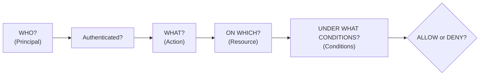
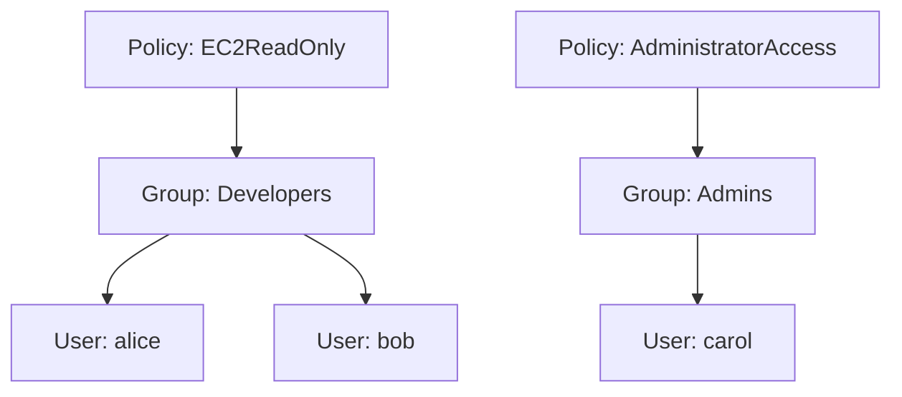
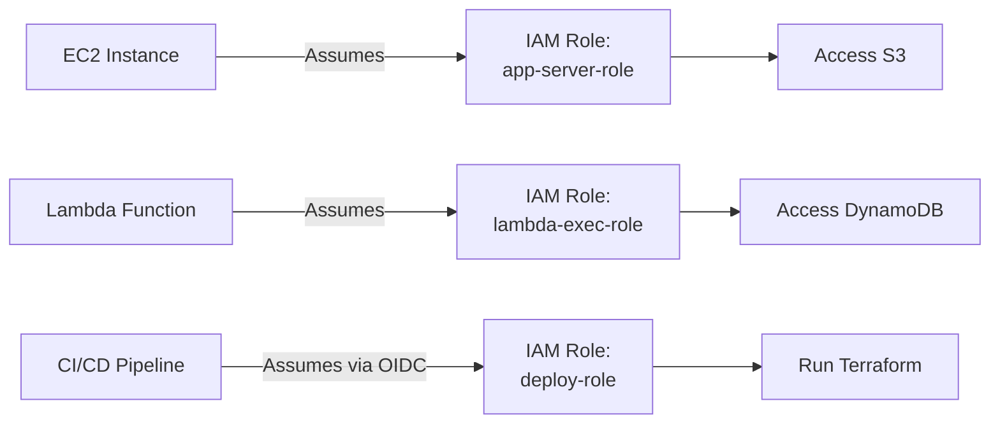
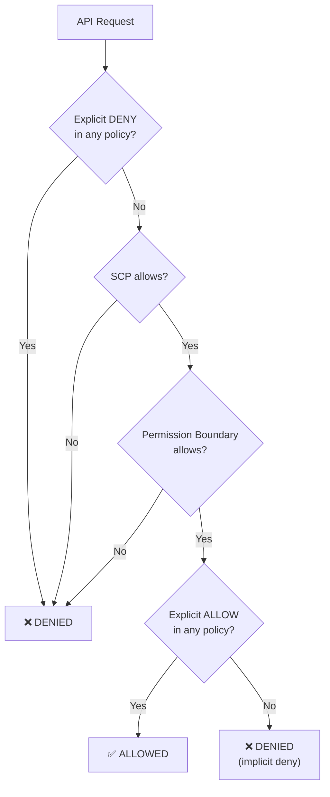
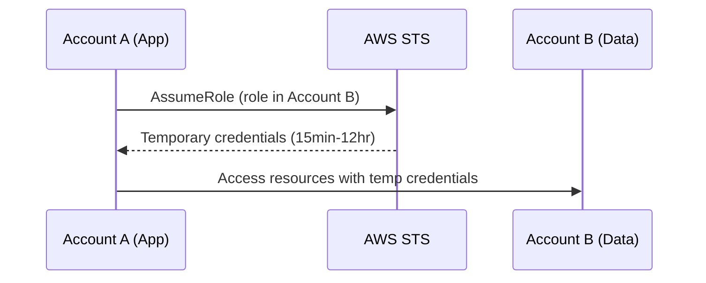

## What is IAM?

IAM controls who (authentication) can do what (authorization) on which AWS resources. It's the security foundation of every AWS account — misconfigure IAM and nothing else matters.



---

## IAM Entities

### Users

An IAM user represents a person or application that interacts with AWS:

```json
{
  "UserName": "alice",
  "Arn": "arn:aws:iam::123456789012:user/alice",
  "CreateDate": "2024-01-15T10:00:00Z"
}
```

**Best practice:** Minimize IAM users. Use IAM Identity Center (SSO) for humans and IAM roles for applications.

### Groups

Groups are collections of users — attach policies to groups, not individual users:



### Roles

Roles are identities that can be assumed temporarily. No permanent credentials — they use temporary security tokens.



Use roles for:

- EC2 instances (instance profile)
- Lambda functions (execution role)
- ECS tasks (task role)
- Cross-account access
- CI/CD pipelines (OIDC federation)

---

## Policies

Policies are JSON documents that define permissions:

```json
{
  "Version": "2012-10-17",
  "Statement": [
    {
      "Sid": "AllowS3Read",
      "Effect": "Allow",
      "Action": [
        "s3:GetObject",
        "s3:ListBucket"
      ],
      "Resource": [
        "arn:aws:s3:::my-bucket",
        "arn:aws:s3:::my-bucket/*"
      ]
    }
  ]
}
```

### Policy Elements

| Element | Purpose | Example |
|---------|---------|---------|
| `Effect` | Allow or Deny | `"Allow"` |
| `Action` | API operations | `"s3:GetObject"` |
| `Resource` | Which resources | `"arn:aws:s3:::bucket/*"` |
| `Condition` | When to apply | IP range, time, MFA |
| `Principal` | Who (resource policies only) | `"arn:aws:iam::123:role/x"` |

### Policy Types

| Type | Attached To | Use Case |
|------|-------------|----------|
| **AWS Managed** | Users, Groups, Roles | Common permissions (ReadOnlyAccess) |
| **Customer Managed** | Users, Groups, Roles | Custom permissions for your org |
| **Inline** | Single entity | One-off, tightly coupled permissions |
| **Resource-based** | Resources (S3, SQS, etc.) | Cross-account access |
| **Permission Boundary** | Users, Roles | Maximum permission ceiling |
| **SCP** | AWS Organizations OUs | Account-level guardrails |

### Policy Evaluation Logic



**Key rule:** Deny always wins. If no policy explicitly allows, the request is denied (implicit deny).

---

## Least Privilege

Grant only the permissions needed to perform a task — nothing more.

```json
{
  "Version": "2012-10-17",
  "Statement": [
    {
      "Effect": "Allow",
      "Action": "s3:GetObject",
      "Resource": "arn:aws:s3:::prod-data-bucket/reports/*",
      "Condition": {
        "IpAddress": {
          "aws:SourceIp": "10.0.0.0/16"
        }
      }
    }
  ]
}
```

This policy allows reading only from a specific path, only from the corporate network.

### Common Mistakes

```json
// ❌ Too broad — allows everything on everything
{
  "Effect": "Allow",
  "Action": "*",
  "Resource": "*"
}

// ❌ Too broad — allows all S3 actions on all buckets
{
  "Effect": "Allow",
  "Action": "s3:*",
  "Resource": "*"
}

// ✅ Specific actions on specific resources
{
  "Effect": "Allow",
  "Action": ["s3:GetObject", "s3:PutObject"],
  "Resource": "arn:aws:s3:::my-app-uploads/*"
}
```

---

## Conditions

Add context-based restrictions:

```json
{
  "Effect": "Allow",
  "Action": "ec2:RunInstances",
  "Resource": "*",
  "Condition": {
    "StringEquals": {
      "ec2:InstanceType": ["t3.micro", "t3.small"],
      "aws:RequestedRegion": "eu-central-1"
    },
    "Bool": {
      "aws:MultiFactorAuthPresent": "true"
    }
  }
}
```

| Condition Key | Use Case |
|---------------|----------|
| `aws:SourceIp` | Restrict by IP range |
| `aws:RequestedRegion` | Restrict to specific regions |
| `aws:MultiFactorAuthPresent` | Require MFA |
| `aws:PrincipalOrgID` | Restrict to your organization |
| `ec2:InstanceType` | Limit instance sizes |
| `s3:prefix` | Restrict to S3 key prefixes |

---

## Cross-Account Access



### Trust Policy (on the role in Account B)

```json
{
  "Version": "2012-10-17",
  "Statement": [
    {
      "Effect": "Allow",
      "Principal": {
        "AWS": "arn:aws:iam::111111111111:role/app-role"
      },
      "Action": "sts:AssumeRole",
      "Condition": {
        "StringEquals": {
          "sts:ExternalId": "unique-external-id"
        }
      }
    }
  ]
}
```

---

## Best Practices

| Practice | Why |
|----------|-----|
| Use roles, not long-lived keys | Temporary credentials auto-expire |
| Enable MFA for console users | Prevents credential theft |
| Use IAM Identity Center for humans | Centralized, federated access |
| Apply least privilege | Minimize blast radius |
| Use permission boundaries | Cap maximum permissions |
| Audit with CloudTrail | Track who did what |
| Rotate credentials regularly | Limit exposure window |
| Use conditions | Add context-based restrictions |
| Never use root account | Create IAM users/roles instead |

---

## Key Takeaways

1. **IAM is global** — users, roles, and policies apply across all regions
2. **Deny always wins** — explicit deny overrides any allow
3. **Use roles over users** — temporary credentials are safer than permanent keys
4. **Least privilege** — start with zero permissions, add only what's needed
5. **Conditions add context** — restrict by IP, region, MFA, time
6. **Resource policies enable cross-account** — S3, SQS, KMS support them
7. **Audit everything** — CloudTrail logs every API call
