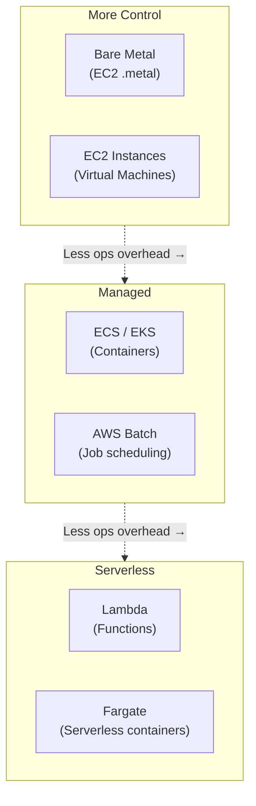
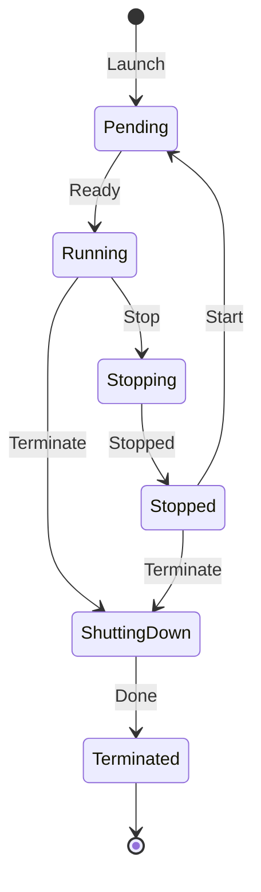
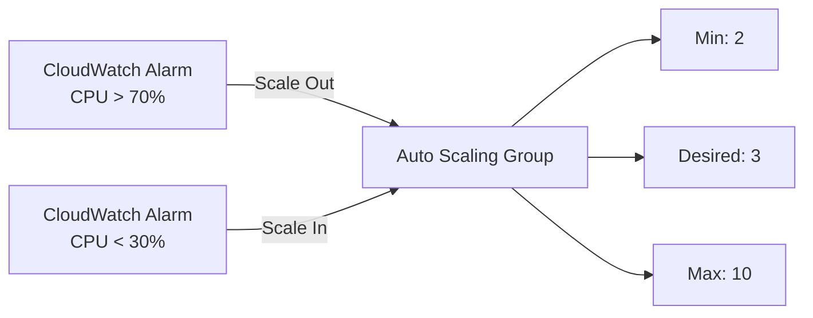
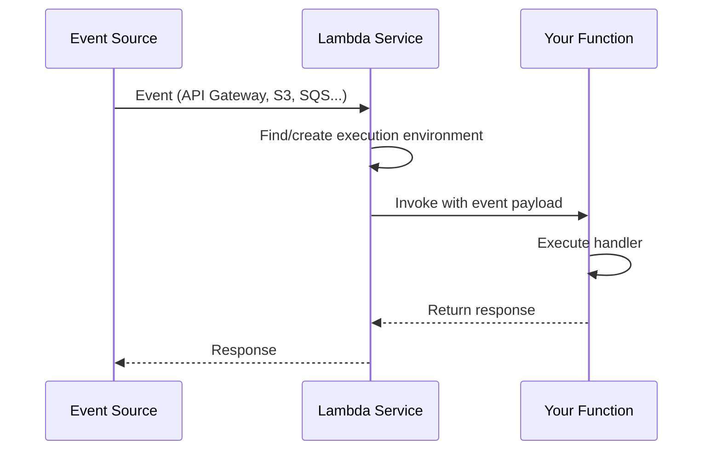
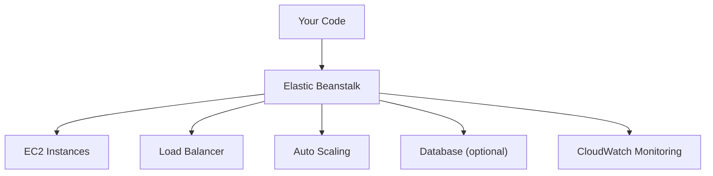
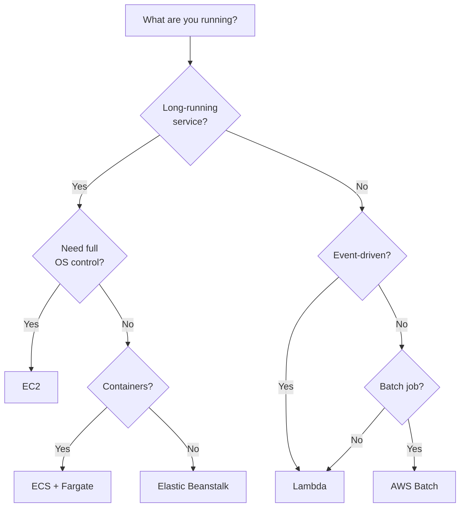

## Compute Options Overview

AWS offers compute at every abstraction level — from bare metal to fully managed serverless:



---

## EC2 (Elastic Compute Cloud)

Virtual machines in the cloud. You choose the OS, instance type, storage, and networking.

### Instance Types

Instance types follow the pattern: `{family}{generation}.{size}`

| Family | Optimized For | Example | Use Case |
|--------|--------------|---------|----------|
| **t** | Burstable general | t3.micro | Dev, low-traffic web |
| **m** | General purpose | m6i.xlarge | Web servers, app servers |
| **c** | Compute | c6i.2xlarge | Batch processing, ML inference |
| **r** | Memory | r6i.4xlarge | In-memory caches, databases |
| **i** | Storage I/O | i3.large | Databases, data warehouses |
| **g/p** | GPU | g5.xlarge | ML training, video encoding |

### Instance Lifecycle



### Purchasing Options

| Option | Discount | Commitment | Best For |
|--------|----------|-----------|----------|
| **On-Demand** | 0% | None | Unpredictable workloads |
| **Reserved (1yr)** | ~40% | 1 year | Steady-state workloads |
| **Reserved (3yr)** | ~60% | 3 years | Long-term stable workloads |
| **Savings Plans** | ~40-60% | $/hr commitment | Flexible across instance types |
| **Spot** | ~70-90% | None (can be interrupted) | Fault-tolerant batch jobs |

### User Data (Bootstrap Script)

```bash
#!/bin/bash
# Runs on first boot
yum update -y
yum install -y docker
systemctl start docker
systemctl enable docker
docker pull myapp:latest
docker run -d -p 80:8080 myapp:latest
```

---

## Auto Scaling

Automatically adjusts the number of EC2 instances based on demand:



### Scaling Policies

| Policy | How It Works | Use Case |
|--------|-------------|----------|
| **Target Tracking** | Maintain metric at target value | "Keep CPU at 50%" |
| **Step Scaling** | Add/remove N instances per threshold | "Add 2 if CPU > 80%" |
| **Scheduled** | Scale at specific times | "Scale up at 9am weekdays" |
| **Predictive** | ML-based forecasting | Recurring traffic patterns |

---

## Lambda

Run code without provisioning servers. Pay only for execution time.

### How Lambda Works



### Lambda Characteristics

| Property | Value |
|----------|-------|
| Max execution time | 15 minutes |
| Memory | 128 MB – 10,240 MB |
| Temp storage | 512 MB – 10 GB (/tmp) |
| Deployment package | 50 MB (zip), 250 MB (unzipped) |
| Concurrent executions | 1,000 default (adjustable) |
| Cold start | 100ms – 10s (depends on runtime, VPC) |

### When to Use Lambda vs Containers

| Lambda | Containers (ECS/Fargate) |
|--------|--------------------------|
| Event-driven, short tasks | Long-running services |
| < 15 min execution | No time limit |
| Unpredictable traffic | Steady traffic |
| Simple deployment | Complex multi-container apps |
| Auto-scales to zero | Minimum 1 task running |

---

## Elastic Beanstalk

Platform-as-a-Service — deploy applications without managing infrastructure:



Supports: Java, .NET, PHP, Node.js, Python, Ruby, Go, Docker.

Good for: teams that want to deploy quickly without learning all AWS services individually. You still have full access to underlying resources.

---

## Choosing Compute



---

## Key Takeaways

1. **EC2 for full control** — you manage the OS, patching, scaling
2. **Lambda for event-driven** — no servers, pay per invocation, auto-scales
3. **Fargate for containers without servers** — no EC2 management, per-task billing
4. **Spot instances for cost savings** — up to 90% off, but can be interrupted
5. **Auto Scaling for elasticity** — match capacity to demand automatically
6. **Right-size instances** — monitor CPU/memory and adjust; oversizing wastes money
7. **Use Savings Plans** — commit to $/hr for predictable workloads, save 40-60%
