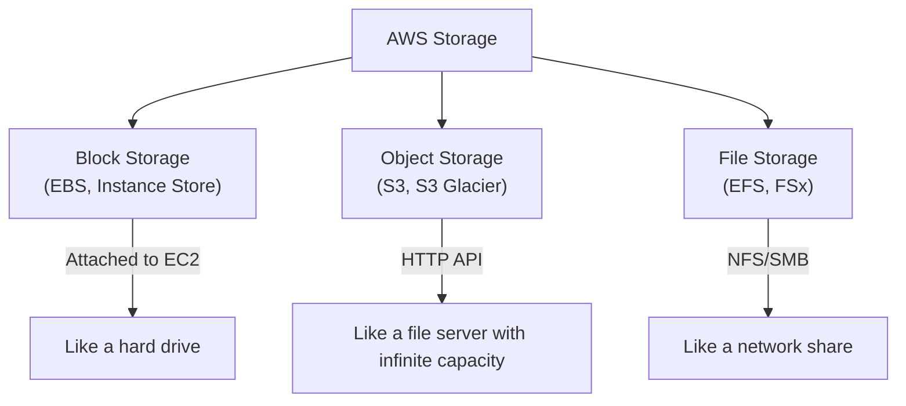
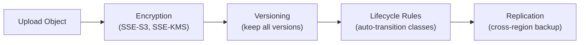
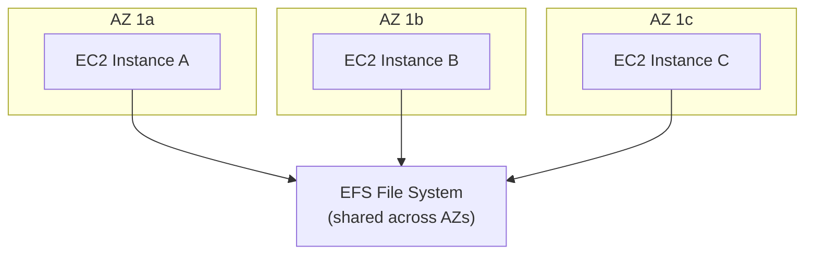

## Storage Types

AWS offers storage at different layers — block, file, and object — each optimized for different access patterns:



---

## S3 (Simple Storage Service)

Object storage with virtually unlimited capacity. The most-used AWS service.

### Core Concepts

| Concept | Description |
|---------|-------------|
| **Bucket** | Container for objects (globally unique name) |
| **Object** | File + metadata (up to 5 TB) |
| **Key** | Full path to the object within a bucket |
| **Version ID** | Unique ID when versioning is enabled |

### Storage Classes

| Class | Access Pattern | Durability | Cost |
|-------|---------------|-----------|------|
| **Standard** | Frequent access | 99.999999999% (11 9s) | $$$ |
| **Intelligent-Tiering** | Unknown/changing | 11 9s | Auto-optimized |
| **Standard-IA** | Infrequent (monthly) | 11 9s | $$ (retrieval fee) |
| **One Zone-IA** | Infrequent, non-critical | 11 9s (single AZ) | $ |
| **Glacier Instant** | Archive, instant access | 11 9s | $ |
| **Glacier Flexible** | Archive, minutes-hours | 11 9s | ¢ |
| **Glacier Deep Archive** | Long-term archive (12hr) | 11 9s | ¢¢ |

### S3 Features



**Lifecycle rules** automate cost optimization:

```text
Day 0:   Standard (frequent access)
Day 30:  → Standard-IA (infrequent)
Day 90:  → Glacier Flexible (archive)
Day 365: → Deep Archive (compliance)
Day 730: → Delete
```

### Access Control

| Mechanism | Scope | Use Case |
|-----------|-------|----------|
| **Bucket Policy** | Bucket-level | Cross-account access, public access |
| **IAM Policy** | User/Role-level | Internal access control |
| **ACLs** | Object-level (legacy) | Avoid — use policies instead |
| **Block Public Access** | Account/Bucket | Safety net against accidental exposure |

### S3 Use Cases

- Static website hosting
- Data lake storage
- Backup and disaster recovery
- Log storage and analytics
- Application assets (images, videos)
- Terraform state backend

---

## EBS (Elastic Block Store)

Network-attached block storage for EC2 instances — like a virtual hard drive.

### Volume Types

| Type | IOPS | Throughput | Use Case |
|------|------|-----------|----------|
| **gp3** | 3,000-16,000 | 125-1,000 MB/s | General purpose (default) |
| **gp2** | Burst to 3,000 | 128-250 MB/s | Legacy general purpose |
| **io2** | Up to 64,000 | 1,000 MB/s | High-performance databases |
| **st1** | 500 | 500 MB/s | Big data, log processing |
| **sc1** | 250 | 250 MB/s | Cold storage, infrequent |

### EBS Characteristics

- **AZ-scoped** — volume must be in same AZ as EC2 instance
- **Snapshots** — point-in-time backups stored in S3 (cross-AZ, cross-region)
- **Encryption** — AES-256, transparent to the instance
- **Resizable** — increase size without downtime
- **Detachable** — move between instances in same AZ

---

## EFS (Elastic File System)

Managed NFS file system that multiple EC2 instances can mount simultaneously:



| Feature | EBS | EFS |
|---------|-----|-----|
| Protocol | Block (attached) | NFS (network mount) |
| Multi-attach | No (usually) | Yes (many instances) |
| Scope | Single AZ | Multi-AZ |
| Scaling | Manual resize | Automatic (petabyte scale) |
| Cost | Lower (per GB provisioned) | Higher (per GB used) |
| Use case | Boot volumes, databases | Shared content, CMS, ML data |

---

## Choosing Storage

| Need | Service | Why |
|------|---------|-----|
| Boot volume for EC2 | EBS gp3 | Block storage, fast, persistent |
| High-IOPS database | EBS io2 | Consistent low-latency |
| Shared files across instances | EFS | NFS mount, multi-AZ |
| Unlimited object storage | S3 | Scalable, durable, cheap |
| Static website | S3 + CloudFront | No servers needed |
| Backup/archive | S3 Glacier | Lowest cost for cold data |
| Temporary high-speed | Instance Store | Ephemeral, highest IOPS |

---

## Key Takeaways

1. **S3 for everything that isn't a disk** — objects, backups, logs, static sites, data lakes
2. **EBS gp3 is the default** — better price/performance than gp2
3. **EFS for shared access** — when multiple instances need the same files
4. **Use lifecycle rules** — automatically move data to cheaper tiers
5. **Enable versioning** — protect against accidental deletion
6. **Encrypt everything** — SSE-KMS for S3, encryption for EBS
7. **Block public access by default** — enable only when intentionally hosting public content
