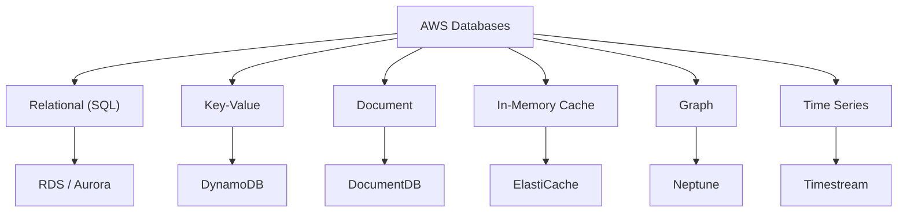
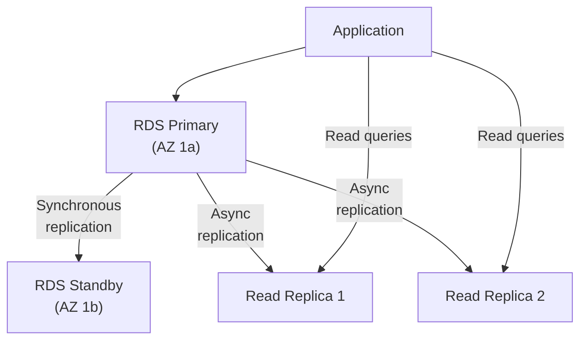
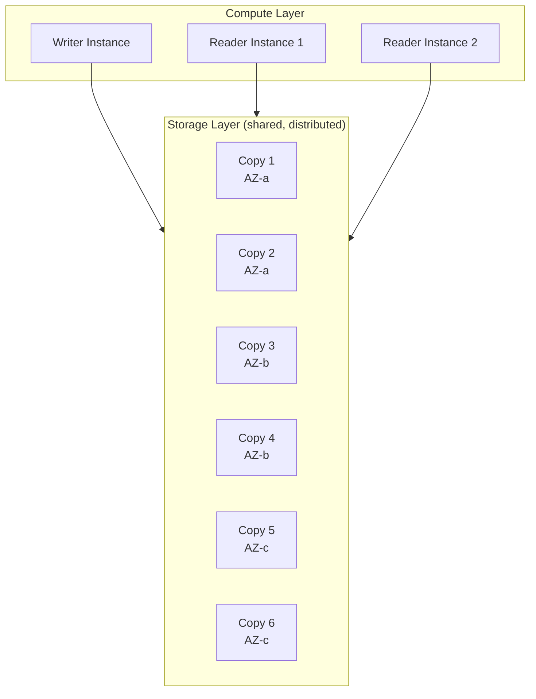
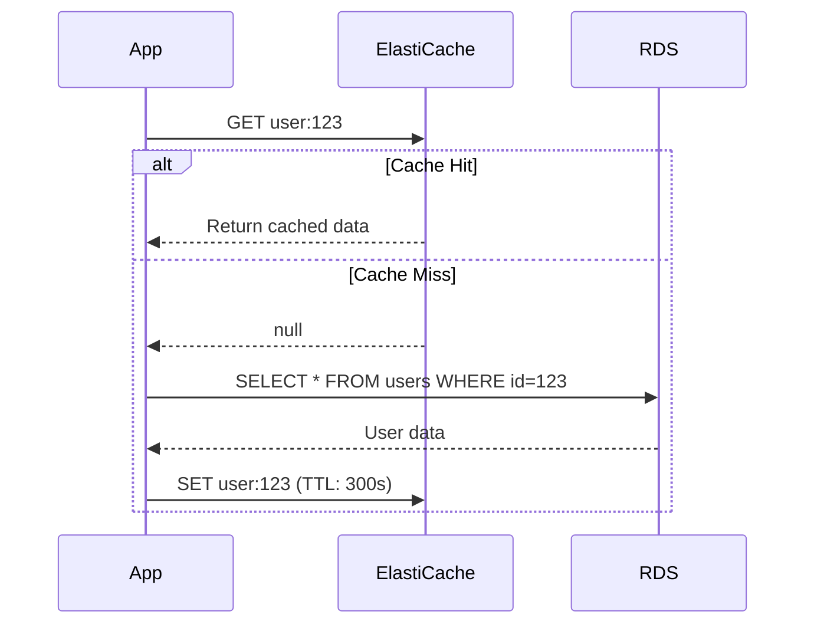

## Database Options

AWS offers purpose-built databases for different data models and access patterns:



---

## RDS (Relational Database Service)

Managed relational databases — AWS handles patching, backups, failover, and replication.

### Supported Engines

| Engine | Use Case |
|--------|----------|
| **PostgreSQL** | General purpose, complex queries, JSON support |
| **MySQL** | Web applications, WordPress, simple schemas |
| **MariaDB** | MySQL-compatible, community-driven |
| **Oracle** | Enterprise, legacy applications |
| **SQL Server** | .NET applications, Microsoft ecosystem |
| **Aurora** | AWS-native, MySQL/PostgreSQL compatible, 5x performance |

### RDS Architecture



### Multi-AZ vs Read Replicas

| Feature | Multi-AZ | Read Replica |
|---------|----------|--------------|
| Purpose | High availability | Read scaling |
| Replication | Synchronous | Asynchronous |
| Failover | Automatic (< 2 min) | Manual promotion |
| Accessible | No (standby only) | Yes (read traffic) |
| Cross-region | No | Yes |

### RDS Backups

- **Automated backups** — daily snapshots + transaction logs (point-in-time recovery)
- **Retention** — 1-35 days
- **Manual snapshots** — persist until you delete them
- **Cross-region** — copy snapshots to another region for DR

---

## Aurora

AWS's cloud-native relational database — MySQL and PostgreSQL compatible but with significant architectural improvements:



| Feature | Standard RDS | Aurora |
|---------|-------------|--------|
| Storage | Single EBS volume | Distributed across 3 AZs (6 copies) |
| Failover | 1-2 minutes | < 30 seconds |
| Read replicas | Up to 5 | Up to 15 |
| Storage scaling | Manual | Auto (up to 128 TB) |
| Performance | Baseline | 5x MySQL, 3x PostgreSQL |

### Aurora Serverless

Automatically scales compute capacity based on demand:

```text
No traffic → 0 ACUs (paused, no cost)
Light traffic → 2 ACUs
Heavy traffic → 64 ACUs
```

Ideal for: infrequent workloads, dev/test, variable traffic.

---

## DynamoDB

Fully managed NoSQL key-value and document database. Single-digit millisecond latency at any scale.

### Data Model

```text
Table: Orders
├── Partition Key: customer_id (String)
├── Sort Key: order_date (String)
└── Attributes: items, total, status (flexible schema)
```

| Concept | Description |
|---------|-------------|
| **Table** | Collection of items |
| **Item** | A single record (like a row) |
| **Attribute** | A field on an item (like a column) |
| **Partition Key** | Primary key for distribution |
| **Sort Key** | Optional, enables range queries |
| **GSI** | Global Secondary Index (query on non-key attributes) |

### Capacity Modes

| Mode | Billing | Best For |
|------|---------|----------|
| **On-Demand** | Per request | Unpredictable traffic |
| **Provisioned** | Per RCU/WCU | Predictable, steady traffic |

### DynamoDB Strengths and Limitations

| Strength | Limitation |
|----------|-----------|
| Single-digit ms latency | No complex joins |
| Infinite scale | Query patterns must be designed upfront |
| Fully managed | Max item size: 400 KB |
| Global tables (multi-region) | Eventual consistency by default |
| TTL (auto-delete expired items) | Limited aggregation |

---

## ElastiCache

Managed in-memory data stores for microsecond latency:

| Engine | Use Case |
|--------|----------|
| **Redis** | Caching, sessions, leaderboards, pub/sub, queues |
| **Memcached** | Simple caching, multi-threaded |

### Caching Pattern



---

## Choosing a Database

| Need | Service | Why |
|------|---------|-----|
| Complex queries, joins, transactions | RDS/Aurora | SQL, ACID compliance |
| High-performance relational | Aurora | 5x MySQL performance |
| Key-value at scale | DynamoDB | Infinite scale, ms latency |
| Caching layer | ElastiCache Redis | Microsecond reads |
| Full-text search | OpenSearch | Elasticsearch-compatible |
| Graph relationships | Neptune | Traversal queries |
| Time-series data | Timestream | IoT, metrics, events |

---

## Key Takeaways

1. **Aurora over standard RDS** — better performance, availability, and auto-scaling storage
2. **DynamoDB for scale** — infinite throughput, but design access patterns upfront
3. **Multi-AZ for production** — automatic failover protects against AZ failure
4. **Read replicas for read-heavy** — offload reads, reduce primary load
5. **ElastiCache in front of databases** — reduce latency and database load
6. **Automated backups always** — enable point-in-time recovery
7. **Choose the right tool** — don't force SQL for key-value or NoSQL for complex joins
