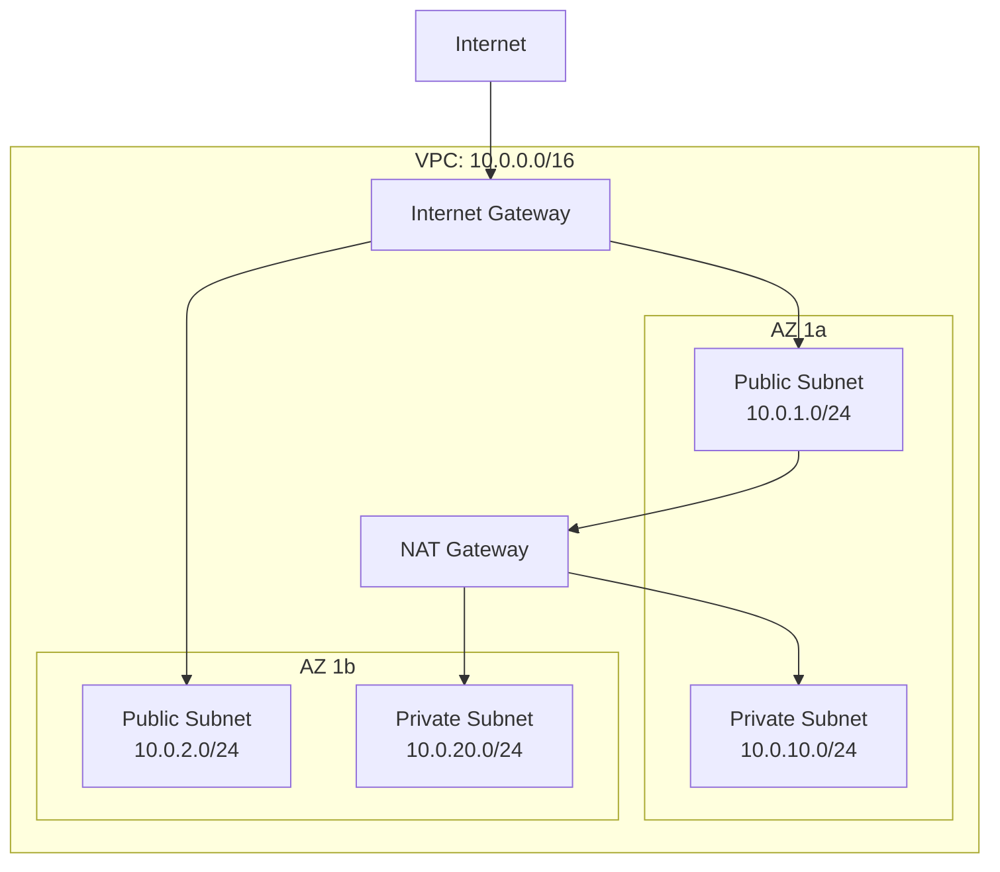
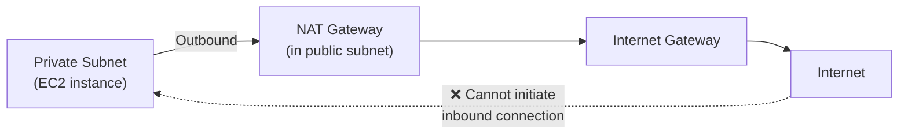
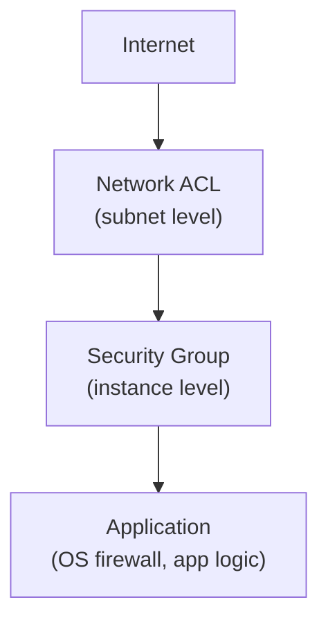
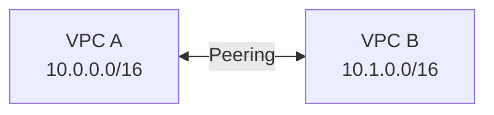
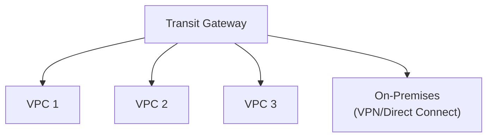
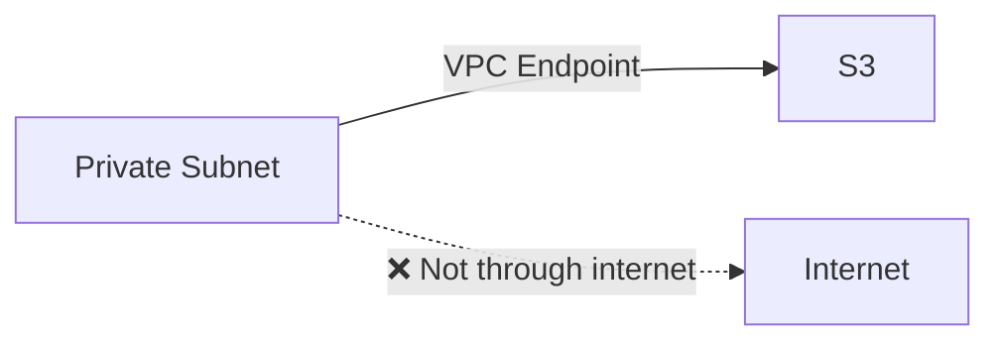

## What is a VPC?

A Virtual Private Cloud (VPC) is your isolated network within AWS. It's a logically isolated section of the AWS cloud where you launch resources in a virtual network that you define.



---

## VPC Components

### CIDR Blocks

CIDR (Classless Inter-Domain Routing) defines the IP address range for your VPC:

| CIDR | IPs Available | Common Use |
|------|---------------|-----------|
| `/16` | 65,536 | Large VPC (recommended) |
| `/20` | 4,096 | Medium VPC |
| `/24` | 256 | Small subnet |
| `/28` | 16 | Minimum subnet size |

**Planning tip:** Use `10.0.0.0/16` for production VPCs. AWS reserves 5 IPs per subnet.

### Subnets

Subnets divide your VPC into segments, each in a single AZ:

| Type | Internet Access | Use Case |
|------|----------------|----------|
| **Public** | Direct (via IGW) | Load balancers, bastion hosts |
| **Private** | Outbound only (via NAT) | Application servers, databases |
| **Isolated** | None | Databases with no internet need |

### Route Tables

Route tables determine where network traffic is directed:

```text
# Public subnet route table
Destination     Target
10.0.0.0/16     local          (VPC internal)
0.0.0.0/0       igw-abc123     (Internet Gateway)

# Private subnet route table
Destination     Target
10.0.0.0/16     local          (VPC internal)
0.0.0.0/0       nat-xyz789     (NAT Gateway)
```

---

## Gateways

### Internet Gateway (IGW)

Allows resources in public subnets to communicate with the internet:

- One per VPC
- Horizontally scaled, redundant, highly available
- No bandwidth constraints

### NAT Gateway

Allows private subnet resources to access the internet (for updates, API calls) without being accessible from the internet:



- Deployed per AZ (for HA, one per AZ)
- Managed by AWS (no patching)
- Costs: hourly + per GB processed

---

## Security

### Security Groups (Stateful Firewall)

Attached to ENIs (network interfaces). **Stateful** — if inbound is allowed, outbound response is automatic.

```text
# Web server security group
Inbound:
  Port 80   from 0.0.0.0/0        (HTTP from anywhere)
  Port 443  from 0.0.0.0/0        (HTTPS from anywhere)

Outbound:
  All traffic to 0.0.0.0/0         (allow all outbound)
```

```text
# Database security group
Inbound:
  Port 5432 from sg-webserver      (PostgreSQL from web SG only)

Outbound:
  All traffic to 0.0.0.0/0
```

### Network ACLs (Stateless Firewall)

Attached to subnets. **Stateless** — must explicitly allow both inbound and outbound.

| Feature | Security Group | NACL |
|---------|---------------|------|
| Level | Instance (ENI) | Subnet |
| Stateful | Yes | No |
| Rules | Allow only | Allow and Deny |
| Evaluation | All rules evaluated | Rules evaluated in order |
| Default | Deny all inbound | Allow all |

### Defense in Depth



---

## VPC Connectivity

### VPC Peering

Direct connection between two VPCs (same or different accounts/regions):



- No transitive peering (A↔B and B↔C doesn't mean A↔C)
- CIDR blocks must not overlap

### Transit Gateway

Hub-and-spoke connectivity for many VPCs:



### VPC Endpoints

Access AWS services without going through the internet:

| Type | Services | How |
|------|----------|-----|
| **Gateway Endpoint** | S3, DynamoDB | Route table entry (free) |
| **Interface Endpoint** | Most other services | ENI in your subnet (PrivateLink) |



---

## VPC Design Pattern

A production-ready VPC:

```text
VPC: 10.0.0.0/16

Public Subnets (ALB, NAT, Bastion):
  10.0.1.0/24  (AZ-a)
  10.0.2.0/24  (AZ-b)
  10.0.3.0/24  (AZ-c)

Private Subnets (Application):
  10.0.10.0/24 (AZ-a)
  10.0.20.0/24 (AZ-b)
  10.0.30.0/24 (AZ-c)

Database Subnets (Isolated):
  10.0.100.0/24 (AZ-a)
  10.0.110.0/24 (AZ-b)
  10.0.120.0/24 (AZ-c)
```

---

## Key Takeaways

1. **VPC is your network boundary** — all resources launch inside a VPC
2. **Public subnets for internet-facing** — ALBs, NAT Gateways
3. **Private subnets for applications** — no direct internet access
4. **Security groups are your primary firewall** — stateful, allow-only rules
5. **NAT Gateway for outbound** — private resources can reach internet, but not vice versa
6. **VPC Endpoints save money** — avoid NAT costs for AWS service access
7. **Plan CIDR carefully** — can't change later, must not overlap with peered VPCs
