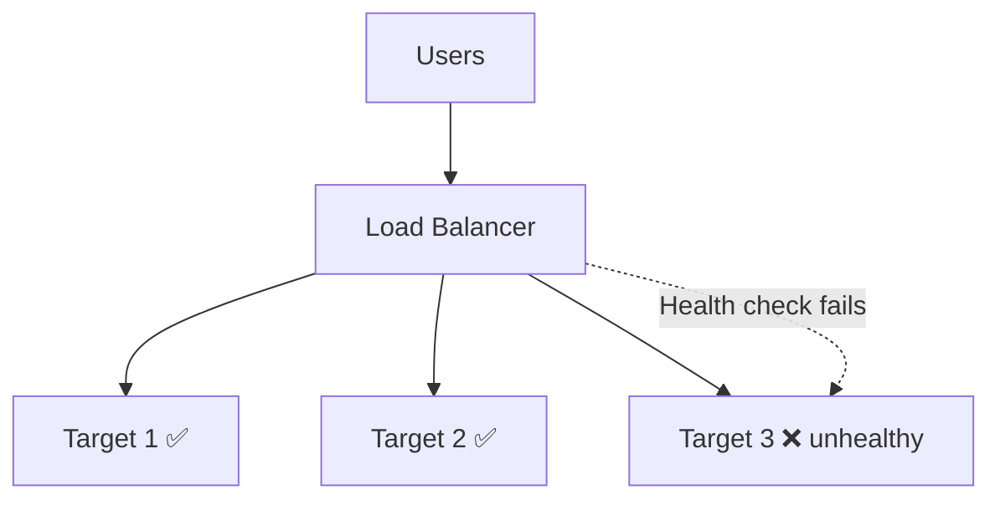
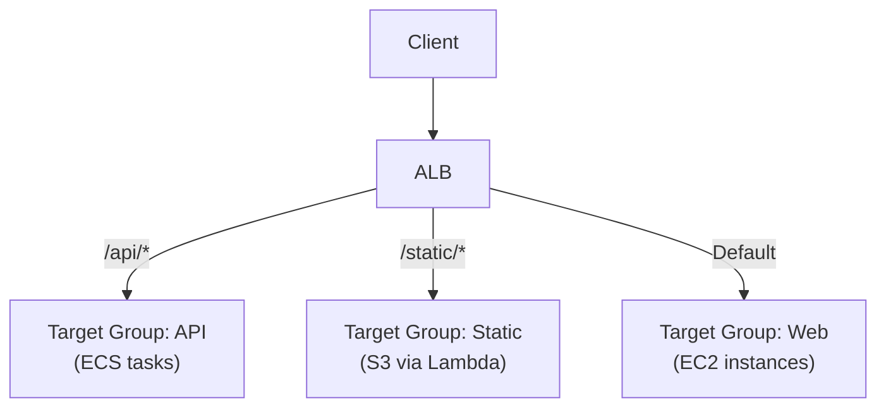
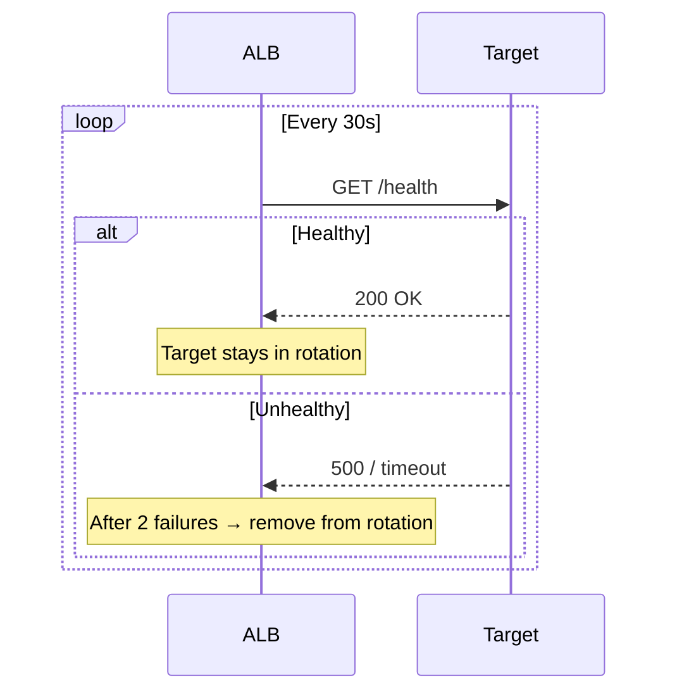
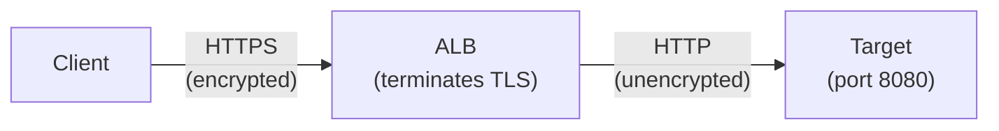
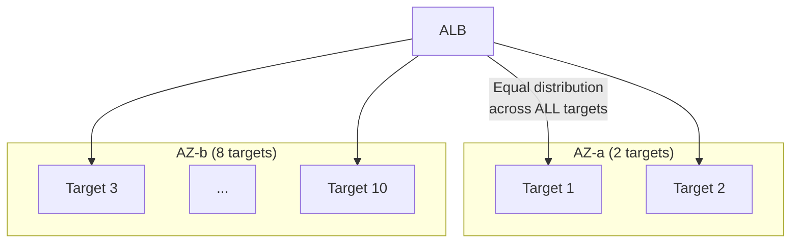

## Why Load Balancers?

Load balancers distribute incoming traffic across multiple targets, providing:

- **High availability** — if one target fails, traffic routes to healthy ones
- **Scalability** — add/remove targets without changing client configuration
- **SSL termination** — handle encryption at the LB, not each server
- **Health checks** — automatically detect and remove unhealthy targets



---

## ELB Types

| Type | Layer | Protocol | Use Case |
|------|-------|----------|----------|
| **ALB** (Application) | 7 (HTTP) | HTTP, HTTPS, gRPC | Web apps, microservices, APIs |
| **NLB** (Network) | 4 (TCP) | TCP, UDP, TLS | Ultra-low latency, gaming, IoT |
| **GLB** (Gateway) | 3 (IP) | IP | Third-party appliances (firewalls) |

### Application Load Balancer (ALB)

The most common choice for web applications:



**ALB features:**

- Path-based routing (`/api/*` → service A, `/web/*` → service B)
- Host-based routing (`api.example.com` → service A)
- HTTP/2 and WebSocket support
- Sticky sessions (cookie-based)
- Authentication integration (Cognito, OIDC)
- Request/response header manipulation

### Network Load Balancer (NLB)

For extreme performance and non-HTTP protocols:

| Feature | ALB | NLB |
|---------|-----|-----|
| Layer | 7 (HTTP) | 4 (TCP/UDP) |
| Latency | ~400ms added | ~100μs added |
| Throughput | Millions req/s | Millions packets/s |
| Static IP | No (use DNS) | Yes (Elastic IP per AZ) |
| Protocols | HTTP, HTTPS, gRPC | TCP, UDP, TLS |
| Routing | Path, host, headers | Port-based only |

---

## Target Groups

Target groups define where the load balancer sends traffic:

| Target Type | Example |
|-------------|---------|
| **Instance** | EC2 instance IDs |
| **IP** | Private IPs (ECS tasks, on-premises) |
| **Lambda** | Lambda function |
| **ALB** | Another ALB (chaining) |

### Health Checks

```text
Health Check Configuration:
  Protocol: HTTP
  Path: /health
  Port: 8080
  Healthy threshold: 3 consecutive successes
  Unhealthy threshold: 2 consecutive failures
  Interval: 30 seconds
  Timeout: 5 seconds
```



---

## Listener Rules

ALB listeners evaluate rules in priority order:

```text
Listener: HTTPS:443

Rule 1 (priority 10):
  IF path = /api/*
  THEN forward to target-group-api

Rule 2 (priority 20):
  IF host = admin.example.com
  THEN forward to target-group-admin

Rule 3 (priority 30):
  IF header X-Custom = "internal"
  THEN forward to target-group-internal

Default Rule:
  Forward to target-group-web
```

### Routing Conditions

| Condition | Example |
|-----------|---------|
| Path pattern | `/api/*`, `/v2/users` |
| Host header | `api.example.com` |
| HTTP method | `POST`, `GET` |
| Source IP | `10.0.0.0/16` |
| Query string | `?version=2` |
| HTTP header | `X-Forwarded-For: 10.*` |

---

## SSL/TLS Termination



- ALB handles certificate management (ACM integration)
- Offloads CPU-intensive encryption from application servers
- Supports SNI (multiple certificates on one listener)
- Can re-encrypt to targets if needed (end-to-end TLS)

---

## Cross-Zone Load Balancing



With cross-zone enabled (default for ALB): traffic is distributed evenly across all targets regardless of AZ. Without it: each AZ gets equal share (causing imbalance if target counts differ).

---

## Connection Draining (Deregistration Delay)

When a target is removed (scaling in, deployment), the LB stops sending new requests but allows in-flight requests to complete:

```text
Deregistration delay: 300 seconds (default)

1. Target marked "draining"
2. No new requests sent to target
3. Existing connections allowed to complete (up to 300s)
4. After timeout: connections forcibly closed
5. Target removed
```

Set lower (30-60s) for fast deployments. Set higher for long-running requests.

---

## Key Takeaways

1. **ALB for web traffic** — path/host routing, HTTP/2, WebSocket, authentication
2. **NLB for extreme performance** — static IPs, TCP/UDP, microsecond latency
3. **Health checks are critical** — unhealthy targets are automatically removed
4. **SSL termination at the LB** — simplifies certificate management, offloads encryption
5. **Cross-zone balancing** — ensures even distribution regardless of AZ target count
6. **Connection draining** — graceful shutdown prevents dropped requests during deployments
7. **Target groups decouple routing from targets** — swap implementations without changing rules
