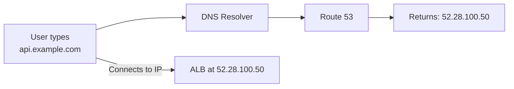
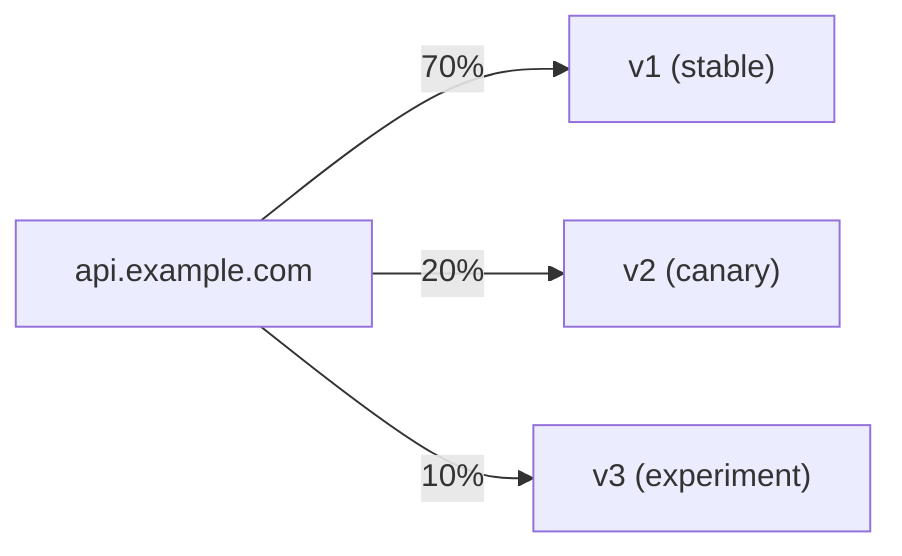
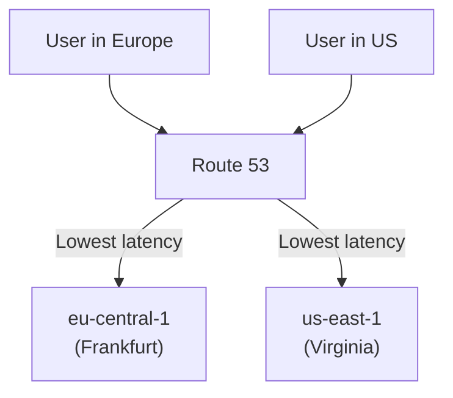
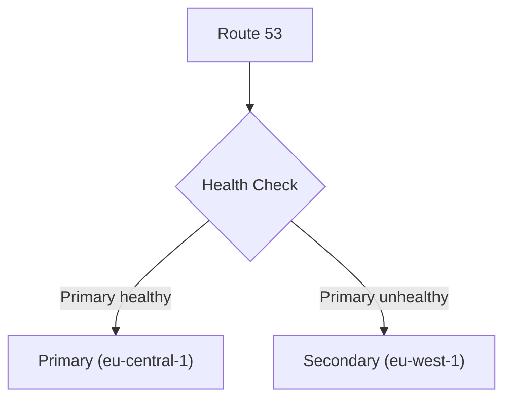
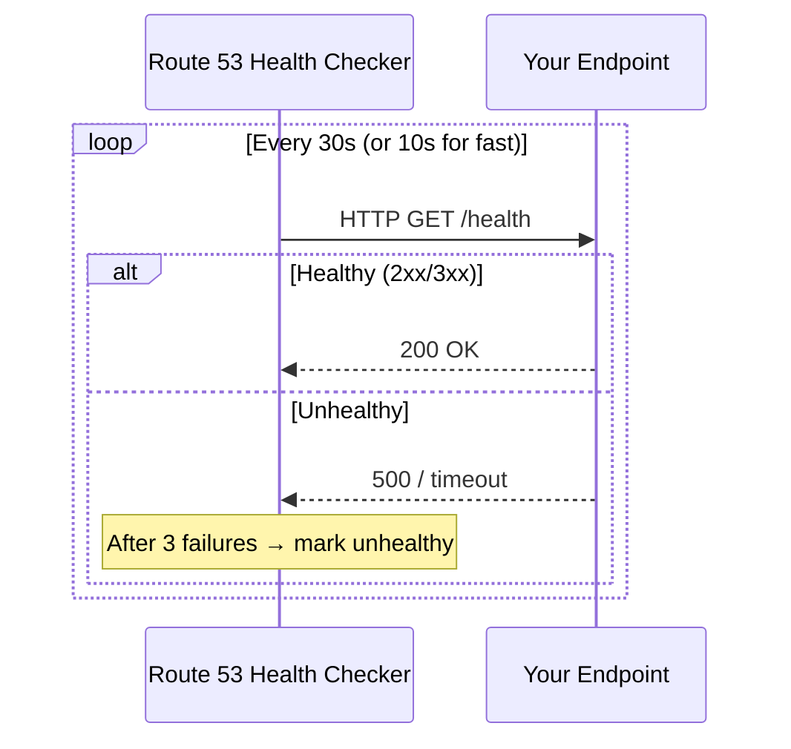
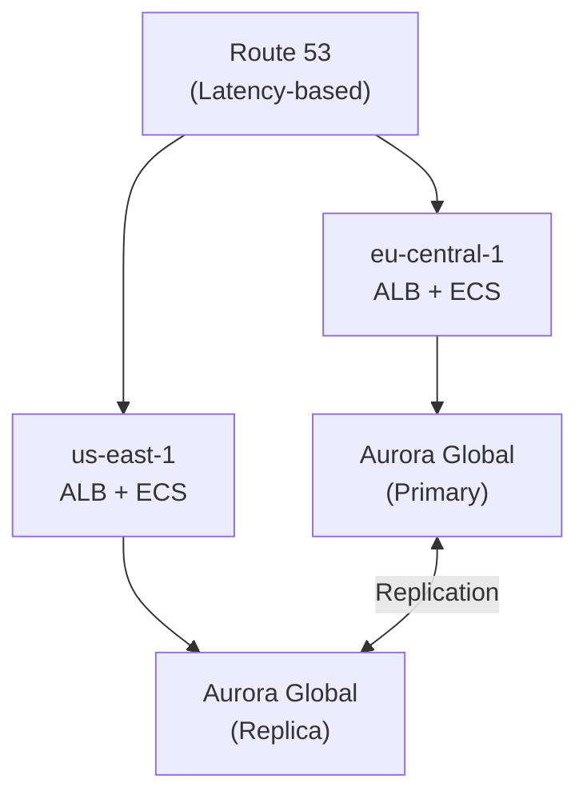

## What is Route 53?

Route 53 is AWS's managed DNS service. It translates domain names (like `api.example.com`) into IP addresses, and provides health checking and traffic routing.



The name "Route 53" comes from TCP/UDP port 53, the standard DNS port.

---

## Core Concepts

### Hosted Zones

A hosted zone is a container for DNS records for a domain:

| Type | Purpose | Example |
|------|---------|---------|
| **Public** | Internet-facing DNS | `example.com` |
| **Private** | VPC-internal DNS | `internal.example.com` (only within VPC) |

### Record Types

| Type | Purpose | Example |
|------|---------|---------|
| **A** | Domain → IPv4 | `api.example.com → 52.28.100.50` |
| **AAAA** | Domain → IPv6 | `api.example.com → 2001:db8::1` |
| **CNAME** | Domain → another domain | `www.example.com → example.com` |
| **Alias** | Domain → AWS resource | `example.com → d1234.cloudfront.net` |
| **MX** | Mail server | `example.com → mail.example.com` |
| **TXT** | Text (verification, SPF) | `example.com → "v=spf1 ..."` |
| **NS** | Name servers | `example.com → ns-123.awsdns-45.com` |
| **SOA** | Start of Authority | Zone metadata |

### Alias Records (AWS-specific)

Alias records are Route 53's extension — they map a domain directly to an AWS resource without a CNAME:

| Feature | CNAME | Alias |
|---------|-------|-------|
| Zone apex (naked domain) | ❌ Not allowed | ✅ Works |
| Cost | Charged per query | Free for AWS resources |
| Target | Any domain | AWS resources only |
| Health checks | Separate | Integrated |

```text
# CNAME (can't use at zone apex)
www.example.com → my-alb-123.eu-central-1.elb.amazonaws.com

# Alias (works at zone apex)
example.com → my-alb-123.eu-central-1.elb.amazonaws.com (Alias to ALB)
```

---

## Routing Policies

Route 53 supports multiple routing strategies:

### Simple Routing

One record, one or more values. If multiple values, client picks randomly.

```text
api.example.com → [52.28.100.50, 52.28.100.51]
```

### Weighted Routing

Distribute traffic by percentage:



Use case: canary deployments, A/B testing, gradual migration.

### Latency-Based Routing

Route to the region with lowest latency for the user:



### Failover Routing

Active-passive: route to primary unless health check fails:



### Geolocation Routing

Route based on user's geographic location (country, continent):

```text
Users in EU → eu-central-1 (compliance: data stays in EU)
Users in US → us-east-1
Default     → us-east-1
```

### Multi-Value Answer

Return multiple healthy IPs (up to 8). Client-side load balancing with health checking.

---

## Health Checks

Route 53 monitors endpoint health and removes unhealthy records from DNS responses:



### Health Check Types

| Type | Monitors |
|------|----------|
| **Endpoint** | HTTP/HTTPS/TCP to an IP or domain |
| **Calculated** | Combines multiple health checks (AND/OR) |
| **CloudWatch Alarm** | Based on a CloudWatch metric |

---

## Common Patterns

### Multi-Region Active-Active



### Domain with CloudFront

```text
example.com        → Alias → CloudFront distribution
www.example.com    → Alias → CloudFront distribution
api.example.com    → Alias → ALB (eu-central-1)
```

---

## Key Takeaways

1. **Use Alias records for AWS resources** — free, works at zone apex, integrates health checks
2. **Latency-based routing for global apps** — automatically routes users to nearest region
3. **Failover routing for DR** — automatic switchover when primary fails
4. **Health checks enable automation** — unhealthy endpoints removed from DNS automatically
5. **TTL matters** — lower TTL = faster failover but more DNS queries (cost)
6. **Private hosted zones for internal** — service discovery within VPCs
7. **Weighted routing for deployments** — canary releases at the DNS level
