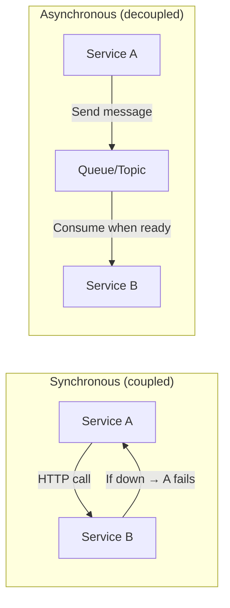
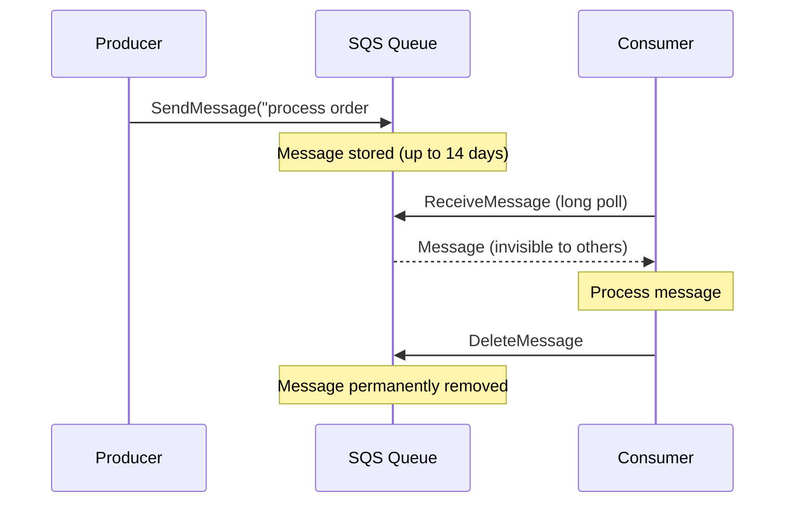
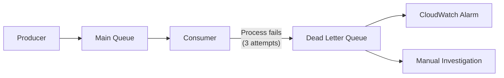
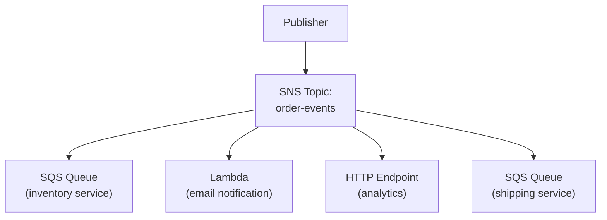
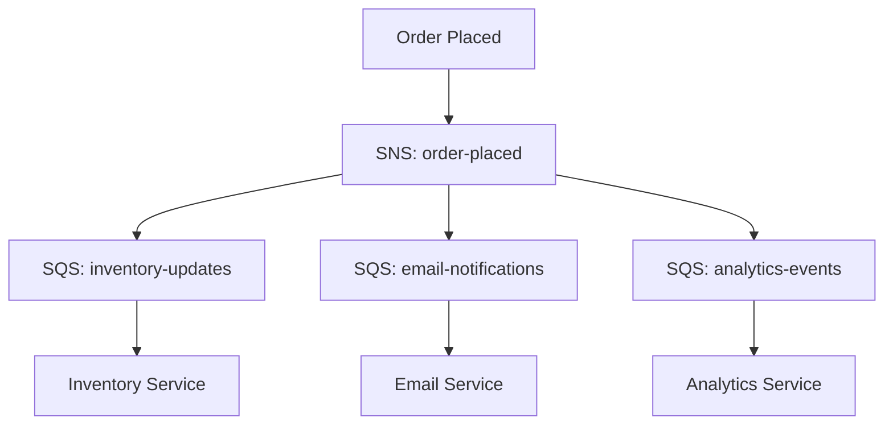
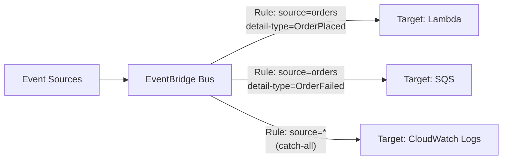
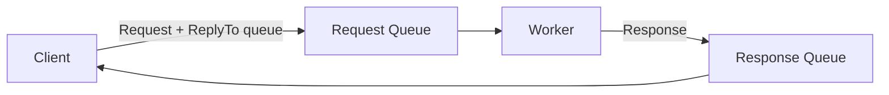
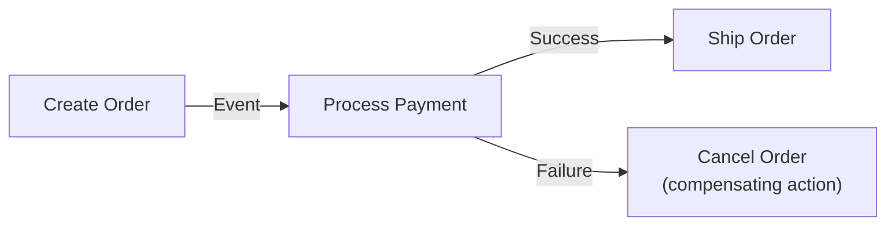

## Why Messaging?

Direct synchronous communication between services creates tight coupling — if service B is down, service A fails too. Messaging decouples services by introducing a buffer between them.



---

## SQS (Simple Queue Service)

Fully managed message queue — producers send messages, consumers poll and process them.

### Queue Types

| Feature | Standard | FIFO |
|---------|----------|------|
| Throughput | Unlimited | 3,000 msg/s (with batching) |
| Ordering | Best-effort | Strict FIFO |
| Delivery | At-least-once (possible duplicates) | Exactly-once |
| Use case | High throughput, order doesn't matter | Order matters, no duplicates |

### How SQS Works



### Key Concepts

| Concept | Description |
|---------|-------------|
| **Visibility Timeout** | Time message is hidden after being received (default: 30s) |
| **Dead Letter Queue (DLQ)** | Failed messages go here after N retries |
| **Long Polling** | Consumer waits up to 20s for messages (reduces empty responses) |
| **Message Retention** | 1 minute to 14 days (default: 4 days) |
| **Max Message Size** | 256 KB (use S3 for larger payloads) |
| **Delay Queue** | Messages invisible for N seconds after being sent |

### Dead Letter Queue Pattern



---

## SNS (Simple Notification Service)

Pub/sub messaging — one message published to a topic is delivered to all subscribers.



### SNS Subscriber Types

| Subscriber | Use Case |
|-----------|----------|
| SQS Queue | Decouple processing |
| Lambda | Serverless processing |
| HTTP/HTTPS | Webhooks |
| Email | Notifications |
| SMS | Alerts |
| Mobile Push | App notifications |

### SNS + SQS (Fan-Out Pattern)

One event triggers multiple independent processors:



Each service processes independently — if email service is slow, inventory isn't affected.

---

## EventBridge

Event bus for building event-driven architectures. More powerful than SNS for complex routing.



### EventBridge vs SNS

| Feature | SNS | EventBridge |
|---------|-----|-------------|
| Filtering | Basic (attribute-based) | Rich (JSON content-based) |
| Schema | None | Schema registry + discovery |
| Sources | Your services | AWS services + SaaS + custom |
| Targets | Subscribers | 20+ AWS service integrations |
| Archive/Replay | No | Yes (replay past events) |
| Use case | Simple fan-out | Complex event routing |

### Event Structure

```json
{
  "source": "com.myapp.orders",
  "detail-type": "OrderPlaced",
  "detail": {
    "orderId": "12345",
    "customerId": "cust-789",
    "total": 99.99,
    "items": [{"sku": "ABC", "qty": 2}]
  },
  "time": "2024-01-15T10:30:00Z"
}
```

---

## Choosing a Messaging Service

| Need | Service | Why |
|------|---------|-----|
| Decouple producer/consumer | SQS | Simple queue, at-least-once delivery |
| Strict ordering | SQS FIFO | Guaranteed order, exactly-once |
| One-to-many broadcast | SNS | Fan-out to multiple subscribers |
| Complex event routing | EventBridge | Content-based filtering, schema registry |
| Fan-out + independent processing | SNS + SQS | Each consumer has its own queue |
| Event replay/archive | EventBridge | Replay past events for debugging |
| Streaming (high throughput) | Kinesis | Real-time data streams, ordered |

---

## Patterns

### Request-Response via Queue



### Saga Pattern (Distributed Transactions)



---

## Key Takeaways

1. **SQS for decoupling** — buffer between services, handles backpressure
2. **SNS for fan-out** — one event, multiple consumers
3. **EventBridge for complex routing** — content-based filtering, schema registry
4. **Always use DLQs** — failed messages need investigation, not silent loss
5. **Long polling reduces cost** — fewer empty ReceiveMessage calls
6. **SNS + SQS for independent processing** — each consumer processes at its own pace
7. **FIFO when order matters** — but accept the throughput tradeoff
