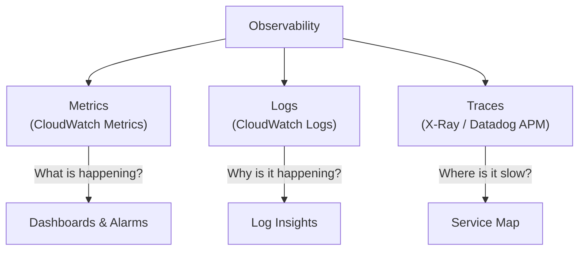
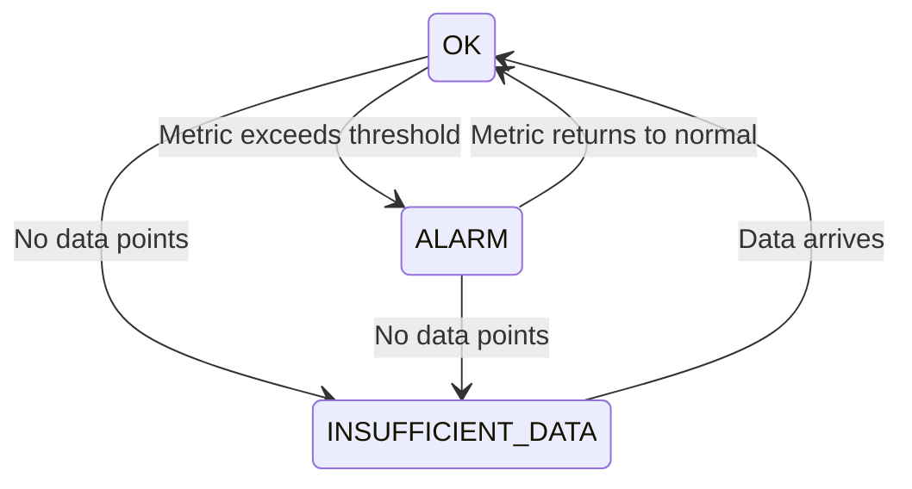
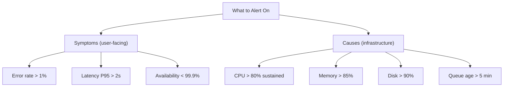

## The Three Pillars of Observability



---

## CloudWatch Metrics

Metrics are time-series data points that measure resource behavior.

### Built-in Metrics (Free)

| Service | Metrics |
|---------|---------|
| EC2 | CPUUtilization, NetworkIn/Out, DiskRead/Write |
| ALB | RequestCount, TargetResponseTime, HTTPCode_5XX |
| RDS | CPUUtilization, FreeableMemory, ReadIOPS |
| Lambda | Invocations, Duration, Errors, Throttles |
| SQS | ApproximateNumberOfMessages, ApproximateAgeOfOldestMessage |

### Custom Metrics

Publish application-specific metrics:

```python
import boto3

cloudwatch = boto3.client('cloudwatch')

cloudwatch.put_metric_data(
    Namespace='MyApp',
    MetricData=[{
        'MetricName': 'OrdersProcessed',
        'Value': 42,
        'Unit': 'Count',
        'Dimensions': [
            {'Name': 'Environment', 'Value': 'prod'},
            {'Name': 'Service', 'Value': 'order-processor'}
        ]
    }]
)
```

### Metric Resolution

| Resolution | Period | Cost | Use Case |
|-----------|--------|------|----------|
| Standard | 60 seconds | Free (built-in) | Most workloads |
| High-resolution | 1 second | Extra cost | Latency-sensitive |

---

## CloudWatch Alarms

Alarms watch a metric and trigger actions when thresholds are breached:



### Alarm Configuration

```text
Alarm: High CPU
  Metric: CPUUtilization
  Statistic: Average
  Period: 300 seconds (5 min)
  Threshold: > 80%
  Evaluation Periods: 3 (must breach 3 consecutive periods)
  Actions:
    - ALARM: Send SNS notification
    - ALARM: Scale out Auto Scaling Group
    - OK: Scale in Auto Scaling Group
```

### Composite Alarms

Combine multiple alarms with AND/OR logic:

```text
Composite Alarm: "Service Degraded"
  Rule: (HighCPU AND HighLatency) OR ErrorRateHigh
  Action: Page on-call engineer
```

---

## CloudWatch Logs

Centralized log collection and analysis.

### Log Structure

```text
Log Group: /ecs/my-service
├── Log Stream: ecs/my-service/task-abc123
├── Log Stream: ecs/my-service/task-def456
└── Log Stream: ecs/my-service/task-ghi789
```

### Log Insights (Query Language)

```sql
-- Find errors in the last hour
fields @timestamp, @message
| filter @message like /ERROR/
| sort @timestamp desc
| limit 50

-- Count errors by service
fields @message
| filter @message like /ERROR/
| stats count(*) as error_count by service
| sort error_count desc

-- P95 latency by endpoint
fields @timestamp, endpoint, duration
| stats percentile(duration, 95) as p95 by endpoint
| sort p95 desc
```

### Metric Filters

Extract metrics from log patterns:

```text
Filter Pattern: [timestamp, level="ERROR", ...]
Metric: ErrorCount
Namespace: MyApp/Errors
```

Every time a log line matches the pattern, the metric increments.

---

## CloudWatch Dashboards

Visual overview of system health:

```text
Dashboard: Production Overview
┌─────────────────┬─────────────────┐
│ CPU Utilization │ Request Count   │
│ (line chart)    │ (bar chart)     │
├─────────────────┼─────────────────┤
│ Error Rate      │ Latency P95     │
│ (number widget) │ (line chart)    │
├─────────────────┼─────────────────┤
│ SQS Queue Depth │ Active Tasks    │
│ (line chart)    │ (number widget) │
└─────────────────┴─────────────────┘
```

---

## CloudTrail

Audit log of every API call made in your AWS account:

| Field | Example |
|-------|---------|
| Who | `arn:aws:iam::123:user/alice` |
| What | `ec2:TerminateInstances` |
| When | `2024-01-15T10:30:00Z` |
| Where | `eu-central-1` |
| Source IP | `203.0.113.50` |
| Result | `Success` or `AccessDenied` |

Use cases:

- Security investigation ("who deleted the database?")
- Compliance auditing
- Detecting unauthorized access
- Triggering automation on specific API calls

---

## Alerting Strategy

### Severity Levels

| Level | Criteria | Response | Example |
|-------|----------|----------|---------|
| **Critical** | Service down, data loss risk | Page immediately | 5xx > 10%, database unreachable |
| **Warning** | Degraded, approaching limits | Investigate within hours | CPU > 80%, disk > 85% |
| **Info** | Notable but not urgent | Review next business day | Deployment completed, scaling event |

### What to Alert On



**Alert on symptoms first** — users care about errors and latency, not CPU percentage.

---

## Key Takeaways

1. **Metrics for what, logs for why, traces for where** — use all three together
2. **Alert on symptoms** — error rate and latency matter more than CPU
3. **Use composite alarms** — reduce noise by combining conditions
4. **CloudTrail for audit** — every API call is logged (who did what, when)
5. **Log Insights for investigation** — SQL-like queries across all your logs
6. **Metric filters bridge logs and metrics** — turn log patterns into alarms
7. **Set retention policies** — logs cost money; 30 days for dev, 90-365 for prod
