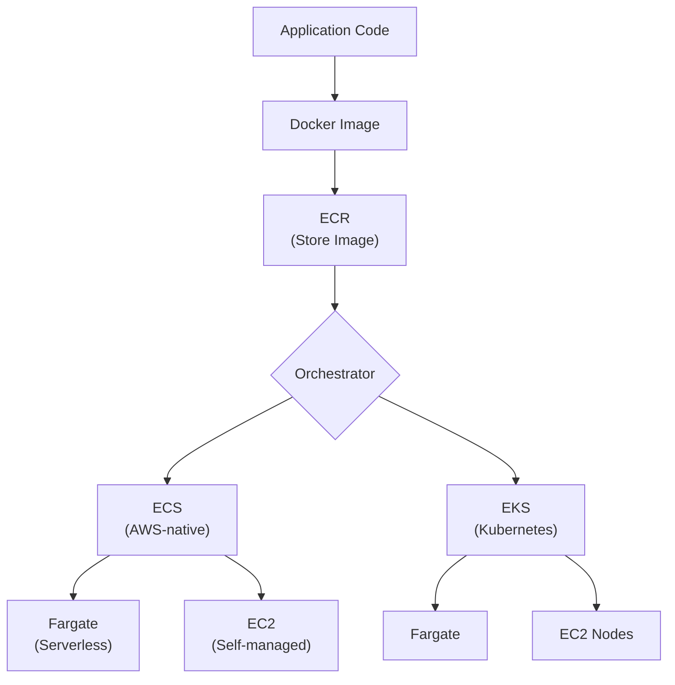
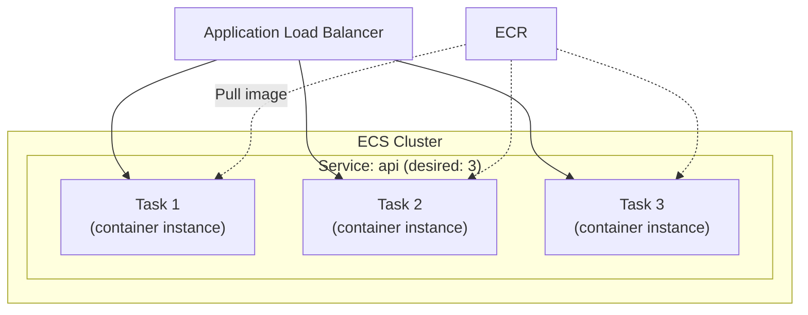
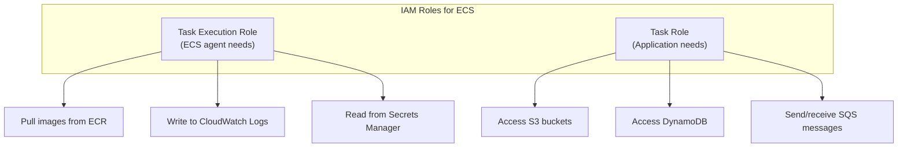
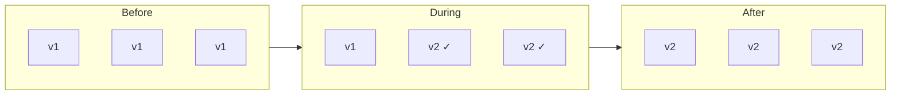
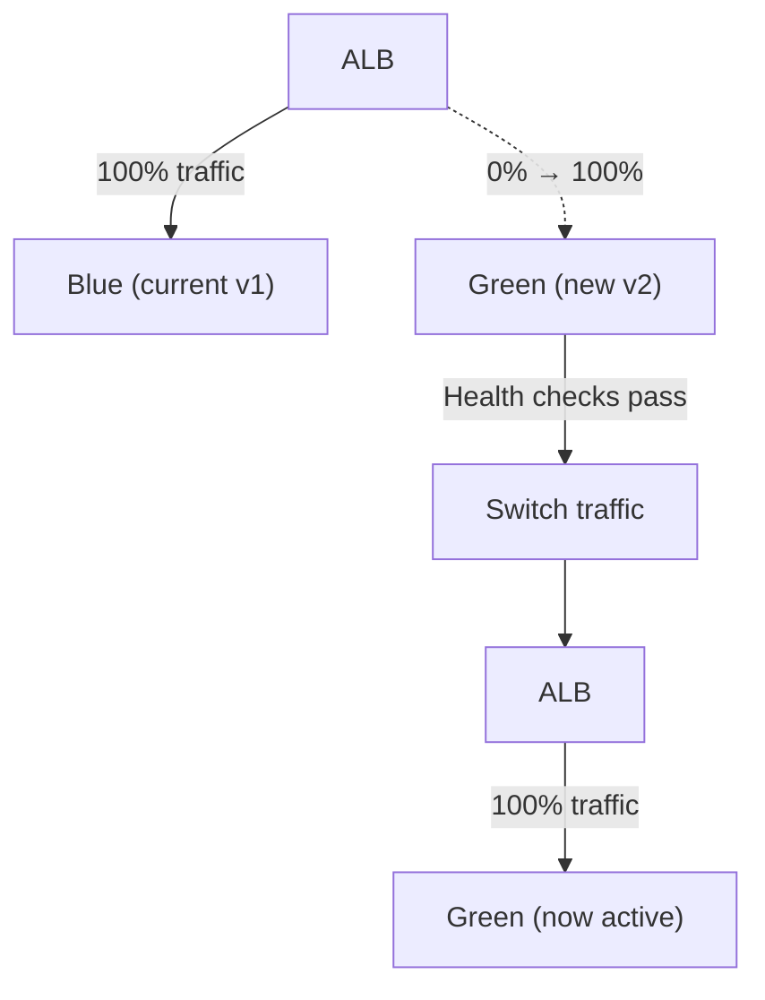

## Why Containers on AWS?

Containers package your application with all its dependencies into a portable unit. AWS provides managed services to run containers without managing the underlying infrastructure.



---

## ECR (Elastic Container Registry)

Managed Docker registry — store, manage, and deploy container images.

### Key Features

| Feature | Description |
|---------|-------------|
| **Private repositories** | Per-account, per-region |
| **Image scanning** | Vulnerability detection on push |
| **Lifecycle policies** | Auto-delete old images |
| **Cross-region replication** | Replicate images to other regions |
| **Immutable tags** | Prevent tag overwriting |

### Lifecycle Policy Example

```json
{
  "rules": [
    {
      "rulePriority": 1,
      "description": "Keep last 10 images",
      "selection": {
        "tagStatus": "any",
        "countType": "imageCountMoreThan",
        "countNumber": 10
      },
      "action": { "type": "expire" }
    }
  ]
}
```

---

## ECS (Elastic Container Service)

AWS-native container orchestrator. Simpler than Kubernetes, deeply integrated with AWS services.

### ECS Architecture



### ECS Concepts

| Concept | Description |
|---------|-------------|
| **Cluster** | Logical grouping of services and tasks |
| **Task Definition** | Blueprint for a container (image, CPU, memory, ports, env vars) |
| **Task** | Running instance of a task definition |
| **Service** | Maintains desired count of tasks, integrates with ALB |
| **Container** | Docker container within a task |

### Task Definition

```json
{
  "family": "api-service",
  "cpu": "512",
  "memory": "1024",
  "networkMode": "awsvpc",
  "containerDefinitions": [
    {
      "name": "api",
      "image": "123456789.dkr.ecr.eu-central-1.amazonaws.com/api:v1.2.3",
      "portMappings": [{ "containerPort": 8080 }],
      "environment": [
        { "name": "ENV", "value": "prod" }
      ],
      "secrets": [
        { "name": "DB_PASSWORD", "valueFrom": "arn:aws:secretsmanager:..." }
      ],
      "logConfiguration": {
        "logDriver": "awslogs",
        "options": {
          "awslogs-group": "/ecs/api-service",
          "awslogs-region": "eu-central-1",
          "awslogs-stream-prefix": "ecs"
        }
      }
    }
  ]
}
```

### Launch Types

| | Fargate | EC2 |
|---|---------|-----|
| Server management | None (serverless) | You manage EC2 instances |
| Pricing | Per task (vCPU + memory) | Per EC2 instance |
| Scaling | Per task | Per instance + per task |
| Control | Less (no host access) | Full (SSH, custom AMI) |
| Best for | Most workloads | GPU, specific instance types |

### ECS Service Features

- **Desired count** — ECS maintains N healthy tasks
- **Rolling updates** — deploy new version with zero downtime
- **Auto Scaling** — scale tasks based on CPU, memory, or custom metrics
- **Service discovery** — Cloud Map integration for service-to-service communication
- **Circuit breaker** — automatically roll back failed deployments

---

## ECS IAM Roles



| Role | Who Uses It | For What |
|------|-------------|----------|
| **Execution Role** | ECS agent | Pull images, push logs, read secrets |
| **Task Role** | Your application | Access AWS services (S3, DDB, SQS) |

---

## EKS (Elastic Kubernetes Service)

Managed Kubernetes — AWS runs the control plane, you manage worker nodes (or use Fargate).

### When EKS vs ECS

| Choose ECS | Choose EKS |
|-----------|-----------|
| AWS-native, simpler | Multi-cloud or hybrid |
| Smaller teams | Large platform teams |
| Tight AWS integration | Kubernetes ecosystem (Helm, operators) |
| Fewer moving parts | Complex scheduling needs |
| Cost-sensitive | Team already knows Kubernetes |

---

## Deployment Strategies

### Rolling Update (Default)



Configuration:

- `minimumHealthyPercent: 50` — at least 50% of tasks stay running
- `maximumPercent: 200` — can temporarily run 2x tasks during deploy

### Blue/Green (via CodeDeploy)



---

## Key Takeaways

1. **ECS for most AWS workloads** — simpler than Kubernetes, deeply integrated
2. **Fargate for serverless containers** — no EC2 management, pay per task
3. **ECR for image storage** — lifecycle policies prevent unbounded growth
4. **Separate execution and task roles** — least privilege for each concern
5. **Rolling updates for zero downtime** — ECS handles draining and health checks
6. **Use Secrets Manager for secrets** — never bake credentials into images
7. **EKS only if you need Kubernetes** — it adds complexity; justify the choice
