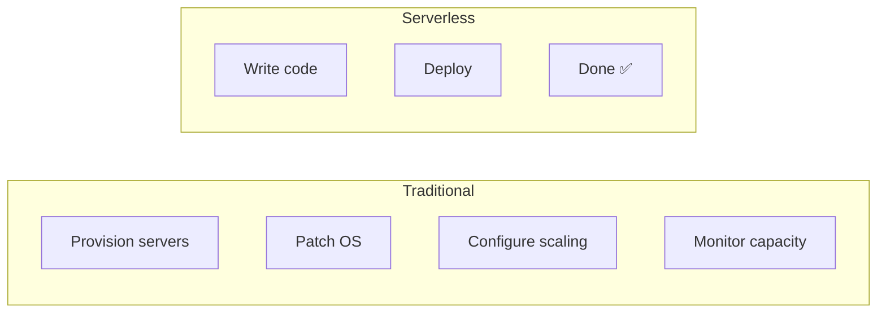
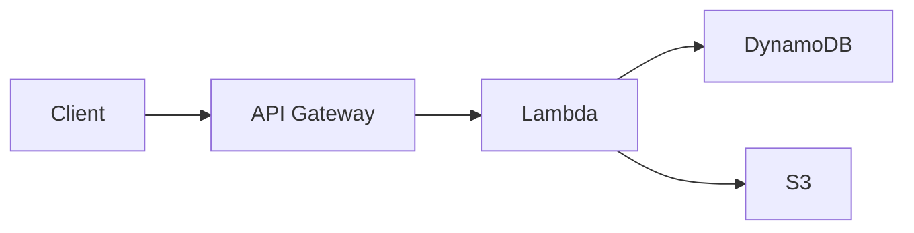
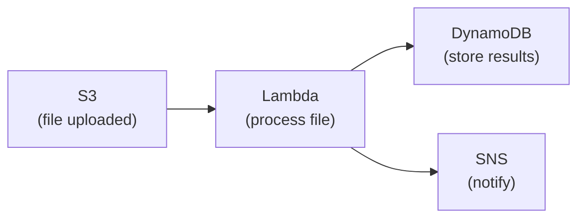
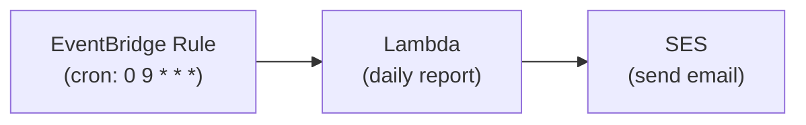
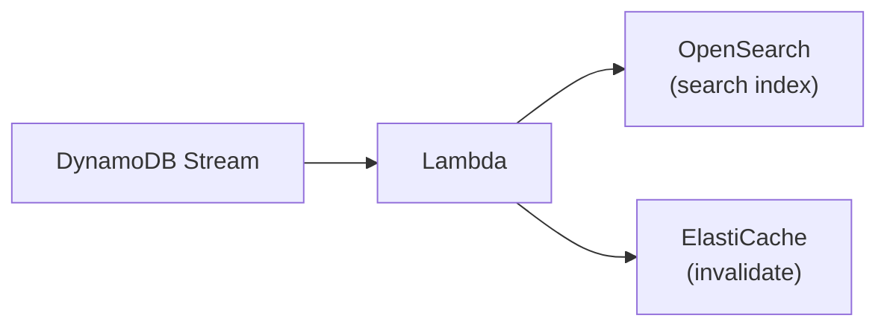
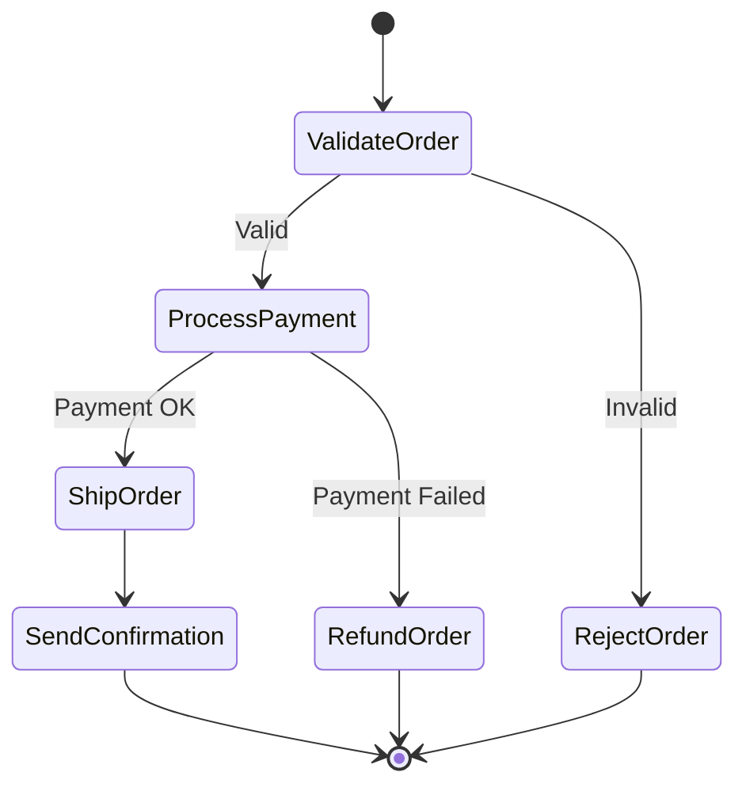
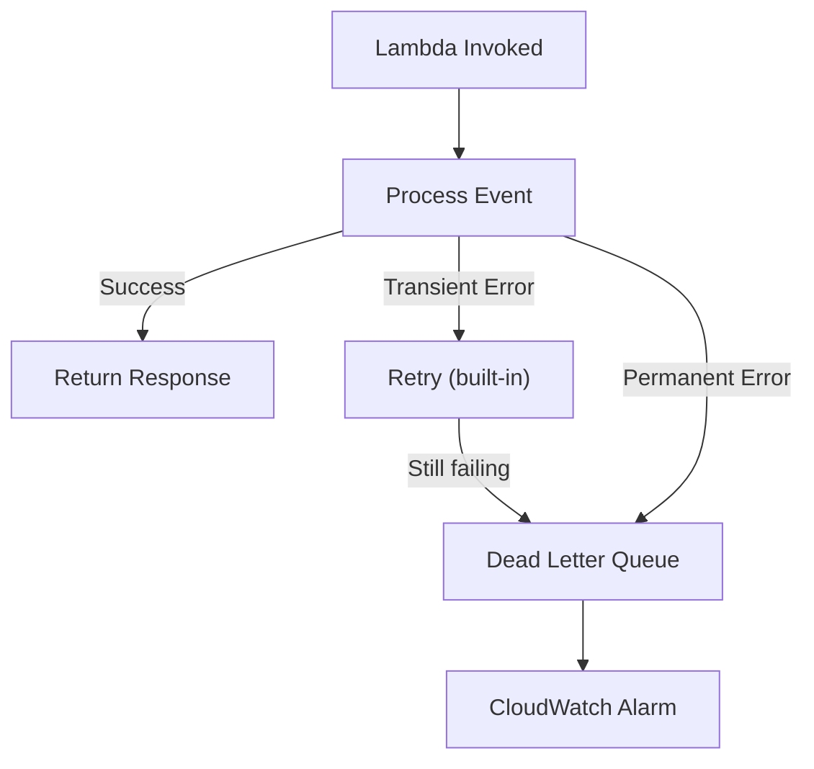

## What is Serverless?

Serverless doesn't mean "no servers" — it means you don't manage them. AWS handles provisioning, scaling, patching, and availability. You write code and define triggers.



### Serverless Services

| Service | Purpose |
|---------|---------|
| **Lambda** | Compute (functions) |
| **API Gateway** | HTTP APIs |
| **DynamoDB** | Database |
| **S3** | Storage |
| **SQS/SNS** | Messaging |
| **EventBridge** | Event routing |
| **Step Functions** | Workflow orchestration |
| **Fargate** | Containers (serverless) |

---

## Common Serverless Patterns

### API Backend



API Gateway handles: routing, authentication, rate limiting, request validation, CORS.
Lambda handles: business logic.
DynamoDB handles: data persistence.

### Event Processing



### Scheduled Tasks (Cron)



### Stream Processing



---

## Step Functions

Orchestrate multi-step workflows with visual state machines:



### Step Functions Features

| Feature | Description |
|---------|-------------|
| **Error handling** | Retry with backoff, catch and redirect |
| **Parallel execution** | Run branches simultaneously |
| **Wait states** | Pause for time or callback |
| **Map state** | Process items in parallel (like for_each) |
| **Choice state** | Conditional branching |
| **Human approval** | Wait for external callback |

### When to Use Step Functions

| Use Step Functions | Use Direct Lambda |
|-------------------|-------------------|
| Multi-step workflows | Single operation |
| Error handling with retries | Simple request-response |
| Long-running processes | < 15 min execution |
| Visual audit trail needed | No orchestration needed |
| Parallel processing | Sequential only |

---

## API Gateway

### Types

| Type | Protocol | Use Case |
|------|----------|----------|
| **HTTP API** | HTTP | Simple APIs, lower cost, faster |
| **REST API** | HTTP | Full features (caching, WAF, usage plans) |
| **WebSocket API** | WebSocket | Real-time, bidirectional |

### API Gateway Features

- **Authentication** — Cognito, Lambda authorizers, IAM
- **Rate limiting** — Throttle per client (usage plans + API keys)
- **Request validation** — Validate body/params before hitting Lambda
- **Caching** — Cache responses (reduce Lambda invocations)
- **CORS** — Configure cross-origin access
- **Custom domains** — `api.example.com` with ACM certificate

---

## Serverless Best Practices

### Cold Starts

First invocation after idle period is slower (100ms – 10s):

| Mitigation | How |
|-----------|-----|
| Provisioned Concurrency | Keep N instances warm (costs money) |
| Smaller packages | Less code to load |
| Avoid VPC (if possible) | VPC adds ENI setup time |
| Use lightweight runtimes | Python/Node.js start faster than Java |

### Function Design

```text
✅ Single responsibility — one function, one job
✅ Stateless — no local state between invocations
✅ Idempotent — safe to retry (use idempotency keys)
✅ Small packages — only include what you need
✅ Environment variables for config — not hardcoded

❌ Monolithic Lambda — one function doing everything
❌ Synchronous chains — Lambda calling Lambda calling Lambda
❌ Large dependencies — 200MB deployment package
```

### Error Handling



---

## Cost Model

Serverless pricing is pay-per-use:

| Service | You Pay For |
|---------|-------------|
| Lambda | Invocations + duration (GB-seconds) |
| API Gateway | Requests + data transfer |
| DynamoDB | Read/Write capacity units (or per-request) |
| S3 | Storage + requests + data transfer |
| Step Functions | State transitions |

**Key insight:** Serverless is cheap at low scale but can be expensive at high scale. At millions of requests/day, containers (ECS/Fargate) may be more cost-effective.

---

## Key Takeaways

1. **Serverless for event-driven workloads** — APIs, file processing, scheduled tasks
2. **Step Functions for orchestration** — don't chain Lambdas synchronously
3. **API Gateway for HTTP** — handles auth, throttling, validation
4. **Design for cold starts** — small packages, provisioned concurrency for latency-sensitive
5. **Idempotent functions** — retries are inevitable in distributed systems
6. **DLQs for failed events** — never silently lose messages
7. **Cost-aware at scale** — serverless isn't always cheapest; model your costs
