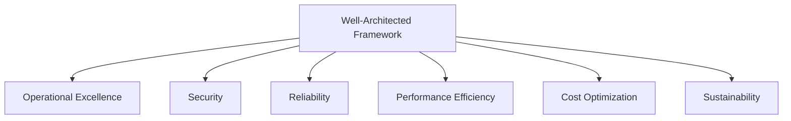
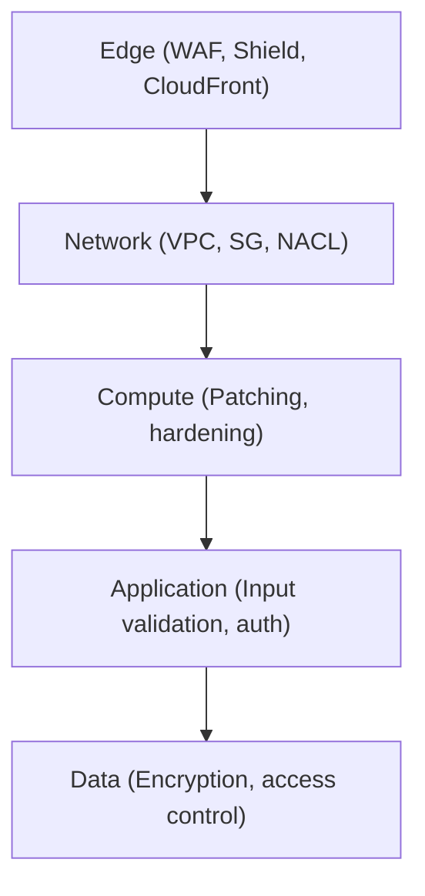
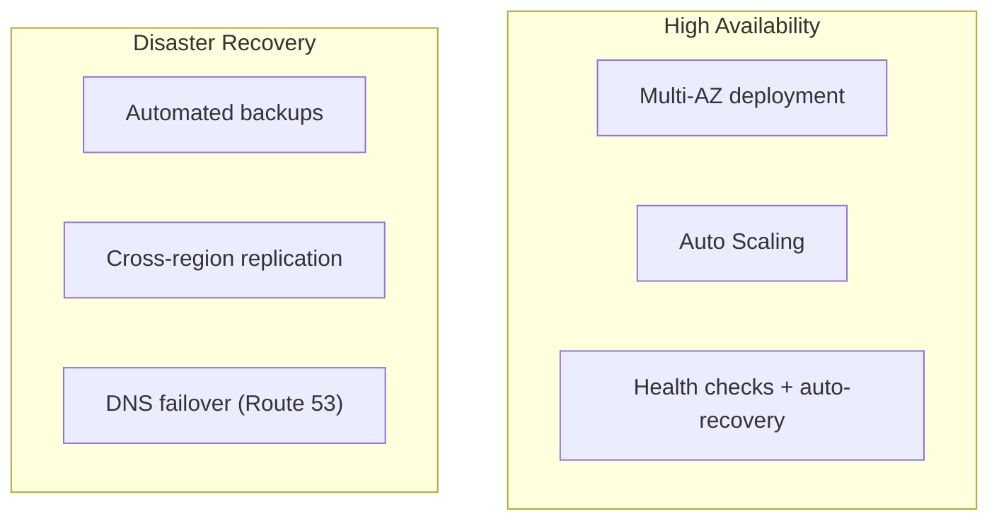
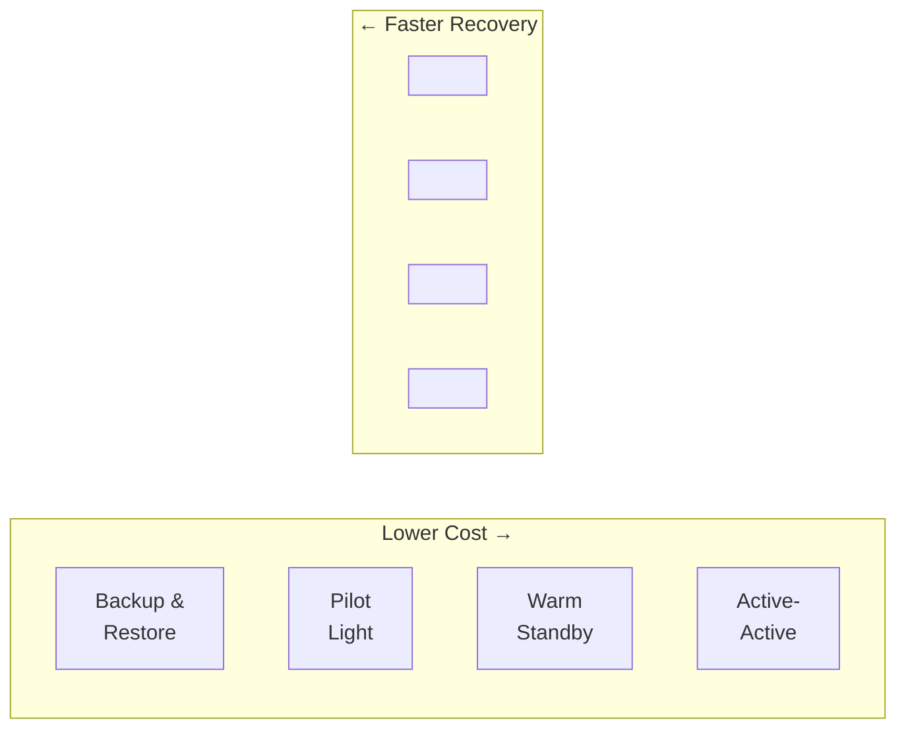

## What is the Well-Architected Framework?

AWS's Well-Architected Framework is a set of best practices for designing and operating reliable, secure, efficient, cost-effective, and sustainable systems in the cloud. It provides a consistent approach to evaluating architectures.

---

## Pillar 1: Operational Excellence

**Focus:** Run and monitor systems to deliver business value, and continually improve processes.

### Key Principles

| Principle | Practice |
|-----------|----------|
| Operations as code | IaC (Terraform), CI/CD pipelines |
| Frequent small changes | Small deployments, feature flags |
| Anticipate failure | Game days, chaos engineering |
| Learn from failures | Post-mortems, blameless culture |
| Observability | Metrics, logs, traces, dashboards |

### Design Principles

- Automate everything that can be automated
- Make frequent, small, reversible changes
- Refine operations procedures frequently
- Anticipate failure and practice recovery
- Learn from all operational events

---

## Pillar 2: Security

**Focus:** Protect information, systems, and assets while delivering business value.

### Key Principles

| Principle | Practice |
|-----------|----------|
| Least privilege | Minimal IAM permissions |
| Defense in depth | Multiple security layers |
| Automate security | Security scanning in CI/CD |
| Protect data | Encryption at rest and in transit |
| Traceability | CloudTrail, VPC Flow Logs |

### Security Layers

### Practices

- Enable MFA on all human accounts
- Use IAM roles (not long-lived keys)
- Encrypt everything (KMS, ACM)
- Enable CloudTrail in all regions
- Use Security Hub for centralized findings
- Automate incident response

---

## Pillar 3: Reliability

**Focus:** Ensure a workload performs its intended function correctly and consistently.

### Key Principles

| Principle | Practice |
|-----------|----------|
| Auto-recover | Health checks, auto-scaling, failover |
| Scale horizontally | Distribute load across instances |
| Stop guessing capacity | Auto-scaling based on demand |
| Manage change through automation | CI/CD, IaC |
| Test recovery procedures | Regularly test failover |

### Reliability Patterns

### DR Strategies (by RTO/RPO)

| Strategy | RTO | RPO | Cost |
|----------|-----|-----|------|
| **Backup & Restore** | Hours | Hours | $ |
| **Pilot Light** | Minutes-hours | Minutes | $$ |
| **Warm Standby** | Minutes | Seconds | $$$ |
| **Active-Active** | Near-zero | Near-zero | $$$$ |

---

## Pillar 4: Performance Efficiency

**Focus:** Use computing resources efficiently to meet requirements, and maintain efficiency as demand changes.

### Key Principles

| Principle | Practice |
|-----------|----------|
| Right-size resources | Monitor and adjust instance types |
| Use managed services | Let AWS handle undifferentiated work |
| Go global in minutes | Multi-region, CloudFront |
| Experiment more often | A/B test architectures |
| Mechanical sympathy | Understand how services work internally |

### Performance Patterns

| Pattern | Implementation |
|---------|---------------|
| Caching | ElastiCache, CloudFront, DAX |
| Read replicas | RDS read replicas, Aurora readers |
| Async processing | SQS, EventBridge, Step Functions |
| CDN | CloudFront for static + dynamic content |
| Connection pooling | RDS Proxy |

---

## Pillar 5: Cost Optimization

**Focus:** Avoid unnecessary costs and understand where money is being spent.

### Key Principles

| Principle | Practice |
|-----------|----------|
| Pay only for what you use | Serverless, auto-scaling to zero |
| Right-size | Match resource size to actual usage |
| Use pricing models | Reserved Instances, Savings Plans, Spot |
| Measure efficiency | Cost per transaction, cost per user |
| Stop spending on undifferentiated work | Managed services over self-managed |

### Cost Optimization Strategies

| Strategy | Savings | Effort |
|----------|---------|--------|
| Delete unused resources | Immediate | Low |
| Right-size instances | 20-40% | Medium |
| Reserved Instances (1yr) | 40% | Low |
| Savings Plans (3yr) | 60% | Low |
| Spot Instances | 70-90% | Medium |
| S3 lifecycle policies | Variable | Low |
| Serverless for variable load | Variable | High |

### Cost Monitoring

- **AWS Cost Explorer** — visualize spending trends
- **AWS Budgets** — alerts when spending exceeds threshold
- **Cost Allocation Tags** — track cost by team, project, environment
- **Trusted Advisor** — recommendations for cost savings

---

## Pillar 6: Sustainability

**Focus:** Minimize environmental impact of cloud workloads.

### Key Principles

| Principle | Practice |
|-----------|----------|
| Understand your impact | Measure carbon footprint |
| Maximize utilization | Right-size, use managed services |
| Use efficient hardware | Graviton (ARM) instances |
| Reduce downstream impact | Optimize data transfer, compress |

---

## Applying the Framework

### Well-Architected Review

1. **Select workload** — a specific application or system
2. **Answer questions** — per pillar (AWS provides the questionnaire)
3. **Identify risks** — high-risk items flagged
4. **Create improvement plan** — prioritize fixes
5. **Implement** — address highest-risk items first
6. **Repeat** — review periodically (quarterly)

### Trade-offs

The pillars sometimes conflict:

| Trade-off | Example |
|-----------|---------|
| Reliability vs Cost | Multi-AZ costs more but prevents downtime |
| Performance vs Cost | Larger instances are faster but more expensive |
| Security vs Performance | Encryption adds latency |
| Operational Excellence vs Speed | Automation takes time to build |

The right balance depends on your business requirements.

---

## Key Takeaways

1. **Six pillars, not one** — optimize across all dimensions, not just cost or performance
2. **Trade-offs are intentional** — document why you chose reliability over cost (or vice versa)
3. **Review regularly** — architectures drift; reassess quarterly
4. **Automate everything** — operational excellence starts with automation
5. **Design for failure** — assume components will fail; build recovery into the architecture
6. **Measure to improve** — you can't optimize what you don't measure
7. **Start with security** — it's harder to add later than to build in from the start
