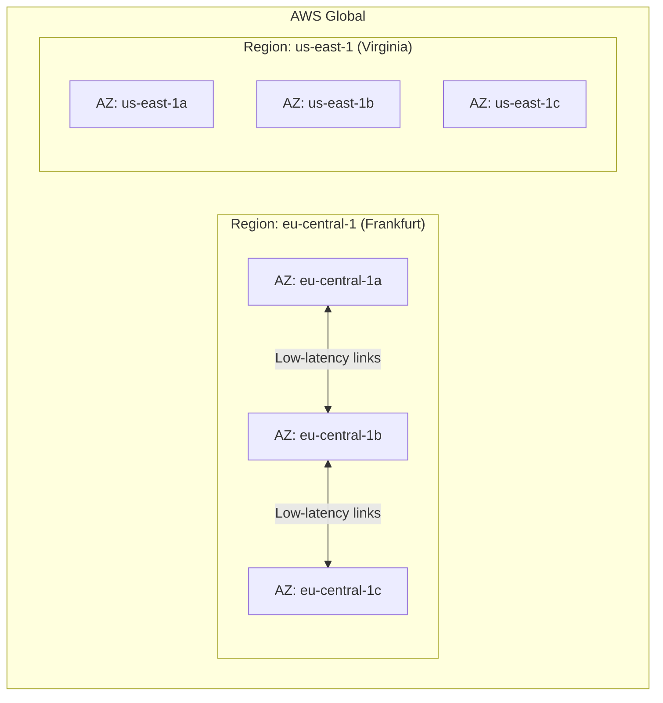
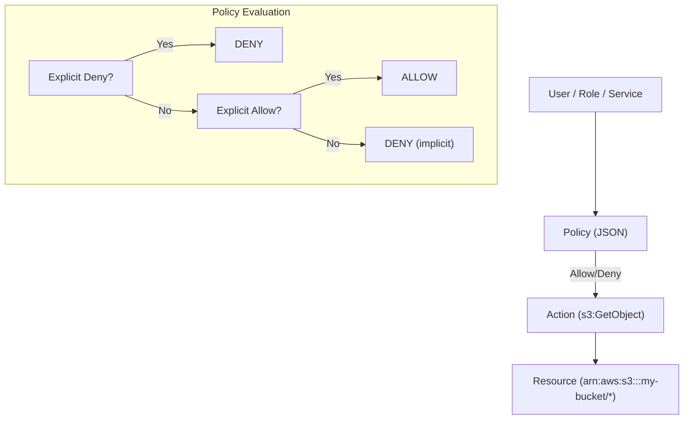
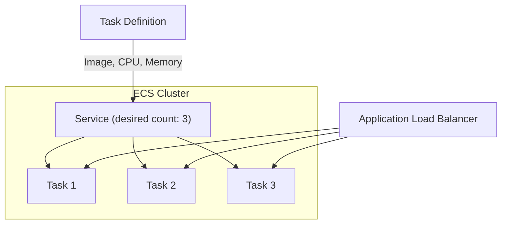
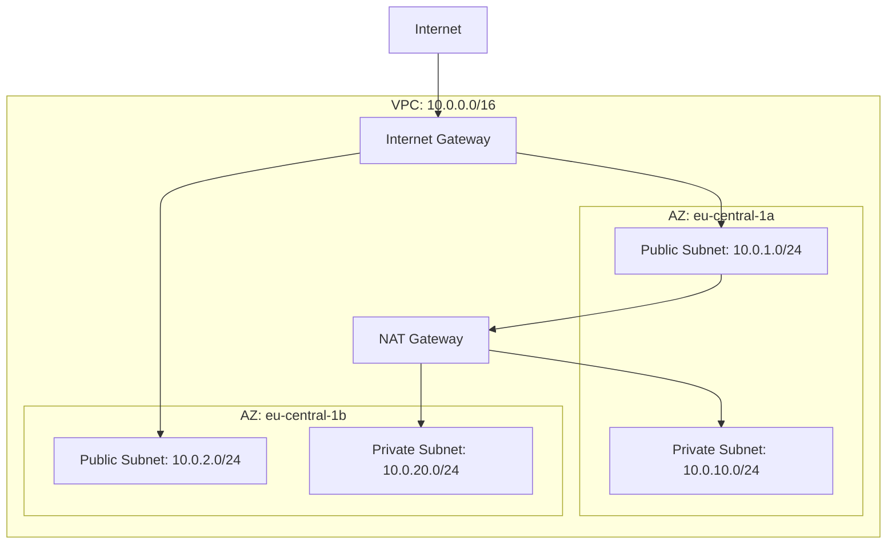
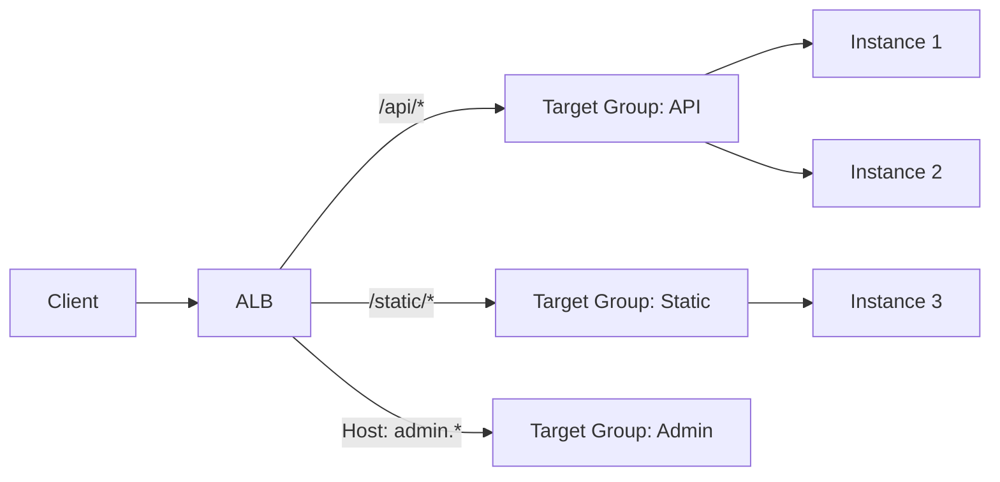
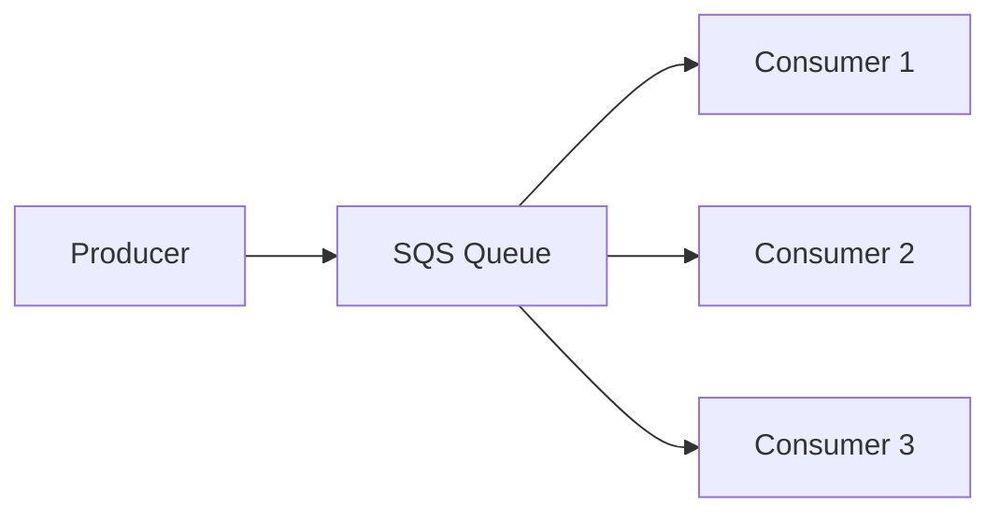
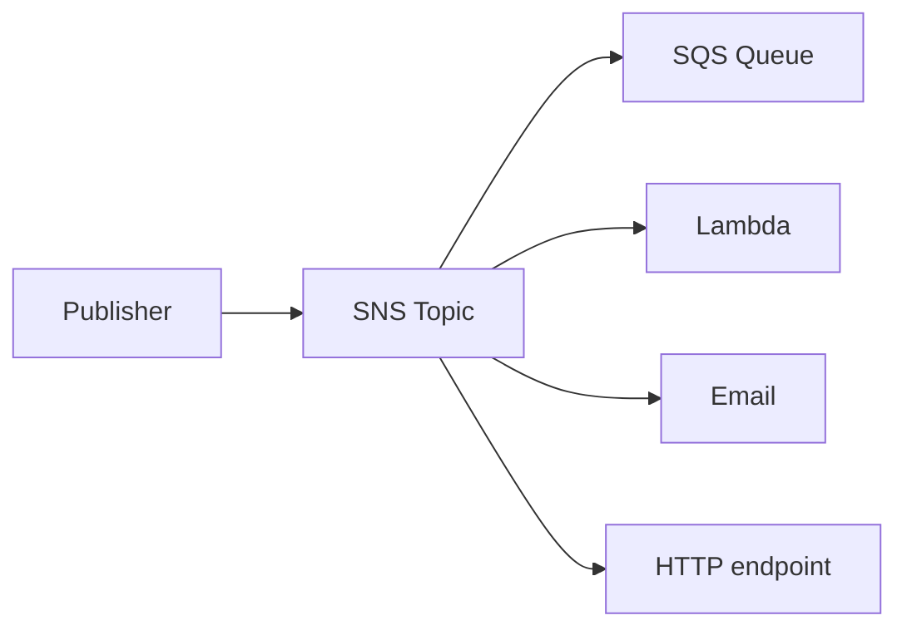
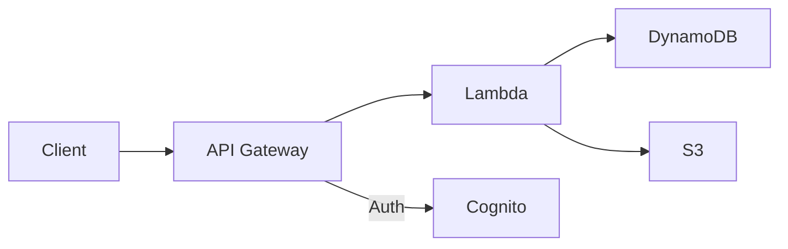
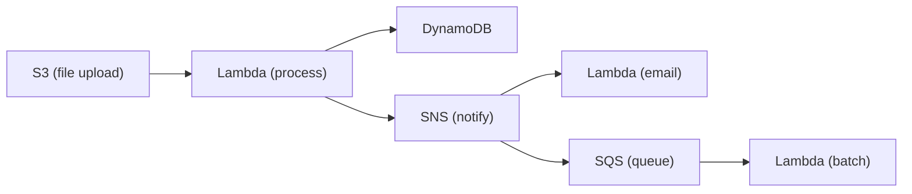
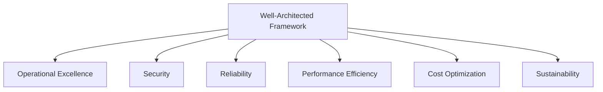

AWS is the world's largest cloud platform, offering 200+ services for compute, storage, databases, networking, machine learning, and more. This path covers the core services and architectural patterns you need to build production systems.

## Prerequisites

- Networking basics (IP, DNS, HTTP)
- Linux command line
- Basic understanding of servers and databases

---

## 1. AWS Global Infrastructure

### Regions and Availability Zones



| Concept | Definition |
|---------|-----------|
| **Region** | Geographic area with multiple data centers (e.g., eu-central-1) |
| **Availability Zone (AZ)** | One or more discrete data centers within a region |
| **Edge Location** | CDN endpoint for CloudFront (200+ worldwide) |
| **Local Zone** | Extension of a region closer to users |

### Choosing a Region

Consider:

1. **Compliance** — data residency requirements
2. **Latency** — proximity to users
3. **Service availability** — not all services in all regions
4. **Cost** — pricing varies by region

### Key Takeaway

Design for multi-AZ from the start. A single AZ failure should not take down your application. Regions are isolated — cross-region replication is explicit and costs money.

---

## 2. IAM (Identity and Access Management)

### Core Concepts



### Policy Structure

```json
{
    "Version": "2012-10-17",
    "Statement": [
        {
            "Effect": "Allow",
            "Action": [
                "s3:GetObject",
                "s3:PutObject"
            ],
            "Resource": "arn:aws:s3:::my-bucket/*",
            "Condition": {
                "StringEquals": {
                    "aws:RequestedRegion": "eu-central-1"
                }
            }
        }
    ]
}
```

### IAM Entities

| Entity | Use Case |
|--------|----------|
| **User** | Human identity (avoid for applications) |
| **Group** | Collection of users sharing permissions |
| **Role** | Assumed by services, applications, or cross-account access |
| **Policy** | JSON document defining permissions |
| **Instance Profile** | Wrapper for role attached to EC2 |

### Least Privilege Principle

```json
// BAD — too broad
{
    "Effect": "Allow",
    "Action": "s3:*",
    "Resource": "*"
}

// GOOD — specific actions on specific resources
{
    "Effect": "Allow",
    "Action": ["s3:GetObject", "s3:ListBucket"],
    "Resource": [
        "arn:aws:s3:::my-app-assets",
        "arn:aws:s3:::my-app-assets/*"
    ]
}
```

### Key Takeaway

IAM is the foundation of AWS security. Use roles (not users) for applications. Apply least privilege. Explicit deny always wins. Use conditions to further restrict access.

---

## 3. Compute

### EC2 (Elastic Compute Cloud)

Virtual machines in the cloud:

| Instance Family | Optimized For | Example |
|----------------|---------------|---------|
| t3/t4g | General purpose, burstable | Web servers, dev environments |
| m6i/m7g | General purpose, sustained | Application servers |
| c6i/c7g | Compute-intensive | Batch processing, ML inference |
| r6i/r7g | Memory-intensive | Databases, caching |
| i3/i4i | Storage-intensive | Data warehouses |

### Lambda (Serverless)

Run code without managing servers:

```python
# lambda_function.py
import json

def handler(event, context):
    name = event.get("name", "World")
    return {
        "statusCode": 200,
        "body": json.dumps({"message": f"Hello, {name}!"})
    }
```

| Feature | Limit |
|---------|-------|
| Timeout | 15 minutes max |
| Memory | 128 MB – 10 GB |
| Package size | 50 MB (zip), 250 MB (unzipped) |
| Concurrency | 1000 default (adjustable) |
| Ephemeral storage | 512 MB – 10 GB |

### ECS/Fargate (Containers)



| Component | Purpose |
|-----------|---------|
| **Cluster** | Logical grouping of tasks/services |
| **Task Definition** | Blueprint (image, CPU, memory, env vars) |
| **Task** | Running instance of a task definition |
| **Service** | Maintains desired count of tasks, handles deployments |
| **Fargate** | Serverless compute for containers (no EC2 management) |

### When to Use What

| Scenario | Service |
|----------|---------|
| Full control over OS | EC2 |
| Short-lived event processing | Lambda |
| Long-running containerized apps | ECS/Fargate |
| Kubernetes workloads | EKS |
| Batch jobs | Lambda (short) or Fargate (long) |

### Key Takeaway

Default to Fargate for containerized workloads (no server management). Use Lambda for event-driven, short-lived functions. Use EC2 only when you need OS-level control or specific instance types.

---

## 4. Storage

### S3 (Simple Storage Service)

Object storage — unlimited capacity, 99.999999999% (11 nines) durability.

| Storage Class | Use Case | Cost |
|--------------|----------|------|
| Standard | Frequently accessed | $$$  |
| Intelligent-Tiering | Unknown access patterns | Auto-optimizes |
| Standard-IA | Infrequent access (30-day min) | $$ |
| Glacier Instant | Archive, millisecond retrieval | $ |
| Glacier Flexible | Archive, minutes-hours retrieval | ¢ |
| Glacier Deep Archive | Long-term archive, 12-hour retrieval | ¢¢ |

```text
s3://my-bucket/path/to/object.json
       │              │
       bucket         key (not a folder — flat namespace)
```

### EBS (Elastic Block Store)

Block storage attached to EC2 — like a hard drive:

| Type | Use Case | IOPS |
|------|----------|------|
| gp3 | General purpose (default) | 3,000 – 16,000 |
| io2 | High-performance databases | Up to 256,000 |
| st1 | Throughput-optimized (big data) | 500 MB/s |
| sc1 | Cold storage | 250 MB/s |

### EFS (Elastic File System)

Shared file system — multiple EC2/containers can mount simultaneously. NFS protocol. Auto-scales.

### Key Takeaway

S3 for objects (files, backups, static assets). EBS for block storage (databases, OS volumes). EFS for shared file systems (multiple instances need the same files).

---

## 5. Databases

### RDS (Relational Database Service)

Managed relational databases:

| Engine | Notes |
|--------|-------|
| PostgreSQL | Most versatile, best for new projects |
| MySQL/MariaDB | Widely used, good ecosystem |
| Aurora | AWS-native, 5x MySQL / 3x PostgreSQL performance |
| SQL Server | Enterprise Windows workloads |
| Oracle | Legacy enterprise |

**Multi-AZ:** Synchronous replication to standby in another AZ. Automatic failover.

**Read Replicas:** Asynchronous replication for read scaling. Up to 15 replicas.

### DynamoDB

Fully managed NoSQL (key-value + document):

| Feature | Value |
|---------|-------|
| Latency | Single-digit milliseconds |
| Scaling | Automatic (on-demand) or provisioned |
| Capacity | Virtually unlimited |
| Consistency | Eventually consistent (default) or strongly consistent |

```text
Table: Orders
├── Partition Key: customer_id
├── Sort Key: order_date
└── Attributes: items, total, status
```

**Access patterns drive table design** — unlike relational databases, you design DynamoDB tables around your queries, not your data model.

### ElastiCache

Managed Redis or Memcached:

| Use Case | Service |
|----------|---------|
| Session storage | Redis |
| Caching (simple) | Memcached |
| Caching (complex, persistence) | Redis |
| Pub/sub, queues | Redis |
| Leaderboards, counters | Redis |

### Key Takeaway

Use RDS/Aurora for relational data with complex queries. Use DynamoDB for high-scale, simple access patterns. Use ElastiCache to reduce database load and improve latency.

---

## 6. Networking: VPC

### VPC Architecture



### Components

| Component | Purpose |
|-----------|---------|
| **VPC** | Isolated virtual network |
| **Subnet** | IP range within a VPC, tied to one AZ |
| **Internet Gateway** | Connects VPC to the internet |
| **NAT Gateway** | Allows private subnets to reach internet (outbound only) |
| **Route Table** | Rules for where traffic goes |
| **Security Group** | Stateful firewall at instance level |
| **NACL** | Stateless firewall at subnet level |

### Security Groups vs NACLs

| Feature | Security Group | NACL |
|---------|---------------|------|
| Level | Instance/ENI | Subnet |
| Stateful | Yes (return traffic auto-allowed) | No (must allow both directions) |
| Rules | Allow only | Allow and Deny |
| Evaluation | All rules evaluated | Rules evaluated in order |
| Default | Deny all inbound, allow all outbound | Allow all |

### Subnet Design

```text
VPC: 10.0.0.0/16 (65,536 IPs)
├── Public subnets (internet-facing)
│   ├── 10.0.1.0/24 (AZ-a) — ALB, NAT Gateway, bastion
│   ├── 10.0.2.0/24 (AZ-b)
│   └── 10.0.3.0/24 (AZ-c)
├── Private subnets (application tier)
│   ├── 10.0.10.0/24 (AZ-a) — ECS tasks, EC2 instances
│   ├── 10.0.20.0/24 (AZ-b)
│   └── 10.0.30.0/24 (AZ-c)
└── Data subnets (database tier)
    ├── 10.0.100.0/24 (AZ-a) — RDS, ElastiCache
    ├── 10.0.110.0/24 (AZ-b)
    └── 10.0.120.0/24 (AZ-c)
```

### Key Takeaway

Put load balancers in public subnets, applications in private subnets, databases in isolated subnets. Use security groups for instance-level control. Design for multi-AZ from day one.

---

## 7. Load Balancing

### Application Load Balancer (ALB)

Layer 7 (HTTP/HTTPS) — content-based routing:



**Routing rules:** path-based, host-based, header-based, query string, source IP.

### Network Load Balancer (NLB)

Layer 4 (TCP/UDP) — ultra-high performance:

| Feature | ALB | NLB |
|---------|-----|-----|
| Layer | 7 (HTTP) | 4 (TCP/UDP) |
| Latency | Milliseconds | Microseconds |
| Static IP | No (use alias) | Yes |
| TLS termination | Yes | Yes (passthrough too) |
| WebSocket | Yes | Yes |
| Use case | Web apps, APIs | Gaming, IoT, extreme performance |

### Health Checks

```text
Target Group Health Check:
- Protocol: HTTP
- Path: /health
- Healthy threshold: 3 consecutive successes
- Unhealthy threshold: 2 consecutive failures
- Interval: 30 seconds
- Timeout: 5 seconds
```

### Key Takeaway

Use ALB for HTTP workloads (most web applications). Use NLB for TCP/UDP or when you need static IPs and extreme performance. Always configure health checks.

---

## 8. DNS: Route 53

### Record Types

| Type | Purpose | Example |
|------|---------|---------|
| A | IPv4 address | `api.example.com → 1.2.3.4` |
| AAAA | IPv6 address | `api.example.com → 2001:db8::1` |
| CNAME | Alias to another domain | `www.example.com → example.com` |
| Alias | AWS-native alias (free, zone apex) | `example.com → ALB DNS name` |
| MX | Mail server | `example.com → mail.example.com` |
| TXT | Text records (verification, SPF) | `example.com → "v=spf1 ..."` |

### Routing Policies

| Policy | Use Case |
|--------|----------|
| Simple | Single resource |
| Weighted | A/B testing, gradual migration |
| Latency | Route to lowest-latency region |
| Failover | Active-passive disaster recovery |
| Geolocation | Route by user's country/continent |
| Multi-value | Return multiple healthy IPs |

### Key Takeaway

Use Alias records for AWS resources (free, supports zone apex). Use latency-based routing for multi-region deployments. Route 53 health checks enable automatic failover.

---

## 9. Messaging

### SQS (Simple Queue Service)

Fully managed message queue:



| Feature | Standard Queue | FIFO Queue |
|---------|---------------|------------|
| Throughput | Unlimited | 3,000 msg/s (with batching) |
| Ordering | Best-effort | Guaranteed |
| Delivery | At-least-once | Exactly-once |
| Deduplication | No | Yes (5-min window) |

**Dead Letter Queue (DLQ):** Messages that fail processing N times are moved to a DLQ for investigation.

### SNS (Simple Notification Service)

Pub/sub — one message to many subscribers:



### EventBridge

Event bus for event-driven architectures:

```json
{
    "source": "com.myapp.orders",
    "detail-type": "OrderCreated",
    "detail": {
        "orderId": "12345",
        "customerId": "67890",
        "total": 99.99
    }
}
```

Rules match events and route to targets (Lambda, SQS, Step Functions, etc.).

### When to Use What

| Pattern | Service |
|---------|---------|
| Decouple producer/consumer | SQS |
| Fan-out (one-to-many) | SNS → SQS |
| Event-driven architecture | EventBridge |
| Workflow orchestration | Step Functions |

### Key Takeaway

SQS for point-to-point decoupling. SNS for fan-out. EventBridge for event-driven architectures with complex routing rules. Combine them: SNS → SQS for reliable fan-out with buffering.

---

## 10. Monitoring

### CloudWatch

| Feature | Purpose |
|---------|---------|
| **Metrics** | Numeric time-series data (CPU, memory, custom) |
| **Logs** | Centralized log storage and search |
| **Alarms** | Trigger actions on metric thresholds |
| **Dashboards** | Visual monitoring |
| **Insights** | Query logs with SQL-like syntax |

### Key Metrics to Monitor

| Service | Critical Metrics |
|---------|-----------------|
| EC2 | CPUUtilization, NetworkIn/Out, StatusCheckFailed |
| ALB | RequestCount, TargetResponseTime, HTTP 5xx |
| RDS | CPUUtilization, FreeableMemory, ReadIOPS, Connections |
| Lambda | Invocations, Errors, Duration, Throttles |
| SQS | ApproximateNumberOfMessages, ApproximateAgeOfOldestMessage |

### CloudTrail

Audit log of all API calls in your AWS account:

- Who did what, when, from where
- Essential for security and compliance
- Enable in all regions

### X-Ray

Distributed tracing — follow a request across services:

```text
Client → ALB → Service A → Service B → DynamoDB
                    └→ SQS → Lambda → S3
```

### Key Takeaway

CloudWatch for metrics and logs. CloudTrail for audit. X-Ray for distributed tracing. Set up alarms on critical metrics before you need them.

---

## 11. Containers: ECS, ECR, EKS

### ECR (Elastic Container Registry)

Private Docker registry:

```bash
# Authenticate
aws ecr get-login-password | docker login --username AWS --password-stdin $ACCOUNT.dkr.ecr.$REGION.amazonaws.com

# Build and push
docker build -t my-app .
docker tag my-app:latest $ACCOUNT.dkr.ecr.$REGION.amazonaws.com/my-app:latest
docker push $ACCOUNT.dkr.ecr.$REGION.amazonaws.com/my-app:latest
```

### ECS Task Definition

```json
{
    "family": "my-app",
    "cpu": "256",
    "memory": "512",
    "networkMode": "awsvpc",
    "containerDefinitions": [
        {
            "name": "app",
            "image": "123456789.dkr.ecr.eu-central-1.amazonaws.com/my-app:latest",
            "portMappings": [{ "containerPort": 8080 }],
            "environment": [
                { "name": "ENV", "value": "production" }
            ],
            "secrets": [
                { "name": "DB_PASSWORD", "valueFrom": "arn:aws:secretsmanager:..." }
            ],
            "logConfiguration": {
                "logDriver": "awslogs",
                "options": {
                    "awslogs-group": "/ecs/my-app",
                    "awslogs-region": "eu-central-1"
                }
            }
        }
    ]
}
```

### ECS vs EKS

| Feature | ECS | EKS |
|---------|-----|-----|
| Complexity | Simpler | Complex (Kubernetes) |
| Portability | AWS-only | Multi-cloud |
| Learning curve | Low | High |
| Ecosystem | AWS-native | Kubernetes ecosystem |
| Use when | AWS-only, simpler needs | Multi-cloud, K8s expertise |

### Key Takeaway

ECS + Fargate is the simplest path to running containers on AWS. Use EKS only if you need Kubernetes specifically (multi-cloud, existing K8s expertise, specific K8s features).

---

## 12. Serverless Patterns

### API Gateway + Lambda + DynamoDB



### Event-Driven Processing



### Serverless Benefits and Limitations

| Benefit | Limitation |
|---------|-----------|
| No server management | Cold starts (latency) |
| Pay per use | 15-minute timeout |
| Auto-scaling | Vendor lock-in |
| Built-in HA | Debugging complexity |
| Reduced ops burden | Limited runtime control |

### Key Takeaway

Serverless is ideal for event-driven, variable-traffic workloads. Not ideal for long-running processes, consistent high-throughput, or when you need full runtime control.

---

## 13. Well-Architected Framework

### Six Pillars



| Pillar | Key Question |
|--------|-------------|
| **Operational Excellence** | How do you run and monitor systems? |
| **Security** | How do you protect data and systems? |
| **Reliability** | How do you recover from failures? |
| **Performance Efficiency** | How do you use resources efficiently? |
| **Cost Optimization** | How do you avoid unnecessary costs? |
| **Sustainability** | How do you minimize environmental impact? |

### Design Principles

- **Design for failure** — everything fails, plan for it
- **Decouple components** — reduce blast radius
- **Think parallel** — scale horizontally
- **Automate everything** — infrastructure, deployments, recovery
- **Use managed services** — reduce undifferentiated heavy lifting
- **Measure everything** — you can't improve what you don't measure

### Key Takeaway

The Well-Architected Framework is a checklist for production readiness. Review it before launching any system. Focus on reliability and security first — cost optimization comes after you have a working, secure system.

---

## Summary

| Topic | Core Concept |
|-------|-------------|
| Global Infrastructure | Multi-AZ for HA, multi-region for DR |
| IAM | Least privilege, roles over users |
| Compute | Fargate (containers), Lambda (events), EC2 (full control) |
| Storage | S3 (objects), EBS (blocks), EFS (shared files) |
| Databases | RDS (relational), DynamoDB (NoSQL), ElastiCache (caching) |
| Networking | VPC with public/private/data subnets, security groups |
| Load Balancing | ALB for HTTP, NLB for TCP/UDP |
| DNS | Route 53 with Alias records and routing policies |
| Messaging | SQS (queue), SNS (pub/sub), EventBridge (events) |
| Monitoring | CloudWatch (metrics/logs), CloudTrail (audit), X-Ray (tracing) |
| Containers | ECR (registry), ECS/Fargate (orchestration) |
| Serverless | API Gateway + Lambda + DynamoDB |
| Well-Architected | Six pillars: ops, security, reliability, performance, cost, sustainability |

AWS is vast. Start with VPC + ECS/Fargate + RDS + S3 + ALB — that covers 80% of web application needs. Add services as requirements demand, not because they exist.
