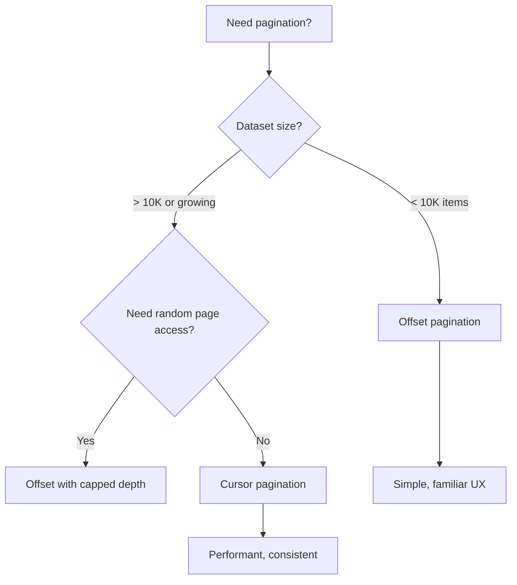
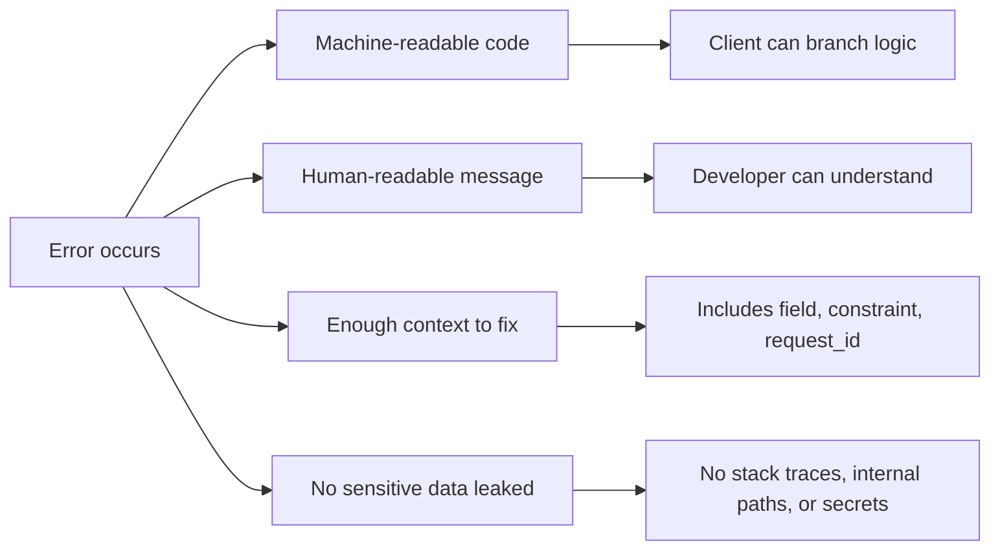

# API Design

Good API design makes the right thing easy and the wrong thing hard. This section covers the practical patterns for URL structure, request/response shaping, pagination, error handling, and bulk operations that production APIs rely on.

## URL Structure

A well-designed URL is predictable, readable, and consistent.

### Anatomy of an API URL

```
https://api.example.com/v1/customers/42/orders?status=shipped&page=2
└─────────┬──────────┘ └┬┘ └────┬────┘ └┘ └──┬──┘ └──────┬───────┘
       base URL        ver  collection    id  sub-res   query params
```

### Design Rules

| Rule | Good | Bad |
|------|------|-----|
| Use nouns for resources | `/invoices` | `/getInvoices` |
| Plural for collections | `/users` | `/user` |
| IDs in path for specifics | `/users/42` | `/users?id=42` |
| Nest for relationships | `/users/42/posts` | `/posts?user_id=42` (acceptable for filtering) |
| Max 2 levels of nesting | `/users/42/posts` | `/users/42/posts/7/comments/3/likes` |
| Actions as sub-resources | `/orders/42/cancel` | `/cancelOrder?id=42` |
| Consistent naming | `snake_case` or `camelCase` (pick one) | Mixing conventions |

### When Nesting Gets Too Deep

If you need more than two levels, flatten:

```
# Instead of:
GET /companies/5/departments/3/employees/42/reviews

# Use:
GET /employees/42/reviews
GET /reviews?employee_id=42
```

## Request and Response Design

### Request Bodies

Use JSON by default. Structure payloads clearly:

```json
// POST /api/orders
{
  "customer_id": 42,
  "shipping_address": {
    "street": "123 Main St",
    "city": "Barcelona",
    "country": "ES",
    "postal_code": "08001"
  },
  "items": [
    { "product_id": 101, "quantity": 2 },
    { "product_id": 205, "quantity": 1 }
  ],
  "notes": "Leave at reception"
}
```

### Response Envelopes

Two common patterns — choose one and be consistent:

```json
// Pattern 1: Direct resource (simpler, preferred for single items)
{
  "id": 1234,
  "status": "confirmed",
  "total": 149.97,
  "created_at": "2024-03-15T10:30:00Z"
}

// Pattern 2: Envelope (useful for collections with metadata)
{
  "data": [...],
  "meta": {
    "total": 342,
    "page": 2,
    "per_page": 20
  },
  "links": {
    "next": "/api/orders?page=3",
    "prev": "/api/orders?page=1"
  }
}
```

### Field Naming

| Convention | Format | Common In |
|-----------|--------|-----------|
| snake_case | `created_at`, `order_id` | Python APIs, Ruby, PostgreSQL |
| camelCase | `createdAt`, `orderId` | JavaScript/TypeScript APIs, Java |

Pick one convention for the entire API. Don't mix.

## Filtering, Sorting, and Searching

### Filtering

Use query parameters for filtering collections:

```http
# Simple equality
GET /api/products?category=electronics&in_stock=true

# Range filters
GET /api/orders?created_after=2024-01-01&created_before=2024-03-01

# Multiple values (comma-separated)
GET /api/products?color=red,blue,green

# Comparison operators (when needed)
GET /api/products?price[gte]=10&price[lte]=100
```

### Sorting

```http
# Single field sort
GET /api/products?sort=price

# Descending (prefix with minus)
GET /api/products?sort=-created_at

# Multiple fields
GET /api/products?sort=-featured,price
```

### Full-text Search

```http
# Dedicated search parameter
GET /api/products?q=wireless+headphones

# Search with filters
GET /api/products?q=headphones&category=electronics&sort=-rating
```

## Pagination

Pagination is essential for any collection that can grow unboundedly. Two main approaches exist:

### Offset-Based Pagination

```http
GET /api/orders?page=3&per_page=20
# or equivalently:
GET /api/orders?offset=40&limit=20
```

```json
{
  "data": [...],
  "meta": {
    "total": 342,
    "page": 3,
    "per_page": 20,
    "total_pages": 18
  }
}
```

### Cursor-Based Pagination

```http
GET /api/orders?limit=20&after=eyJpZCI6MTIzNH0=
```

```json
{
  "data": [...],
  "meta": {
    "has_next": true,
    "next_cursor": "eyJpZCI6MTI1NH0=",
    "has_prev": true,
    "prev_cursor": "eyJpZCI6MTIzNX0="
  }
}
```

### Comparison

| Aspect | Offset | Cursor |
|--------|--------|--------|
| Jump to page N | ✅ Easy | ❌ Not possible |
| Show total count | ✅ Natural | ⚠️ Requires extra query |
| Performance at depth | ❌ Degrades (`OFFSET 10000`) | ✅ Constant time |
| Consistency during writes | ❌ Items can shift | ✅ Stable traversal |
| Implementation complexity | Low | Medium |
| Best for | Admin panels, small datasets | Feeds, timelines, large datasets |



### Cursor Encoding

Cursors are typically base64-encoded JSON containing the sort key:

```python
import base64, json

# Encode cursor
last_item = {"id": 1234, "created_at": "2024-03-15T10:30:00Z"}
cursor = base64.b64encode(json.dumps(last_item).encode()).decode()
# "eyJpZCI6IDEyMzQsICJjcmVhdGVkX2F0IjogIjIwMjQtMDMtMTVUMTA6MzA6MDBaIn0="

# Decode on next request
decoded = json.loads(base64.b64decode(cursor))
# Use decoded["id"] and decoded["created_at"] in WHERE clause
```

## Partial Responses (Field Selection)

Let clients request only the fields they need:

```http
# Only return id, name, and email
GET /api/users?fields=id,name,email

# Nested field selection (Google-style)
GET /api/users?fields=id,name,address(city,country)
```

This reduces bandwidth and serialization cost. Especially valuable for mobile clients.

### Response Comparison

```json
// Full response (without field selection)
{
  "id": 42,
  "name": "Ana García",
  "email": "ana@example.com",
  "phone": "+34612345678",
  "address": { "street": "...", "city": "Barcelona", "country": "ES", "postal_code": "08001" },
  "created_at": "2023-01-15T08:00:00Z",
  "updated_at": "2024-03-10T14:22:00Z",
  "preferences": { ... },
  "metadata": { ... }
}

// Partial response (fields=id,name,email)
{
  "id": 42,
  "name": "Ana García",
  "email": "ana@example.com"
}
```

## Bulk Operations

When clients need to create, update, or delete multiple resources at once:

### Batch Create

```http
POST /api/products/batch
Content-Type: application/json

{
  "items": [
    { "name": "Widget A", "price": 9.99 },
    { "name": "Widget B", "price": 14.99 },
    { "name": "Widget C", "price": 7.49 }
  ]
}
```

### Response: Partial Success

```json
{
  "results": [
    { "index": 0, "status": 201, "data": { "id": 501, "name": "Widget A" } },
    { "index": 1, "status": 201, "data": { "id": 502, "name": "Widget B" } },
    { "index": 2, "status": 422, "error": { "code": "DUPLICATE", "message": "Product already exists" } }
  ],
  "summary": {
    "total": 3,
    "succeeded": 2,
    "failed": 1
  }
}
```

The overall HTTP status should be **207 Multi-Status** when results are mixed, or **201** if all succeed.

### Batch Delete

```http
DELETE /api/products/batch
Content-Type: application/json

{
  "ids": [501, 502, 503]
}
```

### Bulk Operation Design Rules

| Rule | Reason |
|------|--------|
| Cap batch size (e.g., max 100 items) | Prevent timeouts and memory issues |
| Return per-item status | Client needs to know which items failed |
| Make operations atomic OR report partial results | Don't leave client guessing |
| Use 207 Multi-Status for mixed results | Correct HTTP semantics |
| Support idempotency keys per item | Enable safe retries |

## Error Format Standardisation

Consistent error responses save hours of debugging. Use RFC 7807 (Problem Details for HTTP APIs) or a similar structured format:

### RFC 7807 Format

```json
{
  "type": "https://api.example.com/errors/insufficient-funds",
  "title": "Insufficient Funds",
  "status": 422,
  "detail": "Account balance is €12.50 but transaction requires €89.99.",
  "instance": "/api/payments/txn-789"
}
```

### Extended Error Format (with field-level errors)

```json
{
  "type": "https://api.example.com/errors/validation-error",
  "title": "Validation Error",
  "status": 422,
  "detail": "One or more fields failed validation.",
  "errors": [
    {
      "field": "email",
      "code": "INVALID_FORMAT",
      "message": "Must be a valid email address"
    },
    {
      "field": "age",
      "code": "OUT_OF_RANGE",
      "message": "Must be between 18 and 120"
    }
  ],
  "request_id": "req-abc-123"
}
```

### Error Design Principles



| Principle | Do | Don't |
|-----------|-----|-------|
| Be specific | `"email format invalid"` | `"bad request"` |
| Be actionable | `"Retry after 30 seconds"` | `"rate limited"` |
| Be safe | `"Authentication failed"` | `"Password wrong for user admin"` |
| Be consistent | Same structure for all errors | Different shapes per endpoint |
| Include correlation | `request_id` for support lookup | No way to trace the request |

## Timestamps and Dates

Always use ISO 8601 with timezone:

```json
{
  "created_at": "2024-03-15T10:30:00Z",
  "updated_at": "2024-03-15T14:22:33.456Z",
  "scheduled_for": "2024-04-01T09:00:00+02:00"
}
```

| Rule | Format | Example |
|------|--------|---------|
| UTC for storage | `...Z` suffix | `2024-03-15T10:30:00Z` |
| Include timezone when local time matters | `±HH:MM` offset | `2024-03-15T10:30:00+02:00` |
| Date-only fields | `YYYY-MM-DD` | `2024-03-15` |
| Duration | ISO 8601 duration | `PT2H30M` (2 hours 30 minutes) |

## Key Takeaways

1. **URLs are addresses, not commands** — use nouns, keep them predictable, limit nesting depth
2. **Cursor pagination outperforms offset at scale** — use offset only when you need random page access
3. **Partial responses save bandwidth** — let clients specify which fields they need
4. **Bulk operations need per-item status** — one failed item shouldn't sink the whole batch
5. **Standardise errors from day one** — RFC 7807 gives you a solid foundation
6. **Pick conventions and stick to them** — consistency matters more than which convention you choose
7. **Always include a request_id** — you'll need it when debugging production issues at 3am
