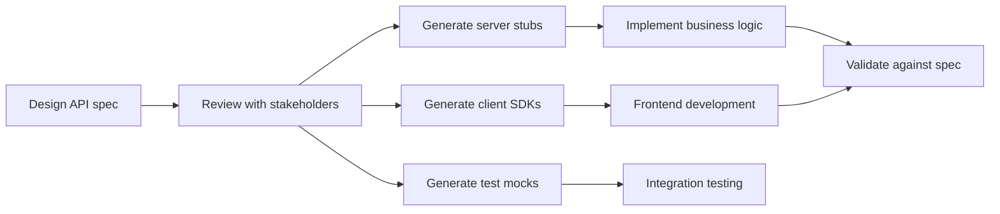
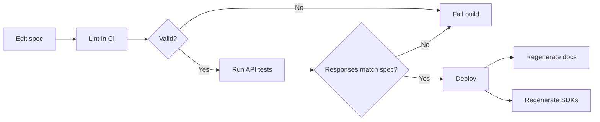

# OpenAPI & Documentation

A well-documented API is a usable API. The OpenAPI Specification (formerly Swagger) provides a machine-readable description of your API that powers documentation, code generation, testing, and validation.

## What is OpenAPI?

OpenAPI is a standard for describing REST APIs. It's a YAML or JSON document that describes every endpoint, parameter, request body, response, and authentication mechanism your API offers.

### OpenAPI Document Structure

```yaml
openapi: 3.1.0
info:
  title: Orders API
  description: API for managing customer orders
  version: 1.2.0
  contact:
    name: Platform Team
    email: platform@example.com

servers:
  - url: https://api.example.com/v1
    description: Production
  - url: https://staging-api.example.com/v1
    description: Staging

paths:
  /orders:
    get: ...
    post: ...
  /orders/{id}:
    get: ...
    put: ...
    delete: ...

components:
  schemas: ...
  securitySchemes: ...

security:
  - bearerAuth: []
```

### Key Sections

| Section | Purpose | Contains |
|---------|---------|----------|
| `info` | API metadata | Title, version, description, contact |
| `servers` | Base URLs | Production, staging, dev environments |
| `paths` | Endpoints | All routes with operations |
| `components` | Reusable definitions | Schemas, parameters, security, responses |
| `security` | Global auth requirements | Default security schemes |
| `tags` | Grouping | Logical grouping of operations |

## Schema Definition

Schemas define the shape of request and response bodies:

```yaml
components:
  schemas:
    Order:
      type: object
      required:
        - customer_id
        - items
      properties:
        id:
          type: integer
          readOnly: true
          example: 1234
        customer_id:
          type: integer
          description: ID of the customer placing the order
          example: 42
        status:
          type: string
          enum: [pending, confirmed, shipped, delivered, cancelled]
          default: pending
        items:
          type: array
          minItems: 1
          items:
            $ref: '#/components/schemas/OrderItem'
        total:
          type: number
          format: double
          readOnly: true
          example: 149.97
        created_at:
          type: string
          format: date-time
          readOnly: true

    OrderItem:
      type: object
      required:
        - product_id
        - quantity
      properties:
        product_id:
          type: integer
        quantity:
          type: integer
          minimum: 1
          maximum: 100
        unit_price:
          type: number
          format: double
          readOnly: true

    Error:
      type: object
      required:
        - type
        - title
        - status
      properties:
        type:
          type: string
          format: uri
        title:
          type: string
        status:
          type: integer
        detail:
          type: string
        request_id:
          type: string
```

### Path Definition Example

```yaml
paths:
  /orders:
    get:
      summary: List orders
      description: Returns a paginated list of orders for the authenticated user
      operationId: listOrders
      tags:
        - Orders
      parameters:
        - name: status
          in: query
          schema:
            type: string
            enum: [pending, confirmed, shipped, delivered, cancelled]
        - name: page
          in: query
          schema:
            type: integer
            default: 1
            minimum: 1
        - name: per_page
          in: query
          schema:
            type: integer
            default: 20
            minimum: 1
            maximum: 100
      responses:
        '200':
          description: Successful response
          content:
            application/json:
              schema:
                type: object
                properties:
                  data:
                    type: array
                    items:
                      $ref: '#/components/schemas/Order'
                  meta:
                    $ref: '#/components/schemas/PaginationMeta'
        '401':
          $ref: '#/components/responses/Unauthorized'

    post:
      summary: Create an order
      operationId: createOrder
      tags:
        - Orders
      requestBody:
        required: true
        content:
          application/json:
            schema:
              $ref: '#/components/schemas/CreateOrderRequest'
            example:
              customer_id: 42
              items:
                - product_id: 101
                  quantity: 2
      responses:
        '201':
          description: Order created
          headers:
            Location:
              schema:
                type: string
              description: URL of the created order
          content:
            application/json:
              schema:
                $ref: '#/components/schemas/Order'
        '422':
          $ref: '#/components/responses/ValidationError'
```

## Security Schemes

```yaml
components:
  securitySchemes:
    bearerAuth:
      type: http
      scheme: bearer
      bearerFormat: JWT
      description: JWT access token from OAuth2 flow

    apiKey:
      type: apiKey
      in: header
      name: X-API-Key
      description: API key for server-to-server access

    oauth2:
      type: oauth2
      flows:
        authorizationCode:
          authorizationUrl: https://auth.example.com/authorize
          tokenUrl: https://auth.example.com/token
          scopes:
            read:orders: Read order data
            write:orders: Create and modify orders
```

## Contract-First Development

In contract-first (or design-first) development, you write the OpenAPI spec *before* writing any code. The spec becomes the source of truth.



### Contract-First vs Code-First

| Aspect | Contract-First | Code-First |
|--------|---------------|------------|
| Spec is source of truth | ✅ | ❌ (code is) |
| Frontend can start early | ✅ | ❌ (waits for implementation) |
| API consistency | High (designed holistically) | Variable (grows organically) |
| Initial effort | Higher (design upfront) | Lower (just start coding) |
| Spec drift risk | Low | High (spec and code diverge) |
| Best for | Multi-team projects, public APIs | Small teams, rapid prototyping |

### Code Generation

From an OpenAPI spec, you can generate:

| Generated Artifact | Tool | Purpose |
|-------------------|------|---------|
| Server stubs | openapi-generator, swagger-codegen | Scaffold endpoint handlers |
| Client SDKs | openapi-generator | Type-safe API clients in any language |
| TypeScript types | openapi-typescript | Frontend type safety |
| Mock servers | Prism, WireMock | Test without real backend |
| Validation middleware | express-openapi-validator | Request/response validation |
| Test cases | Schemathesis | Property-based API testing |

```bash
# Generate Python client from spec
openapi-generator generate \
  -i openapi.yaml \
  -g python \
  -o ./generated/python-client

# Generate TypeScript types
npx openapi-typescript openapi.yaml -o src/api-types.ts

# Start mock server
prism mock openapi.yaml
```

## Documentation Tools

### Swagger UI

Interactive documentation that lets developers try API calls directly from the browser:

```html
<!-- Self-hosted Swagger UI -->
<div id="swagger-ui"></div>
<script src="https://unpkg.com/swagger-ui-dist/swagger-ui-bundle.js"></script>
<script>
  SwaggerUIBundle({
    url: "/openapi.yaml",
    dom_id: '#swagger-ui',
    presets: [SwaggerUIBundle.presets.apis],
  });
</script>
```

### Redoc

Beautiful, responsive API documentation with three-panel layout:

```html
<!-- Redoc -->
<redoc spec-url="/openapi.yaml"></redoc>
<script src="https://cdn.redoc.ly/redoc/latest/bundles/redoc.standalone.js"></script>
```

### Tool Comparison

| Feature | Swagger UI | Redoc | Stoplight |
|---------|-----------|-------|-----------|
| Try-it-out (live requests) | ✅ | ❌ (premium only) | ✅ |
| Three-panel layout | ❌ | ✅ | ✅ |
| Code samples | Basic | Good | Excellent |
| Customisation | Limited | Good (theming) | Extensive |
| Hosting | Self-hosted / SwaggerHub | Self-hosted / Redocly | Cloud / self-hosted |
| Cost | Free | Free (premium available) | Paid |

## Versioning in Documentation

Document all supported API versions clearly:

```yaml
# Separate specs per version
/docs/v1/openapi.yaml
/docs/v2/openapi.yaml

# Or use server URLs
servers:
  - url: https://api.example.com/v1
    description: Version 1 (stable)
  - url: https://api.example.com/v2
    description: Version 2 (current)
```

### Documenting Deprecation

```yaml
paths:
  /users/{id}/orders:
    get:
      deprecated: true
      summary: List user's orders (DEPRECATED)
      description: |
        **Deprecated since v1.4.** Use `GET /orders?user_id={id}` instead.
        This endpoint will be removed on 2025-06-01.
      x-sunset: "2025-06-01"
```

## Writing Good API Documentation

Beyond the spec, good documentation includes:

### Essential Documentation Sections

| Section | Purpose | Example Content |
|---------|---------|-----------------|
| Getting Started | First successful request in 5 minutes | Auth setup, curl example |
| Authentication | How to get and use tokens | Full OAuth2 walkthrough |
| Errors | How errors work and what codes mean | Error catalogue |
| Pagination | How to traverse collections | Cursor vs offset examples |
| Rate Limits | Limits and how to handle 429s | Headers, backoff strategy |
| Changelog | What changed in each version | Breaking changes highlighted |
| SDKs | Official client libraries | Links, installation, usage |

### Documentation Anti-Patterns

| Anti-Pattern | Problem | Better |
|-------------|---------|--------|
| Auto-generated only | No context, no guides | Supplement with tutorials |
| No examples | Theory without practice | Show real request/response pairs |
| Outdated examples | Erode trust | Automated testing of doc examples |
| Missing error docs | Developers can't handle failures | Document every error code |
| No changelog | Breaking changes surprise consumers | Publish changes before rollout |

## Spec Validation and Testing

Keep your spec accurate by validating it automatically:

```bash
# Lint the OpenAPI spec
spectral lint openapi.yaml

# Validate responses match the spec in tests
# (using express-openapi-validator in Node.js)
app.use(
  OpenApiValidator.middleware({
    apiSpec: './openapi.yaml',
    validateRequests: true,
    validateResponses: true,
  })
);
```

### Continuous Spec Validation



## Key Takeaways

1. **OpenAPI is the industry standard** — learn it once, use it everywhere (docs, codegen, testing, validation)
2. **Contract-first unlocks parallel development** — frontend and backend teams work simultaneously against the agreed spec
3. **Schemas are documentation** — well-typed schemas with descriptions, examples, and constraints ARE your docs
4. **Auto-generation is not enough** — supplement generated reference docs with guides, tutorials, and use-case examples
5. **Validate continuously** — spec lint in CI + response validation in tests catches drift before it reaches consumers
6. **Examples are non-negotiable** — every endpoint should show a real request and response
7. **Document errors as carefully as successes** — developers spend more time debugging failures than celebrating 200s
