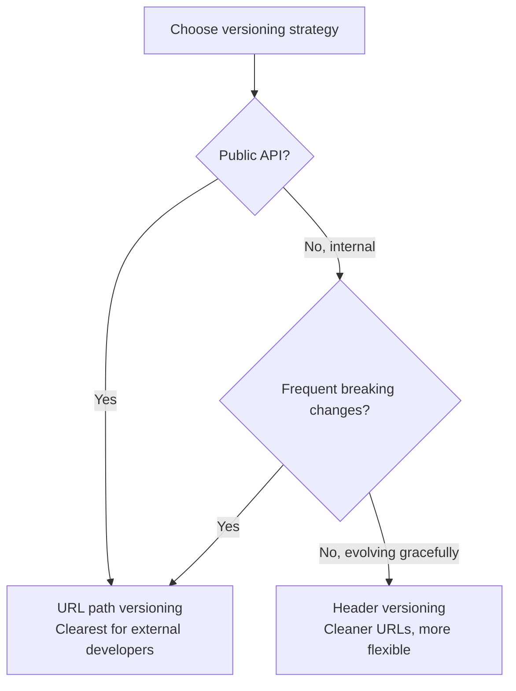
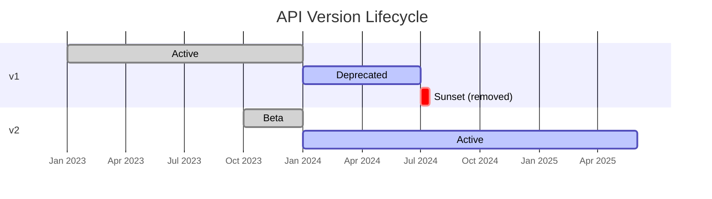
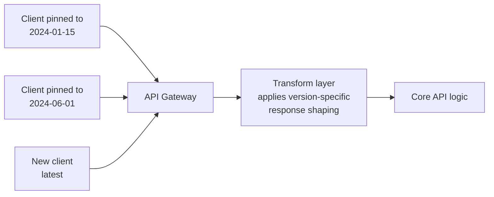

# Versioning & Evolution

APIs evolve. New features arrive, old patterns prove inadequate, business requirements shift. The challenge is evolving your API without breaking existing consumers. This section covers versioning strategies, change classification, and lifecycle management.

## Why Version?

Once an API has consumers, you can't freely change it. Versioning gives you a mechanism to:

- Introduce breaking changes without disrupting existing clients
- Communicate the stability of different API surfaces
- Allow consumers to migrate at their own pace
- Maintain multiple versions during transition periods

## Versioning Strategies

### URL Path Versioning

The most common and visible approach. The version is part of the URL:

```http
GET https://api.example.com/v1/orders
GET https://api.example.com/v2/orders
```

| Pros | Cons |
|------|------|
| Immediately visible | URL represents resource, not version of resource |
| Easy to route at load balancer/gateway | Encourages breaking changes (new version = new URL space) |
| Simple to implement | Clients must update all URLs when migrating |
| Cache-friendly (different URL = different cache) | Hard to version individual endpoints |

### Header Versioning

Version specified in a custom header:

```http
GET https://api.example.com/orders
Api-Version: 2
Accept: application/json

# Alternative: use Accept header with vendor media type
GET https://api.example.com/orders
Accept: application/vnd.example.v2+json
```

| Pros | Cons |
|------|------|
| URLs remain clean and stable | Version is hidden (not visible in browser/logs) |
| Can version individual endpoints | More complex routing |
| Technically "correct" (URI identifies resource) | Harder to test (need to set headers) |
| Can default to latest if no header sent | Caching is more complex (Vary header) |

### Query Parameter Versioning

```http
GET https://api.example.com/orders?version=2
```

| Pros | Cons |
|------|------|
| Simple to implement | Optional params can be forgotten |
| Easy to test in browser | Mixes concerns (version vs filtering) |
| Backward compatible (default version) | Not cache-friendly without Vary |

### Strategy Comparison

| Aspect | URL Path | Header | Query Param |
|--------|----------|--------|-------------|
| Visibility | High | Low | Medium |
| Ease of use | High | Medium | High |
| Routing complexity | Low | Medium | Low |
| Caching | Simple | Complex | Complex |
| Granularity | API-wide | Per-endpoint | Per-request |
| Industry adoption | Most common | Growing | Rare |



### Recommendation

**Use URL path versioning** unless you have a strong reason not to. It's the most widely understood, easiest to debug, and simplest to route.

## Breaking vs Non-Breaking Changes

Not every change requires a new version. Classify changes correctly:

### Non-Breaking Changes (backward compatible)

These are safe to make without versioning:

| Change | Why It's Safe |
|--------|--------------|
| Adding a new optional field to response | Clients ignore unknown fields |
| Adding a new optional query parameter | Existing requests still work |
| Adding a new endpoint | Doesn't affect existing endpoints |
| Adding a new enum value to response | Client should handle unknown values |
| Relaxing validation (accepting more input) | Existing valid input remains valid |
| Adding a new HTTP method to existing resource | Doesn't affect existing methods |
| Improving error messages (same structure) | Same shape, better content |

### Breaking Changes (require new version)

| Change | Why It Breaks |
|--------|--------------|
| Removing a field from response | Clients expecting it will crash |
| Renaming a field | Same as removing + adding |
| Changing a field's type | Deserialization fails |
| Adding a required field to request | Existing requests become invalid |
| Removing an endpoint | 404 for existing integrations |
| Changing URL structure | Bookmarks and hardcoded URLs break |
| Tightening validation | Previously valid requests rejected |
| Changing authentication mechanism | Existing credentials stop working |
| Changing error format | Error handling logic breaks |

### Grey Area Changes

| Change | Impact | Mitigation |
|--------|--------|-----------|
| Adding required field to response | Usually safe (clients ignore extras) | But some strict parsers reject unknown fields |
| Changing default values | Existing behaviour changes silently | Document prominently, consider it breaking |
| Adding a new enum value to request | Old clients can't send it, new clients can | Safe if optional |
| Changing rate limits | May break clients at scale | Announce well in advance |

## Deprecation Strategies

When you need to retire an endpoint or version:

### Deprecation Timeline



### Deprecation Headers

Signal deprecation through HTTP headers:

```http
HTTP/1.1 200 OK
Deprecation: Sun, 01 Jan 2025 00:00:00 GMT
Sunset: Mon, 01 Jul 2025 00:00:00 GMT
Link: <https://api.example.com/v2/orders>; rel="successor-version"
```

| Header | Purpose | RFC |
|--------|---------|-----|
| `Deprecation` | When the endpoint was deprecated | RFC 8594 (draft) |
| `Sunset` | When it will be removed | RFC 8594 |
| `Link` | Where to find the replacement | RFC 8288 |

### Deprecation Announcement Checklist

1. **Announce** — blog post, changelog, email to API consumers
2. **Set timeline** — minimum 6 months for public APIs, 3 months for internal
3. **Add headers** — `Deprecation` and `Sunset` on affected endpoints
4. **Update docs** — mark deprecated in OpenAPI spec, show migration guide
5. **Monitor usage** — track who's still calling deprecated endpoints
6. **Notify stragglers** — reach out to teams still using old version
7. **Remove** — only after sunset date, with final 410 Gone response

### After Sunset

Return `410 Gone` with a helpful body:

```http
HTTP/1.1 410 Gone
Content-Type: application/json

{
  "type": "https://api.example.com/errors/endpoint-removed",
  "title": "Endpoint Removed",
  "status": 410,
  "detail": "This endpoint was removed on 2025-07-01. Use GET /v2/orders instead.",
  "migration_guide": "https://docs.example.com/migration/v1-to-v2"
}
```

## API Lifecycle Management

### Lifecycle Stages

| Stage | Description | Guarantees |
|-------|-------------|------------|
| **Experimental / Alpha** | Testing internally, may change without notice | None |
| **Beta** | Open for early adopters, may have breaking changes | Basic stability |
| **Stable / GA** | Production-ready, versioned, breaking changes = new version | Full backward compatibility |
| **Deprecated** | Still works, but don't build new integrations | Maintained until sunset |
| **Sunset / Retired** | Removed | None — returns 410 |

### Version Numbering Schemes

| Scheme | Format | Example | Best For |
|--------|--------|---------|----------|
| Integer | `v1`, `v2` | URL path: `/v1/orders` | Simple, major-only versions |
| Semantic (major only) | `v1`, `v2` | Same as above | Most APIs |
| Date-based | `2024-01-15` | Header: `Api-Version: 2024-01-15` | APIs that change frequently (Stripe, Twilio) |
| Semantic full | `1.2.3` | SDK versioning | Client libraries, not APIs |

### Date-Based Versioning (Stripe Model)

```http
GET /v1/orders
Stripe-Version: 2024-01-15
```

Every breaking change gets a date. Clients pin to a date and receive that version's behaviour. This allows the URL to stay at `/v1` forever while still evolving.



## Evolution Without Versioning

Sometimes you can evolve without explicit versioning:

### Additive Changes

The safest evolution strategy — only add, never remove or change:

```json
// v1 response
{ "id": 42, "name": "Widget", "price": 9.99 }

// After evolution (additive — still v1)
{ "id": 42, "name": "Widget", "price": 9.99, "currency": "EUR", "in_stock": true }
```

### Feature Flags in APIs

```http
GET /api/orders
X-Enable-Features: new-pricing,extended-metadata
```

Clients opt into new behaviour. The server returns enhanced responses for opted-in clients while keeping default behaviour unchanged.

### Expand/Contract Pattern

1. **Expand**: Add new field alongside old field
2. **Migrate**: Consumers move to new field
3. **Contract**: Remove old field (breaking change, but all consumers have migrated)

```json
// Phase 1: Expand (both fields present)
{ "name": "Ana García", "full_name": "Ana García" }

// Phase 2: Consumers migrate to full_name

// Phase 3: Contract (remove old field in new version)
{ "full_name": "Ana García" }
```

## Key Takeaways

1. **URL path versioning wins for clarity** — it's visible, debuggable, and universally understood
2. **Not every change needs a new version** — additive changes are backward-compatible by definition
3. **Classify changes rigorously** — removing a field is breaking, adding an optional field is not
4. **Set a deprecation policy and follow it** — minimum 6 months notice for public APIs
5. **Use headers to signal deprecation** — `Sunset` and `Deprecation` headers warn programmatically
6. **Date-based versioning suits rapidly evolving APIs** — Stripe's model is elegant but complex to implement
7. **Plan for coexistence** — you'll always be running multiple versions simultaneously; design your architecture for it
