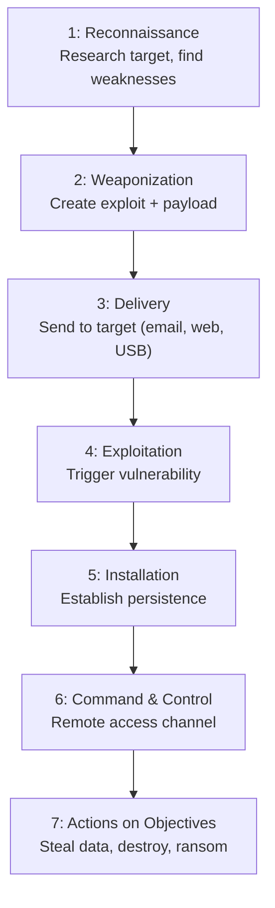
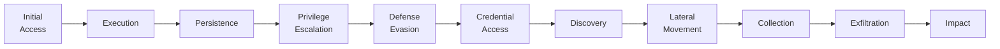
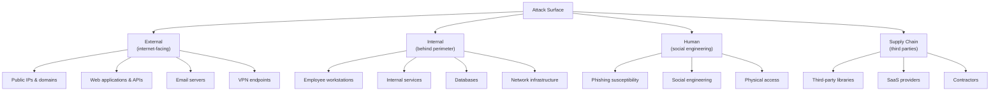

## Why This Matters

You cannot defend what you don't understand. Security is fundamentally adversarial — there are intelligent humans actively trying to break your systems. Understanding their motivations, methods, and tooling is the first step to building effective defenses.

---

## Threat Actors

### Classification by Motivation

| Actor | Motivation | Resources | Persistence | Typical Targets |
|-------|-----------|-----------|-------------|-----------------|
| Script Kiddies | Fun, bragging rights | Low (public tools) | Low | Anything vulnerable |
| Hacktivists | Political/ideological | Low–Medium | Medium | Government, corporations |
| Cybercriminals | Financial gain | Medium–High | High | Anyone with money/data |
| Insiders | Revenge, money, negligence | High (already inside) | Varies | Their own organization |
| Nation-States (APT) | Espionage, sabotage, influence | Very High (unlimited) | Very High | Critical infrastructure, IP |
| Competitors | Business advantage | Medium | Medium | Trade secrets, strategies |

### Advanced Persistent Threats (APTs)

APTs are the most dangerous — state-sponsored groups with:

- Custom malware (zero-days)
- Months/years of patience
- Specific strategic objectives
- Operational security to avoid detection

| Group | Attribution | Known Targets |
|-------|------------|---------------|
| APT28 (Fancy Bear) | Russia (GRU) | NATO, elections, media |
| APT29 (Cozy Bear) | Russia (SVR) | Government, SolarWinds |
| APT41 | China (MSS) | Healthcare, telecom, gaming |
| Lazarus Group | North Korea | Financial institutions, crypto |
| APT33 | Iran | Energy, aerospace |

---

## The Cyber Kill Chain

Developed by Lockheed Martin, models the stages of a targeted attack:

### Defensive Opportunities at Each Phase

| Phase | Detection/Prevention |
|-------|---------------------|
| Reconnaissance | Monitor for scanning, OSINT awareness |
| Weaponization | Threat intelligence (known malware signatures) |
| Delivery | Email filtering, web proxies, endpoint protection |
| Exploitation | Patching, application hardening, sandboxing |
| Installation | Endpoint detection, file integrity monitoring |
| C2 | Network monitoring, DNS analysis, egress filtering |
| Actions | Data Loss Prevention, access controls, encryption |

**Key insight:** The earlier you break the chain, the less damage. Most organizations focus too heavily on the perimeter (delivery) and not enough on post-exploitation detection.

---

## MITRE ATT&CK Framework

A comprehensive knowledge base of adversary behavior based on real-world observations. Unlike the kill chain (linear), ATT&CK is a matrix — attackers can use techniques in any order.

### Tactics (the "why")

### Techniques (the "how") — Examples

| Tactic | Technique | ID | Description |
|--------|-----------|-----|-------------|
| Initial Access | Phishing | T1566 | Spearphishing attachment/link |
| Execution | PowerShell | T1059.001 | Execute commands via PowerShell |
| Persistence | Scheduled Task | T1053 | Create task for recurring execution |
| Priv Escalation | Exploitation for Privilege Escalation | T1068 | Exploit software vulnerability |
| Defense Evasion | Obfuscated Files | T1027 | Encode/encrypt malicious payloads |
| Credential Access | OS Credential Dumping | T1003 | Extract credentials from memory |
| Lateral Movement | Remote Services (RDP) | T1021.001 | Move via Remote Desktop |
| Exfiltration | Exfiltration Over C2 Channel | T1041 | Steal data over existing C2 |

### Using ATT&CK Defensively

1. **Gap analysis** — map your detections to ATT&CK techniques, find blind spots
2. **Threat intelligence** — map known adversary groups to techniques they use
3. **Detection engineering** — write detection rules for specific technique IDs
4. **Red team planning** — simulate specific technique chains
5. **Communication** — common language between teams ("we detected T1059.001")

---

## Attack Surface Management

### What is Attack Surface?

Everything that an attacker could potentially target:

### Reducing Attack Surface

| Strategy | Actions |
|----------|---------|
| Minimize exposure | Remove unnecessary public services, close unused ports |
| Inventory assets | You can't protect what you don't know exists |
| Patch continuously | Unpatched systems are low-hanging fruit |
| Segment networks | Limit what's reachable from any given point |
| Monitor changes | Alert on new exposed services, shadow IT |

---

## Threat Intelligence

### Types

| Type | Audience | Content | Example |
|------|----------|---------|---------|
| Strategic | Executives | Trends, motivations, risk | "Ransomware targeting healthcare increased 300%" |
| Tactical | Security teams | TTPs, attack patterns | "APT29 using OAuth token theft via phishing" |
| Operational | IR teams | Specific campaigns, IOCs | "Campaign X uses domain evil.com, hash abc123" |
| Technical | SOC analysts | Indicators of Compromise | IP addresses, file hashes, domains |

### Indicators of Compromise (IOCs)

| IOC Type | Example | Lifespan |
|----------|---------|----------|
| IP address | 192.168.1.100 | Short (easily changed) |
| Domain | malware-c2.evil.com | Medium |
| File hash (SHA-256) | a1b2c3d4... | Long (specific to file) |
| Email address | <phish@evil.com> | Medium |
| TTP (behavior) | "PowerShell downloads from pastebin" | Long (hard to change) |

**Pyramid of Pain:** The higher up the pyramid (from hashes → TTPs), the harder it is for attackers to change, and the more valuable the detection.

---

## Key Takeaways

1. **Know your adversary** — different threat actors require different defenses
2. **The kill chain is linear; real attacks are not** — use ATT&CK for realistic modeling
3. **Break the chain early** — detection at reconnaissance/delivery is cheapest
4. **Attack surface grows constantly** — continuous inventory and reduction is essential
5. **Threat intelligence drives prioritization** — focus on threats relevant to YOUR organization
6. **Assume breach** — invest in detection and response, not just prevention
