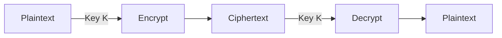
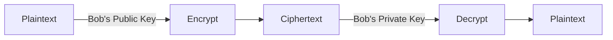
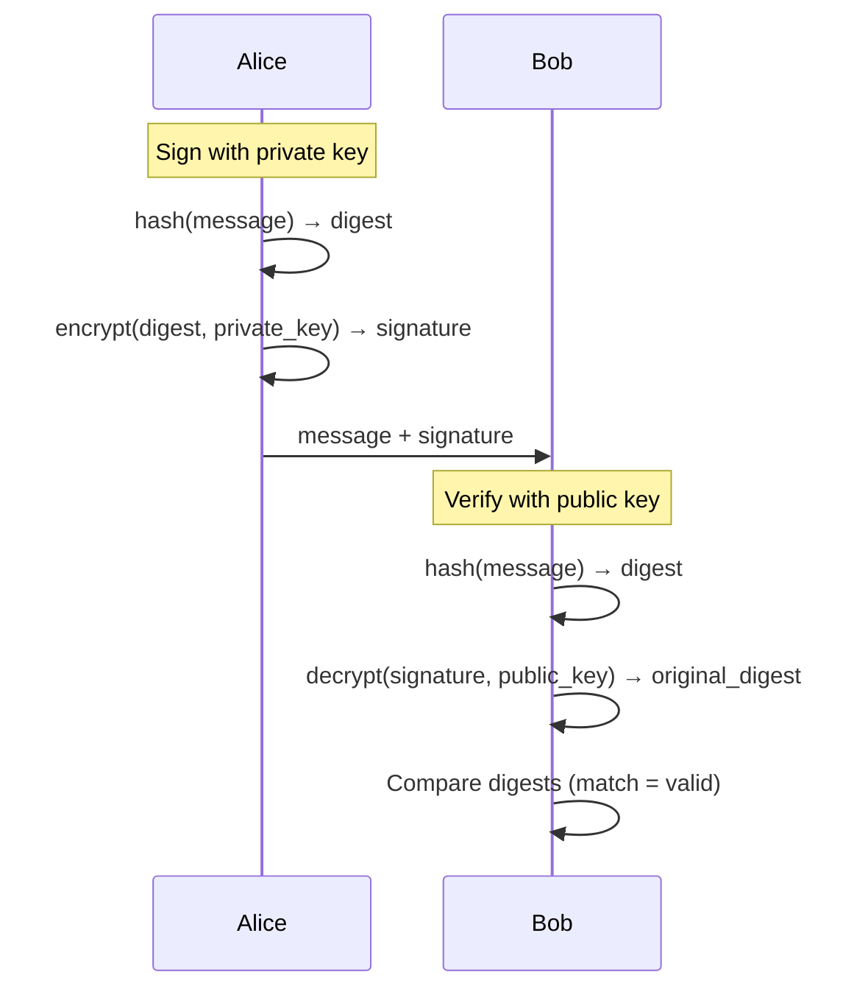
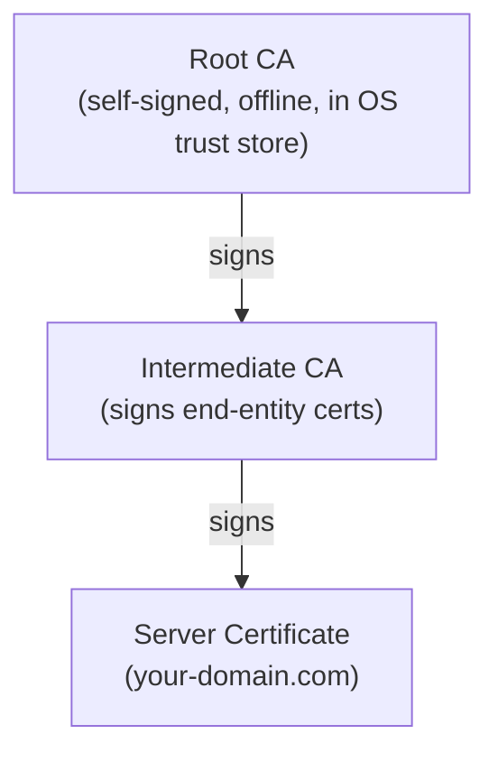
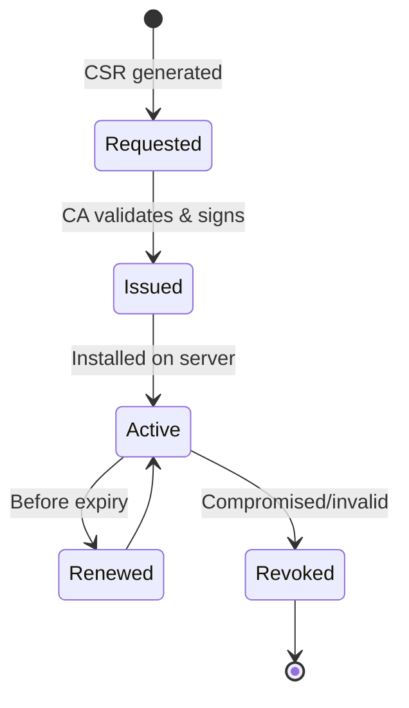
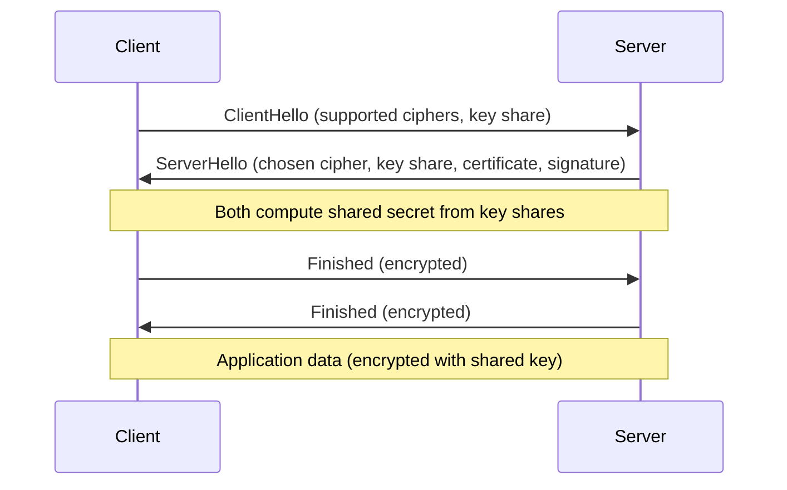

## Why This Matters

Cryptography is the mathematical foundation of all digital security. Every time you visit a website, send a message, or authenticate to a service, cryptographic algorithms are protecting you. Understanding how they work — and how they fail — is essential.

---

## Core Concepts

| Concept | Purpose | Property Provided |
|---------|---------|-------------------|
| Encryption | Hide data from unauthorized readers | Confidentiality |
| Hashing | Create fixed-size fingerprint of data | Integrity |
| Digital Signatures | Prove who created/approved data | Authentication + Non-repudiation |
| Key Exchange | Securely agree on a shared secret | Confidentiality (setup) |

---

## Symmetric Encryption

Same key for encryption and decryption. Fast, efficient for bulk data.

### Algorithms

| Algorithm | Block Size | Key Size | Status | Notes |
|-----------|-----------|----------|--------|-------|
| AES-128 | 128 bits | 128 bits | Secure | Minimum for new systems |
| AES-256 | 128 bits | 256 bits | Secure | Standard for sensitive data |
| ChaCha20 | Stream | 256 bits | Secure | Faster on devices without AES hardware |
| 3DES | 64 bits | 168 bits | Deprecated | Sweet32 attack, retire by 2023 |
| Blowfish | 64 bits | 32–448 bits | Legacy | Small block size limits use |

### Block Cipher Modes

How to encrypt data larger than one block:

| Mode | Properties | Use Case |
|------|-----------|----------|
| ECB | Each block independent (INSECURE — patterns visible) | Never use |
| CBC | Each block XORed with previous ciphertext | Legacy TLS, disk encryption |
| CTR | Turns block cipher into stream cipher | Parallel encryption |
| GCM | CTR + authentication tag (AEAD) | TLS 1.3, modern standard |

**Always use authenticated encryption (GCM, ChaCha20-Poly1305)** — encryption without authentication allows undetected tampering.

### The Key Distribution Problem

If Alice and Bob need the same key, how do they share it securely? This is why asymmetric cryptography exists.

---

## Asymmetric Encryption

Two mathematically linked keys: public (shared freely) and private (kept secret).

### Algorithms

| Algorithm | Based On | Key Size | Use Case |
|-----------|----------|----------|----------|
| RSA | Integer factorization | 2048–4096 bits | Key exchange, signatures (legacy) |
| ECDSA | Elliptic curve discrete log | 256–384 bits | TLS certificates, Bitcoin |
| Ed25519 | Twisted Edwards curve | 256 bits | SSH keys, modern signatures |
| X25519 | Curve25519 | 256 bits | Key exchange (TLS 1.3) |

### Why Not Use Asymmetric for Everything?

| Aspect | Symmetric (AES-256) | Asymmetric (RSA-2048) |
|--------|---------------------|----------------------|
| Speed | ~1 GB/s | ~1 MB/s |
| Key size for equivalent security | 256 bits | 2048+ bits |
| Use case | Bulk data | Key exchange, signatures |

**Solution:** Hybrid encryption — use asymmetric to exchange a symmetric key, then encrypt data with the symmetric key. This is exactly what TLS does.

---

## Hashing

One-way function: input → fixed-size output. Cannot be reversed.

### Properties of a Good Hash

| Property | Meaning |
|----------|---------|
| Deterministic | Same input always produces same output |
| Avalanche effect | Tiny input change → completely different output |
| Pre-image resistance | Cannot find input from output |
| Collision resistance | Cannot find two inputs with same output |

### Algorithms

| Algorithm | Output Size | Status | Use Case |
|-----------|------------|--------|----------|
| MD5 | 128 bits | Broken (collisions) | Legacy checksums only |
| SHA-1 | 160 bits | Broken (collisions) | Do not use |
| SHA-256 | 256 bits | Secure | File integrity, certificates, blockchain |
| SHA-3 | Variable | Secure | Alternative to SHA-2 family |
| BLAKE3 | 256 bits | Secure | High-performance hashing |

### Password Hashing (Different Category)

General-purpose hashes (SHA-256) are too fast for passwords — attackers can try billions per second. Password hashes are intentionally slow:

| Algorithm | Features | Recommendation |
|-----------|----------|----------------|
| bcrypt | Salt + configurable cost factor | Good (widely supported) |
| scrypt | Salt + memory-hard | Good (resists GPU attacks) |
| Argon2id | Salt + memory-hard + time-hard | Best (winner of PHC competition) |

**Never:** store plaintext passwords, use MD5/SHA for passwords, use unsalted hashes.

---

## Digital Signatures

Prove that a message was created by a specific entity and hasn't been modified:

### Use Cases

| Application | What's Signed |
|-------------|--------------|
| TLS certificates | Server's public key + identity |
| Code signing | Software binaries |
| Git commits | Commit content |
| JWT tokens | Claims (payload) |
| Email (S/MIME, PGP) | Message content |

---

## Public Key Infrastructure (PKI)

The trust system that makes HTTPS work.

### Certificate Chain

### X.509 Certificate Contents

| Field | Purpose |
|-------|---------|
| Subject | Who the cert identifies (CN=example.com) |
| Issuer | Who signed it (CA) |
| Public Key | The subject's public key |
| Validity | Not Before / Not After dates |
| Serial Number | Unique identifier |
| Extensions | SANs (alternative names), key usage, constraints |
| Signature | CA's signature over all fields |

### Certificate Lifecycle

### Revocation

| Method | How It Works | Pros | Cons |
|--------|-------------|------|------|
| CRL | CA publishes list of revoked certs | Simple | Large files, infrequent updates |
| OCSP | Real-time query to CA | Current | Privacy (CA sees what you visit) |
| OCSP Stapling | Server fetches and caches OCSP response | Fast, private | Server must support it |
| Certificate Transparency | Public log of all issued certs | Detects mis-issuance | Doesn't revoke, only detects |

---

## TLS (Transport Layer Security)

The protocol that secures HTTPS, email, and most internet communication.

### TLS 1.3 Handshake (Simplified)

### TLS 1.3 vs 1.2

| Aspect | TLS 1.2 | TLS 1.3 |
|--------|---------|---------|
| Handshake round-trips | 2 RTT | 1 RTT (0-RTT resumption) |
| Cipher suites | Many (some insecure) | Only 5 (all secure) |
| Key exchange | RSA or ECDHE | ECDHE only (forward secrecy mandatory) |
| Removed | — | RSA key exchange, CBC, RC4, SHA-1, compression |

### Forward Secrecy

Even if the server's private key is compromised later, past sessions cannot be decrypted — because each session uses ephemeral keys that are discarded.

---

## Post-Quantum Cryptography

Quantum computers threaten current asymmetric algorithms (RSA, ECDSA) via Shor's algorithm. Symmetric and hashing are less affected (just need larger keys).

| Algorithm | Type | Status |
|-----------|------|--------|
| ML-KEM (Kyber) | Key encapsulation | NIST standard (2024) |
| ML-DSA (Dilithium) | Digital signature | NIST standard (2024) |
| SLH-DSA (SPHINCS+) | Digital signature (hash-based) | NIST standard (2024) |

**Action now:** Inventory where you use asymmetric crypto, plan migration timeline, use hybrid approaches (classical + post-quantum) during transition.

---

## Key Takeaways

1. **Symmetric for speed, asymmetric for trust** — real systems use both (hybrid)
2. **Always use authenticated encryption** (AES-GCM, ChaCha20-Poly1305)
3. **Never roll your own crypto** — use well-tested libraries (libsodium, OpenSSL)
4. **Password hashing ≠ general hashing** — use Argon2id or bcrypt, never SHA-256
5. **TLS 1.3 is the standard** — disable TLS 1.0/1.1, prefer 1.3 over 1.2
6. **Forward secrecy is mandatory** — ephemeral key exchange protects past sessions
7. **Post-quantum is coming** — start planning migration now
