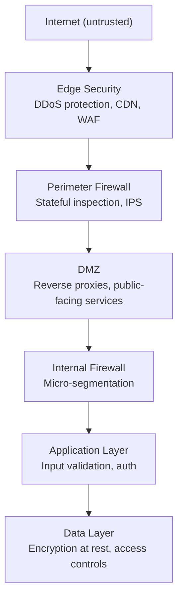
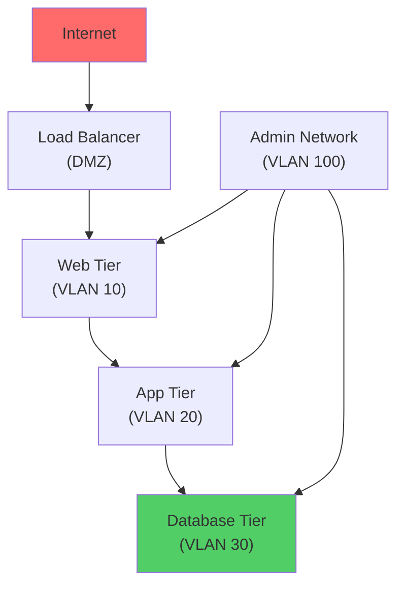
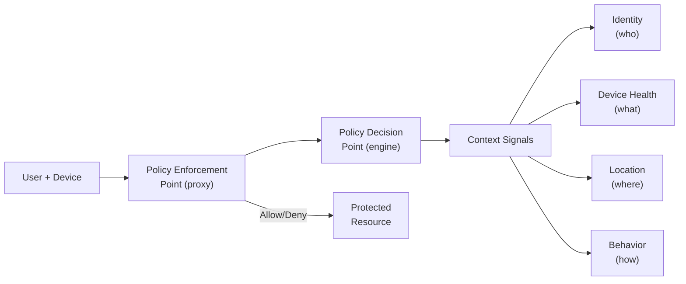

## Why This Matters

Networks carry all data between systems. If an attacker controls the network, they can intercept, modify, or block any communication. Network security creates boundaries, monitors traffic, and ensures only authorized communication occurs.

---

## Defense in Depth

No single control is sufficient. Layer defenses so that if one fails, others still protect:



---

## Firewalls

### Types

| Type | OSI Layer | Inspects | Strengths | Limitations |
|------|-----------|----------|-----------|-------------|
| Packet Filter | L3–L4 | IP, port, protocol | Fast, simple | No state, no content inspection |
| Stateful | L3–L4 | Connection state + packets | Tracks sessions | Can't inspect encrypted traffic |
| Application/WAF | L7 | HTTP content, headers, body | Deep inspection | Slower, complex rules |
| Next-Gen (NGFW) | L3–L7 | All + threat intel + user identity | Comprehensive | Expensive, complex |

### Firewall Rule Design

Rules are evaluated top-to-bottom, first match wins:

| # | Source | Destination | Port | Protocol | Action |
|---|--------|-------------|------|----------|--------|
| 1 | Any | Web Server | 443 | TCP | Allow |
| 2 | Admin VLAN | Any | 22 | TCP | Allow |
| 3 | App Tier | DB Tier | 5432 | TCP | Allow |
| 4 | Any | Any | Any | Any | **Deny** (implicit) |

**Principles:**

- Default deny — block everything, allow only what's needed
- Most specific rules first
- Log denied traffic for visibility
- Review rules regularly (remove stale entries)

---

## Network Segmentation

Divide the network into isolated zones to limit blast radius:



### Segmentation Methods

| Method | Mechanism | Granularity |
|--------|-----------|-------------|
| VLANs | Layer 2 broadcast domains | Subnet-level |
| Subnets + ACLs | Layer 3 routing + access lists | Subnet-level |
| Security Groups | Cloud-native (AWS, Azure) | Instance-level |
| Micro-segmentation | Software-defined (per workload) | Process-level |
| Service Mesh | Sidecar proxies (Istio, Linkerd) | Service-level |

---

## Zero Trust Architecture

Traditional model: "trust inside the perimeter, verify outside."
Zero Trust: "never trust, always verify" — regardless of network location.

### Principles

| Principle | Implementation |
|-----------|---------------|
| Verify explicitly | Authenticate and authorize every request |
| Least privilege access | Just-in-time, just-enough, risk-based |
| Assume breach | Minimize blast radius, encrypt everything, verify end-to-end |

### Zero Trust Components



### Zero Trust vs Traditional

| Aspect | Traditional (Perimeter) | Zero Trust |
|--------|------------------------|------------|
| Trust model | Inside = trusted | Nothing trusted by default |
| Authentication | At perimeter only | Every request |
| Network access | Broad (flat network) | Micro-segmented |
| Encryption | Edge only (TLS termination) | End-to-end (mTLS) |
| Lateral movement | Easy once inside | Blocked by default |

---

## Intrusion Detection and Prevention

### IDS vs IPS

| System | Mode | Action | Placement |
|--------|------|--------|-----------|
| IDS | Passive (mirror/tap) | Alert only | Out-of-band |
| IPS | Inline | Block + alert | In traffic path |

### Detection Methods

| Method | How It Works | Pros | Cons |
|--------|-------------|------|------|
| Signature-based | Match known attack patterns | Low false positives | Misses novel attacks |
| Anomaly-based | Detect deviations from baseline | Catches unknown attacks | High false positives |
| Behavior-based | Detect suspicious sequences | Context-aware | Complex to tune |
| Heuristic | Rule-based scoring | Flexible | Requires expertise |

### Network Detection and Response (NDR)

Modern evolution of IDS — uses ML to detect threats in network traffic:

- Encrypted traffic analysis (metadata, not content)
- Lateral movement detection
- Data exfiltration patterns
- Beaconing (C2 communication patterns)

---

## VPN and Secure Remote Access

### VPN Types

| Type | Use Case | Protocol |
|------|----------|----------|
| Site-to-Site | Connect two networks | IPsec, WireGuard |
| Remote Access | Individual user to network | OpenVPN, WireGuard, IPsec |
| SSL VPN | Browser-based access | TLS (clientless) |

### VPN vs Zero Trust Network Access (ZTNA)

| Aspect | VPN | ZTNA |
|--------|-----|------|
| Access scope | Full network access | Specific applications only |
| Authentication | Once at connection | Per-application, continuous |
| Lateral movement | Possible | Prevented |
| User experience | Tunnel all traffic | Seamless per-app access |
| Scalability | VPN concentrator bottleneck | Cloud-native, distributed |

---

## DNS Security

DNS is often overlooked but critical — it's used in many attacks:

| Attack | Description | Mitigation |
|--------|-------------|-----------|
| DNS Spoofing/Poisoning | Return false DNS responses | DNSSEC |
| DNS Tunneling | Exfiltrate data via DNS queries | Monitor DNS query patterns |
| Domain Hijacking | Take over domain registration | Registrar lock, MFA |
| Typosquatting | Register similar domains | Monitor for lookalikes |
| DDoS via DNS Amplification | Abuse open resolvers | Rate limiting, response rate limiting |

### DNSSEC

Adds cryptographic signatures to DNS responses — clients can verify responses are authentic:

```text
Root (.) → signs → .com → signs → example.com → signs → A record
```

---

## DDoS Protection

### Attack Types

| Layer | Attack | Mechanism | Volume |
|-------|--------|-----------|--------|
| L3/L4 | SYN Flood | Exhaust connection table | High (Gbps) |
| L3/L4 | UDP Flood | Overwhelm bandwidth | Very High |
| L3/L4 | Amplification (DNS, NTP) | Small request → large response | Very High |
| L7 | HTTP Flood | Legitimate-looking requests | Lower volume, harder to filter |
| L7 | Slowloris | Keep connections open slowly | Low volume |

### Mitigation Layers

| Layer | Solution | Provider Examples |
|-------|----------|-------------------|
| Edge/CDN | Absorb volumetric attacks | Cloudflare, AWS Shield, Akamai |
| Network | Rate limiting, blackholing | ISP, transit provider |
| Application | WAF rules, CAPTCHA, rate limiting | Application-level |
| Architecture | Auto-scaling, geographic distribution | Cloud-native |

---

## Network Monitoring

### What to Monitor

| Data Source | Provides | Tools |
|-------------|----------|-------|
| Flow data (NetFlow/IPFIX) | Who talks to whom, how much | ntopng, Elastic |
| Packet capture (PCAP) | Full content of communications | Wireshark, tcpdump, Zeek |
| DNS logs | Domain lookups | Passive DNS, Pi-hole |
| Firewall logs | Allowed/denied connections | SIEM integration |
| Proxy logs | Web traffic details | Squid, Zscaler |

### Indicators of Network Compromise

| Indicator | May Suggest |
|-----------|-------------|
| Unusual outbound traffic volume | Data exfiltration |
| Connections to known-bad IPs/domains | C2 communication |
| DNS queries to random subdomains | DNS tunneling |
| Internal scanning (port sweeps) | Lateral movement |
| Traffic at unusual hours | Automated malware activity |
| Encrypted traffic to unusual ports | Covert channels |

---

## Key Takeaways

1. **Defense in depth** — layer firewalls, segmentation, IDS/IPS, monitoring
2. **Default deny** — block everything, allow only what's explicitly needed
3. **Zero Trust is the future** — network location should not grant trust
4. **Segment aggressively** — limit blast radius of any compromise
5. **Monitor everything** — you can't detect what you can't see
6. **DNS is a blind spot** — monitor DNS traffic, implement DNSSEC
7. **VPNs are being replaced** by ZTNA for better security and UX
