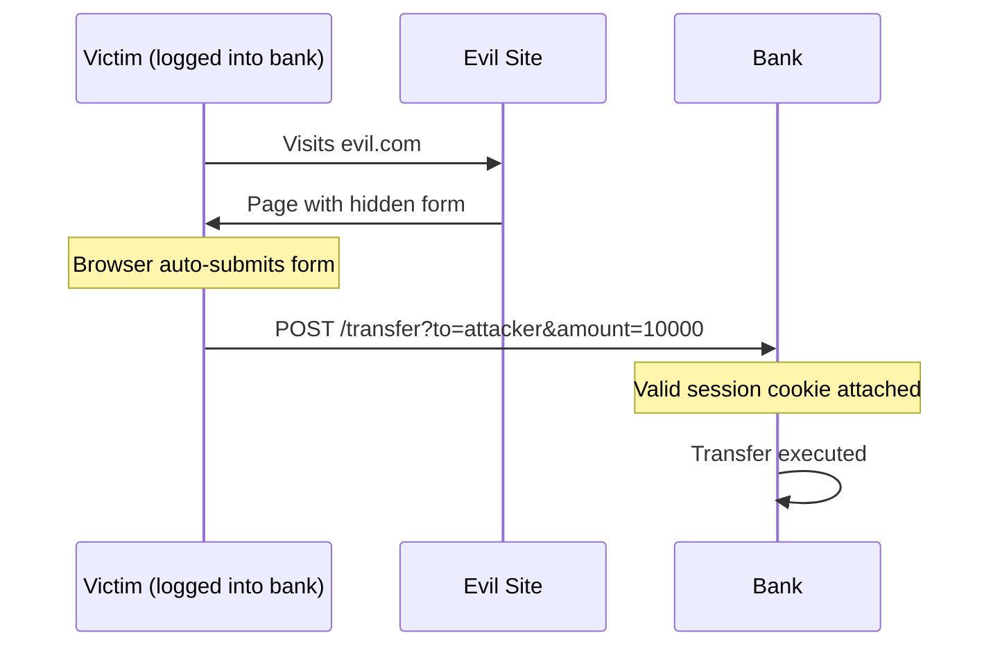
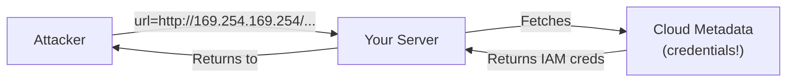

## Why This Matters

Web applications are the most common attack surface. They're internet-facing, complex, and handle sensitive data. Most breaches involve exploiting web application vulnerabilities.

---

## OWASP Top 10 (2021)

The Open Web Application Security Project's definitive list of critical web risks:

| # | Category | Root Cause |
|---|----------|-----------|
| A01 | Broken Access Control | Missing or bypassed authorization checks |
| A02 | Cryptographic Failures | Weak crypto, plaintext data, missing encryption |
| A03 | Injection | Untrusted data interpreted as code/commands |
| A04 | Insecure Design | Flawed architecture, missing threat model |
| A05 | Security Misconfiguration | Default configs, unnecessary features enabled |
| A06 | Vulnerable Components | Outdated libraries with known CVEs |
| A07 | Identification & Auth Failures | Weak passwords, broken session management |
| A08 | Software & Data Integrity Failures | Unsigned updates, insecure deserialization |
| A09 | Logging & Monitoring Failures | Attacks go undetected |
| A10 | Server-Side Request Forgery | Server makes requests to unintended targets |

---

## Injection Attacks

### SQL Injection

The server treats user input as SQL code:

```text
Login form: username = admin' --
Query: SELECT * FROM users WHERE username='admin' --' AND password='anything'
Result: Password check bypassed (commented out)
```

**Types:**

| Type | Behavior | Detection |
|------|----------|-----------|
| Classic (in-band) | Error messages reveal data | Visible in response |
| Union-based | UNION SELECT extracts other tables | Data in response |
| Blind (boolean) | True/false responses leak data bit by bit | Response differences |
| Blind (time-based) | SLEEP() reveals data via timing | Response time |
| Out-of-band | Data sent to attacker's server | DNS/HTTP callbacks |

**Prevention:**

| Method | Effectiveness |
|--------|--------------|
| Parameterized queries (prepared statements) | Complete prevention |
| ORM with parameterized queries | Complete prevention |
| Input validation (allowlist) | Defense in depth |
| WAF rules | Detection layer (bypassable) |
| Least privilege DB user | Limits damage |

### Command Injection

User input executed as OS command:

```text
Input: filename = "; rm -rf /"
Command: convert "; rm -rf /" output.png
```

**Prevention:** Never pass user input to shell commands. Use language APIs instead of `exec()`/`system()`.

### LDAP, NoSQL, Template Injection

Same principle — untrusted data reaches an interpreter:

| Type | Target | Example Payload |
|------|--------|-----------------|
| LDAP Injection | Directory services | `*)(uid=*))(\|(uid=*` |
| NoSQL Injection | MongoDB, etc. | `{"$gt": ""}` |
| Template Injection (SSTI) | Jinja2, Twig, etc. | `{{7*7}}` → `49` |

---

## Cross-Site Scripting (XSS)

Attacker injects JavaScript that executes in victim's browser:

### Types

| Type | Storage | Trigger | Example |
|------|---------|---------|---------|
| Reflected | None (URL parameter) | Victim clicks crafted link | `search?q=<script>steal()</script>` |
| Stored | Database | Any user views the page | Comment containing `<script>` |
| DOM-based | None (client-side) | Client JS processes URL unsafely | `document.write(location.hash)` |

### Impact

- Steal session cookies → account takeover
- Redirect to phishing page
- Keylog user input
- Modify page content (defacement, fake forms)
- Cryptocurrency mining

### Prevention

| Defense | Mechanism |
|---------|-----------|
| Output encoding | Encode `<>&"'` before rendering in HTML |
| Content Security Policy (CSP) | Browser blocks inline scripts, restricts sources |
| HTTPOnly cookies | JavaScript cannot access session cookies |
| Input validation | Reject unexpected characters (defense in depth) |
| Trusted Types | Browser API preventing DOM XSS |

### Content Security Policy (CSP)

```text
Content-Security-Policy: 
  default-src 'self';
  script-src 'self' https://cdn.example.com;
  style-src 'self' 'unsafe-inline';
  img-src *;
  connect-src 'self' https://api.example.com;
```

---

## Cross-Site Request Forgery (CSRF)

Tricks an authenticated user's browser into making unintended requests:



### Prevention

| Defense | How It Works |
|---------|-------------|
| CSRF Token | Unique token per session/request, validated server-side |
| SameSite Cookies | `SameSite=Strict` or `Lax` prevents cross-origin cookie sending |
| Origin/Referer check | Verify request comes from your domain |
| Custom headers | Require `X-Requested-With` (AJAX only, not forms) |

---

## Server-Side Request Forgery (SSRF)

Attacker makes the server fetch resources from unintended locations:



### Common Targets

| Target | What's Exposed |
|--------|---------------|
| Cloud metadata (169.254.169.254) | IAM credentials, instance info |
| Internal services (localhost, 10.x.x.x) | Admin panels, databases |
| Internal APIs | Unauthenticated internal endpoints |
| File system (file://) | Local files |

### Prevention

| Defense | Mechanism |
|---------|-----------|
| Allowlist URLs/domains | Only permit known-good destinations |
| Block internal IP ranges | Deny RFC 1918, link-local, localhost |
| IMDSv2 (AWS) | Requires token for metadata access |
| Network segmentation | Server can't reach sensitive internal services |
| Disable unnecessary URL schemes | Block `file://`, `gopher://`, `dict://` |

---

## Broken Access Control

The #1 OWASP risk. Users accessing resources or actions they shouldn't:

### Common Patterns

| Vulnerability | Example |
|--------------|---------|
| IDOR (Insecure Direct Object Reference) | `/api/users/123` → change to `/api/users/456` |
| Missing function-level access control | Regular user accesses `/admin/delete-user` |
| Privilege escalation | Change `role=user` to `role=admin` in request |
| Path traversal | `../../etc/passwd` |
| CORS misconfiguration | `Access-Control-Allow-Origin: *` with credentials |

### Prevention

| Defense | Implementation |
|---------|---------------|
| Server-side authorization | Check permissions on EVERY request |
| Deny by default | Require explicit grants, not explicit denials |
| Indirect references | Use UUIDs or mapped IDs, not sequential |
| Rate limiting | Prevent enumeration attacks |
| Automated testing | Test access control in CI/CD |

---

## Security Headers

HTTP headers that instruct browsers to enable security features:

| Header | Purpose | Example Value |
|--------|---------|---------------|
| `Content-Security-Policy` | Control resource loading | `default-src 'self'` |
| `Strict-Transport-Security` | Force HTTPS | `max-age=31536000; includeSubDomains` |
| `X-Content-Type-Options` | Prevent MIME sniffing | `nosniff` |
| `X-Frame-Options` | Prevent clickjacking | `DENY` |
| `Referrer-Policy` | Control referrer info | `strict-origin-when-cross-origin` |
| `Permissions-Policy` | Disable browser features | `camera=(), microphone=()` |

---

## API Security

APIs have unique attack vectors beyond traditional web apps:

| Risk | Description | Mitigation |
|------|-------------|-----------|
| Broken Object Level Auth | Access other users' objects via ID | Authorize per-object |
| Broken Authentication | Weak token validation | OAuth 2.0, short-lived tokens |
| Excessive Data Exposure | API returns more than needed | Response filtering, field selection |
| Lack of Rate Limiting | Brute force, DoS | Rate limiting per user/IP |
| Mass Assignment | Client sets fields they shouldn't | Explicit allowlists for writable fields |
| Injection | Same as web apps | Input validation, parameterized queries |

---

## Key Takeaways

1. **Input is untrusted** — validate, sanitize, and encode ALL user input
2. **Parameterized queries** eliminate SQL injection entirely — no exceptions
3. **CSP is essential** — it's the strongest defense against XSS
4. **Authorization on every request** — never trust client-side checks alone
5. **SSRF is cloud-critical** — block metadata access, use IMDSv2
6. **Security headers are free** — enable them all, they cost nothing
7. **APIs need the same rigor** as web UIs — often they get less scrutiny
