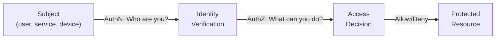
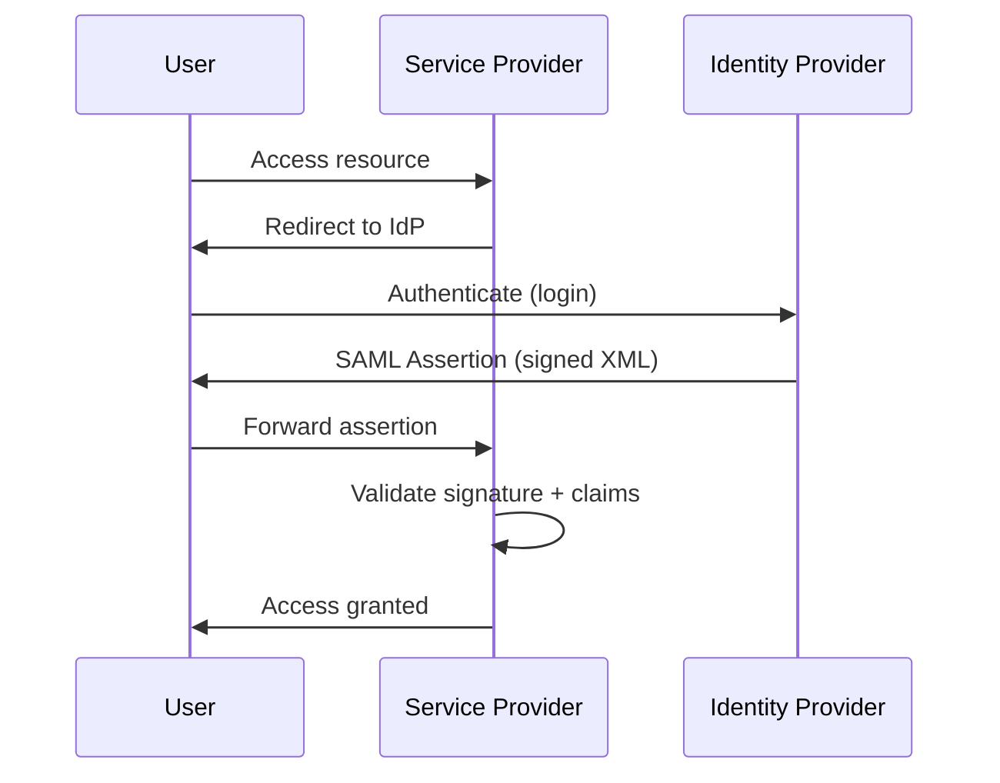
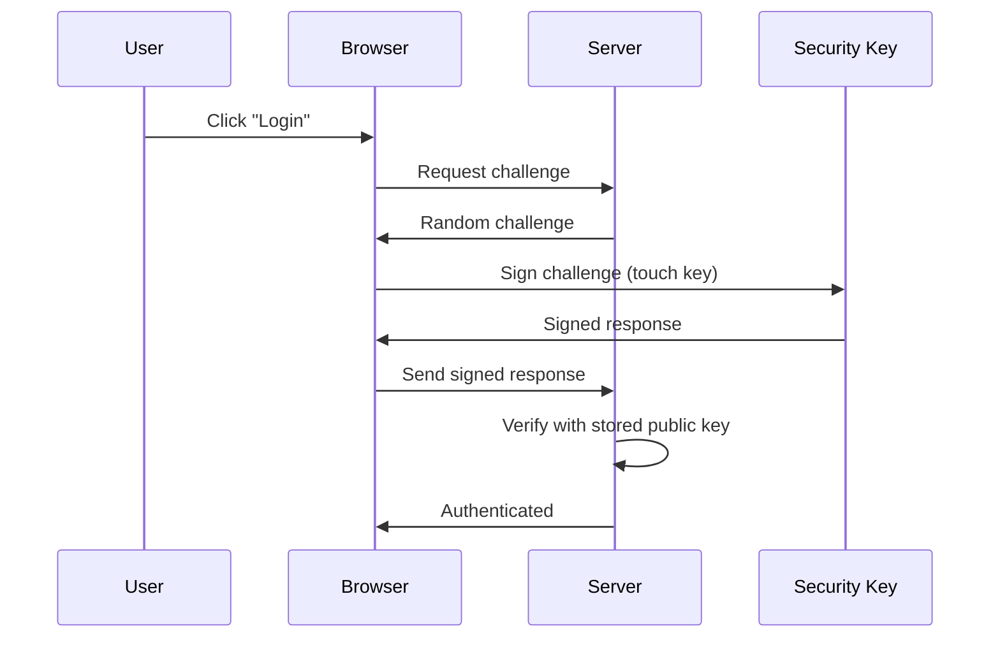
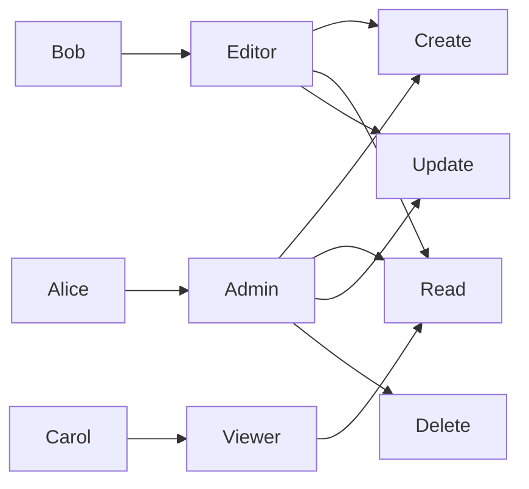
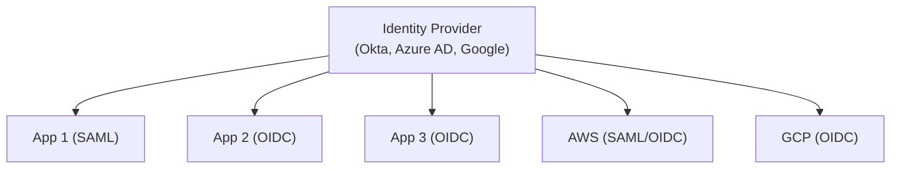

## Why This Matters

Identity is the new perimeter. In cloud and remote-work environments, controlling WHO can access WHAT is the primary security control. IAM failures are behind most breaches — stolen credentials, excessive permissions, and broken authentication.

---

## Core Concepts



| Concept | Question | Mechanism |
|---------|----------|-----------|
| Identification | Who claims to be? | Username, email, certificate CN |
| Authentication (AuthN) | Prove it | Password, MFA, certificate, biometric |
| Authorization (AuthZ) | What's allowed? | Roles, policies, attributes |
| Accounting/Auditing | What did they do? | Logs, audit trail |

---

## Authentication Protocols

### SAML 2.0 (Security Assertion Markup Language)

XML-based SSO protocol, common in enterprise:



### OAuth 2.0

Authorization framework — delegates access without sharing credentials:

| Grant Type | Use Case | Client Type |
|-----------|----------|-------------|
| Authorization Code + PKCE | Web apps, mobile, SPA | Public |
| Client Credentials | Machine-to-machine | Confidential |
| Device Code | Smart TVs, CLI tools | Input-limited |
| Refresh Token | Extend session without re-auth | Any |

### OpenID Connect (OIDC)

Authentication layer built on OAuth 2.0. Adds an **ID Token** (JWT) with user identity:

```text
OAuth 2.0 = "App X can access your photos" (authorization)
OIDC      = "You are alice@example.com" (authentication)
```

### SAML vs OIDC

| Aspect | SAML 2.0 | OIDC |
|--------|----------|------|
| Format | XML | JSON (JWT) |
| Transport | Browser redirects (POST/Redirect) | HTTP API calls |
| Token size | Large (XML) | Compact (JWT) |
| Mobile-friendly | No | Yes |
| Modern apps | Legacy | Standard |
| Use case | Enterprise SSO | Web, mobile, APIs |

### FIDO2 / WebAuthn (Passwordless)

Hardware-based authentication — eliminates passwords entirely:



**Phishing-resistant:** The key is bound to the origin (domain) — it won't respond to a phishing site.

---

## Multi-Factor Authentication (MFA)

| Factor | Type | Examples | Strength |
|--------|------|----------|----------|
| Something you know | Knowledge | Password, PIN | Weakest (phishable) |
| Something you have | Possession | TOTP app, hardware key, phone | Strong |
| Something you are | Biometric | Fingerprint, face, iris | Strong |

### MFA Methods Ranked

| Method | Phishing Resistant | Convenience | Security |
|--------|-------------------|-------------|----------|
| SMS OTP | No (SIM swap) | High | Low |
| Email OTP | No | Medium | Low |
| TOTP (Authenticator app) | No (phishable) | Medium | Medium |
| Push notification | Partially (fatigue attacks) | High | Medium |
| Hardware key (FIDO2) | Yes | Medium | Very High |
| Passkeys | Yes | High | Very High |

**Recommendation:** FIDO2 hardware keys or passkeys for high-value accounts. TOTP as minimum baseline.

---

## Authorization Models

### RBAC (Role-Based Access Control)

Assign permissions to roles, assign roles to users:



**Pros:** Simple, auditable, widely supported.
**Cons:** Role explosion in complex systems, no context awareness.

### ABAC (Attribute-Based Access Control)

Decisions based on attributes of subject, resource, action, and environment:

```text
Policy: ALLOW IF
  subject.department == resource.department
  AND subject.clearance >= resource.classification
  AND environment.time BETWEEN 09:00 AND 18:00
  AND action IN ["read", "list"]
```

**Pros:** Fine-grained, context-aware, flexible.
**Cons:** Complex to manage, harder to audit.

### ReBAC (Relationship-Based Access Control)

Authorization based on relationships between entities (used by Google Zanzibar, OpenFGA):

```text
document:readme#viewer@user:alice     (Alice can view readme)
folder:docs#owner@user:bob            (Bob owns docs folder)
document:readme#parent@folder:docs    (readme is in docs)
→ Bob can view readme (inherited from folder ownership)
```

### Comparison

| Model | Best For | Complexity | Granularity |
|-------|----------|-----------|-------------|
| RBAC | Most applications | Low | Role-level |
| ABAC | Complex policies, compliance | High | Attribute-level |
| ReBAC | Document/resource sharing, social | Medium | Relationship-level |

---

## Privileged Access Management (PAM)

High-privilege accounts (admin, root, service accounts) are the highest-value targets:

### PAM Controls

| Control | Purpose |
|---------|---------|
| Credential vaulting | Store privileged creds centrally, never on endpoints |
| Just-in-time (JIT) access | Elevate only when needed, auto-revoke after |
| Session recording | Full audit trail of admin actions |
| Approval workflows | Require manager/peer approval for sensitive access |
| Break-glass | Emergency access with full audit + post-incident review |

### Service Account Security

| Risk | Mitigation |
|------|-----------|
| Shared credentials | Unique account per service |
| Never-rotated passwords | Automated rotation (Secrets Manager) |
| Excessive permissions | Least privilege, scoped to specific resources |
| No audit trail | Log all service account actions |
| Orphaned accounts | Regular access reviews, auto-disable unused |

---

## Identity Federation

Single identity, multiple services:



### Benefits

- **Single source of truth** — disable user once, access revoked everywhere
- **Reduced password fatigue** — one login for all services
- **Centralized MFA** — enforce at IdP level
- **Audit trail** — all access decisions logged centrally

### Workload Identity Federation

For machine-to-machine (no human credentials):

```text
CI/CD Pipeline (GitLab) → OIDC token → AWS STS → Temporary credentials
```

No long-lived secrets stored in CI/CD — the pipeline proves its identity via OIDC.

---

## Session Management

| Control | Purpose | Implementation |
|---------|---------|---------------|
| Session timeout | Limit exposure window | Idle timeout (15–30 min) |
| Absolute timeout | Force re-authentication | Max session (8–24 hours) |
| Secure cookies | Prevent theft | `Secure; HttpOnly; SameSite=Strict` |
| Session invalidation | Logout works | Server-side session destruction |
| Concurrent session limits | Detect account sharing | Alert or block on multiple sessions |
| Token rotation | Limit stolen token usefulness | Short-lived access + refresh tokens |

---

## Key Takeaways

1. **Identity is the new perimeter** — in cloud/remote, IAM is your primary control
2. **Passwordless (FIDO2/passkeys) is the goal** — phishing-resistant by design
3. **MFA is mandatory** — SMS is weak, hardware keys are strongest
4. **Least privilege always** — start with zero access, grant only what's needed
5. **Federation centralizes control** — one IdP, revoke once, done everywhere
6. **PAM for privileged accounts** — vault, JIT, record, review
7. **Short-lived tokens > long-lived credentials** — reduce blast radius of theft
