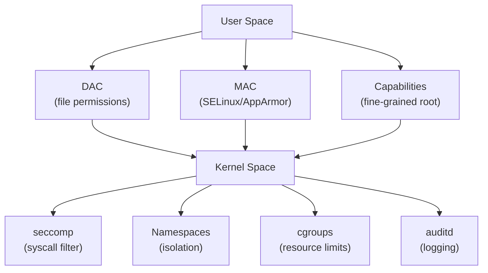
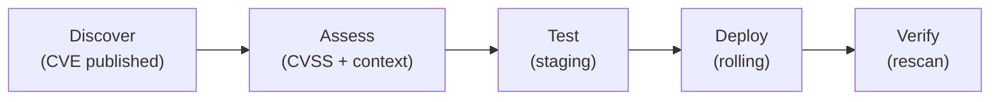

## Why This Matters

The operating system is the foundation of every workload. If the OS is compromised, everything running on it — applications, data, credentials — is compromised. OS hardening reduces the attack surface and limits what an attacker can do even after gaining initial access.

---

## Hardening Principles

| Principle | Actions |
|-----------|---------|
| Minimize attack surface | Remove unused packages, disable unnecessary services |
| Least privilege | Non-root execution, restricted sudo, capability-based access |
| Patch continuously | Automated updates, vulnerability scanning |
| Secure defaults | Disable root login, enforce strong auth |
| Defense in depth | Multiple layers (firewall + MAC + audit) |
| Immutability | Read-only filesystems, rebuild instead of patch |

---

## Linux Security Architecture



### Discretionary Access Control (DAC)

Traditional Unix permissions:

| Permission | File | Directory |
|-----------|------|-----------|
| Read (r/4) | View contents | List files |
| Write (w/2) | Modify contents | Create/delete files |
| Execute (x/1) | Run as program | Enter directory |

Special bits:

| Bit | Effect | Security Implication |
|-----|--------|---------------------|
| SUID | Execute as file owner | Privilege escalation vector |
| SGID | Execute as file group | Group privilege escalation |
| Sticky | Only owner can delete | Protects shared directories (/tmp) |

### Mandatory Access Control (MAC)

Enforces policies that even root cannot override:

| System | Approach | Distribution |
|--------|----------|-------------|
| SELinux | Label-based (type enforcement) | RHEL, CentOS, Fedora |
| AppArmor | Path-based profiles | Ubuntu, SUSE |

SELinux example — a web server can only access its own files:

```text
httpd_t (process) → can read → httpd_sys_content_t (files)
httpd_t (process) → cannot read → user_home_t (home dirs)
```

### Linux Capabilities

Break root's power into granular capabilities:

| Capability | Allows |
|-----------|--------|
| CAP_NET_BIND_SERVICE | Bind to ports < 1024 |
| CAP_NET_RAW | Use raw sockets |
| CAP_SYS_ADMIN | Broad admin operations (avoid!) |
| CAP_DAC_OVERRIDE | Bypass file permission checks |
| CAP_SETUID | Change process UID |

**Best practice:** Drop all capabilities, add back only what's needed.

---

## System Hardening Checklist

### User and Authentication

| Control | Implementation |
|---------|---------------|
| Disable root SSH | `PermitRootLogin no` in sshd_config |
| Key-based SSH only | `PasswordAuthentication no` |
| Strong password policy | PAM modules (pam_pwquality) |
| Account lockout | `pam_faillock` after N failed attempts |
| Sudo restrictions | Specific commands, no NOPASSWD in production |
| Remove unused accounts | Audit `/etc/passwd` regularly |

### Network

| Control | Implementation |
|---------|---------------|
| Host firewall | iptables/nftables — default deny |
| Disable IPv6 (if unused) | Reduces attack surface |
| Restrict outbound | Only allow necessary egress |
| Disable unused protocols | ICMP redirect, IP forwarding |

### Filesystem

| Control | Implementation |
|---------|---------------|
| Separate partitions | `/tmp`, `/var`, `/home` with `noexec,nosuid` |
| File integrity monitoring | AIDE, Tripwire, osquery |
| Restrict world-writable | Find and fix: `find / -perm -002` |
| Encrypt at rest | LUKS, dm-crypt |

### Services

| Control | Implementation |
|---------|---------------|
| Disable unnecessary services | `systemctl disable <service>` |
| Remove unused packages | Minimal base image |
| Restrict service accounts | `nologin` shell, no home directory |
| Sandbox services | systemd units with `ProtectSystem`, `PrivateTmp` |

---

## Patch Management

### Lifecycle



### Patching Strategies

| Strategy | Approach | Risk | Speed |
|----------|----------|------|-------|
| Manual | Admin applies patches | High (delays) | Slow |
| Scheduled | Weekly/monthly windows | Medium | Medium |
| Automated (unattended-upgrades) | Auto-apply security patches | Low (for security) | Fast |
| Immutable infrastructure | Replace instances, don't patch | Lowest | Fastest |

**Immutable is best:** Build new AMI/image with patches → deploy → destroy old instances. No configuration drift.

---

## Endpoint Detection and Response (EDR)

Beyond traditional antivirus — behavioral detection and response:

| Capability | Traditional AV | EDR |
|-----------|---------------|-----|
| Detection method | Signature matching | Behavioral analysis + ML |
| Visibility | File scanning | Process trees, network, registry |
| Response | Quarantine file | Isolate host, kill process, collect forensics |
| Threat hunting | No | Yes (query historical data) |
| Coverage | Known malware | Known + unknown (zero-day) |

### EDR Data Sources

| Source | Detects |
|--------|---------|
| Process creation/termination | Suspicious process chains |
| File system changes | Malware drops, config modifications |
| Network connections | C2 beaconing, lateral movement |
| Registry modifications (Windows) | Persistence mechanisms |
| Memory analysis | Fileless malware, injection |
| DNS queries | C2 domains, tunneling |

---

## Container Security (OS Perspective)

Containers share the host kernel — isolation is weaker than VMs:

### Container Hardening

| Control | Implementation |
|---------|---------------|
| Non-root user | `USER 1000` in Dockerfile |
| Read-only filesystem | `--read-only` flag |
| Drop capabilities | `--cap-drop=ALL --cap-add=<needed>` |
| No privilege escalation | `--security-opt=no-new-privileges` |
| Seccomp profile | Restrict available syscalls |
| Resource limits | CPU/memory limits prevent DoS |
| Minimal base image | Distroless, Alpine, scratch |

### Container Escape Vectors

| Vector | Mitigation |
|--------|-----------|
| Privileged container | Never use `--privileged` in production |
| Mounted Docker socket | Never mount `/var/run/docker.sock` |
| Kernel exploits | Keep host kernel patched |
| Writable hostPath | Avoid host filesystem mounts |

---

## Logging and Auditing

### What to Log

| Category | Events |
|----------|--------|
| Authentication | Login success/failure, MFA events, password changes |
| Authorization | Access denied, privilege escalation attempts |
| System changes | Package installs, config modifications, user creation |
| Network | Firewall denies, new connections, unusual traffic |
| Process | Unexpected processes, privilege changes |

### auditd Rules (Linux)

```bash
# Monitor password file changes
-w /etc/passwd -p wa -k identity
-w /etc/shadow -p wa -k identity

# Monitor sudo usage
-w /etc/sudoers -p wa -k sudo_changes
-a always,exit -F arch=b64 -S execve -F euid=0 -k root_commands

# Monitor network connections
-a always,exit -F arch=b64 -S connect -k network_connect
```

### Log Protection

| Threat | Mitigation |
|--------|-----------|
| Attacker deletes logs | Ship logs off-host immediately (SIEM) |
| Log tampering | Append-only storage, integrity hashing |
| Log overflow (DoS) | Rate limiting, separate partition for /var/log |
| Sensitive data in logs | Redact PII, mask credentials |

---

## Key Takeaways

1. **Minimize attack surface** — remove everything unnecessary (packages, services, users)
2. **MAC (SELinux/AppArmor) limits damage** — even if an app is compromised, it can't escape its policy
3. **Immutable infrastructure > patching** — rebuild, don't repair
4. **EDR replaces antivirus** — behavioral detection catches what signatures miss
5. **Containers are not VMs** — they share a kernel, so host security is critical
6. **Log everything, ship immediately** — if logs stay on the host, attackers delete them
7. **Least privilege at every layer** — users, processes, capabilities, network
