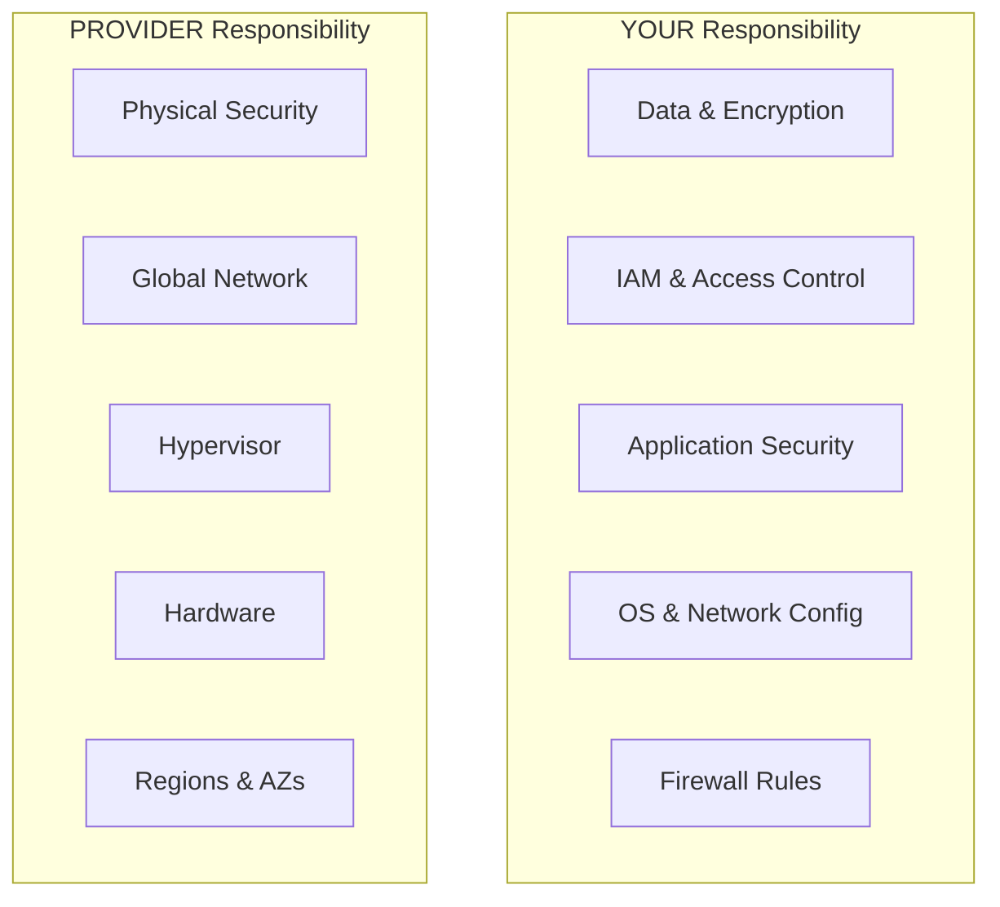
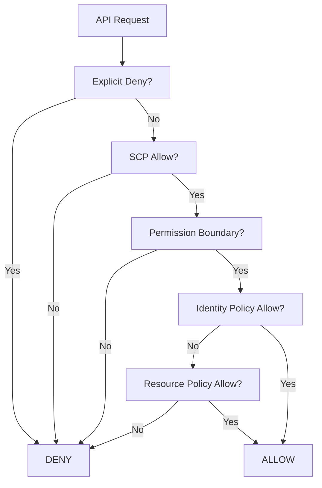
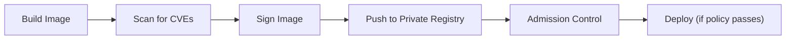
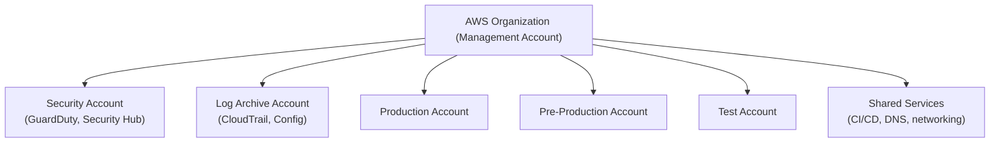

## Why This Matters

Cloud environments are the primary target for modern attacks. Misconfigurations — not sophisticated exploits — cause most cloud breaches. The shared responsibility model means YOU are responsible for securing your workloads, data, and configurations.

---

## Shared Responsibility Model

### Responsibility by Service Type

| Layer | IaaS (EC2) | PaaS (Lambda, RDS) | SaaS (S3, SQS) |
|-------|-----------|-------------------|-----------------|
| Data classification & encryption | You | You | You |
| IAM policies | You | You | You |
| Application code | You | You | N/A |
| OS patching | You | Provider | Provider |
| Network config | You | Shared | Provider |
| Physical infrastructure | Provider | Provider | Provider |

**Key insight:** Moving to managed services (PaaS/SaaS) shifts more responsibility to the provider — but data and access control are ALWAYS yours.

---

## Cloud IAM

### AWS IAM Principles

| Principle | Implementation |
|-----------|---------------|
| Least privilege | Start with zero permissions, add only what's needed |
| No long-lived credentials | Use IAM roles, not access keys |
| MFA everywhere | Require MFA for console and sensitive API calls |
| Separate accounts | Different AWS accounts per environment |
| Service control policies | Guardrails at organization level |

### IAM Policy Evaluation

### Common IAM Mistakes

| Mistake | Risk | Fix |
|---------|------|-----|
| `Action: "*"` | Full account access | Scope to specific actions |
| `Resource: "*"` | Access to all resources | Scope to specific ARNs |
| Long-lived access keys | Credential theft | Use roles, rotate keys |
| No MFA on root | Account takeover | Enable MFA, lock root away |
| Unused permissions | Excessive access | Access Analyzer, regular reviews |
| Cross-account trust too broad | Lateral movement | Restrict with conditions (ExternalId) |

---

## Common Cloud Misconfigurations

### Storage

| Misconfiguration | Impact | Prevention |
|-----------------|--------|-----------|
| Public S3 bucket | Data exposure to internet | S3 Block Public Access (account-level) |
| Unencrypted storage | Data breach if disk stolen/shared | Default encryption (SSE-KMS) |
| No versioning | Data loss, no recovery | Enable versioning + lifecycle |
| Overly broad bucket policy | Unauthorized access | Principle of least privilege |

### Compute

| Misconfiguration | Impact | Prevention |
|-----------------|--------|-----------|
| IMDSv1 enabled | SSRF → credential theft | Require IMDSv2 (token-based) |
| Public instances with admin ports | Direct attack | Private subnets, bastion/SSM |
| Overprivileged instance role | Blast radius | Minimal IAM role per service |
| Unpatched AMIs | Known vulnerability exploitation | Automated AMI pipeline |

### Network

| Misconfiguration | Impact | Prevention |
|-----------------|--------|-----------|
| Security group 0.0.0.0/0 ingress | Open to internet | Restrict to known CIDRs |
| No VPC flow logs | No network visibility | Enable flow logs to S3/CloudWatch |
| Public subnets for private workloads | Unnecessary exposure | Private subnets + NAT gateway |
| Missing encryption in transit | Data interception | TLS everywhere, VPC endpoints |

---

## Cloud Security Posture Management (CSPM)

Automated, continuous scanning for misconfigurations:

### AWS-Native Tools

| Tool | Function |
|------|----------|
| AWS Security Hub | Aggregates findings, compliance checks |
| AWS Config | Track resource configurations, enforce rules |
| IAM Access Analyzer | Find resources shared externally |
| GuardDuty | Threat detection (anomalous API calls, crypto mining) |
| CloudTrail | API audit log (who did what, when) |
| Macie | Discover and protect sensitive data in S3 |

### Third-Party CSPM

| Tool | Strength |
|------|----------|
| Wiz | Agentless, graph-based risk analysis |
| Prisma Cloud (Palo Alto) | Multi-cloud, runtime protection |
| Orca | Agentless, SideScanning |
| Lacework | Anomaly detection, compliance |

### Infrastructure as Code Security (Shift-Left)

Catch misconfigurations BEFORE deployment:

| Tool | Scans | Integration |
|------|-------|-------------|
| Checkov | Terraform, CloudFormation, K8s | CI/CD pipeline |
| tfsec | Terraform | CI/CD pipeline |
| KICS | Multi-framework IaC | CI/CD pipeline |
| Terrascan | Terraform, K8s, Helm | CI/CD pipeline |

---

## Container and Kubernetes Security

### Container Image Security

### Kubernetes Security Layers

| Layer | Controls |
|-------|----------|
| Cluster | API server auth, RBAC, audit logging |
| Network | Network policies (deny by default), service mesh |
| Pod | Security context, non-root, read-only FS |
| Container | Minimal image, no shell, seccomp |
| Supply chain | Signed images, admission webhooks |

### Pod Security Standards

| Level | Restrictions |
|-------|-------------|
| Privileged | No restrictions (admin workloads only) |
| Baseline | Prevents known privilege escalations |
| Restricted | Heavily restricted (best practice for all workloads) |

---

## Cloud Logging and Detection

### Essential Logs

| Log Source | Contains | Retention |
|-----------|----------|-----------|
| CloudTrail | All API calls (who, what, when) | 90 days (default), archive to S3 |
| VPC Flow Logs | Network traffic metadata | 30–90 days |
| GuardDuty Findings | Threat detections | Indefinite (in Security Hub) |
| S3 Access Logs | Bucket access patterns | As needed |
| ALB Access Logs | HTTP request details | 30–90 days |
| CloudWatch Logs | Application logs | Varies by service |

### Detection Patterns

| Indicator | May Suggest |
|-----------|-------------|
| Console login from unusual location | Credential compromise |
| API calls from new IP/user-agent | Stolen access keys |
| Disabled CloudTrail/GuardDuty | Attacker covering tracks |
| Mass S3 downloads | Data exfiltration |
| New IAM user/role creation | Persistence |
| Security group opened to 0.0.0.0/0 | Backdoor |
| EC2 instance in unusual region | Crypto mining |

---

## Multi-Account Strategy

Isolate environments and workloads in separate AWS accounts:

### Benefits

| Benefit | Mechanism |
|---------|-----------|
| Blast radius containment | Compromise of test ≠ compromise of prod |
| Billing isolation | Clear cost attribution |
| IAM boundary | Policies can't cross accounts without explicit trust |
| Compliance | Separate regulated workloads |
| SCPs | Preventive guardrails at OU level |

---

## Key Takeaways

1. **Shared responsibility means YOUR data, YOUR IAM, YOUR config** — always
2. **Misconfigurations cause most cloud breaches** — not sophisticated attacks
3. **Shift left** — scan IaC before deployment (Checkov, tfsec)
4. **No long-lived credentials** — use roles, OIDC federation, temporary tokens
5. **Multi-account isolation** — separate environments, separate blast radius
6. **Enable everything** — CloudTrail, GuardDuty, Config, flow logs (cost is minimal vs. breach cost)
7. **IMDSv2 is mandatory** — blocks the most common cloud SSRF attack
