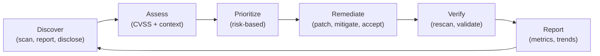
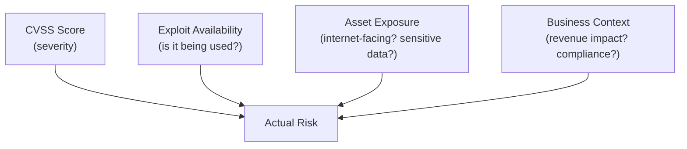
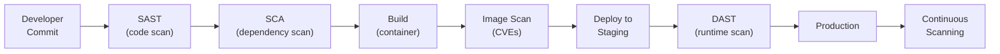
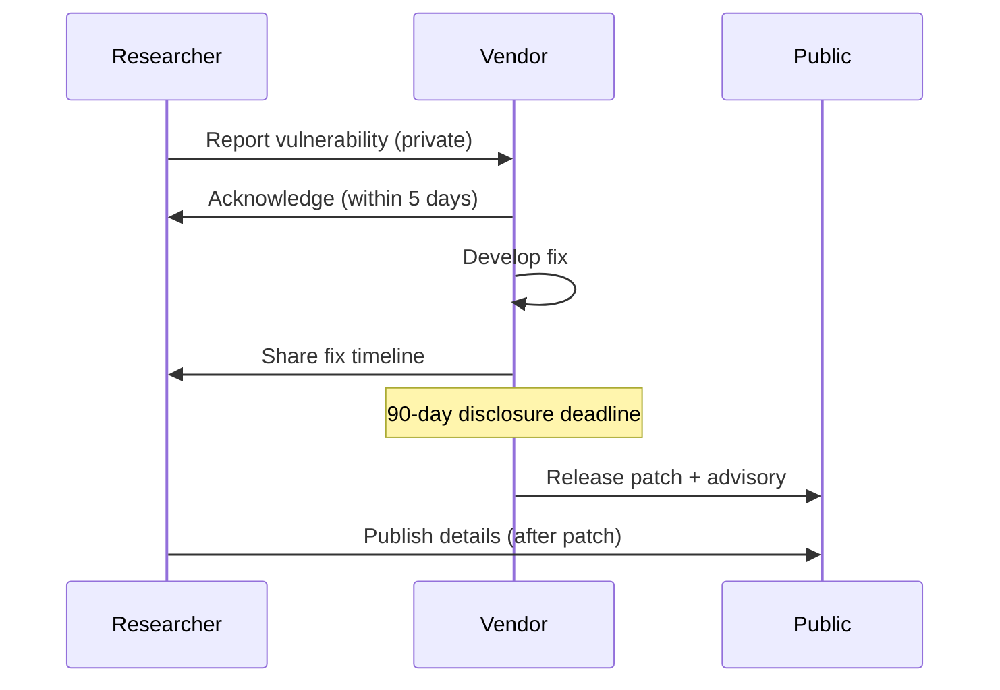

## Why This Matters

Every system has vulnerabilities. The question isn't whether they exist — it's whether you find them before attackers do, and whether you fix the right ones fast enough. Vulnerability management is the continuous process of discovery, assessment, prioritization, and remediation.

---

## Vulnerability Lifecycle



---

## CVE, CWE, and CVSS

### CVE (Common Vulnerabilities and Exposures)

Unique identifier for a specific vulnerability:

```text
CVE-2024-3094 (XZ Utils backdoor)
CVE-2021-44228 (Log4Shell)
CVE-2023-44487 (HTTP/2 Rapid Reset)
```

### CWE (Common Weakness Enumeration)

Categories of vulnerability types (the "class" of bug):

| CWE | Name | Example |
|-----|------|---------|
| CWE-89 | SQL Injection | Unsanitized input in SQL query |
| CWE-79 | Cross-Site Scripting | Unescaped output in HTML |
| CWE-287 | Improper Authentication | Missing auth check |
| CWE-502 | Deserialization of Untrusted Data | Pickle/Java deserialization |
| CWE-918 | Server-Side Request Forgery | Unvalidated URL fetch |
| CWE-798 | Hard-coded Credentials | Password in source code |

### CVSS (Common Vulnerability Scoring System)

Standardized severity scoring (0.0–10.0):

| Metric Group | Factors |
|-------------|---------|
| Base (intrinsic) | Attack vector, complexity, privileges required, user interaction, scope, impact (CIA) |
| Temporal (changes over time) | Exploit maturity, remediation level, report confidence |
| Environmental (your context) | Modified base metrics for your specific environment |

### CVSS Severity Ratings

| Score | Rating | Typical SLA |
|-------|--------|-------------|
| 9.0–10.0 | Critical | 24–48 hours |
| 7.0–8.9 | High | 7 days |
| 4.0–6.9 | Medium | 30 days |
| 0.1–3.9 | Low | 90 days |
| 0.0 | None | Informational |

---

## Beyond CVSS: Risk-Based Prioritization

CVSS alone is insufficient — a Critical CVE in an isolated test system is less urgent than a High CVE in a public-facing production service.

### Factors for Prioritization



| Factor | Question | High Risk If... |
|--------|----------|-----------------|
| CVSS Score | How severe is the vuln? | ≥ 7.0 |
| Exploit in the wild | Are attackers using it? | Yes (CISA KEV catalog) |
| Asset exposure | Is it internet-facing? | Public-facing, no WAF |
| Data sensitivity | What data is at risk? | PII, financial, credentials |
| Compensating controls | Are there mitigations? | No WAF, no segmentation |
| Business criticality | What breaks if exploited? | Revenue-generating service |

### EPSS (Exploit Prediction Scoring System)

Predicts the probability a vulnerability will be exploited in the next 30 days (0–1.0):

| EPSS Score | Interpretation |
|-----------|----------------|
| > 0.9 | Almost certainly exploited — patch immediately |
| 0.5–0.9 | High probability — prioritize |
| 0.1–0.5 | Moderate — schedule remediation |
| < 0.1 | Low probability — normal cycle |

### CISA Known Exploited Vulnerabilities (KEV)

Authoritative list of vulnerabilities actively exploited in the wild. If a CVE is on KEV, it's being used by attackers NOW — treat as emergency.

---

## Scanning Types

### Infrastructure Scanning

| Type | Target | Tools | Frequency |
|------|--------|-------|-----------|
| Network vulnerability scan | Hosts, services, ports | Nessus, Qualys, OpenVAS | Weekly–Monthly |
| Cloud configuration scan | AWS/Azure/GCP resources | Checkov, Prowler, ScoutSuite | Continuous |
| Container image scan | Docker images | Trivy, Grype, Snyk Container | Every build |
| Compliance scan | CIS benchmarks, standards | InSpec, Lynis | Weekly |

### Application Scanning

| Type | When | What It Finds | Limitations |
|------|------|---------------|-------------|
| SAST (Static) | During development | Code-level flaws (injection, hardcoded secrets) | False positives, no runtime context |
| DAST (Dynamic) | Against running app | Runtime vulnerabilities (XSS, auth bypass) | Can't see code, slower |
| IAST (Interactive) | During testing | Combines SAST + DAST (instrumented) | Requires test execution |
| SCA (Composition) | CI/CD pipeline | Vulnerable dependencies | Only known CVEs |

### Scanning Pipeline



---

## Remediation Strategies

| Strategy | When to Use | Example |
|----------|-------------|---------|
| Patch | Fix available, low risk of regression | Apply security update |
| Upgrade | Major version needed | Upgrade library to non-vulnerable version |
| Mitigate | Can't patch immediately | WAF rule, network restriction |
| Compensating control | No fix available (zero-day) | Disable feature, add monitoring |
| Accept | Risk is below threshold | Document decision, set review date |
| Remove | Component unnecessary | Delete unused dependency |

### Remediation SLAs

| Severity | Internet-Facing | Internal | Isolated/Test |
|----------|----------------|----------|---------------|
| Critical | 24–48 hours | 7 days | 30 days |
| High | 7 days | 14 days | 60 days |
| Medium | 30 days | 60 days | 90 days |
| Low | 90 days | 180 days | Best effort |

---

## Software Bill of Materials (SBOM)

A complete inventory of all components in your software:

| Format | Standard | Use Case |
|--------|----------|----------|
| CycloneDX | OWASP | Security-focused, VEX support |
| SPDX | Linux Foundation | License compliance + security |

### Why SBOM Matters

- **Incident response:** "Are we affected by Log4Shell?" → check SBOM instantly
- **Compliance:** Regulatory requirements (US Executive Order 14028)
- **Supply chain visibility:** Know exactly what's in your software
- **Vulnerability tracking:** Continuous monitoring of all components

---

## Vulnerability Disclosure

### Responsible Disclosure Process



### Bug Bounty Programs

| Platform | Type | Payout Range |
|----------|------|-------------|
| HackerOne | Managed platform | $100–$250,000+ |
| Bugcrowd | Managed platform | $100–$100,000+ |
| Private programs | Company-run | Varies |

---

## Metrics and Reporting

### Key Vulnerability Metrics

| Metric | What It Measures | Target |
|--------|-----------------|--------|
| Mean Time to Remediate (MTTR) | Average time from discovery to fix | < SLA per severity |
| Vulnerability density | Vulns per asset or per 1000 LOC | Decreasing trend |
| SLA compliance | % of vulns fixed within SLA | > 95% |
| Scan coverage | % of assets scanned | 100% |
| Reintroduction rate | Vulns that come back after fix | < 5% |
| Risk reduction | Overall risk score trend | Decreasing |

---

## Key Takeaways

1. **CVSS is not enough** — combine with exploit availability, exposure, and business context
2. **CISA KEV = emergency** — if it's on the list, attackers are using it now
3. **Shift left** — find vulnerabilities in code and dependencies before production
4. **SBOM is essential** — you can't protect what you can't inventory
5. **Automate scanning** — continuous, not quarterly
6. **SLAs drive accountability** — define, measure, report
7. **Accept risk explicitly** — document decisions, set review dates, never ignore silently
