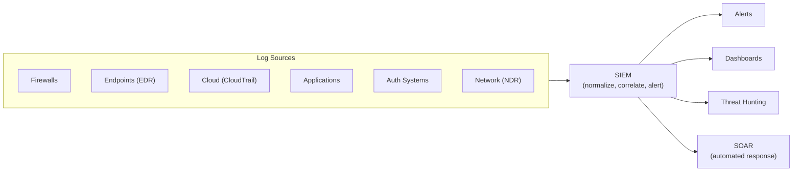
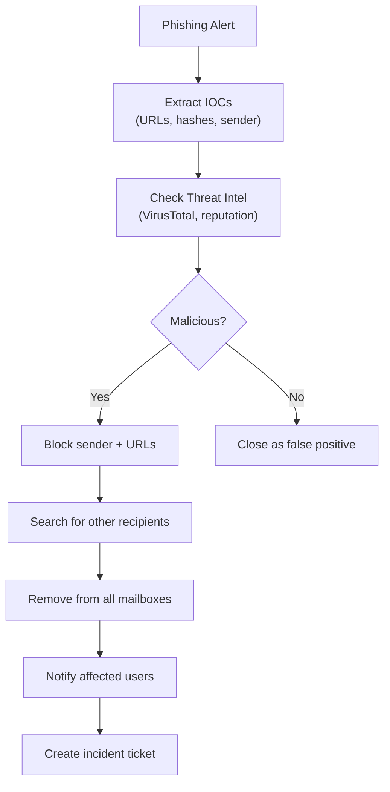
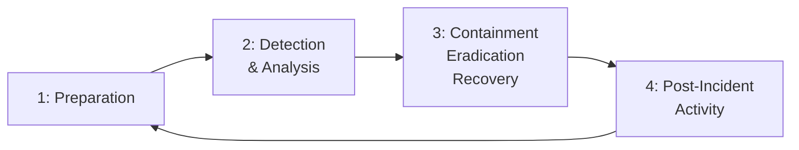
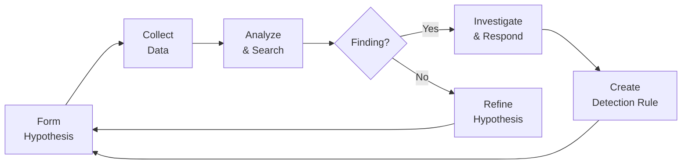

## Why This Matters

Prevention eventually fails. When it does, the speed and quality of your detection and response determines whether an incident is a minor event or a catastrophic breach. Security operations is the 24/7 function that watches, detects, and responds.

---

## Security Operations Center (SOC)

### SOC Tiers

| Tier | Role | Responsibilities |
|------|------|-----------------|
| Tier 1 | Alert Analyst | Triage alerts, initial classification, escalate or close |
| Tier 2 | Incident Responder | Deep investigation, containment, evidence collection |
| Tier 3 | Threat Hunter / Senior Analyst | Proactive hunting, advanced forensics, malware analysis |
| Engineering | Detection Engineer | Build detection rules, tune alerts, automate playbooks |

### SOC Metrics

| Metric | Measures | Target |
|--------|----------|--------|
| Mean Time to Detect (MTTD) | Discovery speed | Minutes–hours |
| Mean Time to Respond (MTTR) | Response speed | Hours |
| Alert volume | Workload | Manageable (not drowning) |
| False positive rate | Alert quality | < 30% |
| Escalation rate | Tier 1 → Tier 2 | 10–20% |
| Coverage | % of ATT&CK techniques detected | Increasing |

---

## SIEM (Security Information and Event Management)

Centralized log aggregation, correlation, and alerting:



### Detection Rule Types

| Type | How It Works | Example |
|------|-------------|---------|
| Threshold | Count exceeds limit | > 10 failed logins in 5 minutes |
| Correlation | Multiple events together | Failed login + successful login + data download |
| Anomaly | Deviation from baseline | User accessing systems they never access |
| Indicator match | Known-bad IOC detected | Connection to known C2 IP |
| Behavioral | Sequence of suspicious actions | Credential dump → lateral movement → exfiltration |

### SIGMA Rules

Vendor-agnostic detection rule format (like Snort rules for logs):

```yaml
title: Suspicious PowerShell Download
status: stable
logsource:
    category: process_creation
    product: windows
detection:
    selection:
        CommandLine|contains|all:
            - 'powershell'
            - 'downloadstring'
    condition: selection
level: high
```

---

## SOAR (Security Orchestration, Automation, and Response)

Automates repetitive SOC tasks:

| Use Case | Automation |
|----------|-----------|
| Phishing email reported | Extract URLs/attachments → scan → block → notify user |
| Malware alert | Isolate host → collect forensics → create ticket |
| Suspicious login | Check geo-location → verify with user → block if unconfirmed |
| Vulnerability found | Enrich with context → assign to team → track SLA |

### Playbook Example: Phishing Response



---

## Incident Response Lifecycle

### NIST SP 800-61 Framework



### Phase 1: Preparation

| Activity | Purpose |
|----------|---------|
| IR plan documented | Everyone knows their role |
| Playbooks for common scenarios | Consistent, fast response |
| Communication plan | Who to notify, when, how |
| Tools ready | Forensic tools, isolation capabilities |
| Training and exercises | Tabletop exercises, red team drills |
| Legal/compliance contacts | Know who to call for breach notification |

### Phase 2: Detection & Analysis

| Activity | Purpose |
|----------|---------|
| Alert triage | Determine if alert is real |
| Scope assessment | How many systems affected? |
| Evidence preservation | Forensic images, log snapshots |
| Timeline construction | What happened, in what order |
| Classification | Type and severity of incident |

### Phase 3: Containment, Eradication, Recovery

| Step | Actions |
|------|---------|
| Short-term containment | Isolate affected systems (network, disable accounts) |
| Evidence collection | Memory dumps, disk images, logs |
| Eradication | Remove malware, close access, patch vulnerability |
| Recovery | Restore from clean backups, rebuild systems |
| Validation | Verify threat is eliminated, monitor for recurrence |

### Phase 4: Post-Incident

| Activity | Output |
|----------|--------|
| Lessons learned meeting | What worked, what didn't |
| Root cause analysis | Why it happened, how to prevent |
| Detection improvements | New rules, better coverage |
| Process updates | Updated playbooks, procedures |
| Metrics | Time to detect, contain, resolve |

---

## Incident Severity Classification

| Severity | Definition | Response | Examples |
|----------|-----------|----------|----------|
| SEV-1 (Critical) | Active breach, data exfiltration, business down | All hands, war room | Ransomware, active APT, mass data theft |
| SEV-2 (High) | Confirmed compromise, contained | IR team engaged | Compromised server, stolen credentials in use |
| SEV-3 (Medium) | Suspicious activity, unconfirmed | Investigation | Unusual login patterns, malware detection |
| SEV-4 (Low) | Policy violation, minor anomaly | Standard process | Failed login attempts, minor misconfiguration |

---

## Digital Forensics

### Evidence Handling

| Principle | Implementation |
|-----------|---------------|
| Chain of custody | Document who handled evidence, when, how |
| Integrity | Hash everything (SHA-256) before and after analysis |
| Preservation | Work on copies, never originals |
| Volatility order | Collect most volatile first (memory → disk → network → logs) |

### Forensic Data Sources

| Source | Contains | Volatility |
|--------|----------|-----------|
| RAM (memory dump) | Running processes, encryption keys, network connections | Very high (lost on reboot) |
| Disk image | Files, deleted files, logs, artifacts | Low |
| Network capture | Traffic content, connections | Medium (if not captured, lost) |
| Cloud logs | API calls, access patterns | Low (if retained) |
| Endpoint telemetry | Process trees, file changes | Low (if EDR deployed) |

### Memory Forensics

What you can find in a memory dump:

- Running and recently terminated processes
- Network connections (including encrypted)
- Encryption keys (BitLocker, TLS session keys)
- Injected code and rootkits
- Command history
- Credentials in memory

---

## Threat Hunting

Proactive search for threats that evade automated detection:

### Hunting Approaches

| Approach | Method | Example |
|----------|--------|---------|
| Hypothesis-driven | "What if APT29 is in our network?" | Search for known APT29 TTPs |
| IOC-driven | Search for known indicators | Query logs for suspicious domains |
| Anomaly-driven | Find statistical outliers | Unusual data volumes, rare processes |
| TTP-driven | Search for technique patterns | PowerShell downloading + executing |

### Hunting Loop



---

## Breach Notification

### Regulatory Requirements

| Regulation | Notification Deadline | Who to Notify |
|-----------|----------------------|---------------|
| GDPR (EU) | 72 hours | Supervisory authority + affected individuals |
| NIS2 (EU) | 24h early warning, 72h full | National CSIRT |
| HIPAA (US) | 60 days | HHS + affected individuals |
| PCI DSS | Immediately | Card brands + acquiring bank |
| SEC (US public companies) | 4 business days | SEC filing (8-K) |

---

## Key Takeaways

1. **Detection speed matters most** — MTTD determines breach impact
2. **Automate the repetitive** — SOAR handles Tier 1 tasks, humans handle judgment
3. **Preparation is everything** — playbooks, training, and tools BEFORE the incident
4. **Preserve evidence first** — you can't investigate what you didn't collect
5. **Post-incident reviews improve everything** — every incident is a learning opportunity
6. **Threat hunting finds what automation misses** — proactive > reactive
7. **Know your notification obligations** — GDPR 72h clock starts at awareness
