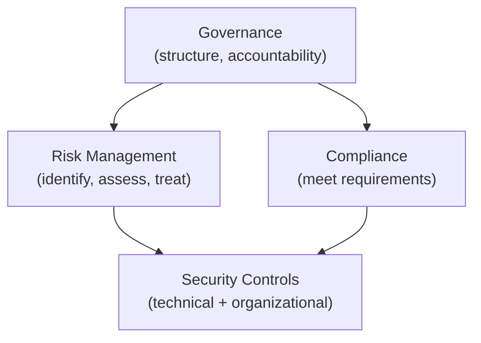
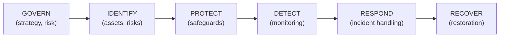
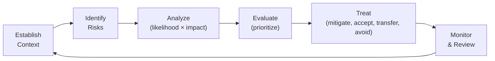
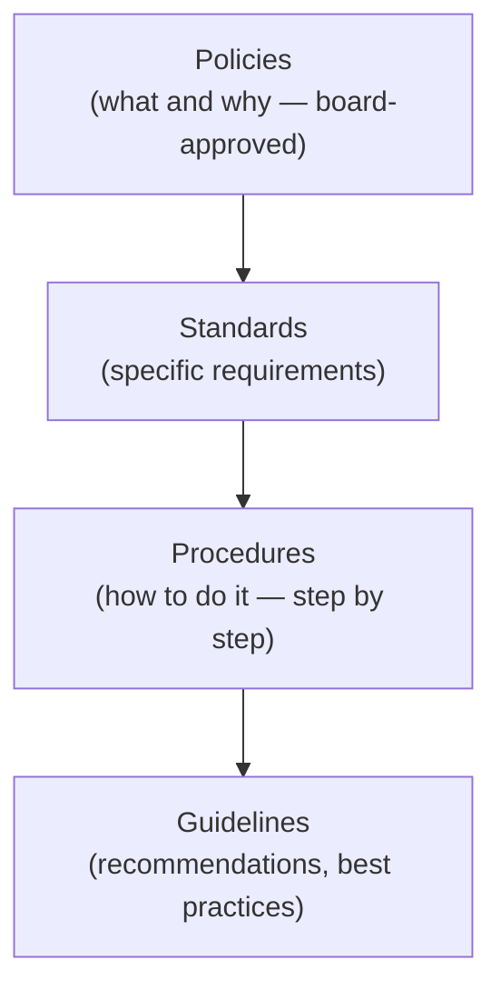

## Why This Matters

Security without governance is ad-hoc and unsustainable. Frameworks provide structure, accountability, and measurability. Compliance ensures you meet legal obligations. But compliance alone is not security — it's the minimum baseline, not the ceiling.

---

## Governance vs Compliance vs Security

| Concept | Focus | Question |
|---------|-------|----------|
| Governance | Decision-making structure | Who decides? How are policies enforced? |
| Risk Management | Understanding and treating risk | What could go wrong? How bad? What do we do? |
| Compliance | Meeting external requirements | Are we following the rules? |
| Security | Protecting assets | Are we actually safe? |

---

## Major Frameworks

### ISO 27001 (Information Security Management System)

International standard for managing information security systematically:

| Component | Purpose |
|-----------|---------|
| ISMS (Management System) | Policies, processes, continuous improvement |
| Annex A Controls (93 controls) | Technical and organizational measures |
| Risk Assessment | Identify and treat information security risks |
| Statement of Applicability | Which controls apply and why |
| Internal Audit | Verify ISMS effectiveness |
| Management Review | Leadership oversight |

**Certification:** Third-party audit → certificate valid 3 years (annual surveillance audits).

### NIST Cybersecurity Framework (CSF) 2.0

Voluntary framework organized around six functions:

| Function | Key Activities |
|----------|---------------|
| Govern | Risk strategy, roles, policies, supply chain risk |
| Identify | Asset inventory, risk assessment, business context |
| Protect | Access control, training, data security, platform security |
| Detect | Continuous monitoring, anomaly detection, event analysis |
| Respond | IR planning, communications, mitigation, analysis |
| Recover | Recovery planning, improvements, communications |

### SOC 2 (Service Organization Controls)

Audit report for service providers, based on Trust Service Criteria:

| Criteria | Focus |
|----------|-------|
| Security (required) | Protection against unauthorized access |
| Availability | System uptime and performance |
| Processing Integrity | Accurate, complete processing |
| Confidentiality | Protection of confidential information |
| Privacy | Personal information handling |

**Type I:** Controls designed appropriately (point-in-time).
**Type II:** Controls operating effectively (over 6–12 months).

### Comparison

| Framework | Type | Certifiable | Scope | Best For |
|-----------|------|-------------|-------|----------|
| ISO 27001 | Standard | Yes | All information security | International organizations |
| NIST CSF | Framework | No | Cybersecurity risk | US organizations, any size |
| SOC 2 | Audit report | Yes (report) | Service providers | SaaS, cloud services |
| CIS Controls | Best practices | No | Technical controls | Implementation guidance |

---

## Regulatory Compliance

### GDPR (General Data Protection Regulation)

EU regulation for personal data protection:

| Principle | Requirement |
|-----------|-------------|
| Lawfulness | Legal basis for processing (consent, contract, legitimate interest) |
| Purpose limitation | Collect only for specified purposes |
| Data minimization | Only collect what's necessary |
| Accuracy | Keep data correct and up-to-date |
| Storage limitation | Don't keep longer than needed |
| Integrity & confidentiality | Protect with appropriate security |
| Accountability | Demonstrate compliance |

**Key obligations:**

- Data Protection Impact Assessment (DPIA) for high-risk processing
- Data breach notification within 72 hours
- Right to erasure ("right to be forgotten")
- Data Protection Officer (DPO) for certain organizations
- Fines: up to €20M or 4% of global annual revenue

### NIS2 (Network and Information Security Directive)

EU directive for critical infrastructure cybersecurity:

| Requirement | Details |
|-------------|---------|
| Risk management | Implement appropriate security measures |
| Incident reporting | 24h early warning, 72h full notification |
| Supply chain security | Assess and manage third-party risks |
| Business continuity | Backup, disaster recovery, crisis management |
| Encryption | Use where appropriate |
| Vulnerability handling | Coordinated disclosure processes |
| Management accountability | Board-level responsibility, training |

**Penalties:** Up to €10M or 2% of global revenue.

### PCI DSS (Payment Card Industry Data Security Standard)

Required for anyone processing, storing, or transmitting cardholder data:

| Requirement | Category |
|-------------|----------|
| 1–2 | Network security (firewalls, secure config) |
| 3–4 | Data protection (encryption, key management) |
| 5–6 | Vulnerability management (AV, secure development) |
| 7–9 | Access control (need-to-know, authentication, physical) |
| 10–11 | Monitoring (logging, testing) |
| 12 | Security policy (governance) |

---

## Risk Management

### Risk Assessment Process

### Risk Matrix

| | Impact: Low | Impact: Medium | Impact: High | Impact: Critical |
|---|---|---|---|---|
| **Likelihood: Almost Certain** | Medium | High | Critical | Critical |
| **Likelihood: Likely** | Low | Medium | High | Critical |
| **Likelihood: Possible** | Low | Medium | High | High |
| **Likelihood: Unlikely** | Low | Low | Medium | High |
| **Likelihood: Rare** | Low | Low | Low | Medium |

### Risk Treatment Options

| Option | When | Example | Residual Risk |
|--------|------|---------|---------------|
| Mitigate | Can reduce likelihood or impact | Implement MFA, encrypt data | Reduced |
| Accept | Cost of treatment > risk value | Low-severity, isolated system | Unchanged (documented) |
| Transfer | Share risk with third party | Cyber insurance, outsource | Shared |
| Avoid | Eliminate the risk entirely | Don't store data you don't need | Eliminated |

### Risk Register

| ID | Risk | Likelihood | Impact | Rating | Treatment | Owner | Status |
|----|------|-----------|--------|--------|-----------|-------|--------|
| R-001 | Ransomware attack | Likely | Critical | Critical | Mitigate (backups, EDR, training) | CISO | Open |
| R-002 | Cloud misconfiguration | Possible | High | High | Mitigate (CSPM, IaC scanning) | Cloud Lead | Open |
| R-003 | Insider data theft | Unlikely | High | Medium | Mitigate (DLP, access reviews) | Security Ops | Open |

---

## Security Policies

### Policy Hierarchy

### Essential Policies

| Policy | Covers |
|--------|--------|
| Information Security Policy | Overall security objectives and principles |
| Acceptable Use Policy | How employees may use company resources |
| Access Control Policy | Who gets access to what, how |
| Data Classification Policy | How to categorize and handle data |
| Incident Response Policy | How to handle security incidents |
| Business Continuity Policy | How to maintain operations during disruption |
| Vendor/Third-Party Policy | Security requirements for suppliers |
| Password/Authentication Policy | Authentication requirements |

### Data Classification

| Level | Description | Examples | Controls |
|-------|-------------|----------|----------|
| Public | No impact if disclosed | Marketing materials, public docs | None required |
| Internal | Minor impact if disclosed | Internal memos, org charts | Access control |
| Confidential | Significant impact | Customer data, financials, IP | Encryption + access control |
| Restricted | Severe impact | Credentials, PII, health data | Encryption + strict access + audit |

---

## Audit and Assurance

### Audit Types

| Type | Performed By | Purpose |
|------|-------------|---------|
| Internal audit | Internal team | Verify controls, find gaps |
| External audit | Third-party auditor | Certification, compliance verification |
| Penetration test | Security firm | Test technical controls |
| Supplier audit | Your team | Verify third-party security |

### Audit Preparation

| Activity | Purpose |
|----------|---------|
| Evidence collection | Gather logs, configs, policies, procedures |
| Gap assessment | Self-assess against framework before audit |
| Remediation | Fix identified gaps |
| Documentation | Ensure policies are current and approved |
| Staff preparation | Ensure teams can explain their processes |

### Continuous Compliance

Move from point-in-time audits to continuous monitoring:

| Traditional | Continuous |
|-------------|-----------|
| Annual audit | Real-time monitoring |
| Manual evidence collection | Automated evidence gathering |
| Snapshot compliance | Continuous compliance posture |
| Reactive fixes | Proactive drift detection |

---

## Key Takeaways

1. **Compliance ≠ security** — compliance is the floor, not the ceiling
2. **Risk-based approach** — prioritize based on actual risk, not checkbox completion
3. **Frameworks provide structure** — ISO 27001 for certification, NIST CSF for guidance
4. **Know your regulations** — GDPR, NIS2, PCI DSS have real penalties
5. **Document everything** — policies, decisions, risk acceptance, evidence
6. **Continuous over periodic** — automate compliance monitoring
7. **Board-level accountability** — NIS2 and GDPR hold leadership responsible
