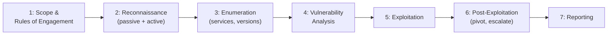
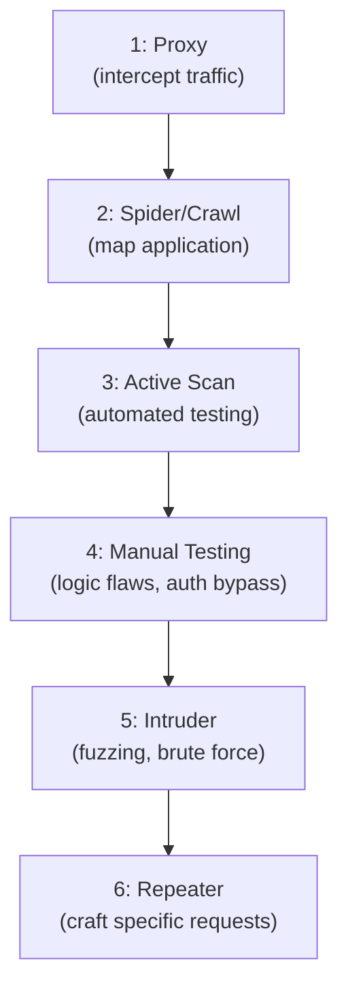
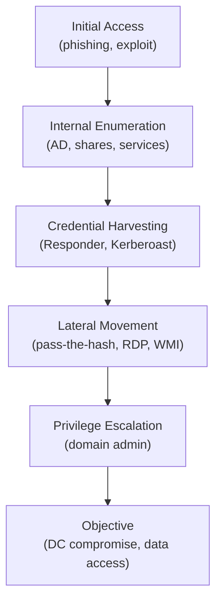
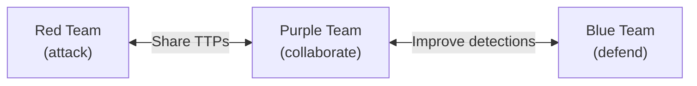

## Why This Matters

You cannot build effective defenses without understanding how attacks work. Offensive security — penetration testing, red teaming, and ethical hacking — validates that your controls actually work against real-world attack techniques. It's the difference between "we think we're secure" and "we've proven it."

---

## Penetration Testing

### Methodology



### Phase Details

| Phase | Activities | Output |
|-------|-----------|--------|
| Scoping | Define targets, boundaries, rules, timeline | Rules of Engagement document |
| Reconnaissance | OSINT, DNS enumeration, technology fingerprinting | Target profile |
| Enumeration | Port scanning, service identification, version detection | Service map |
| Vulnerability Analysis | Identify weaknesses, research exploits | Vulnerability list |
| Exploitation | Attempt to exploit vulnerabilities | Proof of access |
| Post-Exploitation | Privilege escalation, lateral movement, data access | Impact demonstration |
| Reporting | Document findings, evidence, recommendations | Pentest report |

### Testing Types

| Type | Tester Knowledge | Simulates | Depth |
|------|-----------------|-----------|-------|
| Black Box | No internal info | External attacker | Broad, shallow |
| Grey Box | Partial info (creds, docs) | Insider or compromised account | Balanced |
| White Box | Full access (source, architecture) | Comprehensive audit | Deep, thorough |

---

## Reconnaissance

### Passive Reconnaissance (No Direct Contact)

| Technique | Tools | Finds |
|-----------|-------|-------|
| WHOIS lookup | whois, DomainTools | Domain owner, registrar, contacts |
| DNS enumeration | dig, dnsdumpster, subfinder | Subdomains, mail servers, records |
| Certificate transparency | crt.sh, Censys | All issued certificates (reveals subdomains) |
| Search engine dorking | Google, Shodan, Censys | Exposed files, services, devices |
| Social media/LinkedIn | Manual, theHarvester | Employee names, tech stack, org structure |
| Code repositories | GitHub, GitLab search | Leaked credentials, internal paths |
| Job postings | LinkedIn, company site | Technology stack, tools used |

### Active Reconnaissance

| Technique | Tools | Finds |
|-----------|-------|-------|
| Port scanning | Nmap, masscan, RustScan | Open ports, services |
| Service fingerprinting | Nmap -sV, WhatWeb | Software versions |
| Web crawling | Burp Spider, gospider | Pages, forms, parameters |
| Directory brute-forcing | ffuf, gobuster, feroxbuster | Hidden paths, admin panels |
| Virtual host discovery | ffuf, gobuster vhost | Additional web applications |

### Nmap Essentials

```bash
# Quick scan (top 1000 ports)
nmap -sV -sC target.com

# Full port scan
nmap -p- -sV target.com

# UDP scan (slow but important)
nmap -sU --top-ports 100 target.com

# OS detection
nmap -O target.com

# Aggressive scan (noisy)
nmap -A target.com
```

---

## Web Application Testing

### Methodology (OWASP Testing Guide)

| Category | Tests |
|----------|-------|
| Information Gathering | Technology stack, entry points, application mapping |
| Configuration | Default credentials, HTTP methods, error handling |
| Identity Management | User enumeration, account policies |
| Authentication | Brute force, credential stuffing, bypass |
| Authorization | IDOR, privilege escalation, path traversal |
| Session Management | Token analysis, fixation, timeout |
| Input Validation | Injection (SQL, XSS, command), file upload |
| Error Handling | Information leakage, stack traces |
| Cryptography | Weak algorithms, improper implementation |
| Business Logic | Workflow bypass, race conditions |

### Burp Suite Workflow



### Common Web Exploits

| Vulnerability | Test | Impact |
|--------------|------|--------|
| SQL Injection | `' OR 1=1--`, sqlmap | Database access, data theft |
| XSS | `<script>alert(1)</script>` | Session hijacking, phishing |
| IDOR | Change ID in URL/request | Access other users' data |
| SSRF | Internal URLs in parameters | Internal network access |
| File Upload | Upload web shell (.php, .jsp) | Remote code execution |
| Deserialization | Crafted serialized objects | Remote code execution |

---

## Network Penetration Testing

### Internal Network Attack Path



### Active Directory Attacks

| Attack | Technique | Tool |
|--------|-----------|------|
| Kerberoasting | Request service tickets, crack offline | Rubeus, GetUserSPNs |
| AS-REP Roasting | Target accounts without pre-auth | Rubeus, GetNPUsers |
| Pass-the-Hash | Use NTLM hash without cracking | Mimikatz, CrackMapExec |
| Pass-the-Ticket | Use Kerberos ticket | Rubeus, Mimikatz |
| DCSync | Replicate credentials from DC | Mimikatz, secretsdump |
| Golden Ticket | Forge Kerberos TGT | Mimikatz |
| BloodHound | Map AD attack paths | BloodHound + SharpHound |

### Privilege Escalation

| Platform | Technique | Tool |
|----------|-----------|------|
| Linux | SUID binaries | find / -perm -4000 |
| Linux | Sudo misconfigurations | sudo -l, GTFOBins |
| Linux | Kernel exploits | LinPEAS, linux-exploit-suggester |
| Linux | Cron jobs (writable scripts) | pspy, manual review |
| Windows | Unquoted service paths | PowerUp, WinPEAS |
| Windows | Token impersonation | Potato exploits, PrintSpoofer |
| Windows | DLL hijacking | Process Monitor, manual |
| Windows | AlwaysInstallElevated | PowerUp |

---

## Red Team Operations

### Red Team vs Pentest

| Aspect | Penetration Test | Red Team |
|--------|-----------------|----------|
| Objective | Find vulnerabilities | Test detection and response |
| Scope | Defined targets | Full organization |
| Duration | Days–weeks | Weeks–months |
| Stealth | Not required | Essential (avoid detection) |
| Rules | Strict boundaries | Broader (with safety limits) |
| Output | Vulnerability list | Attack narrative + detection gaps |
| Blue team awareness | Usually aware | Usually unaware |

### Red Team Phases

| Phase | Activities |
|-------|-----------|
| Planning | Objectives, threat profile to emulate, C2 infrastructure |
| Reconnaissance | Deep OSINT, target profiling, social engineering prep |
| Initial Access | Phishing, exploit, physical, supply chain |
| Establish Foothold | Persistence, C2 communication |
| Escalate & Move | Privilege escalation, lateral movement |
| Achieve Objectives | Data access, demonstrate impact |
| Reporting | Full attack narrative, detection gaps, recommendations |

### Command and Control (C2)

| Framework | Type | Features |
|-----------|------|----------|
| Cobalt Strike | Commercial | Industry standard, malleable C2 |
| Sliver | Open source | Cross-platform, modern |
| Mythic | Open source | Modular, multi-agent |
| Havoc | Open source | Modern, evasion-focused |

### Evasion Techniques

| Category | Technique |
|----------|-----------|
| Network | Domain fronting, DNS over HTTPS, encrypted C2 |
| Endpoint | AMSI bypass, ETW patching, unhooking |
| Payload | Obfuscation, encryption, living-off-the-land (LOLBins) |
| Behavioral | Slow operations, business-hours activity, legitimate tools |

---

## Purple Team

Collaborative approach — red and blue work together:



| Activity | Purpose |
|----------|---------|
| Atomic testing | Test specific ATT&CK techniques one at a time |
| Detection validation | Verify SIEM rules trigger on known attacks |
| Gap identification | Find blind spots in detection coverage |
| Playbook testing | Validate IR playbooks work in practice |

---

## Bug Bounty Programs

### Program Types

| Type | Scope | Participants | Management |
|------|-------|-------------|-----------|
| Public | Open to all researchers | Anyone | Platform (HackerOne, Bugcrowd) |
| Private | Invite-only | Vetted researchers | Platform or self-managed |
| VDP (Vulnerability Disclosure) | Accept reports, no rewards | Anyone | Self-managed |

### Severity and Rewards (Typical)

| Severity | Impact | Reward Range |
|----------|--------|-------------|
| Critical | RCE, auth bypass, mass data access | $5,000–$250,000+ |
| High | Privilege escalation, significant data exposure | $2,000–$50,000 |
| Medium | XSS, CSRF, limited data exposure | $500–$5,000 |
| Low | Information disclosure, minor issues | $100–$1,000 |

### Responsible Disclosure Timeline

```text
Day 0: Researcher reports vulnerability
Day 1-5: Vendor acknowledges receipt
Day 7-14: Vendor confirms and begins fix
Day 90: Public disclosure (standard deadline)
```

---

## Legal and Ethical Boundaries

| Rule | Explanation |
|------|-------------|
| Written authorization | ALWAYS have signed scope/ROE before testing |
| Stay in scope | Never test systems not explicitly authorized |
| Do no harm | Avoid destructive actions, DoS, data deletion |
| Protect data | Don't exfiltrate real sensitive data |
| Report everything | Disclose all findings, even accidental |
| Confidentiality | Don't share findings publicly without permission |

**Without authorization, penetration testing is a crime** — regardless of intent.

---

## Key Takeaways

1. **Authorization first** — never test without written permission
2. **Methodology matters** — systematic testing finds more than random poking
3. **Think in attack paths** — chain low-severity findings into high-impact scenarios
4. **Red teams test people and processes** — not just technology
5. **Purple teaming maximizes value** — collaboration > adversarial secrecy
6. **Document everything** — evidence, screenshots, timestamps, commands
7. **The goal is improvement** — findings should lead to better defenses, not blame
