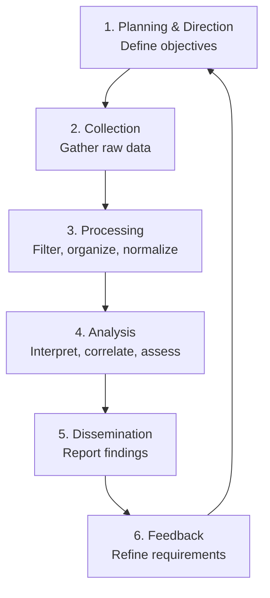
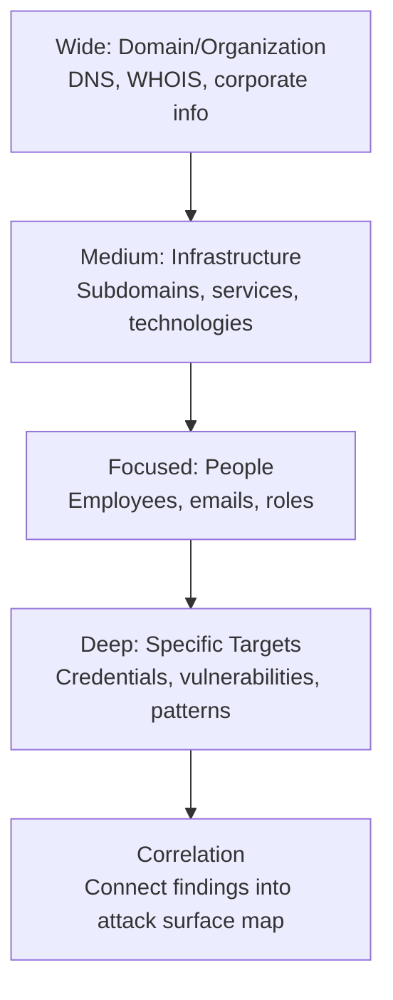

## What Is OSINT?

Open Source Intelligence (OSINT) is the collection, analysis, and use of information from publicly available sources. It's a critical skill in cybersecurity — used in penetration testing, threat intelligence, fraud investigation, incident response, and red team operations.

"Open source" here means **publicly accessible** — not "free software." Sources include the internet, social media, public records, news, satellite imagery, and leaked databases.

---

## The Intelligence Cycle



### Planning Questions

Before collecting anything, define:
- **What** am I looking for? (target scope)
- **Why** do I need it? (objective — pentest, threat intel, investigation)
- **How deep** should I go? (passive recon only? active probing?)
- **What's legal?** (jurisdiction, authorization, privacy laws)

---

## OSINT Categories

| Category | Sources | Examples |
|----------|---------|----------|
| **People** | Social media, professional profiles, public records | LinkedIn, Facebook, voter registries, court records |
| **Infrastructure** | DNS, IP records, certificates, banners | Shodan, Censys, Certificate Transparency logs |
| **Organizations** | Corporate filings, job postings, press releases | SEC filings, Glassdoor, annual reports |
| **Technical** | Code repositories, paste sites, forums | GitHub, GitLab, Pastebin, Stack Overflow |
| **Geospatial** | Maps, satellite imagery, geotagged media | Google Earth, Sentinel Hub, Mapillary |
| **Dark Web** | Onion sites, marketplaces, forums | Tor-based sites (with appropriate authorization) |
| **Media** | News, podcasts, YouTube, academic papers | Google Scholar, news archives |

---

## Passive vs Active Reconnaissance

| Aspect | Passive OSINT | Active OSINT |
|--------|---------------|--------------|
| Interaction | No direct contact with target | Direct interaction (probing, scanning) |
| Detection risk | Zero — target can't know | Detectable — leaves logs, fingerprints |
| Examples | Reading public website, DNS lookups via third parties | Port scanning, sending phishing emails, calling target |
| Legality | Generally legal (public info) | May require authorization (pentest scope) |
| Tools | Shodan, Google dorking, social media | Nmap, Burp Suite, social engineering |

**The OSINT discipline focuses primarily on passive collection.** Active probing crosses into penetration testing territory and requires explicit authorization.

---

## Domain and Infrastructure OSINT

### DNS Enumeration

```bash
# Basic DNS lookups
dig example.com ANY
dig example.com MX
dig example.com TXT              # SPF, DKIM, verification records

# Zone transfer attempt (usually denied, but always try)
dig @ns1.example.com example.com AXFR

# Subdomain enumeration
amass enum -d example.com
subfinder -d example.com
```

### WHOIS

```bash
whois example.com
# Returns: registrant, creation/expiry dates, nameservers, registrar
# Historical WHOIS: whoxy.com, domaintools.com
```

### Certificate Transparency Logs

Every HTTPS certificate issued is logged publicly. This reveals subdomains:

```bash
# Search CT logs for all certificates issued to a domain
curl "https://crt.sh/?q=%25.example.com&output=json" | jq '.[].name_value'
```

### Shodan / Censys

Search engines for internet-connected devices:

```
# Shodan queries
org:"Target Company"
ssl.cert.subject.CN:"example.com"
port:3389 country:ES
http.title:"Dashboard" org:"Target"

# Find exposed services
hostname:example.com port:22,3306,5432,6379,27017
```

### Wayback Machine

View historical versions of websites — find removed pages, old configurations, or exposed files:

```
https://web.archive.org/web/*/example.com
```

---

## People OSINT

### Social Media Intelligence (SOCMINT)

| Platform | What You Can Find |
|----------|-------------------|
| LinkedIn | Job title, employer, skills, connections, education, publications |
| Twitter/X | Opinions, geolocation, connections, daily routine |
| Facebook | Friends, locations, life events, group memberships |
| Instagram | Locations (geotagged photos), daily life, social circle |
| GitHub | Code skills, email in commits, projects, employer |
| Reddit | Interests, writing patterns, location hints |

### Username OSINT

A single username often reused across platforms:

```bash
# Tools that check username across hundreds of sites
sherlock username
whatsmyname username
namechk username
```

### Email OSINT

```bash
# Check if email appears in data breaches
# haveibeenpwned.com API (legitimate use)
# holehe — checks which services an email is registered on
holehe target@example.com

# Email header analysis — trace the path of a suspicious email
```

### Google Dorking for People

```
"John Smith" site:linkedin.com "Target Company"
"target@example.com" filetype:pdf
"Target Company" site:glassdoor.com
```

---

## Google Dorking (Advanced Search Operators)

Google operators are extremely powerful for finding exposed information:

| Operator | Purpose | Example |
|----------|---------|---------|
| `site:` | Limit to domain | `site:example.com admin` |
| `filetype:` | Specific file type | `filetype:pdf confidential` |
| `intitle:` | Text in page title | `intitle:"index of" /backup` |
| `inurl:` | Text in URL | `inurl:admin login` |
| `intext:` | Text in page body | `intext:"password" filetype:log` |
| `cache:` | Cached version of page | `cache:example.com/secret` |
| `-` | Exclude term | `site:example.com -www` |
| `""` | Exact phrase | `"default password"` |
| `*` | Wildcard | `"admin * password"` |

### Common Google Dorks for Security

```
# Exposed sensitive files
filetype:env "DB_PASSWORD"
filetype:sql "INSERT INTO" "password"
filetype:log "password"
filetype:cfg "password"

# Exposed admin panels
intitle:"admin" inurl:login site:example.com
intitle:"phpMyAdmin" "Welcome to phpMyAdmin"

# Exposed directories
intitle:"index of" ".git"
intitle:"index of" "backup"
intitle:"index of" "wp-content/uploads"

# Exposed cameras/IoT
inurl:"view.shtml" "Network Camera"
intitle:"webcamXP" inurl:":8080"

# Exposed documents
site:example.com filetype:xlsx OR filetype:docx "confidential"
site:drive.google.com "example.com"
```

---

## Tools Directory

### Frameworks

| Tool | Purpose |
|------|---------|
| **Maltego** | Visual link analysis — connects entities (people, domains, IPs) |
| **SpiderFoot** | Automated OSINT collection across 200+ sources |
| **Recon-ng** | Modular web reconnaissance framework (like Metasploit for OSINT) |
| **theHarvester** | Email, subdomain, IP harvesting from public sources |
| **OSINT Framework** | osintframework.com — categorized list of tools and resources |

### Domain / Infrastructure

| Tool | Purpose |
|------|---------|
| **Shodan** | Search engine for internet-connected devices |
| **Censys** | Certificate and host discovery |
| **amass** | In-depth subdomain enumeration |
| **subfinder** | Fast subdomain discovery |
| **DNSdumpster** | DNS recon and visualization |
| **SecurityTrails** | Historical DNS and WHOIS data |
| **BuiltWith** | Technology profiling (what stack a site uses) |

### People / Social

| Tool | Purpose |
|------|---------|
| **Sherlock** | Username search across 300+ sites |
| **holehe** | Check email registration across services |
| **PhoneInfoga** | Phone number OSINT |
| **GHunt** | Google account investigation |
| **Maigret** | Username enumeration (Sherlock alternative) |

### Image / Geolocation

| Tool | Purpose |
|------|---------|
| **Google Reverse Image Search** | Find where an image appears online |
| **TinEye** | Reverse image search with change detection |
| **ExifTool** | Extract metadata from images (GPS coords, camera, timestamp) |
| **GeoGuessr / geoint** | Practice geolocation from imagery |
| **SunCalc** | Determine time from shadow angles in photos |

---

## OSINT Methodology

### The Funnel Approach



### Documentation

Always document:
- **What** was found
- **Where** it was found (URL, tool, timestamp)
- **How** it was found (search query, technique)
- **Significance** (why it matters for the objective)

Use screenshots — web content can disappear.

---

## Legal and Ethical Considerations

| Rule | Explanation |
|------|-------------|
| **Public ≠ ethical to exploit** | Just because data is accessible doesn't mean it's ethical to use for harm |
| **GDPR applies** | In the EU, collecting personal data (even public) is processing under GDPR |
| **Authorization matters** | For pentest engagements, get written scope defining what OSINT is permitted |
| **Don't access restricted content** | Bypassing access controls (even weak ones) may violate computer crime laws |
| **Don't impersonate** | Creating fake profiles to extract information crosses into social engineering |
| **Report responsibly** | If you find exposed sensitive data, consider responsible disclosure |
| **Document everything** | Maintain a clear audit trail of what you collected and how |

### OSINT Ethics Framework

1. **Is it publicly available without authentication?** → Generally fair game
2. **Am I authorized to collect this for my stated purpose?** → Check scope
3. **Could this cause harm to an uninvolved party?** → Proceed carefully
4. **Am I complying with applicable data protection laws?** → GDPR, CCPA, etc.
5. **Would I be comfortable explaining my methods?** → The transparency test

---

## Defensive OSINT (Reducing Your Attack Surface)

Organizations should OSINT themselves regularly:

| Check | Action |
|-------|--------|
| Google dork your own domain | Find exposed files, admin panels, credentials |
| Monitor CT logs | Detect unauthorized certificate issuance (subdomain takeover) |
| Audit public code repos | Ensure no secrets in commit history |
| Check data breach databases | Know if employee credentials are exposed |
| Review social media | What are employees sharing about internal systems? |
| Monitor paste sites | Look for leaked data mentioning your organization |

---

## Key Takeaways

1. **OSINT is passive first** — gather everything you can without touching the target directly
2. **Google dorking** is incredibly powerful — it's the first tool in any OSINT investigation
3. **Certificate Transparency logs** reveal subdomains you can't find any other way
4. **Usernames are reused** — one username often maps to dozens of profiles across services
5. **Document everything** — screenshots, timestamps, URLs. Content disappears.
6. **Legal boundaries exist** — public data still has privacy protections (GDPR). Always have authorization.
7. **Defensive OSINT** is equally important — regularly search for your own organization's exposure
8. **The intelligence cycle** (plan → collect → analyze → report) prevents aimless browsing and ensures actionable output
