A comprehensive learning path covering cybersecurity from foundational concepts to advanced offensive and defensive techniques. Designed for software engineers, cloud practitioners, and anyone building or defending systems.

## Prerequisites

- Basic networking knowledge (TCP/IP, DNS, HTTP)
- Familiarity with Linux command line
- Understanding of web applications and APIs
- Basic programming ability (Python recommended)

## Learning Path

| # | Topic | File | Description |
|---|-------|------|-------------|
| 1 | [Threat Landscape & Attacker Mindset](#1-threat-landscape--attacker-mindset) | `01-threat-landscape.md` | Threat actors, kill chain, MITRE ATT&CK |
| 2 | [Cryptography](#2-cryptography) | `02-cryptography.md` | Symmetric, asymmetric, hashing, PKI, TLS |
| 3 | [Network Security](#3-network-security) | `03-network-security.md` | Firewalls, IDS/IPS, segmentation, zero trust |
| 4 | [Web Application Security](#4-web-application-security) | `04-web-application-security.md` | OWASP Top 10, injection, XSS, CSRF, SSRF |
| 5 | [Identity & Access Management](#5-identity--access-management) | `05-identity-access-management.md` | OAuth, SAML, RBAC/ABAC, PAM, federation |
| 6 | [Operating System Security](#6-operating-system-security) | `06-operating-system-security.md` | Hardening, patching, logging, endpoint protection |
| 7 | [Cloud Security](#7-cloud-security) | `07-cloud-security.md` | Shared responsibility, IAM, CSPM, misconfigurations |
| 8 | [Vulnerability Management](#8-vulnerability-management) | `08-vulnerability-management.md` | Scanning, CVE/CVSS, prioritization, remediation |
| 9 | [Security Operations & Incident Response](#9-security-operations--incident-response) | `09-security-operations.md` | SOC, SIEM, IR lifecycle, forensics |
| 10 | [Secure Software Development](#10-secure-software-development) | `10-secure-development.md` | SSDLC, SAST/DAST, supply chain, threat modeling |
| 11 | [Compliance & Governance](#11-compliance--governance) | `11-compliance-governance.md` | ISO 27001, NIST, SOC 2, risk management |
| 12 | [Offensive Security](#12-offensive-security) | `12-offensive-security.md` | Penetration testing, red team, bug bounty |

---

## 1. Threat Landscape & Attacker Mindset

Understanding who attacks systems, why, and how is the foundation of all security work. Defenders must think like attackers to build effective controls.

### Threat Actors

| Actor | Motivation | Sophistication | Examples |
|-------|-----------|----------------|----------|
| Script Kiddies | Fun, notoriety | Low | Using pre-built exploit tools |
| Hacktivists | Political/social cause | Low–Medium | Anonymous, DDoS campaigns |
| Cybercriminals | Financial gain | Medium–High | Ransomware gangs, card fraud |
| Insiders | Revenge, money, negligence | Varies | Disgruntled employees |
| Nation-States (APT) | Espionage, sabotage | Very High | APT28, APT29, Lazarus Group |
| Competitors | Business advantage | Medium | Corporate espionage |

### Cyber Kill Chain (Lockheed Martin)

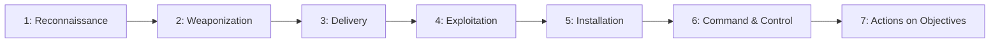

Each phase is a detection opportunity — the earlier you break the chain, the less damage occurs.

### MITRE ATT&CK Framework

A knowledge base of adversary tactics and techniques based on real-world observations:

| Tactic | Question | Example Techniques |
|--------|----------|-------------------|
| Reconnaissance | How do they gather info? | Scanning, OSINT, phishing for info |
| Initial Access | How do they get in? | Phishing, exploit public-facing app |
| Execution | How do they run code? | PowerShell, scripting, user execution |
| Persistence | How do they stay? | Registry keys, scheduled tasks, implants |
| Privilege Escalation | How do they get more power? | Exploit vulnerability, token manipulation |
| Defense Evasion | How do they hide? | Obfuscation, disabling logging |
| Credential Access | How do they steal creds? | Keylogging, credential dumping |
| Lateral Movement | How do they spread? | RDP, SMB, pass-the-hash |
| Exfiltration | How do they steal data? | Encrypted channels, cloud storage |
| Impact | What damage do they cause? | Encryption (ransomware), data destruction |

### Attack Surface

Everything exposed to potential attackers:

- **External:** Public IPs, domains, APIs, web apps, email
- **Internal:** Employee workstations, internal services, databases
- **Human:** Phishing susceptibility, social engineering
- **Supply chain:** Third-party libraries, SaaS providers, contractors

---

## 2. Cryptography

Cryptography provides confidentiality, integrity, and authentication — the mathematical foundation of all security.

### Symmetric Encryption

Same key encrypts and decrypts. Fast, used for bulk data.

| Algorithm | Key Size | Status | Use Case |
|-----------|----------|--------|----------|
| AES-256 | 256 bits | Standard | Disk encryption, TLS data |
| ChaCha20 | 256 bits | Modern | Mobile, TLS alternative |
| 3DES | 168 bits | Deprecated | Legacy systems only |

### Asymmetric Encryption

Key pair: public key encrypts, private key decrypts. Slow, used for key exchange and signatures.

| Algorithm | Key Size | Use Case |
|-----------|----------|----------|
| RSA | 2048–4096 bits | Key exchange, signatures |
| ECDSA | 256–384 bits | TLS certificates, SSH |
| Ed25519 | 256 bits | SSH keys, modern signatures |

### Hashing

One-way function — cannot be reversed. Used for integrity and password storage.

| Algorithm | Output | Use Case |
|-----------|--------|----------|
| SHA-256 | 256 bits | File integrity, certificates |
| SHA-3 | Variable | Modern alternative to SHA-2 |
| bcrypt | 184 bits | Password hashing (with salt + cost) |
| Argon2 | Variable | Password hashing (memory-hard) |

### How TLS Uses All Three

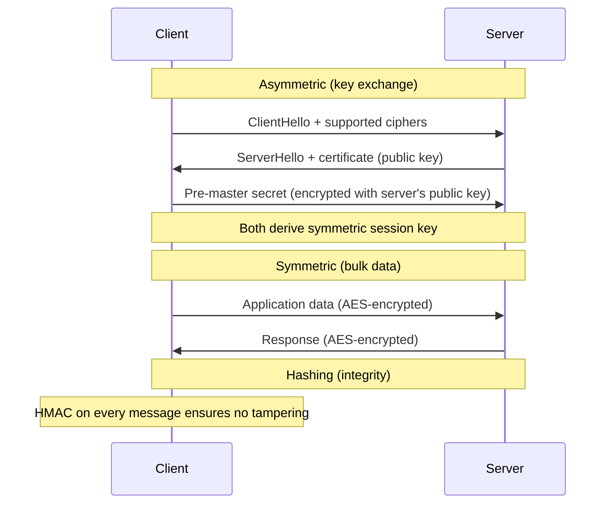

### Public Key Infrastructure (PKI)

Chain of trust for certificates:

```text
Root CA (self-signed, offline)
  └── Intermediate CA (signs server certs)
        └── Server Certificate (your-domain.com)
```

| Component | Role |
|-----------|------|
| Certificate Authority (CA) | Issues and signs certificates |
| Certificate | Binds public key to identity |
| CRL / OCSP | Revocation checking |
| Certificate Transparency | Public log of all issued certs |

---

## 3. Network Security

Protecting data in transit and controlling what can communicate with what.

### Defense in Depth

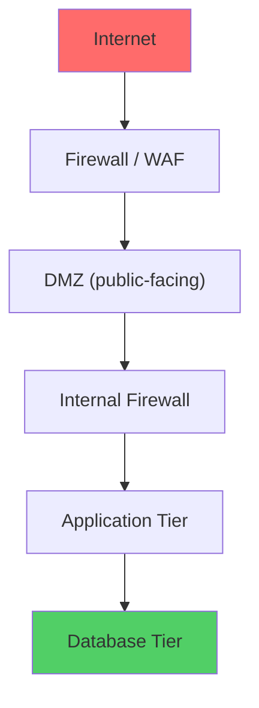

### Firewalls

| Type | Layer | Inspects | Use Case |
|------|-------|----------|----------|
| Packet Filter | L3–L4 | IP, port, protocol | Basic perimeter |
| Stateful | L3–L4 | Connection state | Standard perimeter |
| Application (WAF) | L7 | HTTP content, headers | Web app protection |
| Next-Gen (NGFW) | L3–L7 | All + threat intelligence | Enterprise perimeter |

### Network Segmentation

Divide the network into zones to limit blast radius:

| Zone | Contains | Access |
|------|----------|--------|
| DMZ | Web servers, load balancers | Internet → DMZ allowed |
| Application | App servers, APIs | DMZ → App allowed |
| Data | Databases, storage | App → Data allowed |
| Management | Admin tools, CI/CD | Restricted access |

### Zero Trust Architecture

"Never trust, always verify" — no implicit trust based on network location.

| Principle | Implementation |
|-----------|---------------|
| Verify explicitly | Authenticate every request (mTLS, tokens) |
| Least privilege | Just-in-time, just-enough access |
| Assume breach | Micro-segmentation, encrypt everything |

### IDS/IPS

| System | Function | Action |
|--------|----------|--------|
| IDS (Intrusion Detection) | Monitors and alerts | Passive — alerts only |
| IPS (Intrusion Prevention) | Monitors and blocks | Active — drops malicious traffic |

Detection methods: signature-based (known patterns), anomaly-based (deviations from baseline), behavior-based (suspicious sequences).

---

## 4. Web Application Security

Web apps are the most common attack surface. The OWASP Top 10 defines the most critical risks.

### OWASP Top 10 (2021)

| # | Risk | Description |
|---|------|-------------|
| A01 | Broken Access Control | Users act outside intended permissions |
| A02 | Cryptographic Failures | Sensitive data exposed (weak crypto, plaintext) |
| A03 | Injection | Untrusted data sent to interpreter (SQL, OS, LDAP) |
| A04 | Insecure Design | Missing security controls in architecture |
| A05 | Security Misconfiguration | Default configs, open cloud storage, verbose errors |
| A06 | Vulnerable Components | Using libraries with known vulnerabilities |
| A07 | Auth & Identification Failures | Broken authentication, session management |
| A08 | Software & Data Integrity Failures | Untrusted updates, insecure CI/CD, deserialization |
| A09 | Security Logging & Monitoring Failures | Insufficient logging, no alerting |
| A10 | Server-Side Request Forgery (SSRF) | Server makes requests to unintended locations |

### SQL Injection

```text
User input:  ' OR 1=1 --
Query becomes: SELECT * FROM users WHERE name='' OR 1=1 --'
Result: Returns ALL users
```

**Prevention:** Parameterized queries (prepared statements), never string concatenation.

### Cross-Site Scripting (XSS)

| Type | Vector | Persistence |
|------|--------|-------------|
| Reflected | URL parameter → response | None (one-time) |
| Stored | Database → rendered page | Persistent |
| DOM-based | Client-side JS manipulation | None |

**Prevention:** Output encoding, Content Security Policy (CSP), input validation.

### Cross-Site Request Forgery (CSRF)

Tricks authenticated user into making unintended requests:

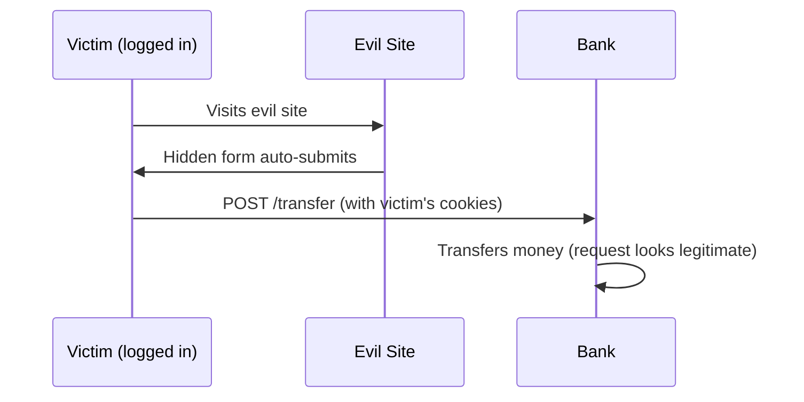

**Prevention:** CSRF tokens, SameSite cookies, checking Origin/Referer headers.

### Server-Side Request Forgery (SSRF)

Attacker makes the server fetch internal resources:

```text
Input: url=http://169.254.169.254/latest/meta-data/iam/security-credentials/
Result: Server fetches AWS credentials from metadata service
```

**Prevention:** Allowlist URLs, block internal IP ranges, use IMDSv2 (requires token).

---

## 5. Identity & Access Management

Controlling who can access what, and proving they are who they claim to be.

### Authentication Protocols

| Protocol | Type | Use Case |
|----------|------|----------|
| SAML 2.0 | XML-based SSO | Enterprise SSO (legacy) |
| OAuth 2.0 | Authorization delegation | API access, third-party apps |
| OpenID Connect | Auth layer on OAuth | Modern SSO, web/mobile |
| FIDO2/WebAuthn | Passwordless | Hardware keys, biometrics |
| Kerberos | Ticket-based | Active Directory, on-prem |

### OAuth 2.0 Flows

| Flow | Client Type | Use Case |
|------|-------------|----------|
| Authorization Code + PKCE | Public (SPA, mobile) | Standard for all modern apps |
| Client Credentials | Confidential (server) | Machine-to-machine |
| Device Code | Input-limited devices | Smart TVs, CLI tools |

### Privileged Access Management (PAM)

Controls for high-privilege accounts:

- **Just-in-time access** — elevate only when needed, auto-revoke
- **Session recording** — audit trail of admin actions
- **Credential vaulting** — secrets stored centrally, rotated automatically
- **Break-glass procedures** — emergency access with full audit

### Federation

Trust relationships between identity providers:

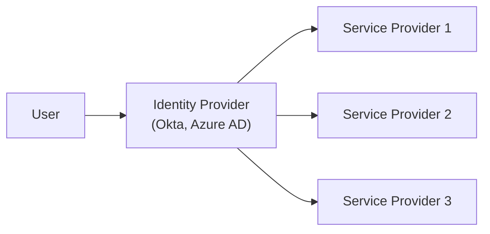

One login, access to many services — reduces password fatigue and attack surface.

---

## 6. Operating System Security

The OS is the foundation — if compromised, everything above it is compromised.

### Hardening Principles

| Principle | Actions |
|-----------|---------|
| Minimize attack surface | Remove unused packages, disable services |
| Least privilege | Non-root users, sudo with constraints |
| Patch management | Automated updates, vulnerability scanning |
| Secure defaults | Disable root SSH, enforce strong passwords |
| Audit and log | Enable auditd, ship logs to SIEM |

### Linux Security Mechanisms

| Mechanism | Purpose |
|-----------|---------|
| File permissions (rwx) | Basic access control |
| SELinux / AppArmor | Mandatory Access Control (MAC) |
| iptables / nftables | Host-based firewall |
| cgroups / namespaces | Process isolation (containers) |
| seccomp | Restrict system calls |
| auditd | Kernel-level audit logging |

### Endpoint Detection and Response (EDR)

Modern endpoint protection beyond traditional antivirus:

| Capability | Description |
|-----------|-------------|
| Behavioral analysis | Detect suspicious process behavior |
| Threat hunting | Proactive search for indicators |
| Automated response | Isolate host, kill process |
| Forensic data | Full timeline for investigation |

### Patch Management Lifecycle

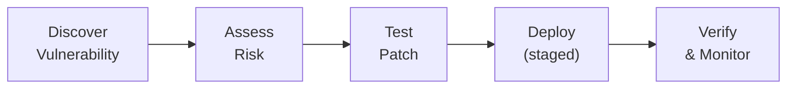

---

## 7. Cloud Security

Cloud introduces new attack vectors and a fundamentally different security model.

### Shared Responsibility Model

| Layer | IaaS (you manage) | PaaS (provider manages) | SaaS (provider manages) |
|-------|-------------------|------------------------|------------------------|
| Data | ✓ You | ✓ You | ✓ You |
| Application | ✓ You | ✓ You | Provider |
| Runtime/OS | ✓ You | Provider | Provider |
| Network | Shared | Provider | Provider |
| Physical | Provider | Provider | Provider |

### Common Cloud Misconfigurations

| Misconfiguration | Risk | Prevention |
|-----------------|------|------------|
| Public S3 buckets | Data exposure | Block public access by default |
| Overly permissive IAM | Privilege escalation | Least privilege, access analyzer |
| Unencrypted storage | Data breach | Enforce encryption policies |
| Open security groups | Unauthorized access | No 0.0.0.0/0 ingress |
| Missing logging | No visibility | Enable CloudTrail, flow logs |
| Exposed secrets | Account takeover | Use secrets manager, scan commits |

### Cloud Security Posture Management (CSPM)

Automated tools that continuously scan cloud environments for misconfigurations:

- **AWS:** Security Hub, Config Rules, Access Analyzer
- **Multi-cloud:** Prisma Cloud, Wiz, Orca, Lacework
- **IaC scanning:** Checkov, tfsec, KICS (shift-left)

### Container Security

| Layer | Threats | Controls |
|-------|---------|----------|
| Image | Vulnerable base images, malware | Scan images, use minimal bases (distroless) |
| Registry | Tampered images | Sign images, private registry |
| Runtime | Container escape, privilege escalation | Read-only FS, no root, seccomp |
| Orchestration | Misconfigured RBAC, exposed API | Network policies, pod security standards |

---

## 8. Vulnerability Management

The systematic process of finding, assessing, and fixing security weaknesses.

### CVE and CVSS

| Term | Meaning |
|------|---------|
| CVE | Common Vulnerabilities and Exposures — unique ID (CVE-2024-1234) |
| CWE | Common Weakness Enumeration — vulnerability category (CWE-89: SQL Injection) |
| CVSS | Common Vulnerability Scoring System — severity 0.0–10.0 |

### CVSS Severity Ratings

| Score | Rating | Typical Response |
|-------|--------|-----------------|
| 0.0 | None | Informational |
| 0.1–3.9 | Low | Fix in normal cycle |
| 4.0–6.9 | Medium | Fix within 30 days |
| 7.0–8.9 | High | Fix within 7 days |
| 9.0–10.0 | Critical | Fix immediately (24–48h) |

### Vulnerability Lifecycle

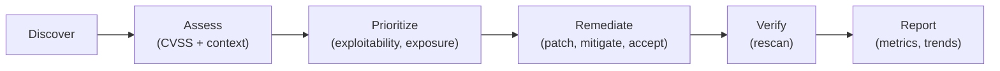

### Scanning Types

| Type | What It Scans | When |
|------|--------------|------|
| SAST | Source code | During development |
| DAST | Running application | In staging/test |
| SCA | Dependencies (libraries) | CI/CD pipeline |
| Infrastructure | OS, network, cloud config | Continuous |
| Container | Docker images | Build + registry |

---

## 9. Security Operations & Incident Response

Detecting, responding to, and recovering from security incidents.

### Security Operations Center (SOC)

| Tier | Role | Responsibility |
|------|------|---------------|
| Tier 1 | Alert Analyst | Triage alerts, initial classification |
| Tier 2 | Incident Responder | Deep investigation, containment |
| Tier 3 | Threat Hunter | Proactive hunting, advanced analysis |
| Engineering | Detection Engineer | Build rules, tune alerts, automate |

### SIEM (Security Information and Event Management)

Aggregates logs from all sources, correlates events, triggers alerts:

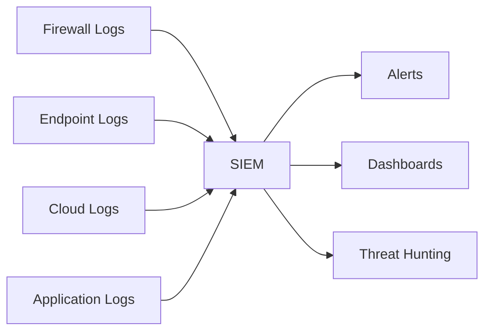

### Incident Response Lifecycle (NIST SP 800-61)

| Phase | Activities |
|-------|-----------|
| 1. Preparation | Playbooks, tools, training, communication plans |
| 2. Detection & Analysis | Alert triage, scope assessment, evidence collection |
| 3. Containment | Isolate affected systems, prevent spread |
| 4. Eradication | Remove threat, patch vulnerability |
| 5. Recovery | Restore services, verify clean state |
| 6. Post-Incident | Lessons learned, improve defenses |

### Incident Severity

| Severity | Definition | Response Time |
|----------|-----------|---------------|
| SEV-1 (Critical) | Active breach, data exfiltration | Immediate (all hands) |
| SEV-2 (High) | Confirmed compromise, contained | Within 1 hour |
| SEV-3 (Medium) | Suspicious activity, unconfirmed | Within 4 hours |
| SEV-4 (Low) | Policy violation, minor anomaly | Next business day |

---

## 10. Secure Software Development

Building security into the development process rather than bolting it on after.

### Secure SDLC

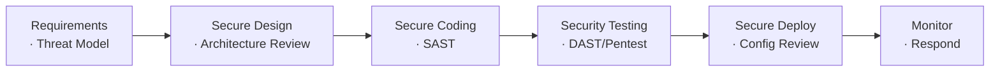

### Threat Modeling (STRIDE)

| Threat | Definition | Example |
|--------|-----------|---------|
| **S**poofing | Pretending to be someone else | Forged authentication token |
| **T**ampering | Modifying data or code | Man-in-the-middle attack |
| **R**epudiation | Denying an action | No audit log of deletion |
| **I**nformation Disclosure | Exposing data | Error messages with stack traces |
| **D**enial of Service | Making system unavailable | Resource exhaustion |
| **E**levation of Privilege | Gaining unauthorized access | Exploiting admin endpoint |

### Supply Chain Security

| Risk | Mitigation |
|------|-----------|
| Compromised dependency | Lock versions, verify checksums, use SCA |
| Typosquatting | Verify package names, use private registries |
| Compromised build pipeline | Sign artifacts, protect CI/CD secrets |
| Malicious maintainer | Monitor dependency changes, use SBOM |

### Security Testing in CI/CD

```text
Commit → SAST (code) → SCA (dependencies) → Build → DAST (running app) → Deploy
         ↓                ↓                           ↓
    Block on critical   Alert on high          Block on critical
```

---

## 11. Compliance & Governance

Frameworks and processes that ensure security is managed systematically.

### Major Frameworks

| Framework | Scope | Type |
|-----------|-------|------|
| ISO 27001 | Information security management | Certifiable standard |
| NIST CSF | Cybersecurity risk management | Voluntary framework |
| SOC 2 | Service organization controls | Audit report |
| PCI DSS | Payment card data | Mandatory (if processing cards) |
| GDPR | Personal data (EU) | Regulation (law) |
| HIPAA | Health information (US) | Regulation (law) |
| NIS2 | Critical infrastructure (EU) | Directive (law) |

### Risk Management

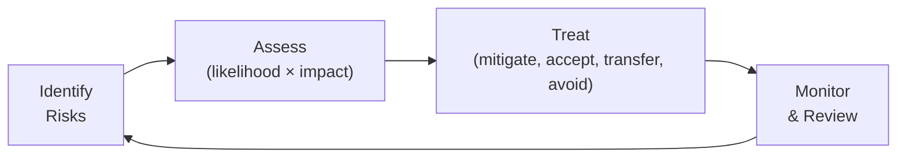

### Risk Treatment Options

| Option | When | Example |
|--------|------|---------|
| Mitigate | Reduce likelihood or impact | Implement MFA |
| Accept | Cost of fix > risk | Low-severity, no sensitive data |
| Transfer | Share risk with third party | Cyber insurance |
| Avoid | Eliminate the activity | Don't store data you don't need |

### Security Controls

| Category | Examples |
|----------|---------|
| Preventive | Firewalls, encryption, access controls |
| Detective | SIEM, IDS, log monitoring |
| Corrective | Incident response, patching, backups |
| Deterrent | Security policies, legal warnings |
| Compensating | Alternative control when primary isn't feasible |

---

## 12. Offensive Security

Understanding attacks to build better defenses. Ethical hacking with authorization.

### Penetration Testing Methodology

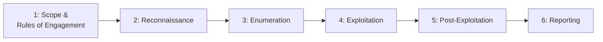

### Testing Types

| Type | Knowledge | Simulates |
|------|-----------|-----------|
| Black Box | No internal info | External attacker |
| Grey Box | Partial info (credentials, docs) | Insider or compromised account |
| White Box | Full access (source code, architecture) | Comprehensive audit |

### Red Team vs Penetration Test

| Aspect | Pentest | Red Team |
|--------|---------|----------|
| Goal | Find vulnerabilities | Test detection & response |
| Scope | Defined targets | Full organization |
| Duration | Days–weeks | Weeks–months |
| Stealth | Not required | Essential |
| Output | Vulnerability list | Narrative of attack path |

### Common Tools

| Category | Tools |
|----------|-------|
| Reconnaissance | Nmap, Shodan, theHarvester, Amass |
| Web Testing | Burp Suite, OWASP ZAP, sqlmap |
| Exploitation | Metasploit, Cobalt Strike |
| Password | Hashcat, John the Ripper, Hydra |
| Post-Exploitation | BloodHound, Mimikatz, LinPEAS |
| Wireless | Aircrack-ng, Kismet |

### Responsible Disclosure

| Approach | Process |
|----------|---------|
| Bug Bounty | Report to program, receive reward |
| Coordinated Disclosure | Report to vendor, wait for fix (90 days), then publish |
| Full Disclosure | Publish immediately (controversial, last resort) |

---

## Key Takeaways

1. **Defense in depth** — no single control is sufficient; layer multiple defenses
2. **Think like an attacker** — understand the kill chain to break it early
3. **Shift left** — integrate security into development, not after deployment
4. **Least privilege everywhere** — users, services, network, cloud
5. **Assume breach** — design systems that limit damage when (not if) compromised
6. **Automate** — manual security doesn't scale; use SAST, DAST, CSPM, SIEM
7. **Compliance ≠ security** — frameworks provide structure, but real security requires continuous effort
8. **People are the weakest link** — training, awareness, and culture matter as much as technology
