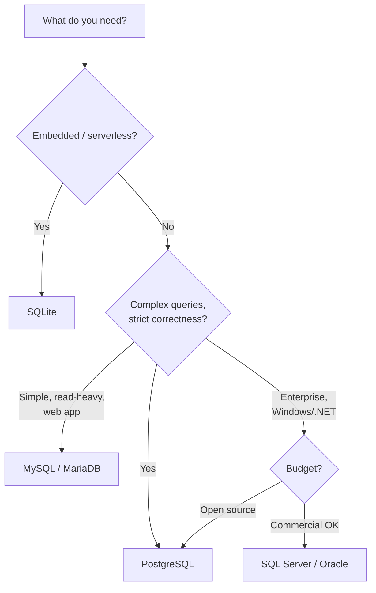

## What Is a Database?

A **database** is an organized collection of structured data, managed by a **Database Management System (DBMS)** that handles storage, retrieval, security, and concurrent access. Without a DBMS, applications would need to manage files, locking, indexing, and crash recovery themselves.

### Types of Databases

| Type | Model | Examples | Best For |
|------|-------|----------|----------|
| Relational (RDBMS) | Tables with rows/columns | PostgreSQL, MySQL, Oracle, SQL Server | Structured data, complex queries, transactions |
| Document | JSON/BSON documents | MongoDB, CouchDB, Firestore | Flexible schemas, nested data |
| Key-Value | Simple key → value pairs | Redis, DynamoDB, Memcached | Caching, sessions, simple lookups |
| Column-Family | Wide columns, sparse rows | Cassandra, HBase, ScyllaDB | Time-series, high write throughput |
| Graph | Nodes and edges | Neo4j, Amazon Neptune | Relationships, social networks, recommendations |
| Time-Series | Timestamped data points | InfluxDB, TimescaleDB, Prometheus | Metrics, IoT, monitoring |

---

## The Relational Model

Proposed by Edgar F. Codd in 1970, the relational model organizes data into **relations** (tables) with mathematical foundations in set theory and predicate logic.

### Core Terminology

| Formal Term | Common Term | Meaning |
|-------------|-------------|---------|
| Relation | Table | Collection of related data |
| Tuple | Row / Record | Single data entry |
| Attribute | Column / Field | A property of the data |
| Domain | Data type | Allowed values for an attribute |
| Degree | Column count | Number of attributes in a relation |
| Cardinality | Row count | Number of tuples in a relation |

### Example Table

```
┌─────────────────────────────────────────────────────────────┐
│ employees                                                    │
├──────┬──────────────┬────────────┬─────────────┬────────────┤
│ id   │ name         │ department │ salary      │ hire_date  │
├──────┼──────────────┼────────────┼─────────────┼────────────┤
│ 1    │ Alice Chen   │ Engineering│ 95000       │ 2021-03-15 │
│ 2    │ Bob Smith    │ Marketing  │ 72000       │ 2020-07-01 │
│ 3    │ Carol Davis  │ Engineering│ 105000      │ 2019-01-20 │
│ 4    │ Dan Wilson   │ Sales      │ 68000       │ 2022-11-10 │
└──────┴──────────────┴────────────┴─────────────┴────────────┘
```

---

## Keys

Keys uniquely identify rows and establish relationships between tables.

### Types of Keys

| Key Type | Purpose | Example |
|----------|---------|---------|
| **Primary Key (PK)** | Uniquely identifies each row. Never NULL, never duplicated. | `employees.id` |
| **Foreign Key (FK)** | References a primary key in another table. Creates relationships. | `orders.customer_id` → `customers.id` |
| **Candidate Key** | Any column(s) that could serve as PK. | `email` (if unique) |
| **Composite Key** | PK made of multiple columns together. | `(student_id, course_id)` in enrollment |
| **Natural Key** | Meaningful real-world identifier. | `isbn`, `email`, `ssn` |
| **Surrogate Key** | Artificial identifier with no business meaning. | Auto-increment `id`, UUID |

### Natural vs Surrogate Keys

| Aspect | Natural Key | Surrogate Key |
|--------|------------|---------------|
| Meaning | Business meaning (ISBN, email) | No meaning (auto-increment) |
| Stability | May change (email updates) | Never changes |
| Size | Variable (strings) | Fixed (integer/UUID) |
| Joins | Self-documenting | Requires lookup |
| Best practice | Use as unique constraint | Use as primary key |

**Modern consensus:** Use surrogate keys (integer or UUID) as primary keys, enforce natural keys as unique constraints.

---

## Relationships

Tables relate to each other through foreign keys. There are three fundamental relationship types:

### One-to-Many (1:N)

The most common. One record in table A relates to many records in table B.

```
┌──────────────┐         ┌──────────────────┐
│ departments  │         │ employees        │
├──────────────┤         ├──────────────────┤
│ id (PK)      │───┐     │ id (PK)          │
│ name         │   │     │ name             │
└──────────────┘   └────▶│ department_id(FK)│
                         │ salary           │
                         └──────────────────┘
```

One department has many employees. Each employee belongs to one department.

### One-to-One (1:1)

One record in A relates to exactly one record in B. Used for:
- Splitting wide tables
- Optional extended data
- Security isolation

```sql
-- users has basic auth info; profiles has optional details
CREATE TABLE users (
    id SERIAL PRIMARY KEY,
    email VARCHAR(255) UNIQUE NOT NULL,
    password_hash VARCHAR(255) NOT NULL
);

CREATE TABLE profiles (
    user_id INTEGER PRIMARY KEY REFERENCES users(id),
    bio TEXT,
    avatar_url VARCHAR(500),
    phone VARCHAR(20)
);
```

### Many-to-Many (M:N)

Requires a **junction table** (also called join table, bridge table, or associative table):

```
┌──────────┐     ┌───────────────────┐     ┌──────────┐
│ students │     │ enrollments       │     │ courses  │
├──────────┤     ├───────────────────┤     ├──────────┤
│ id (PK)  │◀───▶│ student_id (FK)   │◀───▶│ id (PK)  │
│ name     │     │ course_id (FK)    │     │ title    │
└──────────┘     │ enrolled_at       │     │ credits  │
                 │ grade             │     └──────────┘
                 └───────────────────┘
```

A student takes many courses. A course has many students.

---

## RDBMS Landscape

| Database | License | Best For | Notable Features |
|----------|---------|----------|------------------|
| **PostgreSQL** | Open source (BSD) | General purpose, complex queries | Extensions, JSONB, full-text search, CTE, window functions |
| **MySQL** | Open source (GPL) / Commercial | Web applications, read-heavy | Replication, InnoDB engine, widespread hosting support |
| **MariaDB** | Open source (GPL) | MySQL drop-in replacement | Community-driven, compatible, additional engines |
| **SQLite** | Public domain | Embedded, mobile, testing | Serverless, zero-config, single file |
| **SQL Server** | Commercial (+ Express free) | Enterprise Windows/.NET | SSMS tooling, BI integration, CLR |
| **Oracle** | Commercial | Enterprise, legacy systems | RAC clustering, PL/SQL, enterprise features |

### Choosing a Database



---

## Key Takeaways

1. **The relational model** organizes data into tables with mathematical precision — it's 50+ years old and still dominant
2. **Primary keys** uniquely identify rows — prefer surrogate keys (auto-increment/UUID) with natural keys as unique constraints
3. **Foreign keys** create relationships and enforce referential integrity — the database prevents orphaned records
4. **Relationships** come in three forms: one-to-one, one-to-many (most common), and many-to-many (requires junction table)
5. **PostgreSQL** is the safe default choice for new projects — open source, feature-rich, and standards-compliant
6. **SQLite** is perfect for embedded use, prototyping, and testing — no server needed
