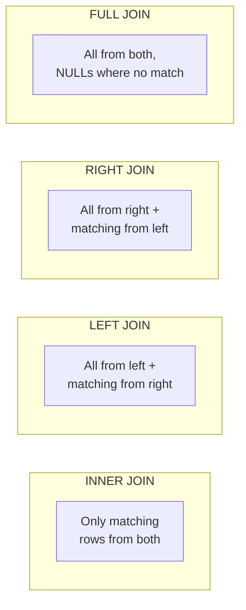

## Why Joins?

In a normalized database, related data lives in separate tables. **Joins** combine rows from two or more tables based on a related column, letting you reconstruct the full picture from properly separated data.

---

## Join Types

### Visual Overview

Assume two tables:

```
employees (id, name, department_id)
departments (id, name)
```



### INNER JOIN

Returns only rows where there's a match in **both** tables:

```sql
SELECT e.name, d.name AS department
FROM employees e
INNER JOIN departments d ON e.department_id = d.id;
```

Employees without a department and departments without employees are excluded.

### LEFT JOIN (LEFT OUTER JOIN)

Returns **all** rows from the left table, with matching rows from the right (or NULL):

```sql
SELECT e.name, d.name AS department
FROM employees e
LEFT JOIN departments d ON e.department_id = d.id;
```

All employees appear — those without a department show `NULL` for department name.

### RIGHT JOIN (RIGHT OUTER JOIN)

Returns **all** rows from the right table, with matching rows from the left (or NULL):

```sql
SELECT e.name, d.name AS department
FROM employees e
RIGHT JOIN departments d ON e.department_id = d.id;
```

All departments appear — those without employees show `NULL` for employee name.

### FULL OUTER JOIN

Returns **all** rows from both tables, with NULLs where there's no match:

```sql
SELECT e.name, d.name AS department
FROM employees e
FULL OUTER JOIN departments d ON e.department_id = d.id;
```

Shows unmatched employees AND unmatched departments.

### CROSS JOIN

Returns the **Cartesian product** — every row from A combined with every row from B:

```sql
SELECT e.name, s.shift_name
FROM employees e
CROSS JOIN shifts s;
```

If employees has 100 rows and shifts has 3, result has 300 rows. Rarely needed — useful for generating combinations.

---

## Practical Join Patterns

### Multi-Table Joins

```sql
SELECT
    e.name AS employee,
    d.name AS department,
    o.name AS office_location,
    m.name AS manager
FROM employees e
JOIN departments d ON e.department_id = d.id
JOIN offices o ON d.office_id = o.id
LEFT JOIN employees m ON e.manager_id = m.id;
```

### Self-Join

A table joined to itself — common for hierarchies:

```sql
-- Employee with their manager's name
SELECT
    e.name AS employee,
    m.name AS manager
FROM employees e
LEFT JOIN employees m ON e.manager_id = m.id;
```

### Finding Unmatched Records

```sql
-- Employees without a department
SELECT e.name
FROM employees e
LEFT JOIN departments d ON e.department_id = d.id
WHERE d.id IS NULL;

-- Departments with no employees
SELECT d.name
FROM departments d
LEFT JOIN employees e ON d.id = e.department_id
WHERE e.id IS NULL;
```

### Join with Aggregation

```sql
-- Count employees per department
SELECT d.name, COUNT(e.id) AS employee_count
FROM departments d
LEFT JOIN employees e ON d.id = e.department_id
GROUP BY d.name
ORDER BY employee_count DESC;
```

---

## Subqueries

A subquery is a query nested inside another query. The inner query executes first, and its result feeds into the outer query.

### Subquery in WHERE

```sql
-- Employees earning above average
SELECT name, salary
FROM employees
WHERE salary > (SELECT AVG(salary) FROM employees);

-- Employees in the Engineering department (subquery instead of join)
SELECT name
FROM employees
WHERE department_id = (SELECT id FROM departments WHERE name = 'Engineering');

-- Employees in departments with > 10 people
SELECT name
FROM employees
WHERE department_id IN (
    SELECT department_id
    FROM employees
    GROUP BY department_id
    HAVING COUNT(*) > 10
);
```

### Subquery in FROM (Derived Table)

```sql
-- Average salary per department, then filter
SELECT dept_name, avg_salary
FROM (
    SELECT d.name AS dept_name, AVG(e.salary) AS avg_salary
    FROM employees e
    JOIN departments d ON e.department_id = d.id
    GROUP BY d.name
) AS dept_averages
WHERE avg_salary > 80000;
```

### Subquery in SELECT

```sql
-- Each employee with the company average for comparison
SELECT
    name,
    salary,
    (SELECT AVG(salary) FROM employees) AS company_avg,
    salary - (SELECT AVG(salary) FROM employees) AS diff_from_avg
FROM employees;
```

### Correlated Subqueries

The inner query references the outer query — executes once per outer row:

```sql
-- Employees earning more than their department average
SELECT e.name, e.salary, e.department_id
FROM employees e
WHERE e.salary > (
    SELECT AVG(e2.salary)
    FROM employees e2
    WHERE e2.department_id = e.department_id
);
```

### EXISTS

Tests whether a subquery returns any rows (true/false):

```sql
-- Departments that have at least one employee
SELECT d.name
FROM departments d
WHERE EXISTS (
    SELECT 1
    FROM employees e
    WHERE e.department_id = d.id
);

-- Departments with no employees
SELECT d.name
FROM departments d
WHERE NOT EXISTS (
    SELECT 1
    FROM employees e
    WHERE e.department_id = d.id
);
```

---

## Common Table Expressions (CTEs)

CTEs make complex queries readable by breaking them into named steps:

```sql
WITH department_stats AS (
    SELECT
        department_id,
        AVG(salary) AS avg_salary,
        COUNT(*) AS headcount
    FROM employees
    GROUP BY department_id
),
high_paying AS (
    SELECT department_id, avg_salary
    FROM department_stats
    WHERE avg_salary > 80000
)
SELECT d.name, hp.avg_salary, ds.headcount
FROM high_paying hp
JOIN departments d ON hp.department_id = d.id
JOIN department_stats ds ON hp.department_id = ds.department_id
ORDER BY hp.avg_salary DESC;
```

### Recursive CTEs

For hierarchical data (org charts, categories, bill of materials):

```sql
-- Full org chart: find all reports under a manager, recursively
WITH RECURSIVE org_chart AS (
    -- Base case: the top manager
    SELECT id, name, manager_id, 1 AS level
    FROM employees
    WHERE id = 1
    
    UNION ALL
    
    -- Recursive case: employees reporting to someone already found
    SELECT e.id, e.name, e.manager_id, oc.level + 1
    FROM employees e
    JOIN org_chart oc ON e.manager_id = oc.id
)
SELECT REPEAT('  ', level - 1) || name AS org_tree, level
FROM org_chart
ORDER BY level, name;
```

---

## Subquery vs Join vs CTE

| Approach | Best For | Performance |
|----------|----------|-------------|
| **JOIN** | Combining related tables, standard associations | Usually fastest — optimizer handles well |
| **Subquery in WHERE** | Filtering by aggregated/computed value | Good for scalar comparisons |
| **Correlated subquery** | Row-by-row comparison with related data | Can be slow (N+1) — consider rewriting as JOIN |
| **CTE** | Breaking complex logic into readable steps | Same as subquery (not materialized in most DBs) |
| **Derived table** | Intermediate aggregation | Same as CTE but less readable |

**Rule of thumb:** Use JOINs for data combination, CTEs for readability, and subqueries only when they're genuinely simpler.

---

## Key Takeaways

1. **INNER JOIN** is the default — only returns matches. Use **LEFT JOIN** when you need all rows from one side regardless of match
2. **Always use explicit JOIN syntax** — never comma-separated tables with WHERE (implicit join is harder to read and maintain)
3. **CTEs** make complex queries human-readable — name your intermediate steps
4. **Correlated subqueries** run once per outer row — rewrite as JOINs if performance matters
5. **EXISTS** is often faster than `IN` for large subquery results — the optimizer can stop at the first match
6. **Self-joins** solve hierarchical queries (manager → employee) elegantly
