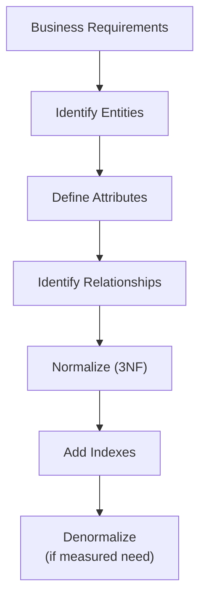

## What Is Normalization?

Normalization is the process of organizing database tables to **reduce redundancy** and **prevent anomalies** (insertion, update, and deletion anomalies). Each normal form builds on the previous one.

### Why Normalize?

| Problem | Without Normalization | With Normalization |
|---------|----------------------|-------------------|
| **Update anomaly** | Change department name in 500 employee rows | Change it in 1 row in departments table |
| **Insertion anomaly** | Can't add a department with no employees | Department exists independently |
| **Deletion anomaly** | Deleting last employee removes department info | Department persists regardless |
| **Storage** | Repeated data wastes space | Each fact stored once |
| **Consistency** | Same data might disagree across rows | Single source of truth |

---

## Normal Forms

### First Normal Form (1NF)

**Rule:** Every column contains only atomic (indivisible) values. No repeating groups or arrays.

❌ Violates 1NF:

| id | name | phone_numbers |
|----|------|---------------|
| 1 | Alice | 555-0001, 555-0002 |
| 2 | Bob | 555-0003 |

✅ Satisfies 1NF:

| id | name | phone_number |
|----|------|-------------|
| 1 | Alice | 555-0001 |
| 1 | Alice | 555-0002 |
| 2 | Bob | 555-0003 |

Or better — separate table:

```sql
CREATE TABLE contacts (id SERIAL PRIMARY KEY, name VARCHAR(100));
CREATE TABLE phone_numbers (
    id SERIAL PRIMARY KEY,
    contact_id INTEGER REFERENCES contacts(id),
    phone VARCHAR(20)
);
```

### Second Normal Form (2NF)

**Rule:** 1NF + every non-key column depends on the **entire** primary key (no partial dependencies). Only relevant for composite keys.

❌ Violates 2NF (composite key: student_id + course_id):

| student_id | course_id | student_name | grade |
|------------|-----------|-------------|-------|
| 1 | CS101 | Alice | A |
| 1 | MA201 | Alice | B |

`student_name` depends only on `student_id`, not the full composite key.

✅ Satisfies 2NF:

```sql
CREATE TABLE students (id INTEGER PRIMARY KEY, name VARCHAR(100));
CREATE TABLE enrollments (
    student_id INTEGER REFERENCES students(id),
    course_id VARCHAR(10) REFERENCES courses(id),
    grade CHAR(2),
    PRIMARY KEY (student_id, course_id)
);
```

### Third Normal Form (3NF)

**Rule:** 2NF + no **transitive dependencies** — non-key columns must depend directly on the primary key, not on other non-key columns.

❌ Violates 3NF:

| employee_id | name | department_id | department_name | dept_building |
|-------------|------|---------------|-----------------|---------------|

`department_name` and `dept_building` depend on `department_id`, not directly on `employee_id`.

✅ Satisfies 3NF:

```sql
CREATE TABLE departments (
    id INTEGER PRIMARY KEY,
    name VARCHAR(100),
    building VARCHAR(100)
);
CREATE TABLE employees (
    id INTEGER PRIMARY KEY,
    name VARCHAR(100),
    department_id INTEGER REFERENCES departments(id)
);
```

### Boyce-Codd Normal Form (BCNF)

**Rule:** 3NF + every determinant is a candidate key. Handles edge cases where 3NF still allows anomalies with overlapping candidate keys.

In practice, if your tables satisfy 3NF, they almost always satisfy BCNF too.

---

## Quick Reference

| Normal Form | Eliminates | Simple Rule |
|-------------|-----------|-------------|
| **1NF** | Repeating groups | Atomic values only |
| **2NF** | Partial dependencies | No column depends on part of a composite key |
| **3NF** | Transitive dependencies | Non-key columns depend only on the PK |
| **BCNF** | Non-candidate-key determinants | Every determinant is a candidate key |

---

## Denormalization

Sometimes you intentionally violate normalization for **read performance**. This is a deliberate tradeoff, not a mistake.

### When to Denormalize

| Scenario | Denormalization Strategy |
|----------|------------------------|
| Dashboard queries joining 10+ tables | Pre-computed summary table |
| Read-heavy, write-rare data | Duplicate frequently-read fields |
| Full-text search requirements | Separate search-optimized table |
| Reporting over time | Snapshot tables (store computed values at a point in time) |

### Common Techniques

```sql
-- Store computed total on order (avoid recalculating from line items)
ALTER TABLE orders ADD COLUMN total_amount NUMERIC(12,2);

-- Store latest status on parent (avoid joining to status history)
ALTER TABLE projects ADD COLUMN current_status VARCHAR(20);

-- Counter cache (avoid COUNT queries)
ALTER TABLE posts ADD COLUMN comment_count INTEGER DEFAULT 0;
```

**Rules:**
- Always normalize first, denormalize for measured performance problems
- Document why the denormalization exists
- Maintain consistency (triggers, application logic, or accept eventual consistency)

---

## Schema Design Process

### From Requirements to Tables



### Entity-Relationship Modeling

1. **Identify entities** — nouns in requirements (Customer, Order, Product)
2. **Identify attributes** — properties of each entity
3. **Identify relationships** — how entities connect (1:1, 1:N, M:N)
4. **Determine cardinality** — "one customer has many orders"
5. **Define keys** — PK for each entity, FKs for relationships

### Example: E-Commerce Schema

```sql
CREATE TABLE customers (
    id SERIAL PRIMARY KEY,
    email VARCHAR(255) UNIQUE NOT NULL,
    name VARCHAR(200) NOT NULL,
    created_at TIMESTAMP DEFAULT NOW()
);

CREATE TABLE products (
    id SERIAL PRIMARY KEY,
    name VARCHAR(300) NOT NULL,
    price NUMERIC(10, 2) NOT NULL CHECK (price > 0),
    stock INTEGER NOT NULL DEFAULT 0 CHECK (stock >= 0),
    category_id INTEGER REFERENCES categories(id)
);

CREATE TABLE orders (
    id SERIAL PRIMARY KEY,
    customer_id INTEGER NOT NULL REFERENCES customers(id),
    status VARCHAR(20) NOT NULL DEFAULT 'pending'
        CHECK (status IN ('pending', 'confirmed', 'shipped', 'delivered', 'cancelled')),
    total NUMERIC(12, 2) NOT NULL,
    ordered_at TIMESTAMP DEFAULT NOW()
);

CREATE TABLE order_items (
    id SERIAL PRIMARY KEY,
    order_id INTEGER NOT NULL REFERENCES orders(id) ON DELETE CASCADE,
    product_id INTEGER NOT NULL REFERENCES products(id),
    quantity INTEGER NOT NULL CHECK (quantity > 0),
    unit_price NUMERIC(10, 2) NOT NULL,  -- Snapshot price at time of order
    UNIQUE (order_id, product_id)
);

CREATE TABLE categories (
    id SERIAL PRIMARY KEY,
    name VARCHAR(100) NOT NULL,
    parent_id INTEGER REFERENCES categories(id)  -- Self-referencing for hierarchy
);
```

---

## Common Design Patterns

### Soft Deletes

```sql
ALTER TABLE employees ADD COLUMN deleted_at TIMESTAMP;
-- "Delete": UPDATE employees SET deleted_at = NOW() WHERE id = 5;
-- Query active: SELECT * FROM employees WHERE deleted_at IS NULL;
```

### Audit Trail

```sql
CREATE TABLE audit_log (
    id BIGSERIAL PRIMARY KEY,
    table_name VARCHAR(100) NOT NULL,
    record_id INTEGER NOT NULL,
    action VARCHAR(10) NOT NULL,  -- INSERT, UPDATE, DELETE
    old_values JSONB,
    new_values JSONB,
    changed_by INTEGER REFERENCES users(id),
    changed_at TIMESTAMP DEFAULT NOW()
);
```

### Polymorphic Associations

```sql
-- Option 1: Separate FKs (type-safe but sparse)
CREATE TABLE comments (
    id SERIAL PRIMARY KEY,
    body TEXT NOT NULL,
    post_id INTEGER REFERENCES posts(id),
    photo_id INTEGER REFERENCES photos(id),
    CHECK (
        (post_id IS NOT NULL AND photo_id IS NULL) OR
        (post_id IS NULL AND photo_id IS NOT NULL)
    )
);

-- Option 2: Type + ID (flexible but no FK constraint)
CREATE TABLE comments (
    id SERIAL PRIMARY KEY,
    body TEXT NOT NULL,
    commentable_type VARCHAR(50) NOT NULL,  -- 'post', 'photo'
    commentable_id INTEGER NOT NULL
);
```

---

## Key Takeaways

1. **Normalize to 3NF by default** — it prevents data anomalies and is sufficient for most applications
2. **Denormalize deliberately** — only for measured performance needs, never out of laziness
3. **Store each fact once** — redundancy leads to inconsistency
4. **Design from the domain** — identify entities and relationships from business language
5. **Snapshot mutable values** — store the price at time of order, not a reference to the current price
6. **Use constraints** — let the database enforce business rules (CHECK, UNIQUE, FK)
