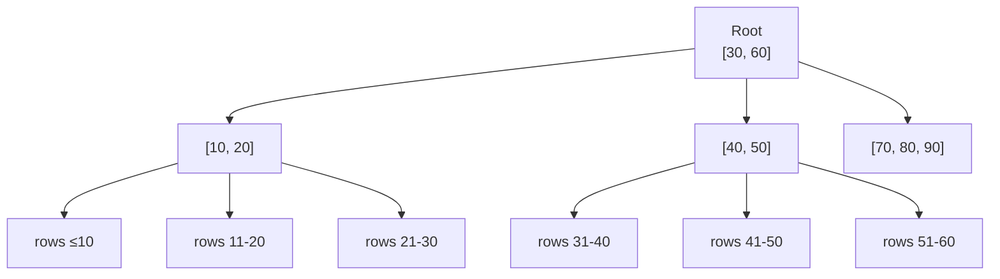

## Why Indexes Matter

Without an index, the database must scan every row in a table to find matches (**full table scan**). An index is a separate data structure that allows the database to find rows without reading the entire table — like a book's index vs reading every page.

| Without Index | With Index |
|--------------|-----------|
| O(n) — scan all rows | O(log n) — tree traversal |
| 1M row table → 1M reads | 1M row table → ~20 reads |
| Fine for small tables | Essential for large tables |

---

## How B-Tree Indexes Work

The default index type in all major databases is the **B-tree** (balanced tree):



B-trees support: equality (`=`), range (`>`, `<`, `BETWEEN`), prefix LIKE (`LIKE 'abc%'`), ORDER BY, and MIN/MAX.

---

## Creating Indexes

```sql
-- Basic index
CREATE INDEX idx_employees_department ON employees(department_id);

-- Unique index
CREATE UNIQUE INDEX idx_employees_email ON employees(email);

-- Composite index (column order matters!)
CREATE INDEX idx_orders_customer_date ON orders(customer_id, order_date);

-- Partial index (only indexes subset of rows)
CREATE INDEX idx_active_employees ON employees(department_id)
    WHERE is_active = TRUE;

-- Index with included columns (covering index)
CREATE INDEX idx_orders_lookup ON orders(customer_id)
    INCLUDE (status, total);

-- Expression index
CREATE INDEX idx_employees_lower_email ON employees(LOWER(email));

-- Drop index
DROP INDEX idx_employees_department;
```

### Composite Index Column Order

For a composite index on `(A, B, C)`:

| Query Filter | Uses Index? |
|-------------|-------------|
| `WHERE A = ?` | ✅ Yes |
| `WHERE A = ? AND B = ?` | ✅ Yes |
| `WHERE A = ? AND B = ? AND C = ?` | ✅ Yes (full) |
| `WHERE B = ?` | ❌ No (skips leading column) |
| `WHERE A = ? AND C = ?` | ⚠️ Partial (only A) |
| `WHERE B = ? AND C = ?` | ❌ No |

**Rule:** Composite indexes work left-to-right. Put the most selective (highest cardinality) or most frequently filtered column first.

---

## Index Types

| Type | Use Case | Example |
|------|----------|---------|
| **B-tree** (default) | Equality, range, sorting | Most queries |
| **Hash** | Equality only (no range) | Exact lookups |
| **GIN** (Generalized Inverted) | Full-text search, arrays, JSONB | `WHERE tags @> '{sql}'` |
| **GiST** (Generalized Search Tree) | Geometric, range types | PostGIS spatial queries |
| **BRIN** (Block Range) | Large naturally-ordered tables | Time-series `created_at` |

```sql
-- GIN for JSONB queries
CREATE INDEX idx_events_payload ON events USING gin(payload);

-- BRIN for time-ordered data (very small index)
CREATE INDEX idx_logs_created ON logs USING brin(created_at);

-- GIN for full-text search
CREATE INDEX idx_articles_search ON articles USING gin(to_tsvector('english', title || ' ' || body));
```

---

## EXPLAIN — Understanding Query Plans

```sql
-- Show query plan
EXPLAIN SELECT * FROM employees WHERE department_id = 5;

-- Show plan with actual execution stats
EXPLAIN ANALYZE SELECT * FROM employees WHERE department_id = 5;

-- Verbose output with costs
EXPLAIN (ANALYZE, BUFFERS, FORMAT TEXT)
SELECT * FROM employees WHERE department_id = 5;
```

### Reading EXPLAIN Output

```
Seq Scan on employees  (cost=0.00..15.00 rows=3 width=64) (actual time=0.01..0.05 rows=3 loops=1)
  Filter: (department_id = 5)
  Rows Removed by Filter: 97
```

vs. with index:

```
Index Scan using idx_employees_department on employees  (cost=0.28..8.30 rows=3 width=64) (actual time=0.02..0.03 rows=3 loops=1)
  Index Cond: (department_id = 5)
```

### Key Scan Types

| Scan Type | What It Means | Performance |
|-----------|---------------|-------------|
| **Seq Scan** | Full table scan (reads every row) | Slow for large tables |
| **Index Scan** | Uses index to find rows, then fetches from table | Good |
| **Index Only Scan** | All data from index (covering index) | Best |
| **Bitmap Index Scan** | Uses index to build bitmap, then fetches | Good for moderate selectivity |
| **Nested Loop** | For each outer row, scan inner table | OK for small inner sets |
| **Hash Join** | Build hash table, probe it | Good for equality joins |
| **Merge Join** | Both sides sorted, merge | Great for sorted large datasets |

---

## Query Optimization Strategies

### 1. Index the WHERE clause

```sql
-- If you frequently query by status:
CREATE INDEX idx_orders_status ON orders(status);
```

### 2. Cover the query (avoid table lookups)

```sql
-- If you only need customer_id and total:
CREATE INDEX idx_orders_covering ON orders(customer_id) INCLUDE (total, status);
-- Now "Index Only Scan" is possible
```

### 3. Avoid functions on indexed columns

```sql
-- ❌ Bad: index on name can't be used
SELECT * FROM employees WHERE UPPER(name) = 'ALICE';

-- ✅ Good: create expression index
CREATE INDEX idx_emp_name_upper ON employees(UPPER(name));

-- ✅ Better: store normalized data
-- Or just compare correctly
SELECT * FROM employees WHERE name = 'Alice';
```

### 4. Avoid leading wildcards

```sql
-- ❌ Can't use B-tree index
SELECT * FROM products WHERE name LIKE '%widget%';

-- ✅ Can use B-tree index (prefix match)
SELECT * FROM products WHERE name LIKE 'widget%';

-- ✅ Use full-text search for contains
SELECT * FROM products WHERE to_tsvector('english', name) @@ to_tsquery('widget');
```

### 5. Use LIMIT for top-N queries

```sql
-- With ORDER BY + LIMIT, database can stop early
SELECT * FROM orders ORDER BY created_at DESC LIMIT 10;
-- Needs: CREATE INDEX idx_orders_created ON orders(created_at DESC);
```

### 6. Analyze query statistics

```sql
-- Update table statistics (PostgreSQL)
ANALYZE employees;

-- Check index usage
SELECT
    indexrelname AS index_name,
    idx_scan AS times_used,
    idx_tup_read AS rows_read
FROM pg_stat_user_indexes
WHERE schemaname = 'public'
ORDER BY idx_scan DESC;

-- Find unused indexes (candidates for removal)
SELECT indexrelname, idx_scan
FROM pg_stat_user_indexes
WHERE idx_scan = 0 AND schemaname = 'public';
```

---

## When NOT to Index

| Scenario | Why |
|----------|-----|
| Small tables (< 1000 rows) | Seq scan is faster than index overhead |
| Columns with low cardinality | Index on boolean `is_active` rarely helps (consider partial index) |
| Heavily written tables | Each INSERT/UPDATE must also update indexes |
| Columns never used in WHERE/JOIN/ORDER BY | Wasted space and write overhead |

---

## Key Takeaways

1. **Index columns you filter, join, and sort by** — these are the columns in WHERE, JOIN ON, and ORDER BY
2. **Composite index order matters** — leftmost column must appear in the query filter
3. **Use EXPLAIN ANALYZE** to verify your index is actually being used
4. **Covering indexes** eliminate table lookups entirely — the fastest possible read
5. **Partial indexes** are powerful — only index the subset of rows you actually query
6. **Every index costs writes** — INSERT and UPDATE become slower. Don't over-index.
7. **Run ANALYZE** after bulk data loads so the query planner has accurate statistics
