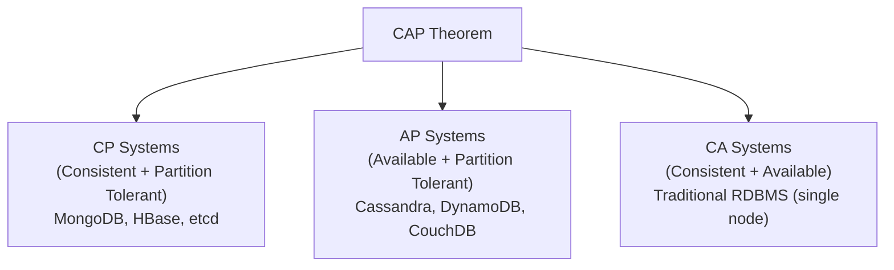
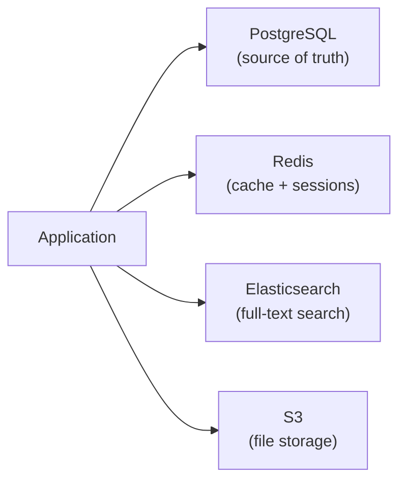

## What Is NoSQL?

**NoSQL** ("Not Only SQL") databases are non-relational systems designed for specific data models, access patterns, and scale requirements that relational databases handle poorly or inefficiently.

NoSQL isn't better or worse than SQL — it's **different tradeoffs** for different problems.

---

## When to Use NoSQL vs SQL

| Choose SQL (Relational) When | Choose NoSQL When |
|-----------------------------|-------------------|
| Data has clear relationships and schema | Schema varies between records |
| Complex queries with JOINs needed | Access patterns are simple (get by key) |
| ACID transactions are critical | Eventual consistency is acceptable |
| Data integrity is paramount | Horizontal scalability is priority |
| You need ad-hoc analytical queries | You need low-latency at massive scale |
| Data fits neatly in tables | Data is hierarchical, graph-shaped, or time-series |

---

## NoSQL Categories

### Document Stores

Store data as flexible JSON/BSON documents. Each document can have different fields.

**Examples:** MongoDB, CouchDB, Firestore, Amazon DocumentDB

```json
// MongoDB document — no fixed schema
{
    "_id": "ObjectId('...')",
    "name": "Alice Chen",
    "email": "alice@example.com",
    "addresses": [
        {"type": "home", "city": "Seattle", "zip": "98101"},
        {"type": "work", "city": "Redmond", "zip": "98052"}
    ],
    "orders": 47,
    "tags": ["premium", "early-adopter"]
}
```

**Best for:** Content management, user profiles, product catalogs, any data with variable structure.

**Tradeoffs:** No JOINs (denormalize or embed), eventual consistency, limited transaction support (improving).

---

### Key-Value Stores

Simplest model: a key maps to a value (string, JSON, binary blob). Extremely fast for simple lookups.

**Examples:** Redis, Amazon DynamoDB, Memcached, etcd

```
Key: "session:abc123"     → Value: {"user_id": 42, "expires": "2024-01-15T10:00:00Z"}
Key: "cache:user:42"      → Value: {"name": "Alice", "email": "alice@example.com"}
Key: "rate:192.168.1.1"   → Value: "47"
```

**Best for:** Caching, sessions, rate limiting, feature flags, leaderboards, real-time counters.

**Tradeoffs:** No queries beyond key lookup (some offer secondary indexes), no relationships.

---

### Column-Family Stores

Organize data by columns rather than rows. Optimized for writing and reading large datasets where you only need certain columns.

**Examples:** Apache Cassandra, HBase, ScyllaDB

```
Row Key: "user:42"
    Column Family: "profile"
        name: "Alice"
        email: "alice@example.com"
    Column Family: "activity"
        last_login: "2024-01-15"
        login_count: "347"
```

**Best for:** Time-series, event logging, IoT data, high write throughput, data that's written once and read by time range.

**Tradeoffs:** Limited query flexibility, no JOINs, eventual consistency, complex data modeling.

---

### Graph Databases

Store entities (nodes) and their relationships (edges) as first-class citizens. Traverse relationships in constant time.

**Examples:** Neo4j, Amazon Neptune, ArangoDB, JanusGraph

```
(Alice)-[:WORKS_IN]->(Engineering)
(Alice)-[:MANAGES]->(Bob)
(Alice)-[:KNOWS]->(Carol)
(Bob)-[:WORKS_ON]->(Project_X)
(Carol)-[:WORKS_ON]->(Project_X)
```

**Best for:** Social networks, recommendation engines, fraud detection, knowledge graphs, network analysis.

**Tradeoffs:** Not suited for bulk analytics, smaller ecosystem, steep learning curve (Cypher/Gremlin query languages).

---

### Time-Series Databases

Optimized for timestamped data points — metrics, events, IoT readings.

**Examples:** InfluxDB, TimescaleDB (PostgreSQL extension), Prometheus, Amazon Timestream

```
measurement: cpu_usage
tags: host=server1, region=us-east
time: 2024-01-15T10:00:00Z, value: 72.5
time: 2024-01-15T10:00:05Z, value: 68.3
time: 2024-01-15T10:00:10Z, value: 74.1
```

**Best for:** Monitoring, IoT, financial tick data, analytics over time windows.

**Tradeoffs:** Not for general-purpose queries, specialized query languages, retention-based storage.

---

## The CAP Theorem

In a distributed system, you can only guarantee **two out of three**:

| Property | Meaning |
|----------|---------|
| **Consistency** | Every read returns the most recent write |
| **Availability** | Every request gets a response (even if stale) |
| **Partition Tolerance** | System continues despite network splits between nodes |

Since network partitions are unavoidable in distributed systems, the real choice is:

- **CP** (Consistency + Partition Tolerance): Returns error or timeout during partition rather than stale data. Examples: MongoDB (primary reads), HBase, etcd.
- **AP** (Availability + Partition Tolerance): Always responds, but data might be stale during partition. Examples: Cassandra, DynamoDB, CouchDB.



---

## DynamoDB (Key-Value / Document Hybrid)

AWS's flagship NoSQL database — common in cloud-native applications:

```python
# Single-table design pattern
{
    "PK": "USER#42",
    "SK": "PROFILE",
    "name": "Alice",
    "email": "alice@example.com"
}
{
    "PK": "USER#42",
    "SK": "ORDER#2024-001",
    "total": 99.99,
    "status": "shipped"
}
```

| Feature | DynamoDB | PostgreSQL |
|---------|----------|-----------|
| Scale | Automatic, unlimited | Vertical (or complex sharding) |
| Pricing | Per request or provisioned capacity | Per instance hour |
| Queries | By key only (+ GSI) | Any column, JOINs, subqueries |
| Schema | Flexible per item | Fixed per table |
| Transactions | Limited (25 items max) | Full ACID |

---

## Redis (In-Memory Key-Value)

Ultra-fast data structure store — commonly used alongside a primary database:

| Data Structure | Use Case | Commands |
|---------------|----------|----------|
| Strings | Cache, counters | `SET`, `GET`, `INCR` |
| Hashes | Objects, sessions | `HSET`, `HGET`, `HGETALL` |
| Lists | Queues, feeds | `LPUSH`, `RPOP`, `LRANGE` |
| Sets | Tags, unique items | `SADD`, `SMEMBERS`, `SINTER` |
| Sorted Sets | Leaderboards, rankings | `ZADD`, `ZRANGE`, `ZRANK` |
| Streams | Event logs | `XADD`, `XREAD` |

```bash
# Caching pattern
SET cache:user:42 '{"name":"Alice"}' EX 3600    # Expires in 1 hour
GET cache:user:42

# Rate limiting
INCR rate:192.168.1.1
EXPIRE rate:192.168.1.1 60                       # 60-second window
```

---

## Polyglot Persistence

Modern systems often use multiple databases, each for its strength:



| Concern | Database | Why |
|---------|----------|-----|
| User data, orders, transactions | PostgreSQL | ACID, relationships, complex queries |
| Sessions, caching | Redis | Sub-millisecond latency |
| Full-text search | Elasticsearch | Inverted indexes, fuzzy matching |
| Files, images | S3 / object storage | Cheap, scalable blob storage |
| Metrics, monitoring | InfluxDB / TimescaleDB | Time-series optimized |
| Recommendations | Neo4j | Graph traversal |

---

## Key Takeaways

1. **NoSQL is not a replacement for SQL** — it's an alternative for specific access patterns and scale requirements
2. **Start with PostgreSQL** unless you have a measured reason for NoSQL — it handles most workloads well
3. **CAP theorem** forces a choice: during network issues, do you prefer consistency or availability?
4. **DynamoDB** is excellent for known access patterns at scale — terrible for ad-hoc queries
5. **Redis** is almost always used alongside another database, not as the primary store
6. **Polyglot persistence** is the norm in production — use each database for its strengths
7. **Schema flexibility** in document stores sounds freeing but requires discipline — schema-on-read means validation moves to application code
