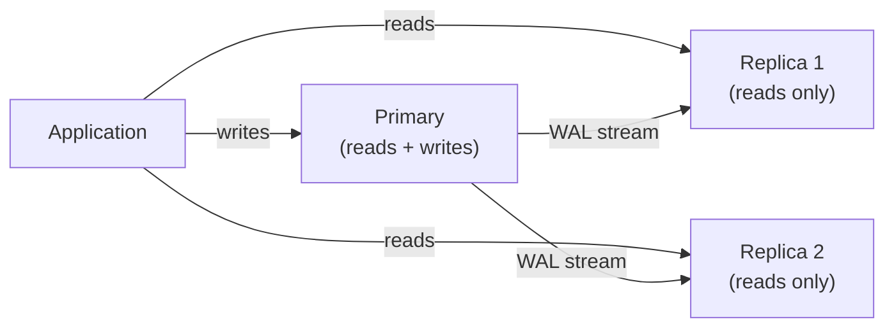
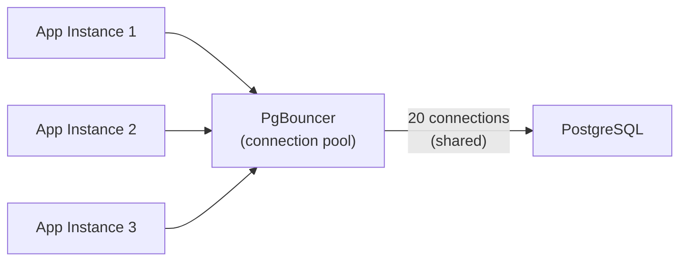

## Backups

### Backup Types

| Type | What It Captures | Speed | Restore Time | Use |
|------|-----------------|-------|--------------|-----|
| **Logical (pg_dump)** | SQL statements to recreate data | Slow (reads all data) | Slow (re-executes SQL) | Small databases, cross-version migration |
| **Physical (pg_basebackup)** | Raw data files | Fast (file copy) | Fast (file restore) | Large databases, point-in-time recovery |
| **Continuous (WAL archiving)** | Write-Ahead Log stream | Minimal overhead | Fast + PITR | Production (restore to any point in time) |

### PostgreSQL Backup Commands

```bash
# Logical backup (single database)
pg_dump -h localhost -U postgres mydb > backup.sql
pg_dump -Fc mydb > backup.dump           # Custom format (compressed, parallel restore)
pg_dump -Fd mydb -j 4 -f backup_dir/     # Directory format (parallel dump)

# All databases
pg_dumpall > all_databases.sql

# Restore
psql mydb < backup.sql                    # From SQL
pg_restore -d mydb backup.dump            # From custom format
pg_restore -d mydb -j 4 backup_dir/       # Parallel restore

# Physical backup
pg_basebackup -h localhost -U replicator -D /backups/base -Ft -z -P
```

### Backup Best Practices

- **Automate backups** on a schedule (daily full + continuous WAL)
- **Test restores** regularly — a backup you can't restore is worthless
- **Store off-site** — different region, different provider
- **Encrypt backups** at rest and in transit
- **Monitor backup jobs** — alert on failure immediately
- **Define retention** — 7 daily, 4 weekly, 12 monthly is a common pattern

---

## Replication

### Purpose

| Goal | Solution |
|------|----------|
| High availability (failover) | Synchronous replica + automatic failover |
| Read scaling | Async read replicas |
| Disaster recovery | Cross-region replica |
| Zero-downtime upgrades | Logical replication to new version |

### PostgreSQL Streaming Replication



### Replication Modes

| Mode | Behavior | Latency | Data Loss Risk |
|------|----------|---------|----------------|
| **Asynchronous** | Primary doesn't wait for replica confirmation | Lowest | Possible (seconds of data) |
| **Synchronous** | Primary waits for at least one replica | Higher | Zero |
| **Logical** | Replicates at SQL level (selective tables) | Variable | Possible |

---

## Partitioning

Split large tables into smaller physical pieces for performance:

### Partition Types

| Strategy | Split By | Best For |
|----------|----------|----------|
| **Range** | Value ranges (dates, IDs) | Time-series, logs, orders by date |
| **List** | Discrete values | Status, region, category |
| **Hash** | Hash of column value | Even distribution |

```sql
-- Range partitioning by date
CREATE TABLE orders (
    id SERIAL,
    customer_id INTEGER,
    order_date DATE NOT NULL,
    total NUMERIC(10,2)
) PARTITION BY RANGE (order_date);

CREATE TABLE orders_2024_q1 PARTITION OF orders
    FOR VALUES FROM ('2024-01-01') TO ('2024-04-01');
CREATE TABLE orders_2024_q2 PARTITION OF orders
    FOR VALUES FROM ('2024-04-01') TO ('2024-07-01');
CREATE TABLE orders_2024_q3 PARTITION OF orders
    FOR VALUES FROM ('2024-07-01') TO ('2024-10-01');
CREATE TABLE orders_2024_q4 PARTITION OF orders
    FOR VALUES FROM ('2024-10-01') TO ('2025-01-01');
```

### Benefits

- **Faster queries** — optimizer scans only relevant partitions (partition pruning)
- **Easier maintenance** — drop old partitions instead of DELETE (instant, no bloat)
- **Parallel operations** — vacuum, backup, index rebuild per partition

---

## Connection Pooling

Database connections are expensive (memory, auth, process creation). A connection pooler maintains a pool of reusable connections.



### PgBouncer (PostgreSQL)

| Mode | Behavior | Best For |
|------|----------|----------|
| **Session** | Connection held for entire client session | Applications needing session state |
| **Transaction** | Connection returned after each transaction | Most web applications (recommended) |
| **Statement** | Connection returned after each statement | Simple queries, no multi-statement transactions |

```ini
# pgbouncer.ini
[databases]
mydb = host=127.0.0.1 port=5432 dbname=mydb

[pgbouncer]
pool_mode = transaction
max_client_conn = 1000
default_pool_size = 20
```

---

## Monitoring

### Key Metrics to Watch

| Metric | Warning Threshold | What It Indicates |
|--------|------------------|-------------------|
| Active connections | > 80% of max | Connection exhaustion risk |
| Long-running queries | > 30 seconds | Missing index or lock contention |
| Replication lag | > 10 seconds | Replica falling behind |
| Cache hit ratio | < 95% | Need more RAM or better queries |
| Dead tuples | Growing constantly | Autovacuum not keeping up |
| Disk usage | > 80% | Need space or cleanup |
| Transaction wraparound | age > 1B | Emergency vacuum needed |

### Useful Monitoring Queries

```sql
-- Active queries (find long-runners)
SELECT pid, now() - pg_stat_activity.query_start AS duration, query, state
FROM pg_stat_activity
WHERE state != 'idle'
ORDER BY duration DESC;

-- Table sizes
SELECT
    relname AS table,
    pg_size_pretty(pg_total_relation_size(relid)) AS total_size,
    pg_size_pretty(pg_relation_size(relid)) AS data_size,
    pg_size_pretty(pg_indexes_size(relid)) AS index_size
FROM pg_catalog.pg_statio_user_tables
ORDER BY pg_total_relation_size(relid) DESC
LIMIT 10;

-- Cache hit ratio (should be > 99%)
SELECT
    sum(heap_blks_read) AS heap_read,
    sum(heap_blks_hit) AS heap_hit,
    ROUND(sum(heap_blks_hit) / (sum(heap_blks_hit) + sum(heap_blks_read))::numeric * 100, 2) AS ratio
FROM pg_statio_user_tables;

-- Replication lag
SELECT
    client_addr,
    state,
    pg_wal_lsn_diff(pg_current_wal_lsn(), replay_lsn) AS lag_bytes
FROM pg_stat_replication;

-- Locks and blocking
SELECT
    blocked.pid AS blocked_pid,
    blocked.query AS blocked_query,
    blocking.pid AS blocking_pid,
    blocking.query AS blocking_query
FROM pg_stat_activity blocked
JOIN pg_locks bl ON bl.pid = blocked.pid
JOIN pg_locks kl ON kl.locktype = bl.locktype AND kl.relation = bl.relation AND kl.pid != bl.pid
JOIN pg_stat_activity blocking ON blocking.pid = kl.pid
WHERE NOT bl.granted;
```

---

## Maintenance Tasks

| Task | Frequency | Command |
|------|-----------|---------|
| VACUUM | Automatic (autovacuum) | `VACUUM ANALYZE tablename;` |
| ANALYZE | After bulk loads | `ANALYZE tablename;` |
| REINDEX | After heavy updates | `REINDEX INDEX idx_name;` |
| Backup verification | Weekly | Restore to test server |
| Index review | Monthly | Check unused indexes |
| Disk space check | Daily (automated) | Monitor pg_total_relation_size |

---

## Key Takeaways

1. **Test your backups by restoring them** — an untested backup is not a backup
2. **Use connection pooling** (PgBouncer in transaction mode) — direct connections don't scale
3. **Partition large tables** by date for time-series data — enables instant old-data removal and faster queries
4. **Monitor replication lag** — if a replica falls too far behind, it becomes useless for failover
5. **Autovacuum is your friend** — don't disable it, tune it if needed
6. **Track long-running queries** — they usually indicate missing indexes or application bugs
7. **Plan for growth** — connection limits, disk space, and partition creation should be automated
